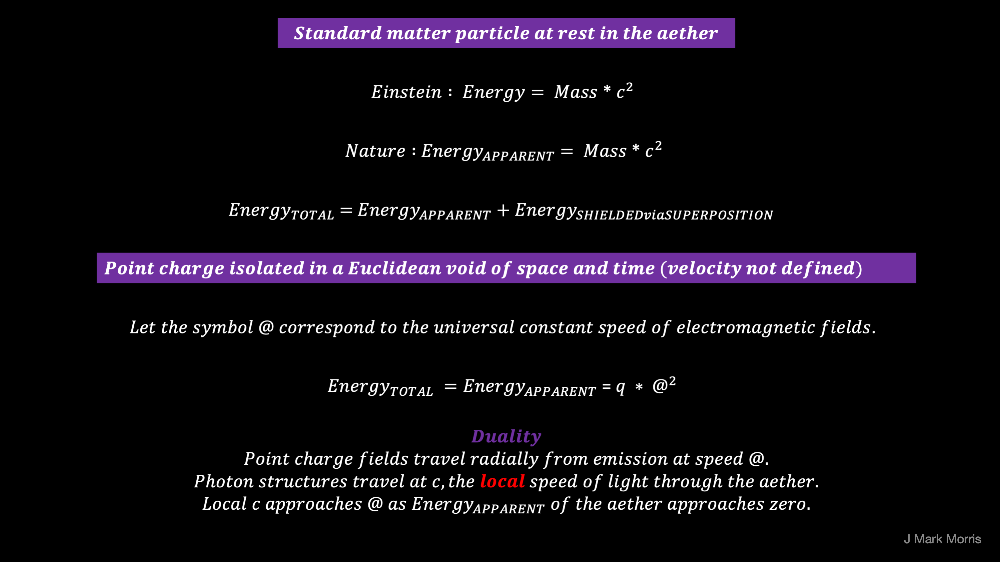

**_I'm creating math and simulation for the point potential universe._**

_**Notes to science historians :**_ A first part of my refusal to "do the math" _**erenow**_, despite that being a requirement for discussions in physics, is that I have known that _for me_ to do so in the context of GR/QM/LCDM would be an entirely bogus, time sucking, mental trap! It makes zero sense to attempt to climb a ridiculous artificial math barrier to entry and learn "effective theories" of physics with incorrect narratives galore. I absorb outreach material and get the shape of the territory, and that is all that I need, and I am sincerely thankful.

A second part of my intransigence in doing the math, and perhaps the more important and deliberate of the two, is that it would not be productive to waste time or limit my degrees of freedom while I was sorting out all the outrageous "**_not even wrong_**" narratives of physics and cosmology and then reverse engineering nature via thought experiment constrained by scientific observations.

A third reason and perhaps the most important yet, is discovering what mathematical and geometric techniques to utilize to describe nature at its most fundamental level of energetic point potentials in Euclidean space and time. The vast majority of GR and QM math relies upon **continuous** differential equations. In some cases, integrals start at zero when describing a behaviour that nature implements with discrete point potentials. All of the well accepted portions of GR and QM math produce an effective theory that matches experimental observations. Which theoretical math should be using continuous differential equations and integrals starting at zero? Which theoretical math needs to be reframed and recast to model precisely with the point potentials? **_I conclude that the best path forward for NPQG is to develop the math along the way as the theory is built up from first principles._**

It will be difficult to imagine in generations hence, how twisted and knotted were the interpretations of general relativity, quantum mechanics, and lambda cold dark matter cosmology. **_GR/QM/LCDM will go down in history much like epicycles but far worse if we consider the wasted funding on the public's dole, the career and reputational carnage, and the cost of opportunities squandered._** Thankfully GR/QM/LCDM theories will fade away in short order to be replaced by an isomorphic theory that frankly, should have been quite obvious in retrospect.

https://youtu.be/msVuCEs8Ydo

Let's get back to the point potential era, and math. I am focusing on setting up the math with extreme parsimony in concepts. One key point is the differentiation between the speed of light and the speed of potential emissions. They are related but very different concepts in the point potential universe. First of all, light is implemented by a photon, which is a structure of contra-rotating pro and anti Noether cores (nested tri-binary structures). If point potential theory were to leverage c, the speed of light, in the point potential equations — that would be problematic. The theory can't exactly pull itself up from its bootstraps using higher level structures and behaviours can it? That would raise all kinds of issues. No, we need to build from first principles and find a speed that is more fundamental than the speed of light. We can accomplish that by differentiating the speed of potential emissions from the (local) speed of photons. Here's my first attempt at a portion of the foundational math.

The Lorentz transformation is an enormous clue to the solution of nature. The tricky part is to interpret the clue properly. Physicists and cosmologists accepted the Lorentz transformation on face value and developed theories based upon Einstein's spacetime geometry.

An alternate approach is to consider that the Lorentz transformation does exactly what it purports to do. Transform from what though, specifically? The Lorentz transformation is not to make reality understandable to our Euclidean instincts formed in low energy spacetime. Oh no! It is a clue that our perception of nature is distorted from reality by some aspect of nature that implements the Lorentz transformation. Lo and behold, the emergent tri-binary Noether engine structure implements the geometry of the Lorentz Transformation in space and time. And every particle we know and even the ones we don't understand yet, like spacetime aether (aka dark matter) are based on Noether engine structures as their battery and quantum conservation accountant.

Physicists have punted the challenge and lazily assigned the Lorentz transformation to a geometry of spacetime. I have lost all respect for physicists and cosmologists for myriad reasons, but this one is truly egregious. I call for a revocation of all physics Ph.D. degrees, dismissal of the old guard patriarchy in academia and industry, and elimination of tenure in these fields.

**_J Mark Morris : Boston : Massachusetts_**

p.p.s. Hopefully the James Webb Space Telescope will return observations from distant galaxies that wake scientists up. Nature hints to us over and over again that the universe is based on systems of orbiting orbs. Physicists had point charges in hand in the 1800's and discarded them because of concerns with math blowing up as two point charges approach and the distance between them goes to zero. How is it possible that it never dawned on scientists that point charges might somehow have a natural limit in closest approach, something that prevents any two point charges from getting infinitely close? If that were the case then the math wouldn't blow up, and we could rehabilitate point charges. Where would we look for ideas about the behaviour of point charges at their limit? Walk the Planck. Take the mental leap. In my newer writings I use the term "point potential" for the NPQG model objects to distinguish them from the "point charges" of yore.

p.p.p.s. In case you are wondering how **@** and **c** relate: I think where this is going is that a photon is made of two Noether cores, one anti and one pro and they are contra-rotating. Each Noether core is a nested tri-binary structure. In a photon, Noether cores are in a planar configuration, i.e., a flat boson oriented geometry. The contra-rotating outer binaries of each Noether core produce the familiar electromagnetic waves via superposition, which mostly cancels in the summation, leaving the electromagnetic waves we know and love. In my thought experiments, the lead Noether core is powered through spacetime aether by sailing on the @ speed field of the trailing Noether core. The lead Noether core also pulls along its partner via a coupling. The energy for this travel comes from a very slow phase unwinding from each Noether core (i.e., redshift), and I suspect the nested binaries are harmonically coupled as well. Hopefully that will all fall out of the ongoing math and simulation, if the vision holds.
