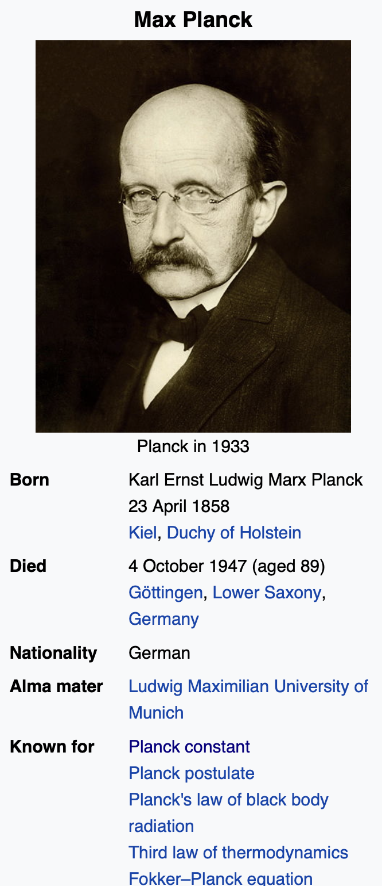
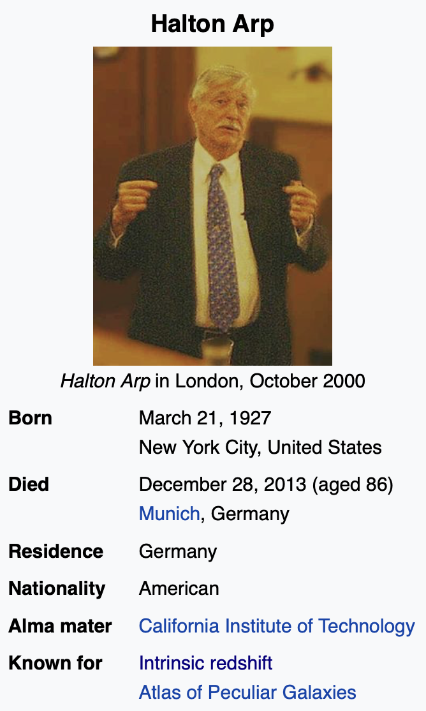
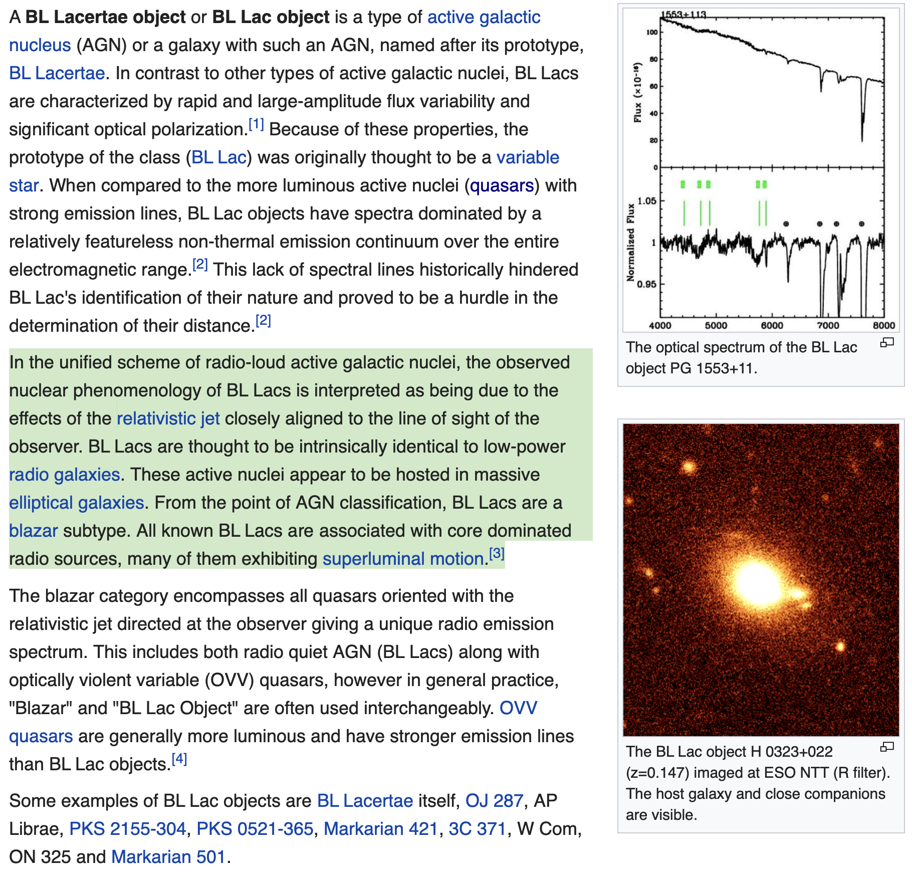

**ANOMALOUS REDSHIFT**

Halton Arp proposed several controversial observations based hypotheses about quasar minor axis (polar) jets of matter and multiple twin galaxies being formed at various locations along each jet axis. A lot of Arp's work involved **anomalous redshifts** of these objects and the parent galaxy. Although his observation data was mostly valid, his proposed model mechanisms have been considered and dismissed as not being consistent with modern cosmological theory and improved data sets.

Halton Arp did not have a good model to explain his observations, but with colleagues came up with a variable mass model that was later falsified. However, we can explain Arp's observations with a mechanism modeled by NPQG — the recycling universe with two fundamental point charge particles. NPQG proposes point charge plasma which assembles, inflates, cools, decays, and reacts to form standard matter-energy, including spacetime æther. Examining the Arp ejection model we see that galaxy formation and maturation from ejecta is consistent with rapid inflation at jet emergence and a tapering off over time and distance.

**MAX PLANCK**

The Planck scale is far more important than physicists realize. It's not just a dimensional analysis. The Planck scale particles are real in the NPQG model. They have the highest particle energy possible and when in the core of a dense matter-energy object, such as a supermassive black hole, it takes on a solid form of point charges, called a Planck core, where general relativity does not apply. If general relativity does not apply, then gravity does not apply. The Planck core will escape given the right conditions, perhaps a rapid spin or perhaps a large merger, the Planck plasma may burst through and jet for quite some time.

<figure>

<figcaption>

WIKIPEDIA

</figcaption>

</figure>

**HALTON ARP**

Which of Halton Arp's observations are consistent with modern astronomy? Are small galaxies forming near the jet axis? Do they have different redshifts? Are there a pair of BL-LAC galaxies with very smooth spectra and other similar characteristics? Do BL-LACs tend to occur at the terminus of the Planck plasma jet? If some of these are valid patterns, they may be imprints of the life-cycle of an AGN SMBH. Imagine the AGN SMBH growing due to ingestion. It becomes massive enough for the core to reach Planck scale and phase change into Planck core. If the SMBH is spinning, perhaps the plasma can breach through the event horizon at the poles and jet. How long does it jet? How much of the plasma escapes in each event? Do small galaxies eventually develop along the path of the jet or its terminus? Are BL-LAC objects associated with jets? This could make for a whole subfield of study.

<figure>

<figcaption>

WIKIPEDIA

</figcaption>

</figure>

**BL LAC OBJECTS**

Wikipedia provides our first result. Could BL-LACs be the Planck plasma jet terminii? No more bending over backwards to model BL-LACs as being aimed towards the observer to explain the superluminality. Nope. The Planck plasma jet may truly be superluminal. General relativity does not apply to point charge plasma jets as they pierce through the æther.

<figure>

<figcaption>

WIKIPEDIA

</figcaption>

</figure>

What about Arp's more general claim? A 2006 study said this.

> "There is a clear excess of QSOs near the minor axis with respect to the major axis of nearby edge-on spiral galaxies, significant at a level 3.5σ up to angular distances of ∼ 3◦ (or ∼ 1.7 Mpc) from the center of each galaxy. The significance is increased to 3.9σ with the _z_ \> 0.5 QSOs, and it reaches 4.8σ if we include galaxies whose circles of radius 3 degrees are covered by the SDSS in more than 98% (instead of 100%) of the area."
> 
> M. Lo ́pez-Corredoira, C. M. Gutie ́rrez [arXiv:astro-ph/0609514](https://arxiv.org/abs/astro-ph/0609514)

As cosmology gets sorted out in the point charge era, it seems very possible that some ideas of Planck and Arp might come back into vogue.

https://youtu.be/aiYszS5RHAE

One of my astute readers commented that they expected a response from me regarding Anton's recent video. I really appreciated that comment because it demonstrates that there is at least one person who understands how I think about the universe and can predict that I would be excited about Anton's video. And right they are! The findings of the referenced papers describe how a main galaxy and it's central supermassive black hole are intimately tied to the star formation and quenching behaviour of companion galaxies and even correlated with the angle from the SMBH jet axis! It's like Halton Arp on steroids, but without the rushed and erroneous steady state theories of Narlikar and Burbridge. **_They were all on to something,_** but were bowled over by the politics propelling the big bang theory. They really didn't have a chance to give their theories time to mature and develop before they were dismissed and taboo. Arp was just an observer and he got swept along in the dismissal and could no longer get good observational time allotments, which was an abrogation of the scientific method, given his bona fides.

Onward to Anton's video! First, and most hilariously, Anton's whole video buries the lede that the central galaxy and the surrounding companion galaxies are a tightly coupled system that responds to activity of the central SMBH. **_That is huge news isn't it?_** Explain to me what we need a Big Bang for now, if you will? Each galaxy is essentially "regurgitating/recycling/regenerating" newer galaxies which eventually merge with the central galaxy ad nauseum. Meanwhile there are higher level mergers occurring as well.

Second, per usual Anton drills down on the facts in a very precise way. These are very important findings circa 2021. They aren't the first nor the last to detect such correlations, yet this appears to be a large step forward in establishing important baselines for any science to follow. Specifically, this basis level can enable a testable differential between

1. an expanding universe LCDM cosmology, or

3. a steady state cosmology with regenerative standard matter, including spacetime aether.

I always recommend watching Anton's videos multiple times until the insight he is attempting to convey sinks in. Usually it's multi-layered. Come back and watch again! The rest of the video speaks for itself. I will probably watch it dozens of times. There is not much more I can add. You know my view - we are in a steady state universe with no known beginning nor end.

This lecture from Dr. Katherine Blundell at Oxford is excellent. I am fascinated by her detailed observations and analysis of black hole jets.

https://youtu.be/gFbZRuCIInI

**_J Mark Morris : San Diego : California_**
