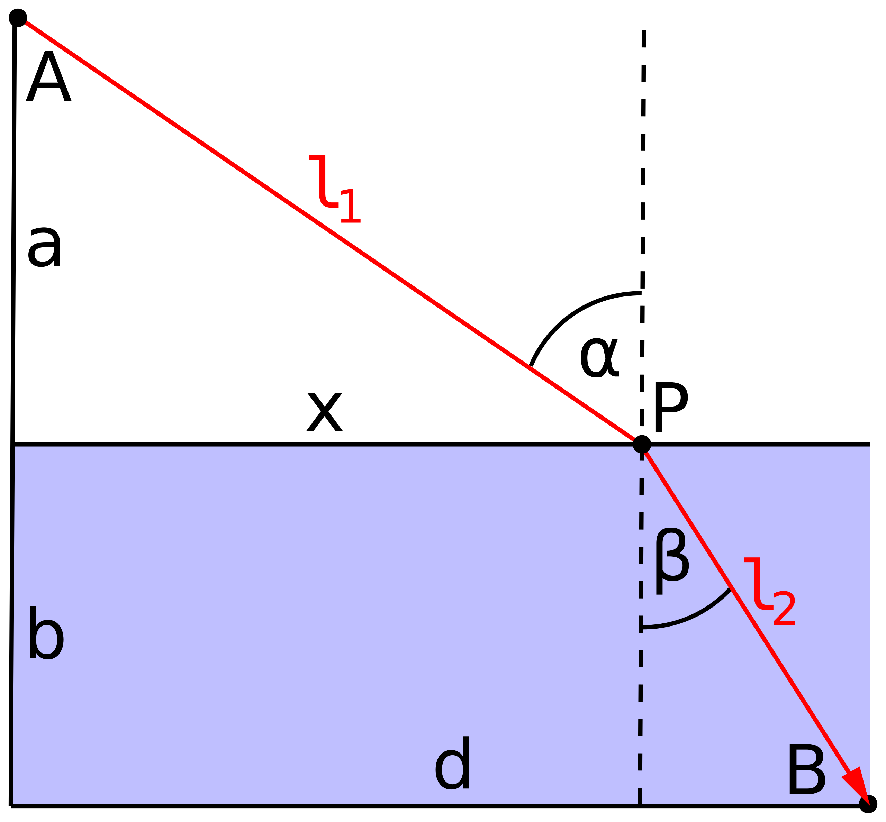

Let's talk about the physical implementation of a photon in 𝗡𝗣𝗤𝗚 and the characteristics that arise. I'll show that GR-QM era physics does not understand the physical implementation of a photon, nor the real implementation of wavelength and frequency.

> "A photon is a composite of both particles and waves."
> 
> J Mark Morris

In 𝗡𝗣𝗤𝗚 a photon is a composite of both particles and waves at all times. The composite particle two contra-rotating Noether cores, one pro and one anti. The 12 point charges are orbiting around the direction of group travel. The wave equation from the path of those 12 particles, their Euclidean world lines, is what implements what GR-QM era physics calls an electromagnetic wave. The distance that the photon travels in one full transit of the binary orbitals is what we call wavelength. The frequency is one divided by the time for that full transit. Furthermore, the photon has a mass, albeit very small, and it is constantly interacting with particles of spacetime æther in the vicinity of its travels, producing a pilot wave.

Let's evaluate Fermat's principle in the context of 𝗡𝗣𝗤𝗚.

> _"Fermat's principle, also known as the principle of least time, is the link between ray optics and wave optics. Fermat's principle states that the path taken by a ray between two given points is the path that can be traversed in the least time._
> 
> _Fermat's principle was initially controversial because it seemed to ascribe knowledge and intent to nature. Not until the 19th century was it understood that nature's ability to test alternative paths is merely a fundamental property of waves. If points A and B are given, a wavefront expanding from A sweeps all possible ray paths radiating from A, whether they pass through B or not. If the wavefront reaches point B, it sweeps not only the ray path(s) from A to B, but also an infinitude of nearby paths with the same endpoints. Fermat's principle describes any ray that happens to reach point B; there is no implication that the ray "knew" the shortest path or "intended" to take that path."_
> 
> Wikipedia

The term 'wave' in the description of Fermat's principle is technically incorrect according to 𝗡𝗣𝗤𝗚. Fermat is using the term 'wave' for a large collection of photons emitting continuously in all directions from a source, with each photon having the same or similar energy from the reaction that produced it. To a GR-QM era observer, the collection of photons looks like an electromagnetic wave similar to what would result from dropping a pebble in a still pond. Yet, as mentioned above, each photon implements its own wave by the paths of the electrinos and positrinos in the photon assembly.

<figure>

<figcaption>

Wikipedia

</figcaption>

</figure>

Let's use 𝗡𝗣𝗤𝗚 to examine a case where path A-P is in spacetime æther and path P-B is in water. Any photon particle that originates at point A in spacetime æther, passes through point P and refracts at the water's surface and ends up at point B follows a path A-P-B. There is no other point P2 that could have refracted to B. Furthermore, if you imagine a different point P2 and calculate the sum of a photon travel time A-P2, and then a different photon travel time P2-B that sum would be longer than the time it took for the single photon in the first cast to travel A-P-B. I suspect that it was this mathematical observation that led Fermat to presume that the mathematical possibilities matched nature, especially considering the contemporary understanding of light as a wave.

* * *

Science understands a lot about particle-waves and fields. We may be able to transform that information so as to deduce the configuration and wave function for each standard model particle type as well as its reactions. We know about orthogonal electric and magnetic fields. Here are some ideas on how to pursue this conception.

- **_Explore these insights for all types of particle-waves._**

- _We know that the electric and magnetic fields are perpendicular and, we know Maxwell's equations, and the frequency vs. wavelength equation._

- _What can polarization inform? It may help explain interactions that cause changes in polarization_

- _What is the configuration of a photon?_

- _How does the electric field oscillate in a sine wave? The charge distribution must end up all on one side or most on one side at the peak, and then it must continue its wave function until the charge distribution reverses. What role does field cancellation by superposition play?_

- _It seems like for a photon to produce electromagnetic waves, the motion of each electrino and positrino would be continuous and not a cloud probability like QM. How can this be reconciled?_

- _How does this knowledge map to configurations of the other particles of the standard model?_

- _How does phase map to particle-wave configuraton and function?_

- _How are frequency and wavelength implemented via the particle-wave function? Certainly we know this will relate to the size of the photon._

- _As the photon size gets smaller with energy it still produces the orthogonal electromagnetic fields._

- _What exactly determines the permittivity and permeability of any medium? Is it related to the energy of spacetime aether? What about the energy of other matter-energy? Well, we know that it will already be continuously mirrored in spacetime æther. So, yes, it would be logical that permittivity and permeability are related to the energy of the spacetime æther._

- How shall this be approached mathematically? Analytically or via computer simulation? Probably both. I would imagine closed form solutions are possible for idealistic situations like constant energy spacetime æther. The solution likely has various quantized harmonics, some imaginary numbers to rotate the waves polarization, Maxwell's equations, and classical mechanics.

This post has been an introduction to how NPQG solves the age old wave-particle duality issue. Which is it? Wave? Particle? QM says wave. GR takes no stance. The answer is BOTH. The immutable electrino and positrino point charges trace a path while emitting electric potential waves in a spherically expanding form.

**_J Mark Morris : San Diego : California_**
