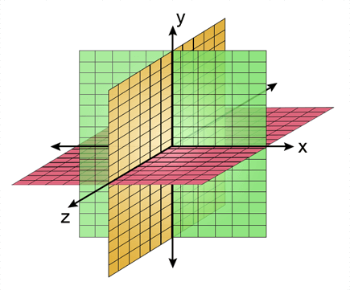
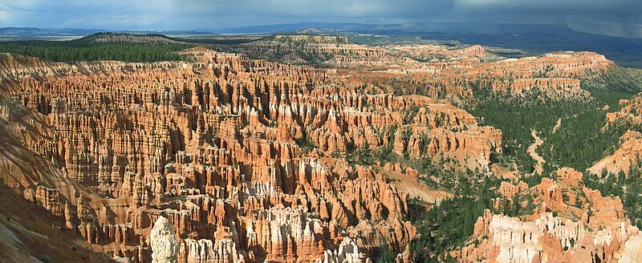
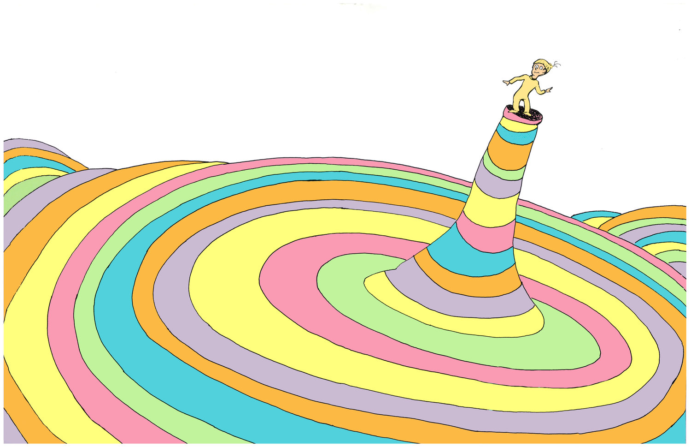
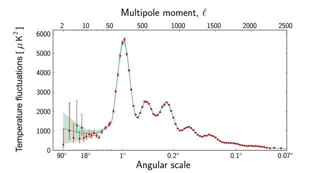

NPQG teaches that the Universe has a background void of 1D linear time and 3D Euclidean **space** which is permeated by a curvy Einsteinian **spacetime æther**. When we talk about measures of space and time we need to be clear about the reference frame. Fundamental background space has a Galilean/Cartesian/Euclidean 3D geometry. It also has a flat linear time. Let's use Map One or M1 to describe the reference frame of absolute space and absolute time. When we talk about the **æther** we are referring to Einstein's spacetime as well as the quantum vacuum. The spacetime æther is an emergent structure formed of point charge assemblies. The æther expands and contracts as a function of localized matter-energy and can be described by a Riemannian geometry at many scales of interest. We'll use Map Two or M2 to describe the Riemannian geometry of the æther.

Imagine M1 3D space as in the figure below. However, note that there is no fundamental up, down, right, left, forward, backward. There is no a priori scale or grid. There is no origin. Absolute direction or scale can only be expressed in a relative sense when comparing multiple discrete objects. M1 time is likewise linear and moves forward only. In some ways M1 space and time are unusual properties because they describe characteristics of a void, which is comprised of nothingness.

<figure>

<figcaption>

src: Ector Ward

</figcaption>

</figure>

Imagine spacetime æther having a map M2 of local matter-energy density, such that there is a peak at every concentration of matter-energy where the height of the peak is determined by the local energy. The maximum height is the Planck energy and the minimum height is zero energy. The flatness near zero energy is where M1 and M2 yield very similar measures of space and time. The photo of the Bryce Canyon hoodoos might help you imagine an M2 map of local matter-energy density.

<figure>

<figcaption>

Bryce Canyon Hoodoos. Wikipedia

</figcaption>

</figure>

Each hoodoo could represent the shape of the energy curve near a celestial object. A small moon would correspond to a tiny hoodoo you might stub your toe on, a planet somewhat larger hoodoo, then a star would be very large, a neutron star larger still, and then black holes would be very very tall hoodoos representing incredible concentration of matter energy. Note that this picture is flipped in comparison to the typical depiction of a black hole '_gravity well_' in general relativity. Here is an imaginary observer standing on the Planck energy peak of a Planck core in a supermassive black hole.

<figure>

<figcaption>

Dr. Seuss : Oh the Places You'll Go!

</figcaption>

</figure>

We need both the M1 and M2 coordinate systems. There is the M1 absolute, flat Cartesian map of void space that is the vessel for the universe. And there is the M2 map of spacetime æther made of particles that shrink with energy and inflate/expand as they cool. If we want to locate ourselves in the spacetime æther, it may be helpful to use the Riemannian coordinate system - but we need to remember that the M2 geometry is always changing as matter-energy and spacetime æther move about. In low energy spacetime, such as in outer space or in low gravity environments (like Earth), M1 and M2 are very similar.

One of the key issues in science is determining the distance a photon has traveled from emitter to detector. We need to understand this distance in both the M1 and M2 coordinate systems to have a clear understanding of the geometry of the universe.

Let's imagine a photon traveling through a constant energy non-expanding spacetime æther region — does that photon experience zero energy loss to spacetime æther and does it's vector momentum would remain constant? Note that this presumes there is no such thing as a small non-scattering leakage or drag that transfers photon energy to the spacetime æther.

Now let's consider a region of the æther with high localized matter-energy density where spacetime æther will have contracted and become denser. As the photon nears this denser region, it will experience an energy gradient and its path in M1 will bend. It will also experience gravitational blueshift as it climbs into higher energy spacetime æther. If that photon passes by the object, it will descend the energy slope and redshift back to a lower energy.

Next let's consider the photon traveling through a region where spacetime æther is expanding, aka cooling. We will also see gravitational redshift here, even though the slope or gradient of spacetime energy density is extremely small.

Are our astronomical observations primarily based upon light paths where the dominant or only photon energy leakage path is through very gently sloped (up or down) cold spacetime æther? This makes some logical sense given the clarity our observations. However, there may still be some misconceptions to clear up. Before doing that, we need to understand the mechanism for photon loss of energy in flat and gently sloped cold spacetime æther.

The key question is then whether we can tell how far a photon has traveled through absolute space based upon its redshift? We know it had to fly a continuous path through spacetime. For photons that do not pass closely by dense matter-energy objects, the M1 and M2 maps are very similar. In this case are we guaranteed that the approximate absolute distance from the source is directly proportional to the redshift or loss of energy? I think that is a fair assumption for now, because it will allow science to progress. Future scientists will undoubtedly be able to model the various paths to our observing instruments with far more knowledge of the regions that the received photons have crossed.

In NPQG we translate the temperature of the CMB at 2.7 Kelvin average to be the black body temperature spectrum of the spacetime æther. Yet the CMB has a multi-peak power spectrum. This spectrum may correspond to a summation of black body spectra of the different constituent binaries that formed the æther according to their proportion.

<figure>

<figcaption>

[ESA](https://sci.esa.int/web/planck/-/51555-planck-power-spectrum-of-temperature-fluctuations-in-the-cosmic-microwave-background)

</figcaption>

</figure>

The galaxy local production of new spacetime æther, from direct escape as well as intermittent jetting of the SMBH, indicates that on average, the spacetime aether new isolated galaxies is expanding. The spacetime aether emitted by each galaxy expands INTO one that from other local galaxies. The misconception in cosmology has been that while expansion is happening everywhere in the universe, it is not _outward_ for the universe as a whole. Rather, **_expansion is galaxy local_**, with opposing galaxy local outflows of spacetime æther. We no longer need to hypothesize universe scale expansion and the idea of far away galaxies speeding away faster than the speed of light. This means that not only is the Hubble 'constant' actually expected to vary, but that the Hubble number for an observation corresponds simply to the accumulated redshift over the path of the photon.

This means we can firmly discard the prior conception of the big bang, and now associate it with galaxy local processes of SMBH production of new spacetime æther assemblies, inflation, and expansion. This causes an outward flow of expanding spacetime aether assemblies from the galaxy. Thus we still have an expansion mechanism causing the redshift that astronomers observe.

I imagine that galaxies have a life cycle. Halton Arp thought young proto-galaxies would be born at the terminus of SMBH jets. I think that is a possibility. Those proto-galaxies may never mature enough to develop their own SMBH and even if they do, it may never reach the conditions that cause it to develop a Planck core or breach the event horizon and emit or jet high energy aether assemblies. That’s ok. The proto-galaxy will probably keep maturing and it may merge with some other galaxy eventually. Some galaxies may never produce spacetime æther, and others may produce it quite regularly on some galactic time scale when their SMBH jets, much like volcanos occasionally erupt here on Earth. The jets happen and continue until the Planck core pressure or whatever the root cause conditions are no longer sufficient to maintain the breach and the event horizon seals up again. 

Spacetime æther energy is greater within our galaxy 'proper' than in the nether regions beyond our galaxy that abut the nether regions of neighbor galaxies. We know that the total energy density of the spacetime æther is one potential root cause for the set of problems that are lumped into the 'dark matter' and 'dark energy' searches. And we know that the density of the æther positively correlates with density of localized matter-energy.

Photons navigate through spacetime æther, so their path may be described by the M2 Riemannian coordinate system of the spacetime æther. However, we may also want to know the absolute M1 path coordinates of the photon from origination to observation -- or at least how far that is in absolute M1 Cartesian space. The Riemannian distance in spacetime æther depends on the degree of expansion experienced along the path. Then the next question is how do we determine the absolute distance traveled in the M1 reference frame of Cartesian space?

* * *

We need to rethink our understanding of how to interpret observations of photons from the perspective of curvy spacetime M2 versus the absolute M1 frame. Nearly all observational data is from sensors receiving photons. That raises interesting questions, such as how the dynamical geometry of photons may have become intertwined with the object being observed. We also need to develop a better understanding of how a photon climbs out of a gravity well.

Therefore, photon-based observations (as well as all multi-messenger observations), distort our view of absolute space and time. We think the photon is moving at a constant rate. However, it sails at a rate that changes as a function of the local permittivity and permeability in the spacetime aether.

**_J Mark Morris : San Diego : California_**
