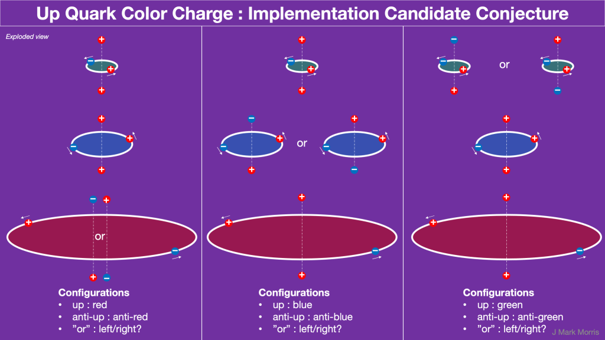

Exactly how does the potential field work with the path history of unit potential charges? It's all potential isn't it, even with movement? Do we need E and B at this level? The potential and it's gradients should be enough. Jefimenko and Lienard-Wiechart look at history potentials _φ_ and **A**. Are those the right concepts? What about when v > @ and a point charge is encountering multiple Dirac spheres from the path history of themselves or any other point charge? **_Jeffimenko and Lienard-Wiechert missed that entire sector of solutions due to being blinded by the photon._**

The sector where unit potential point charge velocity is greater than the field speed involves sophisticated and unexplored dynamical geometry. Perhaps as a way to keep things pure we might consider the v > @ territory as a set of separate actions with superposition and do the tallying later. It's really a matter of how it is all accounted for in nature and how to model that with mathematics.

An exciting area with the chance of rapid progress is the ideas around each binary having polar personality charges. This simple geometry based on charge, spin, and role may have some very logical mappings to the standard model. That sounds really fun and promising to explore because it is mostly primitive code matching. It's fair to say that the different configurations of basic assemblies have a number of detectable qualities and quantities. I tell the beginning of this assembly story in the following slides.

I have a feeling that this emergent architecture conjecture is extremely promising. After all, I am already convinced that NPQG is the basis of the next scientific era in nature based upon the electrino and positrino unit potentials. Therefore, there must be a mapping from NPQG to the observations of GR, QM, and LCDM. In particular the mapping to the standard model is of particular interest. It may be quite productive to sweep back through the patterns in the standard model and attempt to match up this new architecture. So far, I can see the strong force bond as the binaries, and the weak force bond as the polar charges. I know how these map to the standard matter particles in terms of Noether cores and personality charges. I have a conjecture on color charge.

This may be an area of low hanging fruit! For example, note that a nucleon has 8 gluons. Yet there are nine binaries. What if the gluon flux tubes correspond to polar vortex relationships? Like potential flux tornados reaching out and making a connection between the 9 binaries. Note that each binary can only connect to 8 others. This is worth noodling about.

> _The average time it takes for the subatomic particle to decay is 877.75 seconds, according to an experiment that used magnetic fields to trap ultra-cold neutrons. The results have twice the precision of similar measurements, and are consistent with theoretical calculations. But they do not explain why in an alternative kind of experiment, neutrons last nearly 10 seconds longer._
> 
> https://www.nature.com/articles/d41586-021-02812-z

Can you imagine the maelstrom that must be going on in a nucleon with 9 binaries and 9 pairs of polar charges? Thirty-six total point charges! The proton is 15 electrinos and 21 positrinos. The neutron is 18 of each. Think about every unit potential point charge following a path while getting impinged upon by Dirac sphere potentials from path history of all point charges. Yet the proton is amazingly stable. Heck the neutron lasts about 15 minutes, which is a lot of binary cycles elapsed. With NPQG it will be possible to simulate these particles extremely well.

Yet the point charges in the neutron, perhaps with contribution from the surrounding aether, tend to have enough natural variation such that with a predictable frequency they arrive at a reactive configuration. I wonder what is the gravity range over which the precise measurement holds? Would it reproduce in orbit? Close to the sun? Close to a black hole?

It is highly speculative, but I would like to discuss how this architecture might lead to an explanation of the bottle vs. beam experiment which produce different neutron decay times. First, let's imagine that there are actually two different decay modes for the neutron, Case 1 which produces the typical proton, and an unknown Case 2 that produces far less observable products, say for example three neutrinos. The **bottle** experiment counts neutrons in vs. neutrons remaining vs. time. This measures Case 1 and Case 2 decay modes. The **beam** experiment counts neutrons in vs. emerging protons vs. time. This measures only the Case 1 decay mode. It does not measure the Case 2 decay mode. Therefore it is no surprise that different average lifetimes would be calculated.

