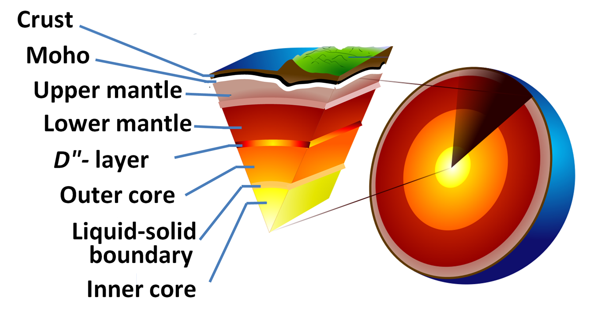
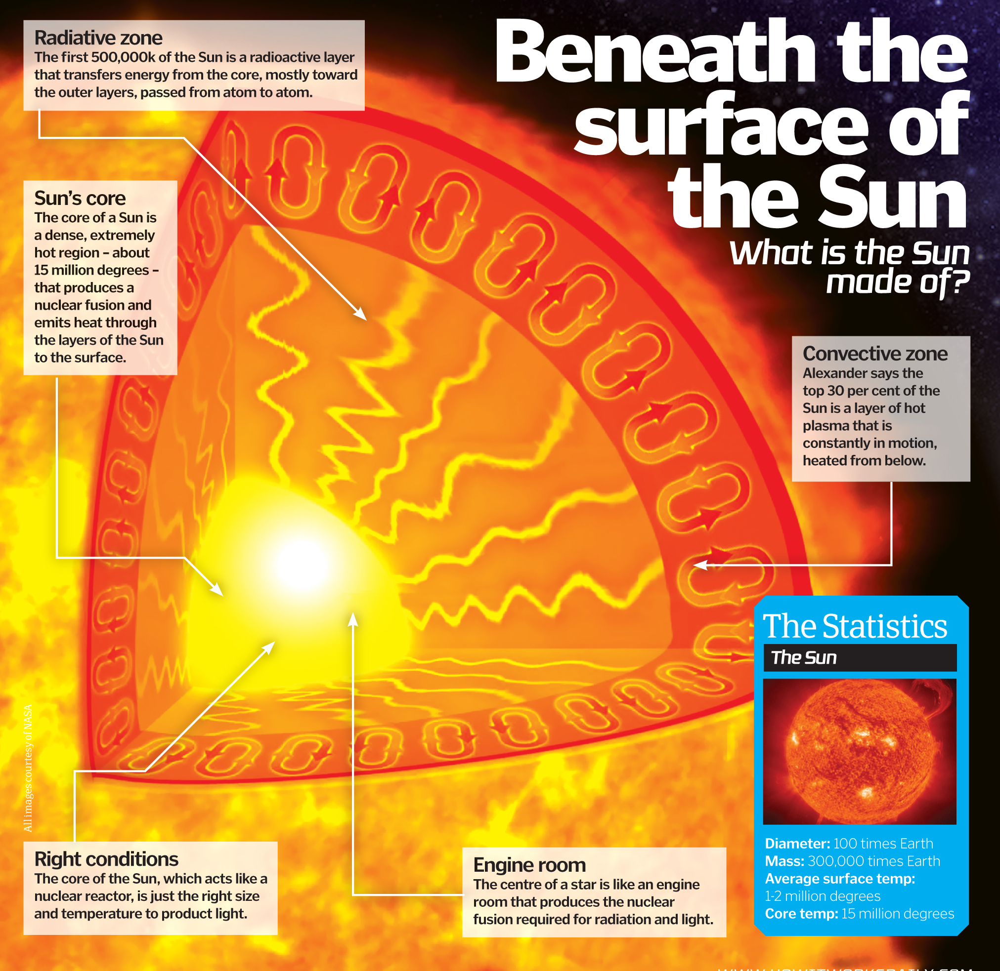
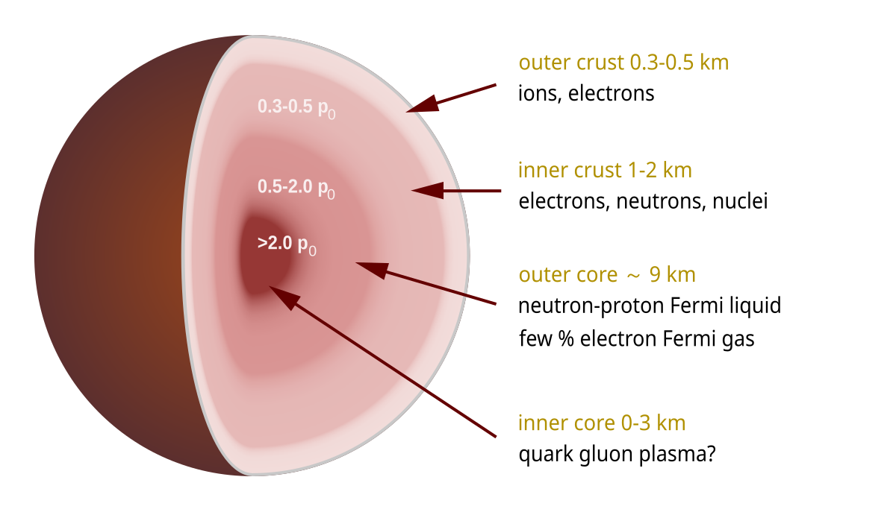
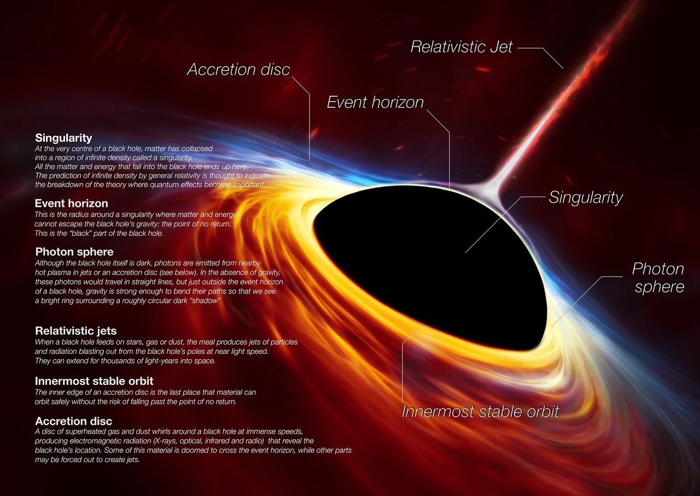

Have you ever considered that science has defined a very simple model for the interior of a black hole? Matter-energy goes in and **that's it**, end of story. Physics says we don't - and can't - know anything more. Physicists say black holes grow without bound. Unfortunately, not only are physicists incorrect, but they also have been overscrupulous in adhering to a narrow and literal definition of the scientific method.

In NPQG black holes can form Planck cores and emit Planck point charge plasma. NPQG dispenses with the mysterious mathematical singularity and imagines a Planck point charge core. Therefore we may intuit the idea that a black hole may contain layers, because every other celestial orb has layers. We need new physics to theorize, at a minimum, about the dynamics in-between black hole event horizons and their cores. What are the factors that determine the composition of the layers and the core? How do the layers and the core evolve?

Here is an illustration of the layers of the Earth.

<figure>

<figcaption>

Credit: Teach Engineering

</figcaption>

</figure>

Here is an illustration of the structure of Jupiter.

Here is an illustration of the layers of our Sun.

<figure>

<figcaption>

howitworksdaily.com

</figcaption>

</figure>

Here are the layers of a neutron star.

<figure>

<figcaption>

WIKIPEDIA

</figcaption>

</figure>

Here is the structure of a black hole as defined by GR-QM era physics. Note the undefined blackness.

<figure>

<figcaption>

Credit: JPL-NASA

</figcaption>

</figure>

GR-QM era physics has defined a very stark mathematical model of a black hole where only the event horizon radius is known. A singularity is predicted by the mathematics, but widely recognized to be a breakdown of general relativity theory. In NPQG physics, the core of a black hole may develop a volume of Planck scale point charges, i.e., a Planck core.

Here is what I wrote in January 2018 in my first physics blog post.

> _At a certain point, called the event horizon, there is no escaping the gravity. Beyond that point as the matter and energy progress inward, the matter decomposes into its' constituent molecules as chemical bonds are broken. Traveling further inward, as the molecular bonds are broken by the intense gravity, the molecules decompose into atoms. Traveling further inward, eventually the intense gravity causes the atomic bonds to break, resulting in a dense soup of protons, neutrons, electrons, and other forms of energy. I suppose it possible this continues and the particles continue inward until the gravity causes the decomposition into sub-atomic particles of the standard model, i.e., quarks, leptons, and bosons. So really, the black hole could consist of many concentric spherical shells, with each shell containing a different soup of particles. Some shells may be very dense. Other shells may be far less dense, as they are a region between two shells._
> 
> J Mark Morris  
> San Diego January 2018  
> [How I Envision Black Holes.](https://johnmarkmorris.com/2018/01/12/how-i-envision-black-holes/)

In NPQG black holes have an internal structure which we can theorize about. In some cases, we can observe an outcome of the highest energy layer, the Planck core, and the Planck plasma that can emit.

Under _sufficient conditions_, _some_ matter-energy that is ingested by a black hole can cause _some_ matter-energy **_in_** the black hole to enter Planck particle phase and reduce or cease transmitting its mass via gravitational waves. The specific _sufficient conditions_ will be a subject for ongoing scientific research, and will likely consider events that can happen to a black hole, and therefore may include:

- total matter-energy inside the event horizon

- charge balance of the matter inside the event horizon

- spin

- black hole layer dynamics possibly partly due to what was ingested (e.g., gas vs. another BH),

- the overall ratio of conserved elements: energy, electrinos, and positrinos

Under a different set of _sufficient conditions_, such as black hole spin or a merger with a dense object, a black hole may emit Planck plasma sourced from the Planck core of the black hole.

What are some of these _sufficient conditions_?

- spin,

- charge,

- ingestion of matter-energy (what is ingested in each absolute time interval)

- ingestion rate and ingestion rate changes (e.g., spikes, mergers, etc.),

- whether a core has already formed,

- if the black hole is currently jetting and at what rate,

- the rate of change of the Planck core size, (jet=shrink, ingest=grow)

- merger dynamics,

- black hole layer dynamics possibly partly due to what was ingested (e.g., gas vs. another BH),

- the overall ratio of conserved elements: energy, electrinos, and positrinos.

SUMMARY

Physics of the QR-GM era espoused a very simple model for black holes that failed to recognize their true nature. In NPQG, black holes are recognized as a step towards the recycling universe, where in some cases a black hole can develop a Planck core which can emit, recycling ingested matter-energy to begin a new journey.

_**J Mark Morris : San Diego : California**_
