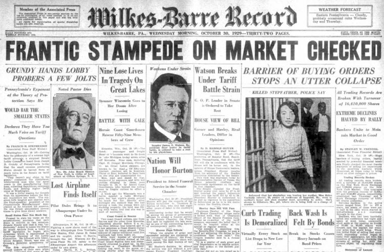
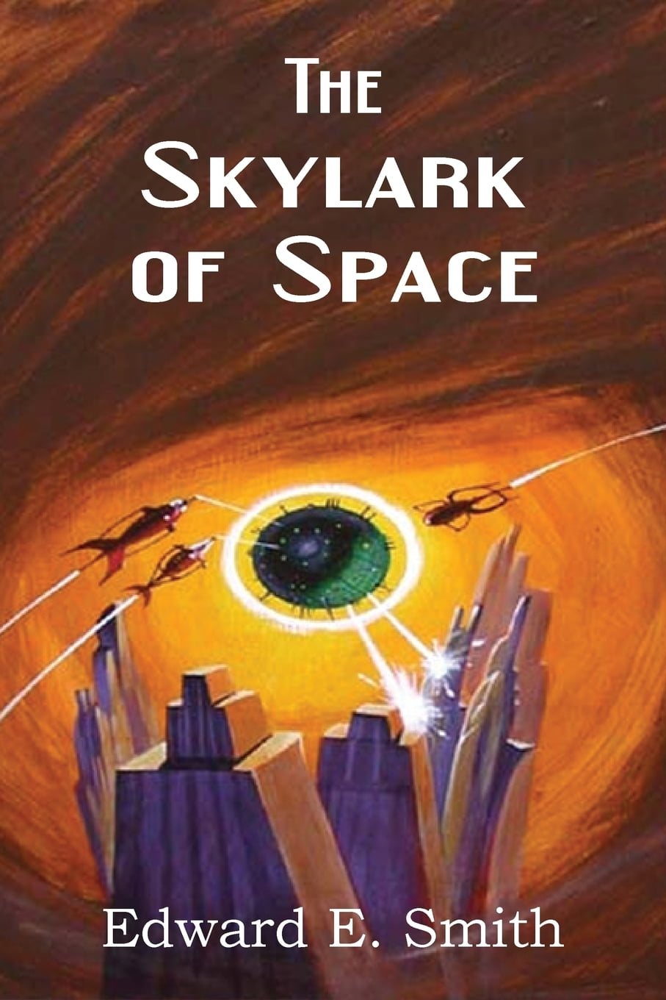
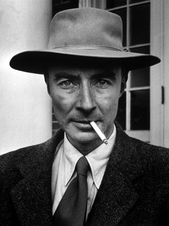
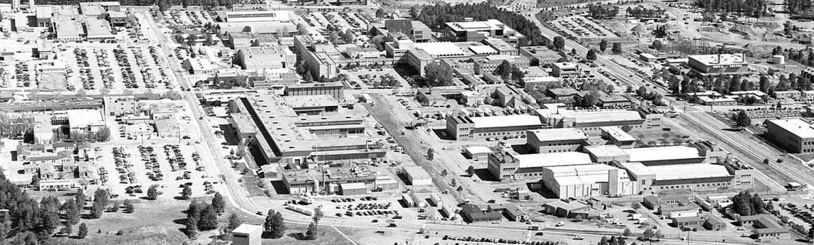
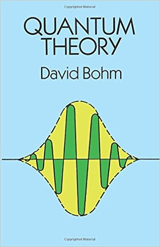
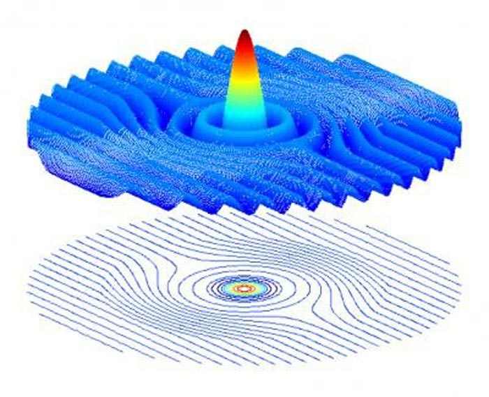

**Bohmian mechanics, aka de Broglie-Bohm theory,** describes a classical model of nature that solves the same problems as the mysterious quantum mechanics. In this post series, I'll show how NPQG can provide a physical implementation of nature that matches Bohmian Mechanics. NPQG also provides a neoclassical quantum gravity solution that matches general relativity. Furthermore NPQG goes beyond the GR-QM era and Bohmian mechanics and leads to a far more parsimonious narrative for physics and cosmology. In this post series I will discuss NPQG as related to quotes from the [Bohmian Mechanics](https://plato.stanford.edu/entries/qm-bohm/) article by Dr. Sheldon Goldstein, Rutgers, which is published in the Stanford Encyclopedia of Philosophy. I suggest making a first pass through Dr. Goldstein's article and then reading this blog post series while making a second more detailed pass.

* * *

> _Bohmian mechanics, which is also called the de Broglie-Bohm theory, the pilot-wave model, and the causal interpretation of quantum mechanics, is a version of quantum theory discovered by Louis de Broglie in 1927 and rediscovered by David Bohm in 1952. It is the simplest example of what is often called a hidden variables interpretation of quantum mechanics. In Bohmian mechanics a system of particles is described in part by its wave function, evolving, as usual, according to Schrödinger’s equation. However, the wave function provides only a partial description of the system. This description is completed by the specification of the actual positions of the particles. The latter evolve according to the “guiding equation”, which expresses the velocities of the particles in terms of the wave function. Thus, in Bohmian mechanics the configuration of a system of particles evolves via a deterministic motion choreographed by the wave function._
> 
> [Bohmian Mechanics](https://plato.stanford.edu/entries/qm-bohm/)

In NPQG, particles are based on a neutral Noether core made of three nested orbiting binaries. The Noether core is composed of three electrino : positrino binaries. Each binary couples to a weak personality point potential in each axial pole, for a total of six weak personality points potentials in the fermion assembly. For example a neutrino is Noether core of 3 electrinos and 3 positrinos (3:3), surrounded by a weak personality layer of 3 electrinos and 3 positrinos. A photon is a Noether core bound to an anti-Noether core and contra-rotationg to make the familiar electromagnetic field of a photon as well as all the polarization behaviour. A particle of spacetime aether is a very low apparent energy neutral structure of a pair of pro and anti Noether cores. Each assembly can interact with neighboring assemblies, emitting and receiving energy as point charges approach and recede. Spacetime aether assemblies, provide a medium that carries the pilot waves of Bohmian mechanics.

* * *

> _When a particle is sent into a two-slit apparatus, the slit through which it passes and its location upon arrival on the photographic plate are completely determined by its initial position and wave function._

The orbiting portions of point potential assembly are casting some field pattern around it's local neighborhood and beyond at lower magnitude. I conjecture that potential field and the action it causes on spacetime aether assembly point potentials qualifies as a pilot wave.

In NPQG each particle assembly is continuously exchanging energy with neighbor structures as the orbiting electrinos and positrinos of the assemblies come in proximity and their potential fields cause action on each other. Each point potential is constantly emitting a spherical potential wave that passes through a sea of spacetime aether assemblies that permeates the universe. This is the "pilot wave" that passes through both slits in the apparatus and now interferes with itself since portions of the aether reacting with the spherical potential wave stream have been delayed by interaction with the apparatus creating the slits. Regardless of which slit the particle assembly goes through, it will be influenced by the interference pattern of the pilot wave.

Gravity is a higher order effect caused by the alternating pulsing potential of the binaries in Noether cores. This pulsing potential is how matter reveals apparent energy, aka mass. The denser the local matter-energy the more superimposing alternating potential waves permeate that local space and time. The faster the assemblies move, they reveal more previously shielded energy. So we see here a departure with the equivalence principle as the implementation of nature is different in the two cases. The principles are the same, however.

In a sense the universe is a cellular automata that is both continuous and discrete. The dynamic energy of every assembly is constantly adjusted according to the sum of the **_delayed_** potential wave received from all point charges in the universe based on $latex \\mathbf{1/r} &s=1$. This falls off fairly quickly. I am sure you can appreciate how this is lossless and continuous. Isn't it interesting that the fundamental quanta, electrino and positrino, can cause continuous behaviour when it comes to energy exchange? We will cover this later, but binaries can also transact energy in quanta of angular momentum. Those quanta are related to the radius of the orbit, velocity of the orbiting point potentials, and the frequency. High energy results in a smaller orbital radius. As energy dissipates the binary orbit inflates and then expands.

> Consider Conway's cellular automata "Life". It is a prescient foreshadowing of the discovery of the point charge basis of nature and emergence of the universe and life.

* * *

### Intelligent Life is Close to Understanding Nature

NPQG models nature as two Planck scale particle types, the electrino and positrino, energy carried by those particles, and flat 3D Euclidean space. From those simple ingredients and routine physics everything emerges. NPQG is focused upon building the narrative around this proposed implementation of nature.

From the point of view of personified electrinos and positrinos looking outward through scales of structure at science, they would say that in some experimental areas science is getting close to nature's bedrock, for example the standard model of quantum mechanics is based on simple nested binaries and personality charges assembled from electrinos and positrinos. There are many other experimental results and theories which can be tested against NPQG.

Quantum computing may accidentally discover nature's structure (e.g., NPQG) due to Moore's law or equivalent in technology advancement. Quantum computing is currently leveraging the predictable patterns of gravity (energy) waves between particle pairs. I've inquired about the technology scale for quantum computing. Until I learn more, I will guesstimate that quantum computing technology may be at the forest level rather than the trees, leaves, and twigs at this point. Still, there is hope that those involved in quantum computing will have insight based on the increasing patterns that become evident.

* * *

### What is the Best Model of Nature?

> _Bohmian mechanics inherits and makes explicit the nonlocality implicit in the notion, common to just about all formulations and interpretations of quantum theory, of a wave function on the configuration space of a many-particle system. It accounts for all of the phenomena governed by nonrelativistic quantum mechanics, from spectral lines and scattering theory to superconductivity, the quantum Hall effect and quantum computing. In particular, the usual measurement postulates of quantum theory, including collapse of the wave function and probabilities given by the absolute square of probability amplitudes, emerge from an analysis of the two equations of motion: Schrödinger’s equation and the guiding equation. No invocation of a special, and somewhat obscure, status for observation is required._
> 
> https://plato.stanford.edu/entries/qm-bohm/

Bohmian mechanics is closer to the truth of nature than quantum mechanics, yet both are lacking a full understanding of nature. It strikes me that what quantum mechanics era physicists call a **quanta**, can equally be viewed as a _**shadow, artifact, or field effect**_ of classical particles. If nature, including spacetime, is classical, then of course there would be symmetric quantized field effects emerging from the fundamental particles.

> **NPQG models nature as equal and opposite point potential types, the electrino and positrino, energy carried by those point potentials, and flat 3D space and forward moving linear time. Everything emerges from those ingredients.**
> 
> J MARK MORRIS  
> i mean everything

A big difference between Quantum and Bohmian mechanics is how spacetime is implemented. Quantum mechanics does not recognize Einstein's spacetime. Bohmian mechanics is closer to the truth as it recognizes more characteristics of spacetime with patterned field waves. NPQG then closes the gap with a physical implementation based upon electrinos and positrinos, energy carried by those particles, and flat 3D Euclidean space.

NPQG implements Einstein's curvy spacetime physically with a low apparent energy sea of interacting Noether cores which form an æther that permeates the universe. The spacetime æther is the conduit for gravitational energy waves as a lossless medium of exchange between kinetic and electromagnetic potential energy. Every particle is involved in an exchange of kinetic and electromagnetic potential energy as a function of all other particles waves that arrive at that moment. These waves are spherical and spread losslessly.

The Noether cores at the heart of all assemblies, particularly those in spacetime aether, are the fundamental media of the Universe. They are the computational substrate. They are the accounting mechanism and medium of exchange for many transactions, as well as being a participant in many reactions. Keep in mind that what we call **_mass_** is a proxy for the apparent energy exhibited by an assembly. My best guess is that as the electrinos and positrinos in the shell follow their wave equation, they interact with all other point charges with (1/r^2) neighbourliness. At true scale, 1/(r^2) tapers quickly. It boils down to an enormous system that trades between kinetic and electromagnetic energy.

_p.s. In case anyone gets worried about cellular automata, determinism, and free will: consider that the substrate in NPQG is dominated by potential waves riding through a sea of point potentials These waves are sweeping by all the time and without a doubt there are some reaction outcomes that will vary depending on random input waves that were out of causal contact. These tipping point reactions are opportunities that may be leveraged by higher level computational and decisioning technology._

* * *

In this post I will present the full transcript from the film "**_Infinite Potential : The Life & Ideas of David Bohm_**" by the Fetzer Memorial Trust. I'll intersperse my commentary to compare and contrast Bohm's physics to NPQG.

David Bohm : "When I was younger I felt that in the beginning that science would surely be a source of benefiting mankind. I had no question about it. I began to feel that something beyond science would be needed to approach this question."

> _My goals for NPQG are :  
> 1) to improve well-being and reduce suffering of intelligent life,  
> 2) to enable intelligent life to spread throughout the cosmos,  
> 3) to improve the environment on Earth._
> 
> J Mark Morris

David Schrum (quantum physicist) : 'It was at night and we were walking under the stars and the black sky and he looked up to the stars and he said "ordinarily when we look to the sky and look to the stars we think of stars as objects far out and vast spaces between them." He said "There's another way we can look at it. We can look at the vacuum, at the emptiness, instead as a plenum. As infinitely full rather than infinitely empty. That material objects themselves are like little bubbles, little vacancies, in this vast sea." David Bohm, in a sense, was using that view to have me look at the stars and to have a sense of the night sky all of a sudden in a different way as one whole living organism and these little bits that we call matter is sort of just little holes in it. We often mentioned just one other aspect of this, that this plenum, and a cubic centimeter of the plenum there is more energy-matter than in the entire visible universe."

> _In NPQG, spacetime is an aether and it is "quantized" in a way, but not the way physicists think about it. Spacetime is quantized by truly fundamental unit potential point charges, the electrino and positrino, in some form of very dense yet ethereal sea of pro and anti Noether cores. Euclidean time and space provides the background to the universe and is modeled continuously in R4. NPQG is consistent with the above statement of Bohm in that the aether is material (an assembly of unit potential point charges) and what we call standard matter-energy are higher level assemblies that are permeated by said aether._

Narrator : David Bohm was a physicist, philosopher, explorer of consciousness — the man Einstein called his spiritual son and the Dalai Lama called his science guru. But his ideas were a threat to his peers in the science community as well as to the government. As a result he would pay a great price for sharing them at a time in history that was fraught and with a world that was not ready to receive them. This is the story of his life and his explorations and physics, philosophy, and consciousness and the search for unity and wholeness at the crossroads of science and spirituality.

> _I was unable to find any substantive explanation for why Bohm's ideas were a threat to his peers in the science community, or 'orthodoxy' as referred to in the film. I understand that science is often highly resistant to new ideas but I don't consider the reason for that behaviour to be a response to a threat. Also, as you will see, the great price Bohm paid was due to McCarthyism and persecution of Bohm for his purportedly mild interest in communist ideas._

Since the dawn of man, humanity has been haunted with fundamental questions about the nature of existence. Who are we? Where did we come from? What is our purpose? What is reality?

Dalai Llama : "Buddha himself expressed that his followers, monks, scholars should not accept his teaching out of faith but rather thorough investigation and experiment. Therefore, we trained that way. Always why why why why why — not easily say yes."

Classical physics promoted _mechanism_ by suggesting that everything should be predictable and controllable — to see three-dimensional space as absolute, time as a singular linear progression, and our sensory experiences as reality itself. But when one begins to understand the true nature of reality, and our place within it, these assumptions become obstacles.

Quantum theory was born around 1900. 1905 saw Einstein's theory of relativity. Then in 1925 Heisenberg looked into the heart of nature and created quantum mechanics. This was followed by Niels Bohr's Copenhagen interpretation. Then quantum field theory. This was followed decades later by the famous theory of everything, when scientists started to believe that the end of physics was in sight.

David Peat (theoretical physicist) : "1980s and 1990s we developed an approach called the theory of everything that was going to resolve everything but it somehow didn't quite work out. There was something missing. Maybe we should look wider."

Quantum physics is the description of the smallest things in the universe. The things that we do not see in our everyday world of space and time such as atoms, molecules, and the tiny invisible particles which form the entire underlying structure of the universe. Quantum physics is also the basis for multi-billion dollar industries. Every time you turn on your mobile or tablet you are invoking the fundamental laws of the universe. It's a world that defies any description that is limited to ordinary space and time. It's a mysterious place where relative space collapses and linear time ceases to be. Everything in the known universe emerges from it. Everything we are and everything we do is dependent on it.

While all this is incredible, the scientific orthodoxy had not been able to successfully reconcile the two big breakthroughs of the early 20th century — quantum mechanics and general relativity — into a unified theory. The equations that Einstein wrote in the early 20th century and the mathematics used to describe quantum mechanics simply could not talk to each other. They were fundamentally incompatible. And so physics remained polarized. It's chief protagonist Niels Bohr on one side and Albert Einstein on the other, unable to agree on what constitutes the true nature of reality.

> _For readers who are unfamiliar, NPQG provides a foundation for both GR and QM and a bridge between them. NPQG enumerates the base ingredients of the universe and shows how spacetime æther_ _and standard matter both emerge as structure. NPQG is a complete theory of everything._

Roger Penrose : "I mean in a certain sense I can respect people like Niels Bohr who said '_well okay this is what you're supposed to do, don't ask questions_', but I don't like that point of view myself. It doesn't make sense to me. I said no no we really want a theory which hangs together. Bohm was a leading figure in that and I think I very much respect him in that particular regard.

Jan Walleczek : "Quantum mechanics is really about explaining the properties of the microscopic world, the materials our bodies are made up, our brains are made up, at the very microscopic level. General relativity, or relativity theory in general, is about explaining the largest cosmic dimensions, spacetime, gravity, the whole macroscopic order of the cosmos. So you can imagine that this macroscopic cosmic level needs to be connected to this super subatomic quantum level. How can this be done? The two theories describing these two realms really can't do that. They have not been compatible with each other since their inception. Since quantum mechanics was developed, there was a tension between the two."

Does this mean that the two approaches can never be resolved?

Bohm : "My interests moved more toward understanding the fundamentals of physics and quantum mechanics and relativity and I became especially interested in how these two these fundamental theories are not clear, that their basic ideas are unclear, and they contradict each other."

Peat : "Bohm was thinking very deeply about them and said, ok we don't need a new idea, we don't need a new theory, we don't need a new bit of mathematics which everybody else was trying. What we need is a radically new order to physics."

As you can imagine this rocked the foundations that had been set by the founding fathers of physics. But perhaps, as Bohm was suggesting, it was time for a new law to describe both the seen and the unseen.

Bohm : "With that absolute contradiction of the two basic theories, I said we could try to find out what they had in common. Now what they have in common is what I call undivided wholeness."

Just as Copernicus had upended cosmological thoughts in the 16th century by suggesting that the earth was in orbit around the Sun and not vice versa, so too was Bohm starting to intuit that we needed a fundamentally new way to describe the connection between the macro and the micro.

Peat : "My feeling is that that gave an insight to Bohm, that this world we live in you know this it's all hard and fast. The explicate order is really just a surface order. It's not a deep profound order. Something lies underneath it which he called the implicate order. So the implicate order is not so much a set of objects but a process. It's a process of constant movement, constantly unfolding and enfolding. So the explicate order comes out of the implicate."

David Bohm was suggesting that everything is internally related to everything else, and that each part of the cosmos contains the whole universe and unfolds into our perception of reality.

Basil Hiley - "He would go into biology and say look this is the way biological systems develop. Nature is surely more organic and yet we're trying to do in our quantum mechanics is to make it mechanical. Perhaps we should move into that area and say that there is a more organic way of thinking about life in general."

Shantena Augusto Sabbadini : "_That's the key. That's the deepest hidden level of reality. The gate of all wonders._" Exploring the philosophical implications of both physics and consciousness, Bohm's questioning of the scientific orthodoxy was the expression of a rare and maverick intelligence in which much of his most important contributions were expressions of inner feelings, which date back to his early unhappy childhood. David was born in Wilkes-Barre, Pennsylvania on December the 20th, 1917. A coal mining town. Once the energy supplier of the world. It had been hit by a serious economic slump, caused in large part by the declining use of coal as a source of fuel in industry.

Bohm : "There was a great deal of unemployment and suffering, and people were out of jobs, and banks were failing, and people were talking about things getting very bad, you know, even revolution. Then Roosevelt came in and he produced all these new measures which gave people hope, you see. I think they lifted things up a little bit and gave people some hope that at least it would get better."

His mother was hospitalized on several occasions for mental illness, and his father was distant and disapproved of his son's interest in science, hoping instead that David would one day take over the family business. Life for the young David was not ideal.

Peat : "Bohm was sort of unhappy, he was unhappy at home, and unhappy with his father running a used furniture sales shop. The ambition was that Bohm would own the biggest furniture sales shop in Wilkes-Barre, Pennsylvania. Bohm didn't want to do that. He wanted to explore ideas and and his father wasn't very happy about that and he felt he lived in a rather brutal world."

Peat : "One-day he got hold of a science fiction story called the Skylark of Space about a boy who travels up to other planets in a spaceship. That was his dream. If I can go to other planets there will be ideal worlds. So for him this world we live in, this world of space and time, it's rather imperfect, it's an illusion and beyond that is a much deeper reality. That was his school vision and then as he grows up and becomes older that becomes his vision of what he called the implicate order, that beyond everyday Newtonian worldview there's a much deeper order, that he called the implicate order and that was what he was groping towards. How do we uncover this deeper order of the world?"

One day with a group of friends he was forced to cross a stream by means of stepping stones. Bohm : "I was with some boys and we were in the mountains near Wilkes-Barre, crossing a rather rapidly flowing stream, and there were a lot of rocks we had to cross on. They were rather far apart and very small and we couldn't just step across them and I felt very apprehensive seeing the new situation. I suddenly realized you had to jump from one to the other without stopping in between, that you were in a state of movement pivoting on one rock while you moved to the next. Whereas I usually thought of going for one step to another I was mapping out the steps. after that I felt no it made up in a deep impression on me that this theme has recurred a lot in my work you know that your consciousness is going moment by moment of awareness and not and not mapped out."

Despite his father's disapproval of his interest in science the young Bohm proved to be an exceptional student, writing his unified theory of the cosmos, one that integrated mind and matter while still at school.

Bohm : "I think this was combined with some tendency to feel I wanted to go beyond limits. You see, when I was in this small city of Wilkes-Barre you see that the nearest towns around were called Askam and Sugar Notch and Warrior Run so that's all I knew. I mean I didn't know them, but I knew about them, so and we went for a ride beyond Warrior Run it seemed like going beyond the end of the world, you see."

Having finished high school the young Bohm moved to Penn State University where he graduated with a physics degree. His exceptional ability in mathematics and physics secured him a scholarship to move to Cal Tech in California. There he met with Robert Oppenheimer who was sufficiently impressed with Bohm to arrange for him to transfer to the University of Berkeley where Oppenheimer headed up the physics department. With a sense of rejection from his own father, Bohm had sought father figures and it was clear that Robert Oppenheimer was to fulfill that role.

<figure>

<figcaption>

Robert Oppenheimer

</figcaption>

</figure>

Hiley : "He became a student of Oppenheimer's to do a PhD and this was just before Oppenheimer went off to set up Los Alamos, the nuclear facility. So one day when Oppenheimer was going off to Los Alamos, Bohm would have liked to have joined him but he couldn't get clearance, partly because he'd joined the Communist Party of America for nine months. What he was joining it for was to try and see if he could find people so they could discuss Hegel with him. He found they didn't even know who Hegel was so he got totally disinterested and didn't go again. Because of actually paying a fee he got smeared with communism."

<figure>

<figcaption>

Los Alamos

</figcaption>

</figure>

Bohm's mathematical calculations proved useful to the Manhattan Project in their quest to build the world's first atomic bomb, but the Brigadier General in charge told Oppenheimer that Bohm was to be kept out. He suspected Bohm might be a communist spy. Denied security clearance Bohm lost access to his own work, making it impossible for him to complete his thesis.

Hiley : "He said I can't write a thesis because the papers have been classified and Oppenheimer said oh okay just let's get the papers. I'll give you a PhD."

Oppenheimer needed Bohm's work and had a very important job to do. But little did Bohm know that his early philosophical idealism coupled with unfolding global unease would have a dramatic impact on the trajectory that his life would take from now on.

Peat : "The Americans were building the atom bomb. The Germans and the Russians are at war and it's our duty to help the Russians. Many scientists including Oppenheimer felt we should talk to the president and suggest maybe we should tell the Russians what we're doing. In fact the president of the United States at that time was in agreement with that, but it was Churchill who overruled it. He said are you crazy? Don't tell Russians anything. But there was a sympathy, maybe the Russians should know a little bit of what we're doing. So maybe there was sympathy among Oppenheimer's students."

Oppenheimer had gathered around him a circle of exceptional research students. Oppenheimer himself supported communist organizations and groups. For Bohm politics and physics were inseparable, and he soon discovered that several of Oppenheimer's students were interested in what they termed the Russian experiment in which a Marxist Society would lead to the transformation of the individual. This idea also played into Bohm's work in physics where he saw parallels between the movement of electrons and the possibility of individual human freedom. This led Bohm to one of his most important early discoveries, the theory of the plasma in metals.

Peat : "A plasma is called the fourth state of matter. There's gases. There's liquids. There's solids. And the fourth state is like a gas in which the gases are charged particles. So it would be a bit like what happens around the Sun. You have a gas of charged particles. And in a metal the idea was a metal you'd have a lattice where all the nuclei are in the lattice their charged and an electron runs through them, there's a gas of electrons running through. Bohm's idea was can I look at the gas can I find a theory for this gas? What he found was that that the extent to which an electron participated in this gas it became relatively free. So it went back to his old idea about the Russian experiment — to what extent if I am a member of the collective can I have individual freedom? It seems a paradox. If I'm a member of the collective then I don't have freedom, I'm part of the group. But he found an extent to which an electron participated in the plasma it became free. It became free of the interaction of other electrons. So he began to say, yes, within the plasma, within the collective, it can be individual freedom. So it was both a theory of the plasma in metals and a theory of freedom and the collective."

Hiley : "Now having set up that plasma physics, he was recognized by the people in Berkeley and he was offered a job at Princeton University. Remember Einstein was at the Advanced Study Institute but he was offered a job at Princeton, because they thought him a very talented young American physicist."

Peat : "He went to Princeton and he took a room in a house next door to Einstein. So he met Einstein, they become close, in the evening Einstein would have German expatriates over playing the cello, violin, have concerts and he would go to those and talked a lot to Einstein.

Letter from Einstein : "_Dear Mr. Bohm: Your letter has interested me very much. I am very astonished about your announcement to establish some connection between the formalism of quantum theory and relativistic field theory. I must confess that I am NOT able to guess how such unification could be achieved._"

Peat : "Einstein said that he felt Bohm was his spiritual son."

In this period Bohm also wrote a standard textbook on quantum theory which presented the orthodox Copenhagen interpretation of the theory as outlined by Niels Bohr.

Hiley : "He then was asked to give a course on quantum mechanics and he gave an orthodox course on quantum mechanics. At the end of the course he thought well I don't really understand this quantum mechanics so he said the best thing to do if you don't understand something is to write a book. So he then wrote a book which he entitled Quantum Theory which has a reputation of being one of the best books on quantum theory at the time. He was describing standard quantum mechanics; Bohr's point of view; he was trying to defend Bohr's point of view. Had a lot of discussions about Bohr's point of view as well as some very interesting applications of quantum mechanics. It was there, by looking at Bohr, that he became very interested in this notion of wholeness. A notion which he carried into much more general situations as he got clearer and clearer how all of this was arising in the quantum structure itself."

However, Bohm began to feel that something was not quite right about Niels Bohr's interpretation, believing that it placed a limit on what could be said about the quantum world. The quantum domain is the subatomic realm. The world of the smallest things in the universe. All that is invisible to the naked eye. Since the 1920s there has been one experiment which puts us up against all the paradoxes and mysteries of nature. The double slit experiment which showed how everything we assumed about electrons since their discovery in the 19th century had been wrong. If we fire electrons through two slits they start as particles but instead of creating two distinct bands on the wall on the other side, they in fact create an interference pattern like waves.

In an effort to decode this mystery, physicists decided to put a measuring detector by one slit but when they did the electrons did not produce any interference pattern. The very act of conscious observation collapsed the wave pattern and the electrons returned once again to behaving like particles. How is this possible? What could be influencing this curious behavior? This paradox has been an accepted part of Orthodox quantum physics. One that Niels Bohr claimed could not be probed or explained. Bohm was developing a strong hunch that there must be something underneath the seemingly quixotic nature of electrons. That there was a process or a potential that somehow informed their behavior.

Hiley : "Bohr had this idea that we could not say anything about the underlying reality and people have taken that also to mean that they may not be an underlying reality. Einstein completely disagreed with this point of view. He thought there must be an underlying reality and this underlying reality would produce the effects we actually see in our instruments. Now the question then was what is that underlying reality?"

Paavo Pylkkanen : "Bohm was saying yes we can talk about quantum objects. We can talk about the quantum world. But the quantum world is radically different from the classical world." Bohm felt that something mysterious was happening and the key for Bohm is that what we observe as distinct and separate in our everyday world of space and time is in fact connected and not separate at the deeper quantum level because they are part of a single system where separation does not exist.

But while Bohm continued to be preoccupied with such questions his communist leanings coupled with concerns at Los Alamos about possible leaks of classified information to the Russians was to impact dramatically on his life within physics and ultimately his own view of the scientific orthodoxy.

Basil Hiley : "McCarthyism had suddenly come back to the fore with the Korean War and McCarthy was trying to get people to testify against colleagues at Berkeley and Los Alamos. David Bohm was asked to testify and he refused."

Peat : "He was asked to give names he refused to give names and the as a result of that he was arrested for contempt of Congress."

Basil Hiley : "He wanted to plead the First Amendment which is freedom of speech but the lawyer suggested no that will be a difficult thing to get out of you must plead the fifth amendment. And the trouble with the fifth amendment is that it's essentially preventing you from incriminating yourself. McCarthy was absolutely frustrated with all these people refusing to testify so he put to the Supreme Court that it should be made illegal or unconstitutional to plead the fifth amendment in this case. And one day when Bohm was in Princeton a sheriff came and actually arrested him and he was arrested because he was using the Fifth Amendment. The interesting story here is that he said the sheriff was a very intelligent sheriff and they had a discussion on the foundations of quantum mechanics as he was driven from Princeton to Washington which is unbelievable — but typical David Bohm. Then he was bailed but very shortly after the bail the high court ruled that it was not unconstitutional to plead the fifth and so he was released. But because he had been enmeshed in this mess the principal, the head of the university, banned him from the campus. Einstein actually wanted him to become his assistant but Oppenheimer objected. In fact Oppenheimer saw Bohm at Princeton once and said I thought I asked you to get out of the country because I think for your own safety you should leave the country."

This was crushing to David Bohm on many levels. Just as he was gaining professional momentum and respect within the science community his own mentor and surrogate father figure was telling him to get lost. Given Oppenheimer's power at the time Bohm was quickly shunned by peers and friends.

Peat : "I know he did write to Einstein asking him to help him but no the only thing was was to leave the United States and go to Brazil. So he had no future in the states he just had to leave and that was it."

Though he was able to get a teaching position at the University of Sao Paulo, exile was a chilling experience. At Princeton he had been surrounded by friends. His work on plasmas was recognized as significant. His book on quantum theory was considered the best. But Bohm found a way to turn exile to his advantage. With this distance he was able to look at the impasse between Einstein and Niels Bohr with new perspective in a paper entitled "Hidden Variables."

Olival Freire : "Bohm realized that the success of quantum mechanics, success in positions of quantum mechanics, and also the stability of quantum mechanics were evidence of a new kind, a new type, of physical theory."

Peat : "Well he really questioned the Orthodox interpretation of Bohr and Heisenberg and the Copenhagen interpretation and decided to develop his own approach which he called hidden variables." In the decades to come hidden variables would become a key component to Bohm's intellectual legacy but in 1952 it sparked hostility and would serve to finish him in the eyes of the physics orthodoxy. Bohm's hidden variables stated that the behavior of quantum particles were not chance processes for the motion of electrons were guided by underlying **pilot waves**. When he finished his paper he sent it for publication believing it would act as a shockwave to physicists.

https://youtu.be/RlXdsyctD50

Peat : "That was what he wanted. Some people say no I want to be accepted. No it's not that I want to be accepted. I want to open the door to debate. He felt that with with the Copenhagen interpretation the orthodoxy had closed the door. There was a bit of controversy but let's close the door Let's all agree we'll all come together we'll come to Copenhagen. We'll all have some meetings. We'll have a lot of arguments but in the end we'll agree, ok we all believe the same thing. No Bohm said, I want to open it up. So that's what he felt. When this paper comes out it will cause great controversy. He's in Brazil, the paper appears. Nothing. He hears nothing. He only heard from one person, DeBroglie's assistant. That's it. He heard nothing. And he was shocked. Why is there nothing? Why aren't people writing to me? Why is it no controversy?" This deeply puzzled Bohm and it was only later that he discovered the reason.

Hiley : "There was a student who read Bohm's paper in Princeton when Bohm wasn't in the country and took the paper to Oppenheimer and said look this is what Bohm wrote. Nobody refers to it. Nobody's discussing it. What's wrong with it? And Oppenheimer said nothing."

Peat : "Oppenheimer had called a conference in Princeton and invited the leading physicists to discuss Bohm's paper and find a flaw in the argument. If we cannot find an error in Bohm, we must all agree to ignore him. So word went out — ignore Bohm — and that's what Oppenheimer had done — ignore Bohm. And that was to Bohm a tremendous shock."

Oppenheimer : "Two people laughed. Two people cried. I remembered the line from the Hindu scripture the Bhagavad Gita. '_Now I am become death destroyer of worlds._'"

> "_If we cannot disprove Bohm, then we must agree to ignore him._" — Robert Oppenheimer  
>   
> _A physical fairy tail for children._" — Albert Einstein  
>   
> _A cheque, that cannot be cashed._" — Wolfgang Pauli  
>   
> "V_ery foolish._" — Neils Bohr

Unhappy in Brazil, Bohm traveled to Israel where he accepted a position at the Technion in Haifa. While in Israel Bohm also met and married the woman who was to become his lifelong partner — Sarah Wolfson.

Maureen Doolan : "David had been exiled to Brazil after the House Un-American activities business and he was never happy there. You know there were many problems he felt. And then he was offered an opportunity in Israel and of course it was a new state at the time you know I mean and also of course he was Jewish. Maybe he saw this you know as a as a good opportunity. He'd only been there a couple of weeks when he was invited to a party and Sarah was present and she spotted him from across the room and immediately was interested in this young man. I would describe Sarah as a very motherly person. She wanted to look after people. She liked to feed people. She was very sociable and including everyone."

Bohm : "My wife and I used to go to the public library and she discovered a book by Krishnamurti and she read in there the words the observer and the observed and I had been interested in that because in quantum mechanics that is a key question in the sense - because of this undivided wholeness the two cannot be separated."

Lee Nichol : "And she opened the book and in it immediately saw references to things with regard to the observer and the observed and she was startled because that's what David was working with in physics and Sarah was trying to understand how could this be that this Indian philosopher is also talking about the observer and the observed."

From Israel, Bohm moved to Bristol and it was here that his fundamental ideas on the nature of reality began to take fresh impetus. In Bristol Bohm left his hidden variable ideas behind and was now focusing on the fact that despite decades of work physicists had been unable to reconcile quantum theory with Einstein's relativity.

Peat : "He's left behind his hidden variables. And now he's asking why has there been decades of work on relativity and quantum theory, the two key key theories of physics? Why are there two? Why not just one theory, one unified theory as Einstein had hoped there would be? So he's wondering do we need a new theory? Is that issue? Or is it a completely new order to physics a new approach? That was what he began to think about what he called the implicate order. We need a radically new order. So that was where his thinking was when he arrived in Britain."

At this time Bohm also developed a new interest that was to have a deep impact on his life and his approach to science. As we have seen quantum physics has long been concerned with the process of wave function observation. And Bohm was very much aware that depending on the conditions of an experiment that electrons would behave differently depending on what was being observed.

Bohm : "When I was younger I felt that in the beginning that science would surely be a source of benefiting mankind. I had no question about it. I began to feel that something beyond science would be needed to approach this question. Science alone could not guarantee that it would be used for benefiting mankind. The scientific impulse. In the beginning I thought it would. Just truth alone. Then I began to look into philosophy and Eastern and Western and so on and some people with religious ideas. I mean just simply looking at it when I was in Bristol in England."

David Moody : "In quantum physics, in the study of the behavior of the electron you have this very mysterious property that the very act of observing the electron changes it in such a way that there's a link between the apparatus of observation and what is observed and Krishnamurti made a similar statement about events in the psychological field which is that the act of observing something inwardly, some emotion or some attitude or whatever, the very seeing of it changes it so that the inward sense of an observer, myself, who's looking, is inextricably connected with whatever I'm looking at and so Krishnamurti expressed that and in sort of an aphoristic fashion by saying **the observer is the observed**."

> _In NPQG, the wave function is the orbital path of the electrinos and positrinos in an assembly and the fields they produce. Each energy level has its own wave function in a sense. The act of observation requires an exchange of energy with a photon which means the wave function must change. The transition between two wave functions would correspond to quantum mechanics 'collapse of the wave function.' In NPQG this is a much more mundane event and is nothing to get all mystical about._

Nichol : "Which in essence took the questions that David was working with in physics and flipped them into the human realm. The realm of human experience, human life, human difficulties. David felt that Krishnamurti was on to something of great importance that could help to complete the sense of wholeness that he was trying to bring to light with his work in physics."

Krishnamurti's approach aligned with own views on the nature of thoughts, of reality, and on the nature of consciousness in particular seen as a coherent whole which is never static or complete but a continuous process of enfolding and unfolding. Both Bohm and Krishnamurti questioned their respective backgrounds, ultimately rejecting the orthodoxy they had once felt would provide answers to humanity's big questions.

Moody : "In his early life he was kind of adopted by this organization called the Theosophical Society which discovered him when he was a 14 year old boy on the beach and in South India and they predicted that he was going to become you know this great what they called world teacher and and bring a new kind of consciousness to mankind and then he cultivated him and nourished him in this role but somewhere about the age of 25, 27, maybe a little bit earlier than that he began to seriously question all of this and find it very limiting similarly to the way Bohm had found the scientific orthodoxy to be limiting."

Peat : "So Bohm wanted to meet this man and they had this meeting and I'm told part way through it Krishnamurti supposed to stood up you know with pleasure or enthusiasm or whatever and said '_you have seen it sir_' so that Bohm had seen it and then Bohm began to have more meetings with Krishnamurthi he became a trustee of Krishnamurti's school at Brockwood Park."

It was at Brookwood Park that Bohm and Krishnamurti entered into a series of conversations whose themes covered the ending of time, the nature of mind, cosmic order, and much more, over a 25-year period.

Moody : "From Krishnamurti's perspective it was very important for him because he felt as though he had a tremendous reservoir of insights to share with the world but he felt like he couldn't necessarily bring it out by himself. He needed people to ask him. He needed people to to dig and to question him. Of all the people he ever met Bohm was the best at that. I think Bohm to some extent performed a similar function for Krishnamurti because Krishnamurti could raise questions with him that might not occur in another context."

Krishnamurti : "Grief is not my grief. Grief is human."  
Bohm : "Yes but how are people to see that because a person caught in grief feels that it's his grief. Doesn't that seem right?"  
Krishnamurti : "Yes I think it is because partly of our education, partly our society, tradition."  
Bohm : "But it's also implicit in our whole way of thinking."  
Krishnamurti : "Quite right."  
Bohm : "We have to jump out of that but perhaps we can see that love is not personal. Love does not belong to anybody any more than any other quality does."  
Krishnamurti : "Earth is not English Earth or French Earth. Earth is Earth."  
Bohm : "I was thinking of an example in physics that states that a scientist, a chemist studying an element such as sodium they say it's not as he studied _his_ sodium and somebody else studies _their_ sodium and they somehow compare notes."  
Krishnamurti : "Sodium is sodium."  
Bohm : ""Sodium is sodium universally. So we have to say love is love universally, right?"

Bohm : "Essentially, the point made by Krishnamurti was that the problems of mankind originated in thought itself, in consciousness itself, you see. Previous to that I'd grown up believing that poverty was the main problem of mankind and science would help eliminate that. I could see that no matter how far science when it probably wouldn't, and even if it did it wouldn't really make mankind happy."

Paavo : "I remember I once asked Bohm so what do you think was the main contribution of of Krishnamurti and if I remember it correctly Bohm said something like that Krishnamurti kind of pointed out that thought is an _actual_ movement in our lives. It's a physical movement, a physiological movement, and it has a tremendous power. It's behind almost all our problems."

Moody : "We have to give attention to that manner in which thought is participating in shaping what we observe in order to understand how our whole mind is working especially with respect to conflicts which occur between you and me, between my country and another country, and and also the conflicts which occur inwardly."

Paavo : "There then of course for Krishnamurti was suggesting that if you are able to be quiet the deeper layers of reality might open up for you."

Moody : "So in that state of mind the the mind is not just blank, not doing anything. It's very active. The thinking process doesn't have to do with thought or recognition or knowledge but is in a state of just perception, awareness, attention maybe you could even say receptivity to truth."

Schrum : "There might have been many reasons Bohm was drawn to Krishnamurti. The ones that are apparent to me, Bohm perceived the wholeness of life, he perceived life as one indivisible whole including nature, including consciousness. In Krishnamurti, he found someone who also had this notion."

Hiley : "Krishnamurti, who was actually addressing the separation of the observer and the observed, in the same way as the wholeness in quantum theory was saying you can't make a separation between the system that you're looking and the apparatus which is the old traditional way of doing it. That somehow these things form the whole. But rather than saying you can't develop concepts for it, what David was trying to do was to develop concepts. How to develop those concepts? You can't develop it within the scientific context. You've got to go outside, to a wider set of concepts. And he found in Krishnamurti a way of discussing this more general question."

> _This is an important issue for science. Science can not isolate the test equipment (the observer) from the test subject (the observed). Now, with NPQG we understand why — everything is permeated by the spacetime æther, which is a universal accumulator and accountant for all things conserved, including energy and matter. Bohm had an innate sense for this issue. In many experiments this is not a concern because the participation of spacetime æther is well below experimental sensitivity (cf Michelson-Morley). However, there are experiments, such as the double slit, or the Bell test, where the effect of spacetime æther is **the** critical missing factor for developing understanding._

Peat : "I remember one day we were here in Italy and he said to me do you think I should give up doing physics and just devote myself to Krishnamurti? My reply was can a fish exist outside the goldfish bowl? But that was it. He was that extreme that maybe should devote himself completely to having his own brain transformed."

Having settled permanently in the UK, it was while at Birkbeck College in London that Bohm formed one of the most enduring science partnerships of his life, with physicist Basil Hiley. He also had an unexpected and welcome encounter with a forgotten theory and that encounter changed everything.

Hiley : "At that time David Bohm was developing a new idea which was called structure process. That basically we want to start with process. Not particles moving in space-time but a process from which both particles and space-time can emerge. Very radical ideas. Chris Dewdney and Chris Philippidis came up to me and said why don't you talk about the '52 paper? And that's when I said, because I think it's wrong. That's when Chris said to me '_Basil, have you read the paper?_' and I then had to agree that I hadn't."

It had been decades since the physics orthodoxy had black balled Bohm and his hidden variables. It would take a new team of mavericks to unearth this critical work and resurrect it for a new generation.

Penrose : "Well I got to know David Bohm quite well when I was a lecturer at Birkbeck College. We had many very interesting discussions and Bohm was somebody who I got a lot from. I always thought that he was very much like a wavefunction himself. That you'd ask a question, you see, a very specific question, and he would be very focused and give you a deep very focused answer to that question. And then it would start to spread out and it would encompass a little more about physics and spread out and about philology and about human nature and so on and I'd get a bit lost about what's going on. So I needed to ask him another question and then _vwoooff_ the conversation would focus itself very deeply on this particular point very succinctly answer to that and then again he would spread out. It's just the way a wave function behaves as you measure it - it's the particle here and and then it spreads out again like this."

They'd finally developed sufficient computing power needed to run the complex mathematics required to describe Bohms hidden variables.

Chris Dewdney : "I think be a very valuable thing we if we could show clearly Bohm's '52 theory worked in the two-slit experiment, because obviously the two-slit experiment is the iconic experiment in the interpretation of quantum theory. So Basil went off and read the papers. I sat around calculating the particle trajectories for this and Chris Philippidis produced the quantum potential picture."

Basil : "And that's what Chris was an absolute master at, was actually developing computer programs to actually simulate this, and let's have a look at what is going on here."

Dewdney : "When we put the two together we were initially quite staggered by how amazing this story was. We had never been told in any sort of clear detailed way."

Basil : "And there was a trajectory for the two slit experiment. Wow!"

Dewdney : "You could actually see in the images that we produced exactly how you could have particle trajectories in the two slit experiment _and_ account for interference — something of course which is forbidden in normal quantum theory. You could actually see how the thing worked exactly. You could follow individual particles as it was affected by this potential through space and as a consequence would guide particles into the bright interference fringes."

Basil : "Wherever there was a dip in the quantum potential, that's the rate of change of a potential, which is a force, and the trajectories would jump across the ditch and when they were on the plateaus they would just come straight. The end result was gathering these trajectories which explained completely the interference pattern."

Dewdney : "There was a physicist Franco Saleri who was particularly supportive of this work once he he learnt about it and he referred to these movies as the hard porn of physics in a sense. Because you know, they would be censored by the orthodoxy. _You shouldn't be able to see this stuff!_ And yet here we were projecting it in front of them."

Basil : "At that stage when Dave was still alive he saw these trajectories and the quantum potential and his eyes actually lit up because he had not seen them. He'd written about them, but he had not seen them. And then we started discussing the quantum potential. What could it mean? And this quantum potential energy only functions when quantum phenomena appear. That is in the particle approaching two slits, it is the quantum potential that organizes the way the individual trajectories work. So there is a dynamic whole process going on in which the quantum potential appears."

> _To match Bohm's idea of a quantum potential to NPQG, it would be the energy in spacetime æther. In the two-slit experiment that could only be generated by the test particle itself and the test apparatus and the interaction between the two. So when Basil talks about the plateau, that would be constant energy spacetime æther, and when he talks about the dip that would be where there was a gradient in spacetime æther energy._

Roger Penrose : "If you're looking at interpretations or ways of looking at quantum mechanics, my view is that probably the Bohm-Hiley way of looking at quantum mechanics has the most satisfactory ontology. So you have a picture of what constitutes reality without changing quantum mechanics."

Jan Walleczek : "The Bohmian theory made a clear prediction about the nonlocality of the world. What is nonlocality? Nonlocality is really, to put it in simple words, the profound discovery of the interconnectedness of the universe at the fundamental level of quantum. Now that conflicts deeply right away with relativity theory where it says, '_No the speed of light is limited, everything is local, nothing can travel faster than the speed of light, so how could everything be instantaneously interconnected in the universe?_' That's the big clash that we have today and that's why also Bohm's theory of hidden variables, which are non-local, has really been rejected from the start."

> _This is an area where NPQG differs from Bohmian Mechanics. In spacetime æther the speed limit is given by the familiar constant c from the point of view of Map Two, the æther. In Euclidean Map One, c is a variable given by the square root of the inverse of the product of æther permittivity and permeability_. _The main opportunity for superluminal motion in NPQG is if a Planck plasma jet were to clear spacetime æther from its path so that the æther no longer provided a speed limit._

Aephraim Steinberg : "It seems strange to us, and I stress the word seems, but if we want to make sense of a theory that matters also. Sometimes when a theory seems strange we get past it and other times when it seems strange it's pointing us to something that we haven't understood well enough."

Jan Walleczek : "It really says that there exists a hidden regime of reality in which everything is interconnected but no person, even in the future, will be able to access that domain and control it. So this is also what the mystical traditions tell us, that we must be humble in front of reality, that there will always be domains of reality that will remain beyond science, beyond the scientific method. Will remain beyond access by scientific agents. And if the quantum potential is discovered in this way and nonlocality is proven then the existence of that domain is proven."

Hiley : "Remember we're talking about wholeness. We have to have wholeness in here. Here we agree with Bohr. Bohr pointed out that it was very important the new features that quantum mechanics introduces is a kind of wholeness which means we cannot analyze things by cutting them up into little bits as we do in classical physics. What we can do, is if we want to try and cut it up, that the way one bit goes into the next bit actually involves unfolding into the whole and then enfolding back again into a particular region. So you get this idea of unfolding, enfolding, unfolding, enfolding so what looks like a continuous trajectory is actually a series of foldings and unfoldings."

Bohm : "I tried to get some idea of what might be the process which was implied by the mathematics of the quantum theory and this process is what I call enfoldment. That the mathematics itself suggests a movement in which any particular element of space may have a field which unfolds into the whole, and the whole enfolds into it."

> _NPQG does not have this concept of unfolding and enfolding and I am not clear on what Bohm is trying to describe with this narrative. It seems a bit mystical at this point, and mysticism is anathema to NPQG._ _Perhaps this is related to the quantum theory misconceptions about fields being fundamental themselves, with no_ _point charges_ _creating the field, as we have with NPQG electrinos and positrinos. Maybe the orbital wave equations of electrinos and positrinos in Noether cores leads to a pattern of fields that Bohm visualizes via this enfoldment process._

Basil : "What David and I have done is to open up the discussion which I find when I'm talking to young people that they're very interested in trying to proceed further with these ideas. In other words some of them have actually got it as I put it. They know in their basic feelings that this is an interesting way to go."

The lab at University College London is at the center of experiments to prove the existence of the quantum potential.

Jan : "If the quantum potential exists in this way then that really is the first evidence for the profound interconnectedness of the physical universe at a very deep fundamental level. That would revolutionize our scientific worldview. It would validate those views of unification, those views that speak to the holism of the universe, and it truly would be a confirmation of a kind of holism that religions and spiritual systems and mystical systems have intuited for many you know centuries and millennia even."

So what does all this mean for you for me the universe and everything?Bohm suggests that out of perceived emptiness out of the so called vacuum state particles interact with, respond to, and are informed by an information potential which allows a cosmos to emerge.

Paavo : "So it's the information informing action of the quantum potential that makes it possible for the physical universe to be."

Everything we know and everything we will come to know is already information waiting to unfold into manifest reality. It's the implicate waiting to become explicate.

Antony Gormley : "We aren't just things in space. We are places of transformation. And furthermore our relationship with others but with all phenomena is very much a question of our relative positions. I think that was something else that really deeply affected me about Bohm's work — the participant nature of the observer in the the emerging of what we call reality. The way that **Quantum Cloud** works is that you are the determiner of what you see. This is a mess of elements that are both particles and hopefully trajectories that come together and depending on where your position is either in a boat or walking along the side of the Thames and depending on the time of day you will see or not see the possibility of a body. Quantum physics invites us to be participants in that emerging of a world and it has very very fundamental I think both philosophical, spiritual, and political implications which are essentially that each of us is a co-producer of a world — that each of us is a co-producer of a possible future. The work of people like Einstein, Bohm they are like huge windows opening in the imagination to a way of dealing with life and the things we encounter within it freshly and in a sense with the right level of uncertainty."

Bohm : "The present ego identity is based I think on a wrong mode of thought, you see, in which a person identifies with his thoughts and with his body and with things, do you see. Which means that he's creating an illusion, right, that this self which people feel they have is only a show it is not really there but it is such a convincing show that everybody acts as if it were there and that gives it an apparent reality. One of the most essential points of the scientific spirit is to acknowledge the fact or the interpretation of the fact whether you like it or not that is not to engage in wishful thinking or not to reject something because you don't like it."

Interviewer : "Is it possible scientifically to define this wholeness?"

Bohm : "Well not really completely. Wholeness is an attitude or an approach but it can be given a scientific realization."

Dalai Lama : "I think two levels interdependency. Firstly external things, different nations, different country, environment, and human being, other animals, everything interdependent. So now according to that reality we have to take care about whole world and environment."

Bohm : "We are internally related to everything, not externally related. Consciousness is an internal relationship to the whole. We take in the whole and we act toward the whole. Whatever we have taken in determines basically what we are."

Dalai Lama : "When we pass them through some sort of forest, no bird, we feel something missing. When we passing through some birds singing, some birds flying then we feel more full. So that's now the reality. So interdependency on that level."

Sabbadini : "Bohm's model of the implicate and explicate I think he's talking about how the subject-object split duality emerges from a ground which Lau Tzu would call the Tao which is non-subject non-object but a unity, a wholeness."

Dalai Lama : "Ancient Indians only used mind or wisdom and sometimes meditation. No instrument. Now modern science use instrument."

Bohm : "The science says whatever people make of it. You see science has changed over the ages and it's different now from a few hundred years ago and it could be a different again. Now there's no intrinsic reason why science must necessarily be measurement. This is a another historical development which has come about over the past few centuries. It's entirely contingent and not absolutely necessary."

Dalai Lama : "So far we know this but still it is limitless. So reality we have to sort of investigate. So David Bohm I think really something like open our mind. So grateful."

Lee Nichol : "In all the areas that he worked in he was constantly pushing, pushing, pushing in physics, in dialogue, in consciousness."

Walleczek : "He became a scientist, I believe, in order to benefit humanity. I think his mission was always leading up to a transformation for human society, overcoming the fragmentation that we experience, towards having the experience of a new interconnectedness among us all, to solve problems together, overcoming the divisions. So in that sense he he represented the truly holistic integrated vision of a human being and I think as that he can serve as a model for future generations."

Sabbadini : "It's a revolution. It has radical implication about how we live our life, how we interact with the earth, how we interact with each other and that revolution is unfinished." If we aspire to go beyond our present state of consciousness, if we truly want to be happier to love and know ourselves better, to regain meaning and wholeness, the old disciplines only served to deepen the illusion of manifest reality. We must look beyond the veil of form to a realization of oneness present in you, in me, the universe and everything. When you grasp this it will put you on the threshold of what is real and your place in reality. Reality is wholeness, undivided wholeness and this fact has yet to dawn on billions of people.

David Bohm died on October 27th, 1992. That day, he was working with his longtime collaborator Basil Hiley at Birkbeck College, London. Just before he left his office, he telephoned his wife and was quite excited, saying... "_I feel I'm on the edge of something..._"

\- - - end of transcript - - -

_**J Mark Morris : San Diego : California**_