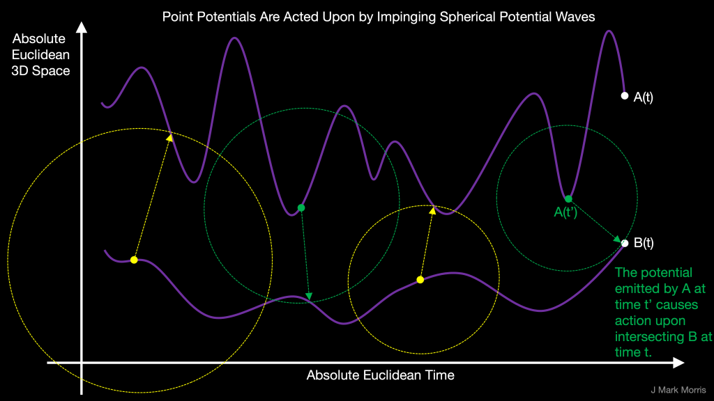
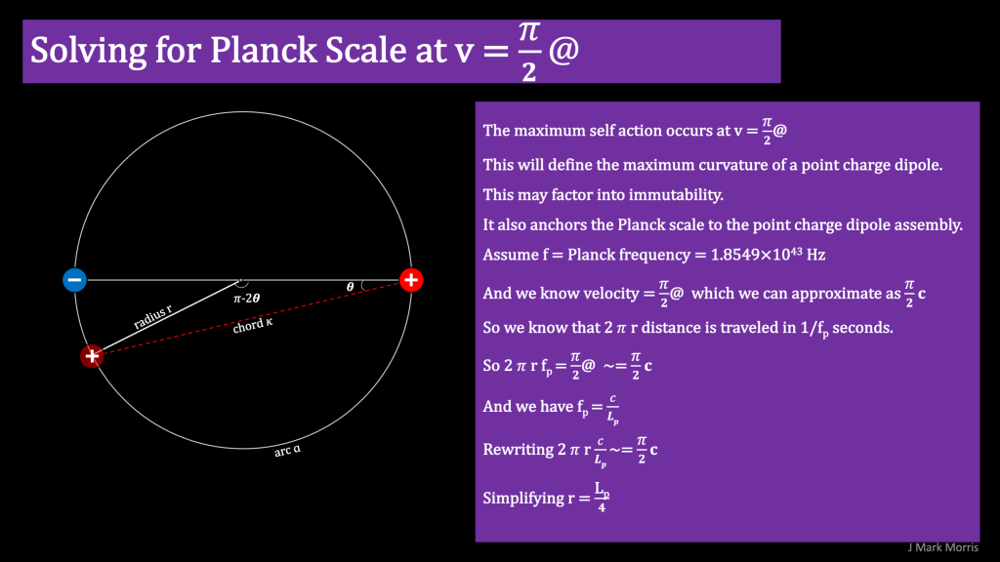

Nature emerges from energetic point potentials in a Euclidean void of time and space. What are these unit potentials? NPQG calls the negative point potential the **electrino**, and the positive point potential the **positrino**.

Each point potential follows a continuous path through time and space in response to action from impinging potential waves from all point potentials, including themselves. Likewise, each point potential is constantly emitting a unit potential wave that spherically expands from the point along the path where it was emitted.

A point potential is modeled as a geometrical point that emits potential at a constant rate. Interestingly, it turns out that a pair of orbiting point potentials have a lower bound orbital radius (see derivation in figure) which establishes a mapping between point potential binaries and the Planck length and Planck frequency. The binary can not reach a radius of zero. However, even if two point potentials were to be at the exact real physical location in t,x,y,z there would be no annihilation. The mathematics do not escalate to infinities. These are the reasons that NPQG does not suffer from Einstein's singularities.

- NPQG presumes that at large scales, the positive and negative point potentials are populated in equal proportion.
    - The universe appears to be neutral at large scales.
    
    - It makes intuitive sense that the two densities would be equal.
    
    - Emitted positive potential balances emitted negative potential.

- There are empirically measurable large scale constants
    - The universal constant speed of the point potential emission is given by the symbol @.
    
    - The speed of light c approaches field speed @ in low apparent energy spacetime aether.
    
    - The large scale density of point potentials.
    
    - The large scale density of the energy carried by point potentials.

- Superposition allows us to consider negative and positive emissions as different polarities of the same mechanism, that of expanding sphere streams emitted at each moment along the path of the point potential.

> _Potential energy is the energy held by an object because of its position relative to other objects, \[...\], its electric charge, or other factors. Potential energy is closely linked with forces. Work per unit of charge is defined by moving a negligible test charge between two points, and is expressed as the difference in electric potential at those points._
> 
> Wikipedia (various)

If we think about most things we encounter on earth they are essentially net neutral meaning they approximately contain the same number of electrinos as they do positrinos. Even when we pick up a bit of static electricity on a dry day, when you consider how many point potentials comprise your body, the percentage difference between electrinos and positrinos would be miniscule. That said, there are natural as well as technological processes where point potentials are concentrated at various scales.

Here are some characteristics of electrinos and positrinos with some detail on emergent assemblies. These topics will be covered in more detail later.

- An electrino/positrino pair can form an orbiting binary.

- It must be possible to split an electrino/positrino binary, since many assemblies aren’t symmetric.

- A photon is a stable configuration of contra-rotating coaxial point potential binaries.

- Spacetime æther is composed of low apparent energy structures made of tri-binaries.

- Spacetime æther may include low apparent energy Higgs clusters, neutrinos, photons, and other point potential assembly detritus.

- Reaction outcome (or stability) is due to both the assembly configuration and energy, but also the environment, i.e., spacetime æther energy, nearby particles and their geometry, etc.

- Each particle in the standard model is implemented by an assembly of point potential.

- Point potential assemblies follow architectural patterns.

- As more energy is transferred to a binary, it assumes physical configurations that can store more energy. The binaries also shrink according to the Lorentz factor which brings potentials closer together.

- Point potentials store energy in both kinetic and electromagnetic potential forms.

- The energy of each binary comprising a tri-binary core may be different by orders of magnitude

- A tri-binary core bonds with six personality potentials, thus making the fermion assemblies.

- Einstein said $latex \\mathbf{E=m c^2} &s=2$. How do we introduce v, the speed of the electrinos and positrinos ε⊖ & ε⊕, orbiting in the tri-binary core?

- What is the relationship of the particle energy magnitudes in electromagnetic form and in the kinetic forms, i.e., linear velocity, rotational velocity of the electrino and positrino within assemblies?

- Energy may only be carried by electrinos and positrinos.

- Wavelength is the distance traveled by the assembly in one binary orbital cycle.

- The penultimate energy particle, just below the energy of the Planck particle, may have the sum energy of harmonics 2..N, where N is the lowest permissible harmonic, i.e., 0x0111...111. It seems like this might be a complicated wave equation. Adding one more Nth harmonic produces the Planck particle with only the first harmonic, 0x1000...000.

- The speed of the electrinos and positrinos in a tri-binary determines both the kinetic and electromagnetic potential energy stored.

- At high energy and high velocity binary radius is small.

- As energy is dissipated to other assemblies, the binary radius inflates.

What are the considerations for the visual symbology we choose for the electrino and positrino in NPQG?

- Easy to understand, intuitive.

- Indication of oppositeness.

- Minus and plus symbol to indicate potential polarity in some representations.

The colors blue and red indicate potential polarity. In animation and simulation visualizations, the color will suffice without the minus and plus symbols.

_**J Mark Morris : San Diego : California**_
