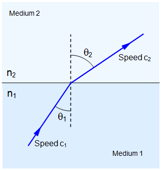
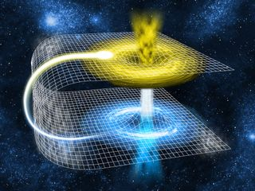

This idea is speculative.

Although GR-QM era scientists assert that the speed of light, **_c_**, is a constant in spacetime, it turns out this is false. Our measurements of **_c_** are typically done in low-gravity environments where it has appeared to scientists as though **_c_** is a constant. In the NPQG model, the speed of light varies based on the local energy density of the spacetime æther, which itself varies based on the density of nearby matter-energy. Essentially, the energy of the æther is the mechanism by which gravity is implemented. Another clue to a variable speed of light is what scientists term "gravitational lensing" of light noticeable around massive objects like stars and black holes, based upon Einstein's theory of curved spacetime. However, now we know that space is 3D Euclidean and that Einstein's curvy spacetime is implemented by the æther in which the speed of light slows nearby dense matter. Therefore, gravitational lensing is really refraction, which is a high school physics topic.

> In physics, refraction is the change in direction of a wave passing from one medium to another or from a gradual change in the medium. How much a wave is refracted is determined by the change in wave speed and the initial direction of wave propagation relative to the direction of change in speed.
> 
> WIKIPEDIA

<figure>

<figcaption>

schoolphysics.co.uk

</figcaption>

</figure>

Given that the speed of light varies depending on the æther energy gradient, which is also related to the strength of gravity, how can we determine **local-_c_** mathematically? In the GR-QM era, **_c_** was based upon the _permittivity_ and _permeability_ of "spacetime." These parameters define the ability of the æther to store more energy. Scientists had thought that permittivity and permeability of "spacetime" were constants, but it turns out they are not. Permittivity and permeability are functions of the local energy density of the æther. This makes sense given that there is an upper limit to the energy a point charge can carry, given by the Planck energy. Thus, as the æther particles energize, as a function of density of nearby matter-energy, their ability to store more energy in the future is continually reduced. The more energy stored in the æther, the higher the permittivity and permeability, and the lower the speed of light in the æther.

<figure>

<figcaption>

Wikimedia Commons

</figcaption>

</figure>

Therefore, we change our speed of light formula from $latex \\mathbf{\\frac{1}{\\sqrt{\\epsilon{\_0}\\mu{\_0}}}} &s=4$ to $latex \\mathbf{\\frac{1}{\\sqrt{\\epsilon\\mu}}} &s=4$. This formula change also specifies a change from a universal spacetime constant to a local æther constant.

A photon is a composite particle with six electrinos and six positrinos. Let's consider the internal orbital speed of those electrinos and positrinos as the photon travels through spacetime aether. Let's make the intuitive leap that the velocity of the electrinos and positrinos in a Planck particle are the same as the local speed of light. Interestingly, a Planck particle can accept no more energy, and therefore, its permittivity and permeability are infinite. Therefore, the local speed of light is **zero** in the Planck core. Therefore, the electrinos and positrinos are not moving in the core. They have taken on some kind of structure that stores the maximum amount of energy.

In the Planck core, the zeros for **_c_**, information, and the rate of time, along with the infinities for permittivity and permeability are likely related to Einstein's general relativity mathematics blowing up in what has been called a singularity. A physical model with math that in some cases divides by zero is not good because it produces infinities that are difficult to explain. However, now we understand what is happening physically: it is simply a Planck core, which is the hottest, most energetic possible matter in the universe. Yeah, it's a bit exotic, but it is also rather simple to imagine. We can abandon all those fantastic ideas of wormholes and the universe reduced to a point particle.

<figure>

<figcaption>

Wormhole bridge between galaxies.  
(Image: © edobric | Shutterstock)

</figcaption>

</figure>

Now let's imagine a high energy photon is on a collision free path towards a lower-energy region. What happens? That's right, **_zing_**, that photon is going to travel at the local speed of light. The local speed of light may change rapidly as it exits the gravitational well near the emitter and enters regions of lower energy spacetime and lesser gravity. That photon is also extremely reactive and will collide with other photons and react and cool. It's a cauldron of reactions in the vicinity of exposed Planck plasma.

Let's take another intuitive leap and guess that the orbital speed of the electrinos and positrinos is the key to quantum energy transfers. Perhaps the orbital paths of the electrinos and positrinos implements a harmonic series of energy steps and when harmonics transfer to other particles. At the same time, as the photon is red shifting energy as it leaves the gravitational well at the emitter, the æther energy density is reducing, and therefore, the speed of light starts increasing. Clearly there are some mathematics to work out here, but hopefully you can roughly imagine this process.

Is there a relationship between a photon's translation speed (the local speed of light) and the orbital speed (magnitude of orbital velocity **v**) of the photon's electrinos and positrinos? Even though measured observational science is both accurate and precise these days, with very small error bounds, perhaps the difference between **_c_** and **v** is far below the scales of measurement or analysis of current experimental science. There is a lot of inflation and expansion from the highest energy photons up to the scale of our best measurements of the GR-QM era. Perhaps twenty orders of magnitude. An orbital speed **v**, very close to the translation speed of light, **c**, might actually appear to us to be at speed **c**, if the difference **(_c_ - v)** is below what we can measure. The implication is that there may be certain formulas which use **_c_**, the speed of light, which should really be using **v**, the orbital speed of the particles electrinos and positrinos. We will examine this idea as we dive further into the mathematics of **NPQG**.

PREDICTIONS AND HYPOTHESES

Obviously the next step is to begin an analysis of equations, particularly Einstein's equations and the Planck equations, that lead to a new understanding of nature. Which **_c_** is a **_c_**? Which **_c_** is a **v**? We need to examine $latex \\mathbf{E=mc^{2}} &s=2$ obviously. Similarly we must look at the momentum-energy equation. $latex \\mathbf{E^{2}=(mc)^{2} + (pv)^{2}} &s=2$**.** Are we missing terms in any equations? How do these equations work out to be consistent with the past and reveal the future of science?

**_J Mark Morris : San Diego : California_  
**
