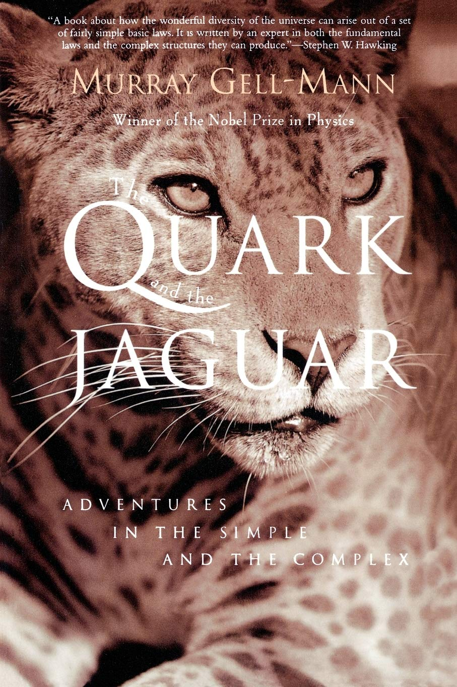

In Murray Gell-Mann's, "The Quark and the Jaguar," he mentions, early-on, his life long interest and passion for understanding nature and later his work at the Santa Fe Institute on complexity. There is a **_beauty_** to how **_complex_** systems **_emerge_** from **_simple_** inputs and rules. He published this book in 1994, 25 years prior to this writing. Yet for the last 50 or 125 years (a case can be made for both) physicists have been struggling against complexity, seeking to explain nature from a fundamental level that replaces complexity with simplicity and emergence. I think that with Neoclassical Physics and Quantum Gravity (NPQG), that solution has finally revealed itself.

> _...a complex adaptive system acquires information about its environment and its own interaction with that environment, identifying regularities in that information, condensing those regularities into a kind of "schema" or model, and acting in the real world on the basis of that schema._
> 
> Murray Gell-Mann in "The Quark and the Jaguar"

This is a model of emergence, with a mechanism as well. Yet, we must not ascribe any kind of mysticism or thinking intelligence to this process. This is a natural process where the system and the environment are symbiotic and evolve together, in reaction to each other.

<figure>

<figure>

<figcaption>

nytimes.com

</figcaption>

</figure>

<figure>

<figcaption>

achievement.org

</figcaption>

</figure>

<figure>

<figcaption>

noblelprize.org

</figcaption>

</figure>

<figure>

<figcaption>

Murray Gell-Mann Ⓦ

</figcaption>

</figure>

</figure>

> _All matter possesses energy, and all energy is associated with matter. When people refer carelessly to matter being converted into energy (or vice versa), they mean simply that certain kinds of matter and energy are being converted into other kinds. For example, an electron and a related (but oppositely charged) particle called a positron can come together and turn into two photons, a process a process often described as "annihilation" or even "annihilation of matter to give energy." However it is merely the transformation of matter into other matter, of certain forms of energy into other forms._
> 
> Murray Gell-Mann in "The Quark and the Jaguar"

This is an excellent observation from Dr. Gell-Mann. In NPQG this is written simply as fundamental particles are conserved and energy is conserved, where the fundamental particles are the electrino and the positrino unit potential point charges and the energy is in kinetic and electromagnetic forms.

Dr. Gell-Mann knew David Bohm quite well from their days in Princeton, New Jersey. Of Einstein and later Bohm's "hidden variables" ideas, Gell-Mann writes,

> _"Those variables may be imagined as describing individual flies buzzing about everywhere in the universe, more or less at random, interacting with the elementary particles and affecting their behavior. As long as the flies are undetectable, the best the theorist can do in making predictions is to take statistical averages over their motions. But the unseen flies will cause unpredictable fluctuations, creating indeterminacies. The hope was that the indeterminacies would somehow match those of quantum mechanics, so that the predictions of the scheme would agree with quantum-mechanical predictions in the many cases where observation confirms the latter."_
> 
> Murray Gell-Mann in "The Quark and the Jaguar"

Gell-Mann's description of hidden variables matches well to the NPQG idea of an æther of very low apparent energy standard matter assemblies. This æther replaces the vague quantum mechanics (QM) concept of the quantum vacuum.

Furthermore, the idea of the dawn of the universe being a Big Bang, is a wrong concept, replaced by galaxy-local mini-bangs and galaxy-local inflation/expansion in NPQG. Of expansion, Gell-Mann writes tellingly,

> _"The solar system is not expanding, nor is our galaxy or the cluster of galaxies to which it belongs. The other galaxies and clusters are not expanding either. But the different clusters are receding from one another, and that is what reveals the expansion of the universe."_
> 
> Murray Gell-Mann in "The Quark and the Jaguar"

Gell-Mann's description here is more consistent with NPQG, where an outflow of spacetime æther from galaxies and galaxy clusters would roughly balance the precipitation and inflow of higher energy standard matter (gas, dust, celestial objects, decay products from spacetime æther). The galaxy local expansion of spacetime æther would cause a photon to experience incrementally more redshift, as if it had traveled on a longer path through the spacetime æther than it actually had. We would then consider expansion to be galaxy local as well.

> There is a **_beauty_** to how  
> **_complex_** systems **_emerge_**  
> from **_simple_** inputs and rules.

Overall, I found "The Quark and the Jaguar" to be an interesting read if a bit over my head at times. Some of the book was new to me and intellectually beyond my understanding. Written 25 years ago as of my review, the main problems in physics are the same, illustrating the lack of progress in the field. The large majority of the book goes fairly wide into philosophy of science and complexity around the field of physics, reflecting Dr. Gell-Mann's work at the Santa Fe Institute. I expect that this firm foundation put in place by Dr. Gell-Mann will mesh perfectly and be informed by NPQG and allow **_emergence and complexity theory_** to be the ongoing focus of the Santa Fe Institute

_**J Mark Morris : San Diego : California**_
