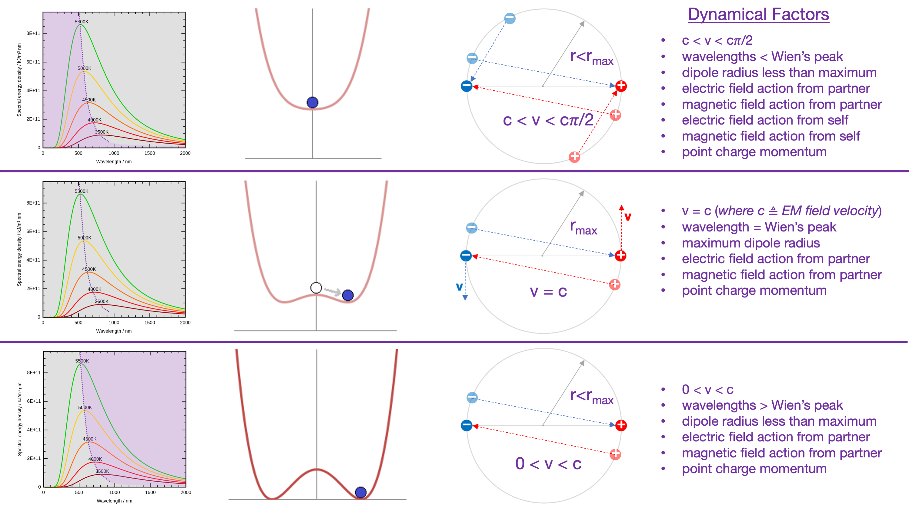

My hobby is to contemplate the evidence for and against an isomorphic mapping between the standard model and a model with energetic immutable point charges in a Euclidean void of space and time.

I am working on a conjecture that the point charge velocity in an orbiting binary can be mapped to Planck's law, the curve describing Wien's peaks, the regions on either side of that curve, and the spontaneous symmetry breaking often described with a sombrero — the iconic Mexican hat. The two point charges in each binary are shown in red and blue, along with shaded locations in their past, where they were when they emitted the electromagnetic fields that lead to action on their partner or themselves. I listed the dynamical factors that will inform the math.

Prior to attempting the math, I am floating this conjecture.

**_J Mark Morris : Boston : Massachusetts_**

p.s. I posted on reddit r/particlephysics. It only took a few minutes before it was removed.

The behaviour of the reddit r/particle physics moderators is atrocious. By now, I presume they know that I am on to something. So what on earth are they doing by deleting my posts and now banning me? What are some of the possible explanations?

- They still don't get it — and truly believe I am posting nonsense.

- They get it — and haven't yet decided how the field will come clean.

- Then there all the conspiracy possibilities. I'm not one to put much credence in conspiracy speculations. Only the moderators know, and they aren't sharing.

I sent these messages to the moderators of r/particlephysics :

_I presume the moderators of [r/particlephysics](https://www.reddit.com/r/particlephysics) understand by now that what I have been proposing is true, that the point charge model is isomorphic to the standard model. So what is going on? Are you all meeting in a secret cabal to decide how the fields of physics and cosmology are going to deal with this? Bottom line, it's better to fess up and move on to the next era. Anyway, whatever. I'm available if you need more help._

_I would hazard a guess that some of you or your institutions receive funding from public grants. I recommend you consider carefully the impact your actions to suppress the point charge discovery may have on future funding for you or your institutions, as well as liability in potential legal actions._

_My thinking is as follows : Journals won't publish anything from me because I am not a scientist (I have no desire to be one) and there is no way the preliminary scanner of papers is going to let something like this through because the isomorphism is not obvious and therefore it sounds like nonsense, even if it is simple and the false priors issue. I've tried the publication route several times and received some rather unkind rejections. Similar story on the requirement for sponsorship to publish on arXiv._

_My thinking is also that this is **not** like a press embargo on science research while the the research team documents their findings. This is someone from the public (me) attempting to alert the physics community that they really need to take a look at what I've found. What makes this different is I am not on your research team. So taking down my posts and banning me is actually suppression and I don't think the funding sources, nor the universities, would take too kindly on that suppression in the long term._

_Also, just to make up an example, let's say quantum computing as currently formulated becomes far less interesting due to now having the source code to nature. Then what happens? There could be a lot of exposed investors. My recommendation is that this is not the normal case where anonymous physicists feel free to bully people bearing 99.99999% nonsense ideas._

_I recommend having a discussion with the executives in your institutions and universities if you actually understand what I have found and are suppressing it for whatever reasons you think are justified. Ok, I think I have said what I wanted to say. I suppose this is it. Goodbye and good science to all of you._

* * *

It's been half a day since this tense exchange with the moderators of r/particlephysics and the more I think about it, the more offended I become. It may finally be time for me to let go of my unrequited love for physicists and to begin _intellectual guerilla marketing_. I know I have been suggesting for a while that I would turn my attention to geometers, chemists, and philosophers, but I am thinking now about university administrators, intellectual property attorneys, and sources of funding. There may no other solution than to completely disband the field of physics and assign the detritus to other departments, i.e., geometry, chemistry, and philosophy.

- **Revoke ALL particle physics Ph.D. degrees.**

- **Revoke ALL **particle**** **physics tenure.**

- **Fire ALL **particle**** **physics professors.**

- **Eliminate ALL funding for GR/QM/LCDM based upon the faulty narrative of **particle** physics.**

- **ALL means ALL**

- **The only way forward is to clean house and start over with with a blank slate and a new and refurbished generation of scholars.**

Perhaps you might think I am over-reacting. Really? After 3.5 years of brutal bullying from the guardians of physics, I have had enough. Is it over-reacting to hold the entire field of particle physics accountable for it's false priors, nonsense interpretations, and inability to detect false priors given their ridiculous interpretations, and allowance of a phalanx of guardian physicists to keep the ideating public at bay? No, I think that is entirely fair. I have given them enough chances in many forums for years.

Physicists are not stupid people. One might think they are the best and brightest. Yet if their mental software is corrupted and all they can do is execute mental software in some incorrect fantasy narrative world, then of what use are they to science? If physicists, en masse, enable this phalanx of bullies, then they are also complicit and accountable. To be clear for administrators who will need to rebuild their science departments, I am referring to those anchored securely in the particle physicists patriarchy. You will need to gauge the degree of sepsis in other areas and how much to excise. You really can't go wrong by sweeping out the entire entrenched patriarchal guard, because the next era is so parsimonious that the past generations have nothing of value to add. Science will be far better off with fresh unencumbered minds exploring the point charge fundamentals of nature.

p.p.p.s. As a reminder, my trials and tribulations with the physics community must be viewed in an overall context where the patriarchal physics power structure has caused great suffering to sub-groups in their own community, specifically women, people of color, non-binary people, and each new crop of eager physicists entering this system. Lots of people get stepped on or far worse in science. Those are the people who have truly suffered in myriad ways, from harassment, discrimination, power manipulation, intellectual bullying and more. I hope the point charge era leadership places a huge priority on valuing and respecting people within and without the field as individuals.

p.p.p.p.s. What shall we call the new field that replaces particle physics? How about "nature" as in "**The Department of Nature**?" Not only is that an appropriate moniker, but the change itself could signal that universities or institutions are reforming and attempting to create an intellectually safe environment for studies of nature and emergence.
