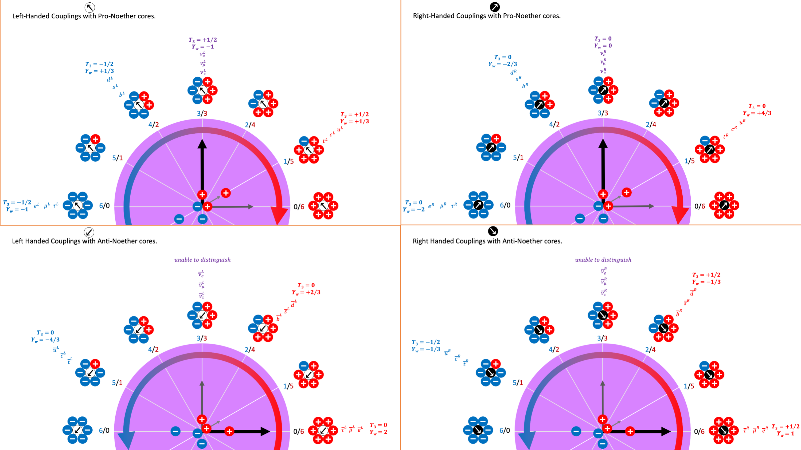

 * *

> _Expansion of the universe… photons from cosmic microwave background had way more energy when they were emitted compared to what we observe_.
> 
> Commentor

I think it is really difficult to be precise in statements about photons received at a CCD detector. I mean, what do we really know? A little green martian could be holding such photon generators right in front of your instruments. Of course that is not the case, but the point is that there is a huge hierarchy of logical inference that goes from received "cosmic microwave" photons to a Big Bang.

> _You know that big chunk of them was released by hydrogen which is very specific energy level_?
> 
> Commentor

Yes, I think this is a great point that a lot of those photons were clearly from the hydrogen line at 21 cm. Now this begs the question of how to interpret the redshift. Via what process did those photons shift to such a low energy? I propose that the idea of a universe expanding outward in scale is fantastical woo. It is far more sensible to imagine that every particle includes a chunk of spacetime and we already know that spacetime handles pair production and annihilation. Therefore all you need is for the chunks to inflate and expand, while also balancing the with pair production. This is a totally different way of thinking about it, but doesn't require any new science.

> _For now science says "Dark Energy" and that is pretty much it... Nobody knows what it is, or have any idea of how to find what it is experimentally..._
> 
> Commentor

I have a lot of ideas for how Dark Energy might map in the point charge formulation of the universe. Mainly the Noether core spinning tri-binaries form and are essentially a chunk of what we call spacetime. Then everything else is assembled with those Noether cores as the battery heart. Except the battery heart leaks a very small amount of energy, which we call redshift. It ties to DeBroglie as well.

I've been trying to dive back into the theory and math of quantum spin and spinors. It's fascinating. I can see so many possible mappings to orbiting point charge binaries. It surprises me that so many people have been naysayers to the idea of point charges. I wish I was really sharp on my dynamical geometry — this looks like it should be a slam dunk mic drop. Seriously. Point charges have a precise path through Euclidean space and time. Their potential field is continuously emitted. The action on each receiving point charge is from the superposition of all incoming potential spheres.

That is a really pure specification of a dynamical geometry. If such a field of study does not yet exist in dynamical geometry, I suggest that is a major failing of academia.

I define a point charge as an eight ball vector (charge, time, x, y, z, dx/dt, dy/dt, dz/dt) and the action upon it by the aura of superposition from the impinging scalar and vector electric potential emitted by all eight ball point charges, including the self. It's really that simple. I think that solves and maps GR, QM, and LCDM less their erroneous narratives.

I predict that the known symmetry violations can be explained with a proper understanding of the implementation. I think some of the symmetry violations can be explained by science not understanding the low energy reactants and products to reactions, because those low energy products are not detectable by our instruments. Are some symmetry violations baked in even at the point charge layer? I don't know. I still am perplexed by how magnetic fields rotate around a moving charge. Why causes them to rotate? I can not explain that yet and I have no clue other than the vague thought that this may be emergent behaviour or whether it is a convention run amok. The question in my mind is whether an individual point charge flying through Euclidean time and space will have a magnetic field given by the right hand rule. I don't see how it would since there is no spinning electric field.

I think this gets down to which came first, the chicken or the egg. I am saying that we can go from orbiting point charges to GR in one or two assembly steps from the maelstrom. It just depends on how broad an assembly rule you allow me. Rule 1: opposite point charges attract and orbit as binaries. Rule 2: Orbiting binaries capture each other and nest to the limit of dimensional space, which is 3D. Given a bit of thought I could encapsulate that in one slightly more complex rule.

I recommend a theoretically flexible conception of time and also of the Big Bang. It's complicated, but everyone has their own mental conception of what those mean. Mental models vary in flexibility, span, correctness, and attention to detail and nuance. However, science strives to be precise about what is meant. Scientists would be the first to tell you they don't fully understand time (Rovelli) nor the Big Bang (Sir Roger).

So that brings us to the Big Bang. If you study the theory there is no single place and no single time of either the Big Bang or Inflation. I swear it is the truth according to Guth on inflation, and more generally on the Big Bang. LeMaitre is the one who projected backwards to a single event. I think these nuances are not fully grasped by everyone, myself included. It is forever dawning on me what Matt, Anton, Becky, Sean, Lawrence, Frank, Paul, Sabine, Leonard, Carlo, and so many other great scientists and communicators meant when they mumble "_ahem … perplexing nuance … ahem_". Ok, would it be consistent with current science to say : "The essence of every standard matter particle began at an unspecified time and unspecified place. The oldest photons we measure appear to have redshifted for about 13.8B years." It's a leap to link these statements.

Imagine the major recycling plant in the universe as the center of each galaxy and more specifically the SMBH — if the SMBH has formed and not vamoosed. Think about how many theories that would reconcile. You get big crunch in each galaxy, you get eternal inflation, you get distributed bangs in time and space, you get a multiverse (overlapping), you get Sir Roger's CCC. You get more, but I'll stop there.

> _Commenter : Well, a photon from the "big bang" would, in theory, say that the big bang just happened, just this instant… no?_

Our instruments detect photons in the microwave frequency, which scientists believe are sampling the eldest photons in the universe from the farthest reaches — and then they take a huge intellectual leap and associate with those photons "the" big bang. They are just photons impacting an instrument sensor. I think that gets to your point as well and you raise a good point. How are we to know that there isn't some background creation of microwave frequency photons from some unknown cause? I have also wondered if perhaps an ultimately redshifted photon might cause a reaction when it redshifted out of light speed. That reaction might create some microwave frequency photons for all we know. It's a good question, and I don't yet have a good feel for the implementation.

> _Commentor : I have had similar thoughts about "crunch" galaxy-wise … didn't think through the expansion universe-wise, but I love it. It feels elegant._

In my view your intuition is correct because it is extremely elegant and therefore probably the truth (in my opinion). Let me offer an idea on inflation and expansion. Imagine that the heart of every standard matter particle is a little chunk of Einstein's spacetime. So this little heart full of energy can expand and contract and it likes to consume and expend energy in quantum of energy h-bars. When that heart has a lot of energy it contracts and it beats faster. When that heart sheds energy it grows and beats slower. We now have this heart metaphor that unifies general relativity and quantum mechanics. And we arrived in this discussion from SMBH recycling plants and the Big Bang.

> _Commentor : Not even sure there necessarily has to be any overlap._

If I understand what you mean by overlap, I totally agree. As I understand it, science could not rule out overlapping discrete bang-_ish_ events distributed in time and space. Such an implementation would be entirely consistent with state of the art hypothesis.

> _Commentor : I just mean that, if the crunch results in another "big bang", that big bang is happening within an expanding universe, so that as it expands, so does the "bubble" from the universe in which it previously crunched, so that (empty) space is made for the "new" universe. The cycle could then repeat infinitely._

My view is not inconsistent with yours. I have a more specific implementation in mind, and it matches at large scales in time and space and parallelism.

> _Commentor : First law of thermodynamics hasn't failed anywhere, I don't think it will with regards to big bang either._

Au contraire! The first law of thermodynamics has been misinterpreted across continuous and quantum domains. Since GR and and QM are not unified, there is no bridging of the quantum to the continuous realms. The first law of thermodynamics is silent on the quantum and continuous domains.

Are there any observations in particle physics other than via photons? I know we are early days into neutrino particle and gravitation wave metronomy, but in terms of QM, QFT, QCD, QED and all their supporting observations in colliders, are the actual measurements based upon photons?

* * *

Social media skepticism of NPQG from the hip, without serious engagement:

> ..._like really, explaining all the complexity of the world with just couple of particles..._
> 
> PBS Space Time discord user

My response: Yer funny. Two particle types. They form rotating binaries, -/+, and emergent assemblies. Two directions of spin left, right. Each binary has 2 x 1.855 x 10^43 energy storage levels in h-bar j-s. Normal and anti-particles. Color charge for quarks. You really don’t need much diversity in configurations if you consider that three -/+ binaries with vastly different energy form the energy core of ALL standard matter particles, and that if you drop the lowest energy binary in a core you now have gen II fermions and if you then drop the next lowest energy binary in a core you now have gen III fermions. Now we get to the personality set of binaries. 6-/0+ electron, 4-/2+ down quark, 1-/5+ up quark, 0-/6+ positron, and etc. The quarks have color charge because it matters which binary in the personality couples with which binary in the energy core. Photon is 6-/6+ which you can think of as 3-/3+ coupled with 3-/3+. Noodle it out on a piece of paper. It’s plenty of diversity to create the standard model particles and all the other exotics. This picture isn’t done yet, but here is my working illustration. If you are a professional in physics, you should drop everything and engage with NPQG.

Imagine the shape of the electric potential fields around one of these binary sub-assemblies, each rotating left or right at 10^43 possible energy levels. Of course, we only experiment at the very low end of that scale. Do QFT/QCD/QED specify fields of that level of emergent complexity? Do they imagine wave equations implemented by an assembly with a dozen point charges under the influence of one another? Ok, no more silly talk that two equal and opposite point charge types are not sufficient. I’d like to say ‘physicists do your thing’ but I don’t think they can extract themselves from the 133-year-old tar pit of errors they created in their imagination with their narratives. Their math and observations are fine, they just missed this next lower-level right below the standard model. Of course, once the physicists get on board, they will make tremendous advancements because EVERYTHING will make sense!

**_J Mark Morris : Boston : Massachusetts_**
