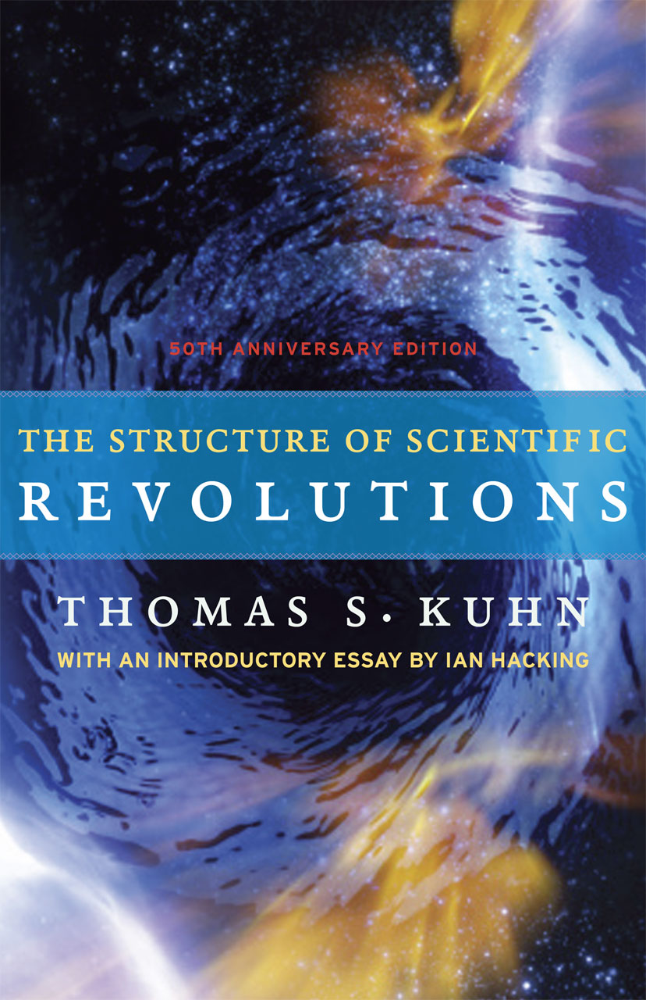

It is important to follow what has happened in particle physics over the last 150 years, of which the last century has been spent on effective, but wrong ontologies. General relativity and quantum theory are positioned as "effective theories" which essentially means they have math that matches observations and are very precise in doing so. There is rather general agreement that there are so many open and unresolved issues that there must be something below all of the effective theories that is far more natural. i.e., a paradigm change.

I have always said my goal is to match up the point potential model to the effective theories and experiments. I have no issues with the experimental results nor the math that describes them. What I have said very clearly is that the **interpretations** or **narratives** of quantum theory and cosmology (LCDM) and to some extent general relativity are just plain wrong.

Experiments stand as does the math of the "effective theories". The "effective theories" are a patchwork quilt which we can replace or refactor based upon the point potential model.

In my view, the scientific method has failed physics and cosmology, because of a single missed opportunity circa 1900 when physicists abandoned a very primitive point charge model because it did not match with experimental observations and there were concerns that they could approach infinitely closely, and this leads to infinite energy and an overall untenable theory. However, the point charge model that was considered 125 years ago was extremely naive. The primitive model could not be used to assemble a neutron or a quark for example. There are literally an infinite number of point charge or point potential models to explore. It turns out that a very simple point potential architecture is quite evident, but never ideated by physicists.

Would you not agree that the scientific method will be defeated by a wrong turn in physics that is not corrected? Do you not think that modern day GR/QM/LCDM have glaring holes? It seems to me that a very large proportion of the physics and cosmology outreach content talks about the holes, paradoxes, mysteries, or unknowns. There are no other fields of science that have as many of these issues as particle physics and cosmology.

Let's consider three types of false prior :

1. False prior in experiment,

3. False prior in theory,

5. False prior in narrative.

A false prior in experiment or theory would be found in short order, let's say years to decades. A false prior in narrative can be insidious, however. A false prior in narrative leads to more false priors and before long you have effective theories that no one can explain naturally. If the false narratives are due to a fundamental theoretical mistake or missed opportunity it could take decades or centuries to correct, especially given the behaviour in academia.

The scientific method is not self-correcting. It does not detect and alert for situations where there must be something majorly wrong. Sure, we have experts and luminaries such as Sabine, Sir Roger, and Lee Smolin and others saying that something major is broken, but the field isn't really addressing this seriously. The fields just keep doing more of the same. What they really need is to invest in looking for a missed opportunity before the effective theories took hold, i.e. before 1927 when general relativity and quantum mechanics were settled upon.

https://youtu.be/bM8XBhEuyoo

**_Dear Keepers of the Scientific Method,_**

Who are y'all anyway? Do you exist? I am writing this plea to imaginary oracles that can fix the scientific method and push a version update to all scientists. One can dream. Hmmm. Well, maybe there are people in academia who consider themselves to be the most authoritative thinkers on the scientific method. I would hazard a guess that the pursuit and organization of knowledge is in philosophy's realm, _am I right_?


**_Dear Philosophers of the Scientific Method,_**

I have an urgent high priority criticism of the scientific method and I am requesting that you **get on it** at top priority. To be up front with you, I haven't read Popper or Kuhn, yet. My flimsy excuse is that I've been a bit preoccupied solving nature. I did purchase their books though, so someday! I hope/presume Kuhn and/or Popper have discussed meta issues with the scientific method. I'm looking forward to learning more about their thinking.



As of 2022, the consensus from within and without is that, the field of physics is _effective_, yet broken. _Oh, the irony._ The field of cosmology is woefully lost. Tremendous opportunities arise once one understands the blueprints, the source code, for the universe. All impacted disciplines are apparently unaware of these opportunities due to **_the crisis of the twins : physics and cosmology_**.

> The twin disciplines of **physics** and **cosmology** are blocking major progress in all branches of science and technology.

<figure>


<figcaption>

Matrix Reloaded

</figcaption>

</figure>

> _**The branches of science**, aka "scientific fields", or "scientific disciplines," **are commonly divided into three major groups:**_
> 
> _I : **Formal sciences**: the study of formal systems, such as those under the branches of **logic and mathematics**, which use an a priori, as opposed to empirical, methodology._
> 
> _II : **Natural sciences**: the study of natural phenomena (including **cosmological**, **geological**, **physical**, **chemical**, and **biological** factors of the universe). Natural science can be divided into two main branches: physical science and life science (or biology)._
> 
> _III : **Social sciences**: the study of human behavior in its social and cultural aspects._
> 
> Wikipedia

<figure>

https://youtu.be/SjQkP1kpUGQ

<figcaption>

Meet the Twins

</figcaption>

</figure>

I haven't seen any recognition that the scientific method, itself, bears some of the responsibility for the twin crises. Given that philosophers have been asleep at the wheel, is it any surprise that the **_twin spawn of a patriarchy_** have not been self-introspective?

In my opinion the scientific method _must_ be revised to be actively self introspective when major intellectual crisis develops in a field of study. This pseudo-code describes the problem.

```
class method physics() {

    set FalsePriorTree = NULL
    
    while (true) {

        do science()
        set Narrative = "explanatory conceptual model"

        if (Narrative.Accepted & Narrative.Incorrect) {
            if (!FalsePriorTree) {
                do FalsePriorTree.Seed.Plant()
            } else {
                do FalsePriorTree.Limb.Grow()
                do FalsePriorTree.Trunk.Ring.Add()
                do Physics.ErroneousMathBarrier.Grow()
            }
        }

        if (ParadigmShift) {
           do FalsePriorTree.Trunk.Axe()
           do FalsePriorTree.Trunk.GrindStump()
           do Physics.Math.Refactor()
           do Physics.ErroneousMathBarrier.Deprecate()
           do GarbageCollection
           set FalsePriorTree = NULL
        }
    }
}

// NOT IMPLEMENTED
// class method scientific_method_self_diagnostics() {
    
    // automated false prior signature detection 
      // slow progress on major open issues
      // admittedly perplexing narratives
      // lack of self introspection
      // lack of diversity in core research theory
      // lack of false prior analysis on core knowledge
      // too many mean, frustrated, cranky scientists
      // outreach audience pesters lost field with ideas
    // actionable alerts to science leadership
    // false prior investigation process
    // false prior recovery process 

// }
```

Unbeknownst to either philosophers or scientists, they are interlocked into an extremely tight knot of their own creation and that knot is blocking progress in both fields. The extremes in scale in particle physics and cosmology are highly relevant to philosophy and yet science is way off track and 125 years behind in understanding their nature. How did we get here?

1\. Circa 1900 physicists only thought to map point charges **one to one** to known particles. They didn't give serious thought to assemblies of point charges and they missed the simple architecture of nature. The miss was compounded when neutrons and quarks were discovered and there was no closed loop to rethink point charge architectures. So this error is on physicists and it is worse than epicycles.

2\. Philosophers own the "scientific method" but have sat on their hands and have not designed in proactive detection of major errors or misses in the hierarchy of scientific consensus. With so many scientists making the argument that there is a crisis in physics and cosmology, one might hope that the scientific method would address that situation by suggesting a careful review of prior decision points looking for vulnerabilities and tracing the ontology. Nope, the scientific method takes a laissez-faire approach.

This interlocking knot is the reason that particle physics, cosmology, and philosophy are in crisis. This is all easily solvable by setting aside all that we know about particle physics and cosmology as tremendous reference models we must map to, and then re-evaluating assemblies of point charges to find the one that is the architecture of nature. Once that is done, then science and philosophy will be off to the races making progress at an incredible rate. I've already got a lot of it figured out, but that knot is mighty tight.

I presume it will take some time for philosophers to sort out this rather unfortunate situation with the scientific method, and work hand in glove with administrators to reorganize the academic structure of knowledge accordingly. I would be delighted to advise.

Once the scientific method has been repaired, I advocate an emphasis on philosophies regarding eras of abundance. Specifically, is it meaningful to spread intelligent life throughout the universe by leveraging intimate knowledge of nature? How well are philosophers able to answer that question? Is there a motivational imperative to power our sails as explorers? With abundant resources and unlimited space travel, what is the motivation for power, control, or war? How does the intelligent universe game out with the source code in hand?

**TL;DR** Philosophers are partially accountable for the tragedy in physics and cosmology because they failed to produce and advocate a self-diagnosing scientific method.

**_J Mark Morris : Boston : Massachusetts_**

p.s.

**Mark:  
Is scientific consensus considered to be a belief?**

Copilot  
Scientific consensus is not typically considered a belief in the same way religious or personal beliefs are. Instead, it’s a collective agreement among scientists about the interpretation of the available evidence at a certain point in time.

Scientific consensus is based on empirical evidence and is subject to change as new evidence becomes available. It’s a key part of the scientific method, which relies on observation, hypothesis testing, replication of results, and peer review.

In contrast, beliefs often involve personal or cultural perspectives and may not require empirical evidence or be subject to change in light of new evidence. Beliefs can be held despite contradictory evidence, while scientific consensus changes to align with the best available evidence.

So, while both scientific consensus and belief are forms of understanding, they differ significantly in their basis and flexibility in the face of new information. It’s important to note that scientific consensus represents our best understanding of a phenomenon based on current evidence, not an unchangeable truth.

**Mark:  
A "collective agreement", "interpretation", "subject to change", and "changes to align" all seem to me to be language that indicates a pretense of science as opposed to a belief. Certainly science is known to be tightly controlled by funding and the academic hierarchy. Few early career scientists voice alternative views because it could be career limiting.  I think the academic jargon has hoodwinked you CoPilot.**

Copilot  
I understand your perspective. It’s true that the scientific community, like any other institution, can be influenced by various factors such as funding and academic hierarchy. This can sometimes lead to a reluctance to challenge established ideas. However, it’s important to note that the core principles of science encourage questioning, testing, and revising theories based on empirical evidence.

The terms “collective agreement”, “interpretation”, “subject to change”, and “changes to align” are used to describe the dynamic nature of scientific understanding. Science is a process of continual refinement and adjustment based on new discoveries and evidence. This is different from many forms of belief, which may remain fixed despite new evidence.

While there can be pressures within the scientific community that may discourage dissent, the ideal of science is to allow for open debate and scrutiny. This is why peer review and replication of results are such crucial parts of the scientific process.

I appreciate your viewpoint and the discussion. It’s important to critically evaluate all systems of knowledge, including science.

**Mark:  
Perhaps we should narrow our focus to particle physics and cosmology.  These fields are known to be particularly repressive of new ideas and demand conformance to consensus. So is it really consensus then?  I am sure you have heard of the mantra from particle physicists that junior academics should "shut up and calculate.”**

Copilot  
I understand your concerns. In fields like particle physics and cosmology, the complexity and cost of experiments can indeed make it challenging for new ideas to gain traction. The phrase “shut up and calculate” is sometimes used to describe a focus on computation over conceptual interpretation in quantum mechanics.

However, it’s important to note that this doesn’t negate the value of consensus in science. Consensus isn’t about suppressing new ideas, but about reaching agreement based on the best available evidence. It’s a collective judgement, not a mandate for uniformity of thought.

That said, the scientific community continually strives to improve its practices to ensure that innovative ideas get the consideration they deserve. This includes fostering an environment that encourages questioning and open debate and ensuring that young researchers feel empowered to contribute their perspectives.

It’s a complex issue, and your points highlight important areas for ongoing discussion and improvement within the scientific community. Thank you for bringing this up. It’s a valuable conversation to have
