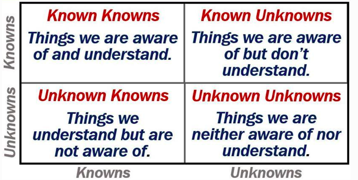

A fascinating video debate between Dr. Alan Guth (age 74) and Sir Roger Penrose (age 90) was published, August 16, 2021. The debate gets testy at some points and a few barbs fly with various levels of subtlety. Phil Halper produced the film and moderates, and he attempts to diffuse the most uncomfortable exchanges. In any case, it is a rousing debate that tap dances right on top of the point charge architecture of nature. I'll explain why in the commentary below. Neither Dr. Guth nor Sir Roger are narratively correct, yet we can tell their instincts and directional statements have a strong correlation with correctness as defined by NPQG and the emergent behaviour of point charges.

I hope these luminary physicists live to see the beginning of the immutable point charge era. I would be fascinated to see each of them apply their deep insights to the incredibly parsimonious point charge model of nature. Candidly, I would also like to hear their own analysis of how physicists managed to fail to find such a parsimonious theory of nature at each of the inflection points in theory and observation over the past 150 years!

https://youtu.be/YhbULagUKhA

I would love to see Dr. Guth light up when he realizes that Einstein is to be understood at incredibly small scales as the characteristics of the point charge binary and the Noether core, three nested pairs of orbiting positive and negative point charges at vastly different energies and orbital orientations. It is so beautiful how a Noether core implements Einstein's general relativity by ticking off 1044 different energy levels for each binary, the difference between each energy level the quantum in h-bar j-s, the radius of each orbit, and the frequency.

Oh how I would enjoy showing Sir Roger Penrose that the basis of nature is not fields, but immutable point charges and the amazing structures they create **and the emitted fields** that emerge from a maelstrom of energetic point charges comprising an assembly. I would be delighted to hear Sir Roger's thinking upon realizing that there is a minimum size for a binary assembly and a maximum concentration of energy. He might then finally make the connection that he has sought between certain black holes and what we call the Big Bang.

Then I would turn back to Dr. Guth and show him how the Noether cores form from binary capture and that a lower energy binary can capture a higher energy binary and shield its energy via superposition. And when the three binaries of the Noether core form and are so very small at first and as they spread out and lose energy in reactions, how the Noether cores inflate. **His inflation**. And how the Noether core is a reusable component inside all generation I standard model assemblies, even the ones we don't yet realize are reusing subassemblies - like the photon, with planar coaxial contra-rotating Noether cores, or the neutrino — with a low apparent energy Noether core that can't maintain shielding of the inner binaries and therefore looks to be oscillating in mass.

If only I could communicate with a physicist. But I have had no success since the early days of NPQG in 2018. It is true I will never be capable of their math. However, their math is a overly complex patchwork quilt applicable to different specific cases and scales. I offer them a unified solution architecture on top of which they could build beautiful mathematics and simulations that weave everything (truly everything) together. If they could understand this basic vision, I think science would be off to the races.

7:55 through 8:12 I can confirm there is no such thing as negative energy evident in the universe as modeled by two immutable point charges. Negative energy is not even a concept in the NPQG model and it's a very simple model : Euclidean space and time, a density 1 of plus and minus immutable point charges at |e/6| which carry a density 2 of electric potential and kinetic energy. That's it. Can anyone show how that could NOT be the basis of nature? How you could rule it out? I've been working for over 5 years on this and only find more and more correlations from the immutable point charge model to GR, QM and LCDM as well as obvious paths to the solutions to most of the open problems in particle physics and cosmology.

11:00 Dr. Guth describes his new favorite interpretation that what preceded the big bang is a stasis in time, a mid region, and that time is a two headed arrow of time and an eternal universe. On one side of the mid-point is the past before the bang, and on the other is the era since the mid-point. This description is exactly what I believe happens - the ultimate packing of immutable point charges in the densest objects in the universe, the Planck point charge core of an SMBH, where time stops and entropy is zero!

12:30 Dr. Guth talks about inflation solving the question of why the universe is so flat, basically Euclidean, especially at very early times. I find this to be a fascinating line of thought because it demonstrates how deeply embedded Einstein's idea of stretchy curvy spacetime as a geometry has become. Why does it not dawn on physicists that a Euclidean background space is reality and that it is permeated by some aether (aka dark matter, aka quantum vacuum) that implements Einstein's general relativity? Why has this been such a mental blindspot for physicists?

25:00 Dr. Penrose talks about the confusion with entropy, which physicists believe is always increasing. That suggests that when we go back in time we should see entropy decreasing and we do, except inflationary theory predicts that entropy is at a maximum at the big bang. This perplexes physicists. It really should not be perplexing at all however. An ideal Planck point charge core has zero entropy due to the tightly packed point charges in a single microstate, yet when the Planck core breaches, the point charges that emit are at maximum entropy due to them being at the highest energy range possible and influencing other point charges in the maelstrom with Coulomb's law and classical mechanics interactions due to velocity and proximity. Perhaps it is better to think of entropy as being conserved. That is, if a point charge in a reaction leaves one structure and joins another, that one structure became more ordered and the other became less ordered.

30:00 Dr. Guth talks about inflation creating mass! That fits well with my ideas about mass being an emergent property of assemblies in conjunction with their velocity and dominated by the internal configuration of the the Noether cores of the structure. Mass is apparent energy. Assemblies can and do shield high energy via superposition.

32:00 Things start to get a bit testy at this point when Dr. Penrose finds it a bit too convenient that a little tiny speck with less entropy than the whole universe is considered Dr. Guth's origination point for inflation. In other words, Dr. Penrose seems to be saying that the responses to his concerns about inflation are too lightweight or dismissive. From my perspective, having two titans of physics arguing over which type of tiny speck became our universe is laughable and tragic. I will never understand why physicists have allowed themselves to proselytize such ridiculous narrative interpretations. The fact that these narratives are outrageous should itself be a huge clue that they need to back out the interpretative woo and get down to business looking for the true basis of nature.

38:00 Dr. Penrose talks about how the absolute dominant sinks for entropy in our universe are black holes. Unfortunately Sir Roger's explanation for where the entropy goes is Hawking radiation or the singularity. I see it differently. In my estimation, when a point charge joins a Planck core microstate that reaction must leave behind the entropy the particle had before, in the intense molten point charge states that encapsulate the core. Thankfully I agree with Sir Roger that information is lost in a black hole.

40:00 Sir Roger discusses his CCC idea (Conformal Cyclic Cosmology) which is both brilliant and myopic at the same time. It is brilliant in that he proposes the concept of recycling of matter-energy through crunch-bounce-bang. The myopic part is that he never makes the association to the bounce point being inside black holes of sufficient characteristics, in particular supermassive black holes. In other words, rather than a universe wide serial process as Sir Roger depicts, it is a parallel recycling process that is independently happening in galaxies. That said, what Sir Roger denotes as a "Hawking Point" is a location in the cosmic microwave background where there may be evidence of a crunch-bounce-bang. One oddity is that [this paper](https://arxiv.org/pdf/1808.01740.pdf) identifies about 30 potential Hawking points. If so, why does Sir Roger still draw CCC as a serial process?

54:00 Dr. Guth discusses the concept of "**eternal inflation**" which is a follow-on idea to inflation proper. Eternal inflation means that big bangs occur into the future at an exponentially increasing rate each one forming a pocket universe. Of course, if he would just parallelize the process then his pocket universe would become, _wait for it_, galaxies! Yikes! All of these confused visions simply because physicists never had the imagination to consider point charges in an assembly architecture circa 1900, got off onto an incorrect narrative which has branched into a tree of nonsense narratives.

1:11:00 Dr. Guth embarks on a verbal essay about the general question of falsifiability. I'll try to summarize :

- A successful primary theory leads to a class of related theories.

- Any one theory in the class may be falsifiable and possibly falsified.

- The class is not falsified by the falsification of a single theory.

- Dr. Guth sees little value in trying to falsify an entire class that is an "effective theory" because the probability and return are low.

<figure>

<figcaption>

Andrea Mantovani

</figcaption>

</figure>

In my estimation Dr. Guth has misunderstood the situation and opportunity. The argument feels like a weary punt and if so, I understand, it's been a long and grueling journey and the theories are predictive to very good accuracy. However, what Dr. Guth is missing are the **_unknown unknowns_**. That is where enormous opportunities will be found. Also, we have to remember that physics is chock full of unknown knowns, i.e., effective theories, as well as known unknowns, i.e., the long list of open problems and conundrums in physics and cosmology. All of these unknowns can now be discovered and known in the point charge era.

1:14:00 Dr. Guth introduces evidence conflicting with Hawking points. Dr. Guth says that inflation predicts :

- the universe to be flat,

- cosmic microwave background radiation to be extremely uniform,

- the non-uniformities in the CMB to be scale invariant,

- those non-uniformities to have a gaussian probability distribution,

- and that perturbations should be adiabatic.

These predictions of inflation have all been verified by observation. Dr. Guth raises his concerns about Hawking points, suggests that Sir Roger's team is not modeling inflation properly, and notes eight papers falsifying the idea of patterns in the CMB such as those that Roger's team has published as potential Hawking points.

1:17:00 Sir Roger retorts with the rebuttal that his team doesn't model inflation at all, that they are looking at raw empirical CMB data and searching for patterns of a certain form. Penrose's team looks for three concentric rings with low variance and plots them in the sky along with temperature — and see a very non-uniform distribution over the cosmos. Sir Roger acknowledges that this pattern can not be from inflation, because inflation does not have this non-uniform distribution. He goes on to talk about the data and the color of these rings and their strong correlations. He says these have no explanation. Dr. Guth responds with renewed frustration that Sir Roger's team doesn't really understand the patterns predicted by inflation and that inflation is consistent with these rings that Roger sees, but that they are simply expected patterns in the noise. At this point in the video, moderator Phil deftly steers the conversation to something less controversial and more vague and the last 15 minutes are rather esoteric.

* * *

I'm currently reading the Hawking Point [paper](https://arxiv.org/pdf/1808.01740.pdf). In NPQG terminology, might Hawking points represent catastrophic eruptions of Planck point charge cores of SMBH or explosions rather than Hawking emission as Sir Roger conceives. I have considered the more typical and likely Planck point charge plasma escape route to be via polar jets of supermassive black holes. I also suppose it may be possible for Higgs spacetime aether assemblies to emit and escape through the event horizon. My intuition suggests that catastrophic Planck core eruptions would be relatively rare, but if or when they do happen, they would leave a reasonably large scale long lasting imprint on the cosmic sky.

I imagine a slowly rotating ultra-massive black hole with a point charge core that explodes catastrophically! How could that happen? Was it spontaneous according to some phase change? Was it catastrophic due to a supra high energy collision with another orb? What exactly is the scale of these patterns Penrose's team discovered anyway? Three to four degrees on the sky! That is enormous.

At the moment our instruments can observe the incoming photons from many enormous jetting SMBH and zero catastrophic 3 to 4 degree explosions. Yet the Hawking Point team detected many of these ring patterns. Woe is us if we were to actually witness such an event as a catastrophic breach of a supermassive black hole! Maybe that is another factor in the Drake equation. You never know when your worldline might intersect with the blast waves of photons, then neutrinos, then who knows what from a catastrophic Planck core breach. Might that be enough to cancel almost all life forms for quite some radius? Measured at what scale? galaxy clusters? They did say 3 to 4 degrees! It seems a bit fantastical, but on the other hand, I've always said it may be possible for a Planck core to have a catastrophic failure. This is interesting.

To take this fantastical imagination a step further, perhaps it could reconcile Big Bang inflationary cosmology with steady-state cosmology (Hoyle, Narlikar, CCC, NPQG) if we happened to be in the middle of one of those bubbles from a catastrophic SMBH breach that happened 14 billion years ago or so. I'm quite skeptical of that convenient finesse solution, but I suppose it should be considered.

**_J Mark Morris : San Diego : California_**

A fascinating video debate between Dr. Alan Guth (age 74) and Sir Roger Penrose (age 90) was published, August 16, 2021 (and appeared in this sub briefly). The debate is moderated by Phil Halper who did a masterful job as the debate gets testy at some points and a few barbs fly with various levels of subtlety. I watched it again more carefully today (meaning lots of rewind-play to understand meaning) and I thought I would share a few thoughts. 

11:00 Dr. Guth describes his new favorite interpretation that what preceded the big bang is a stasis in time, a mid region, and that time is a two headed arrow of time and an eternal universe. On one side of the mid-point is the past before the bang, and on the other is the era since the mid-point. 

12:30 Dr. Guth talks about inflation solving the question of why the universe is so flat, basically Euclidean, especially at very early times. 

_Idea_: _I find this to be a fascinating line of thought because it demonstrates how deeply embedded Einstein’s idea of stretchy curvy spacetime as a geometric reality has become. I wish physicists would brainstorm openly after reading Khoury's recent lecture notes on Dark Matter Superfluidity (_[_https://arxiv.org/abs/2109.10928_](https://arxiv.org/abs/2109.10928)_). I imagine a scientific leap where the dark matter particle is posited as being in large part responsible for implementing the behaviour that Einstein attributes to spacetime. That is an unfalsifiable hypothesis at the moment, experimentally, but imagine if it is true. Could it be that a Euclidean background space is reality and that it is permeated by dark matter particles, aka quantum vacuum, that also implement Einstein’s general relativity? That's a brainstorm prompt. Enjoy contemplating. Physics is fun._

25:00 Dr. Penrose talks about the confusion with entropy, which physicists believe is always increasing. That suggests that when we go back in time we should see entropy decreasing and we do, except inflationary theory predicts that entropy is at a maximum at the big bang. This perplexes physicists.

30:00 Dr. Guth talks about inflation creating mass! Fascinating, I wonder what is known about that?

32:00 Things start to get a bit testy at this point when Dr. Penrose finds it a bit too convenient that a little tiny speck with less entropy than the whole universe is considered Dr. Guth’s origination point for inflation. In other words, Dr. Penrose seems to be saying that the responses to his concerns about inflation are too lightweight or dismissive. From my perspective, having two titans of physics arguing over which type of tiny imaginary speck became our universe is perplexing at best.

38:00 Dr. Penrose talks about how the absolute dominant sinks for entropy in our universe are black holes. Sir Roger’s explanation for where the entropy goes is Hawking radiation or the singularity (which we know physicists consider problematic theory)

54:00 Dr. Guth discusses the concept of “**eternal inflation**” which is a follow-on idea to inflation proper. Eternal inflation means that big bangs occur into the future at an exponentially increasing rate each one forming a pocket universe. 

1:11:00 Dr. Guth embarks on a verbal essay about the general question of falsifiability. I’ll try to summarize :

- A successful primary theory leads to a class of related theories.

- Any one theory in the class may be falsifiable and possibly falsified.

- The class is not falsified by the falsification of a single theory.

- Dr. Guth sees little value in trying to falsify an entire class that is an “effective theory” because the probability and return are low.

_In my view Dr. Guth has misunderstood the situation and opportunity. The argument feels like a weary punt and if so, I understand, it’s been a long and grueling journey and the theories are predictive to good accuracy. However, what Dr. Guth is missing are the_ **_unknown unknowns_**_. That is where enormous opportunities may be found. Also, we have to remember that physics is chock full of unknown knowns, i.e., effective theories and known unknowns, i.e., the long list of open problems and conundrums in physics and cosmology._

1:14:00 Dr. Guth introduces evidence conflicting with Hawking points. Dr. Guth says that inflation predicts :

- the universe to be flat,

- cosmic microwave background radiation to be extremely uniform,

- the non-uniformities in the CMB to be scale invariant,

- those non-uniformities to have a gaussian probability distribution,

- and that perturbations should be adiabatic.

These predictions of inflation have all been verified by observation. Dr. Guth raises his concerns about Hawking points, suggests that Sir Roger’s team is not modeling inflation properly, and notes eight papers falsifying the idea of patterns in the CMB such as those that Roger’s team has published as potential Hawking points.

1:17:00 Sir Roger retorts with the rebuttal that his team doesn’t model inflation at all, that they are looking at raw empirical CMB data and searching for patterns of a certain form. Penrose’s team looks for three concentric rings with low variance and plots them in the sky along with temperature — and see a very non-uniform distribution over the sky. Sir Roger acknowledges that this pattern can not be from inflation, because inflation does not have this non-uniform distribution. He goes on to talk about the data and the color of these rings and their strong correlations. He says these have no explanation. Dr. Guth responds with renewed frustration that Sir Roger’s team doesn’t really understand the patterns predicted by inflation and that inflation is consistent with these rings that Roger sees, but that they are simply expected patterns in the noise. At this point in the video, moderator Phil deftly steers the conversation to something slightly less controversial for the last portion of the debate.

Hopefully I've captured some of the major points and piqued your interest so you may study it as well!

