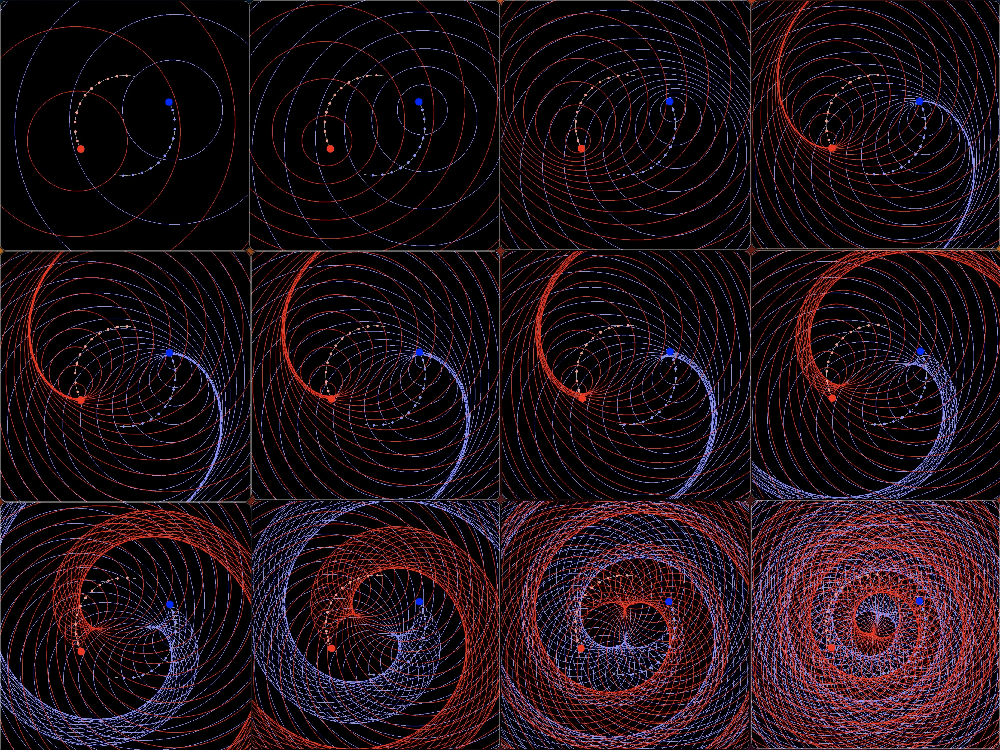

The period circa 1900 to 1930 is marked by a number of scientists who were tap-dancing right on top of the solution to nature. Why didn't they break through?

Read Dirac's words several times until they sink in.

**_Dirac is capitulating, surrendering, and acquiescing._**

Each point potential in the universe has a path dependent relationship with itself and every other point potential in the universe. The challenge is our ontology of that relationship. We know point potentials are constantly emitting an electric potential which expands spherically at a speed @. This creates a fascinating geometry. We need to learn more. Let's imagine two point potentials A and B and how they interact.

> _In mathematics, the Dirac delta distribution (δ distribution), also known as the unit impulse symbol, is a generalized function or distribution over the real numbers, whose value is zero everywhere except at zero, and whose integral over the entire real line is equal to one._
> 
> Wikipedia

Fields seem a bit abstract for our purposes, so let's really focus on the specifics of the dynamical geometry of the point potential universe. We need a geometrical object that implements a potential field that continuously expands at speed @, with an integral of plus or minus 1 at r=0, and plus or minus 1/r when r > 0.

Is there such a thing in mathematics, which acts as a signed Dirac delta emitting a Dirac sphere potential that propagates at v = @?

- It is emitted at (t,s) i.e., (t, x, y, z)

- Has a value of the positive or negative unit vector potential at r=0,

- Has a value of potential/r at r > 0 and propagates at v=@.

I realize this could be considered to be more generally a field, but I want to keep all the geometry of the spheres in the math.

I'm thinking about these Dirac sphere's being emitted by the positive and negative unit potentials, aka unit impulses, aka Dirac deltas described as (polarity, t, s, s'). Is this a proper basis for describing a system of point potentials?

We can imagine any sphere that was emitted by a potential at (t.emission, s) as a Dirac sphere with value potential/r, where r = @ multiplied by (t.now - t.emission). The path of the emitting point potential includes position and velocity and this determines the shape of the Dirac sphere stream that is emitted. This in turn determines the scalar and vector potential at any position in the spherical stream. Note that the Dirac sphere stream covers the universe. Since the point potential velocity may exceed v = @, it is possible for the Dirac sphere stream to intersect itself. These intersections are themselves an interesting topic to ponder.

_Aside: In terms of visualization, I try at first to think in terms of two distinct point potentials A and B. It's more challenging to think about multi-causal action, but imagine your car emits an energy ring at 20 mph and if/or when it hits any car including your own the car will be jostled one way or another, decreasing with distance, which is also time since emission._

Each point potential maintains a relationship with each and every point potential in the universe, including itself, This is really a profound result of NPQG. It has echoes of so much history including Mach's principle, but it also has the ideas of self interaction and multi-causal interactions. I desperately need to make progress on my animated simulations but I keep finding that if I really want to simulate I must understand in detail how this geometry is physically implemented by point potentials. I feel like we are getting close. I'm not sure I have the skills to solve it, but I'm imagining strange little action volumes which are integrable and which are sheared because of the velocity of the emitter. The velocity of the receiver is also an obvious factor. So essentially, I have all these reference models like Maxwell's equations, Jefimenko's equations, the Liénard–Wiechert potentials, Lorentz transformation, general relativity, and on and on. Basically we are going for the solution that will be tested against all of the effective theories. I kind of feel like, "No sweat. Bring it on." but there is a lot of work remaining to do.

On the receiving end, every point potential experiences action from any coincident Dirac sphere and the gradient of that Dirac sphere stream. At every moment, each point potential can experience itself and every other point potential 0 (only in the case of the self), 1, or many times. I think it would be rare to experience another point potential 0 times because the pair would need to be traveling in lockstep superposition. Typically, other point potentials will be experienced at least once in every moment. As far as the self, if the velocity of the point potentials is < @ then there is no self-interaction, unless it has some outstanding incoming Dirac spheres from distant v > @ travels. Self-interaction gets interesting when a point potential travels at v > @.

A point potential does not experience itself when v < @. Self-action is more path dependent when v exceeds @. In a straight line, it won't experience it's emissions since when it exceeded @.

Are there times when a potential experiences one **or more** Dirac sphere crossings from the path history of another point potential or itself? I think this is possible. Is there some relationship to how that Dirac sphere takes action? The value of the Dirac sphere is dropping at 1/r with time and radius. The scalar potential field is dropping at 1/r2. From the perspective of pure action, the emitter doesn't matter. That was in the past. We are dealing with incoming Dirac sphere potentials. However, the key idea is we should deal with each one-to-one point potential interaction first and do the aggregation or superposition last.

> _In mathematics, the Dirac delta distribution (δ distribution), also known as the unit impulse symbol, is a generalized function or distribution over the real numbers, whose value is zero everywhere except at zero, and whose integral over the entire real line is equal to one._
> 
> Wikipedia

Point potentials are a great concept, and reasonably straightforward to describe and visualize. In terms of a precise geometry might our geometry be more parsimonious with a basis of unit positive and negative potentials?

- Euclidean time and space background

- Potential is quantized as scalar unit impulses δ, i.e. Dirac deltas.

- Potential exists as unit positive +δ and unit negative -δ impulses.

- The dimensions of a unit potential are (polarity, time, position, velocity)
    - (-/+ δ, t, s, s’)

- Opposite unit potentials attract and like unit potentials repel.

- Unit potentials are conserved.

- The sum of all unit potential is zero.

- Unit potentials continuously emit a spherical Dirac delta with value
    - \-/+ δ when r = 0, t = 0, (Note : t=0 is "now" for the unit potential)
    
    - \-/+ δ/r when r > 0, t > 0, and r = @t, where @ is the speed of the electric potential field.

- The unit potential path is presumed to span all time.

- Potential potentials are acted upon by the local superposition of all coincident Dirac spheres. This is also known as the scalar and vector electric potential.

- The velocity of a unit potential is not limited except by natural emergent causes.

- A unit potential with v < @ is inside its emitting Dirac potential spheres. A unit potential with v > @ is outside it’s emitting Dirac potential spheres.

- Once a unit potential velocity crosses @ then self-action is constantly occurring.

- The velocity of the unit potential appears to be key to the action.

- The orientation and magnitude of the velocity are directly related to computing the action when crossing a Dirac sphere.

- Instead of calculating phi and A, what if we sum over the path histories of each individual point potential in the structure and the local aether?

- Instead of aggregating all the coincident fields and then determining the action, let's calculate all the actions and sum them up.

- The advantage of using the sum of actions is that we can more easily take advantage of the fact that all action occurs on the surface of Dirac spheres.

- This sounds like Feynman’s path integral but with unit potentials rather than standard model structures.

Given energy and a path, a point potential can explore the Dirac sphere history emitted by itself or any other potentials. It's really interesting and challenging to imagine because it is so dynamic. Yet, even so, we need to develop this cognitive ability and feel because this is the best way forward for sensemaking of nature.

> A point potential always operates in the present, while it tours the past of its partners or self
> 
> J Mark Morris

Is there a simple math that can describe a continuous spherical Dirac delta potential? I guess that is a field. Ok, but we can take advantage of it because we know the shape, so we can consider paths that are orthogonal or tangent to the sphere. It sort of feels like orthogonal to the sphere corresponds to the scalar potential and is velocity independent. Motion tangential to the sphere appears to be velocity dependent and related to the vector potential. This is related to the idea of work required to move through a difference in potential. I could be wrong. The objective is to have a causal understanding of how everything works.

* * *

It is starting to dawn on me that there actually is a group velocity of a moving structure even if it was in Euclidean time and space and not flying through the aether. @ is a universal constant. It makes a difference if a structure is moving with a group velocity v over it's range from 0 to @ or even beyond if a group can move faster than @. I would guess that the group can not move faster than @, but not sure why. The velocity has a relationship to @. This may all be related to the Lorentz factor.

Sometimes I try to imagine a sea of point potentials being acted upon by the superposition of the scalar potential field and the vector potential field from all point potentials in the universe, including themselves. The behaviour is rather fluid like. Still the local dynamics dominate.

I'm working on the foundation for a new dynamical geometry in Euclidean time and space that is based upon energetic point potentials which are eight-balls (polarity, t, s, s') with a presumably infinite path history, and which continuously emit a Dirac delta potential sphere that propagates at speed @ and is defined as -/+ δ at r=0, and -/+ δ/r for r>0. Point potentials are acted upon by the local superposition of the scalar and vector potential from all potentials, including themselves and point potential velocity is not limited except by natural emergent causes.

I presume the things I am describing are standard mathematical concepts. I welcome collaboration to map my description to a more compact mathematical language. I've written what I think is the source code to the universe in 500 characters. I hope with the proper geometry we can write it in under 100 symbols and let emergence do the rest. We'll also need chemists to provide two parameters: density of point potentials, and density of their energy.

There are some fascinating aspects of this geometry that may be exploitable such as the idea that every impinging scalar potential is a propagating Dirac delta sphere emitted from a particular point (t,s). This is before we do the superposition summation from all sources.

Imagine a point potential traveling on a straight line path with velocity v.

- If v < @, then the point potential will never encounter its own potential field. There is no causal contact with its path history.

- If v = @ then it gets rather interesting. The point potential is moving the same speed as its own field. What does that mean? If r=0 then how do we define the potential and the action? Does the point potential moving at v = @ experience its own potential? If ever there was a symmetry breaking point in physics, this is a winner.

- If v > @ then it as if the point potential is outracing its own field and being acted upon by it. Like point potentials repel. There is no causal contact with its recent path history since it exceeded v = @.

Can we find some clever geometry based upon this precise description of nature? For example, using (x,y,z,t) isn't a great fit from a visual conceptual basis. r, theta, phi might be somewhat better. Interestingly for the expanding potential spheres, we really only need to know (polarity, time, s). Do we need to know s' for the scalar or vector potential? I'm leaning to no, but I could be wrong. On the other hand, we do need s' when it comes to action. That would be an interesting asymmetry if s' does not matter at emission and does at the action.

Parsimoniously, given a path history (polarity, time, s) we know everything about the Dirac delta potential sphere stream that emanated continuously. Interestingly, the absolute age of each sphere and the radius are linear. Time equals space, or more specifically the radius of a volume. Imagine that the aura, or superposition of all scalar and vector potential is created by a path history with 5 dimensions (polarity, time, and 3D space). Yet, when we calculate action, we also need the velocity of the point potential, which requires three more dimensions, i.e., the full eight-ball.

Emergent nature repeats duals of a deeper reality at larger scales. Is it possible that this most basic correspondence of time and space of the Dirac delta potential sphere echos throughout nature? We have the uncertainty principle and the tradeoff between position and momentum. This equates to a Fourier domain tradeoff between time and frequency. Now, if we settle all this out, it means that momentum has a relationship with frequency and that totally makes sense for Noether core based structure of standard matter. As we do work on a Noether core based structure, the energy is transferred in units of h-bar angular momentum, and that changes the frequency. It all ties off nicely.

**_J Mark Morris : Boston : Massachusetts_**

Update July 10, 2023

In the electric potential point potential universe, the most primitive components are the electrino and the positrino, which are the point potential types. These are the only elements that carry energy. The most primitive assembly or automata of point potentials is the orbiting electrino : positrino pair. These are the foundational nucleus of matter-energy assemblies.

Here are 2D images of simulations of the orbiting point potentials showing tracers of the spherical potential images (circles in 2D, but you can imagine these images in 3D). The images have different ratios of the velocity of the point potentials to potential field speed. Read these panels left to right, top to bottom. The top left image is where point potential velocity is far less than field speed. Note how each point potential always stays inside the expanding spherical potential wave it emitted. As we move across the top row the velocity increases towards field speed. The middle left is where velocity equals field speed. Beyond that the velocity increases above field speed (a mathematically unexplored territory).

The thing to note here is that these are all representations of the "wave equations" of the orbiting point potential assembly. Note that each time the ratio of velocity to field speed changes that the wave equation takes on a different pattern. That is, when velocity changes the previous wave equation "collapses" and the new wave equation begins. "Collapse" is the physics term, but I would call it more of a "transition".

In a point potential assembly of the standard model particle entities, there are up to three nested orbiting point potential and personality potentials bound in the potential vortices at the two polar regions along the orbital axis of each orbiting pair of point potentials. Needless to say, the wave equations for a standard model particle entity is thus a superposition of the potential emissions from each point potential in the assembly.
