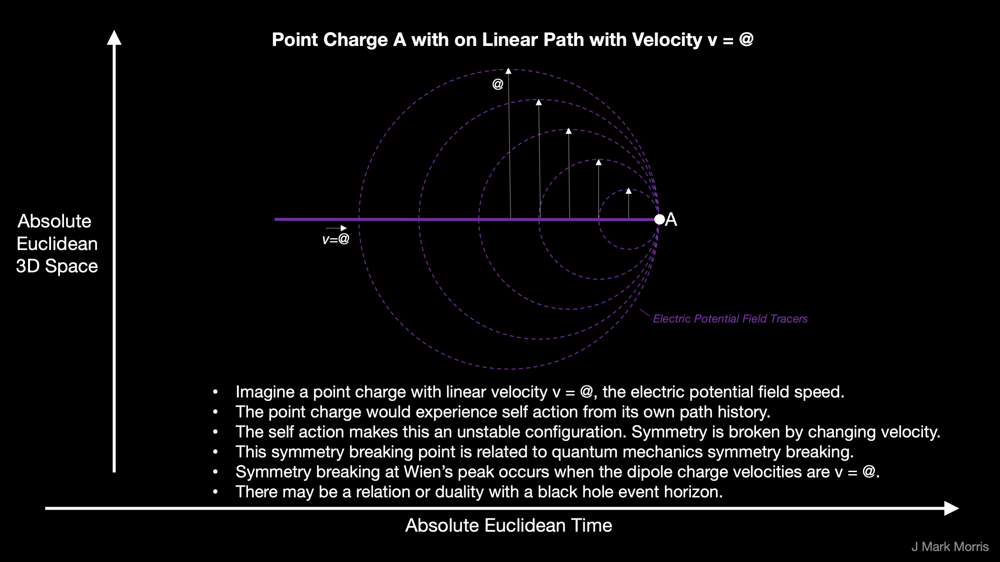

The discrete elements of nature are the negative and positive point potentials, aka the electrino and positrino, respectively. These point potentials continuously emit an electric potential field from their current position (t, s). That electric potential expands spherically at a radial speed @.

Geometrically each expanding spherical potential is defined as a Dirac sphere, which is a term I coined. _I presume there may already be a geometrical object for this purpose, and will update the terminology once I become aware._

Point potentials emit a Dirac sphere at every point along their path

- which propagates from (t, s) with radial velocity @

- has magnitude **_δ_**q/vr where v = velocity of the point potential at emission,

- radius r = @ times Δt, where Δt is the absolute time since the potential was emitted

A point potential emits a continuous stream of Dirac sphere potentials along its path history in space and time. When a Dirac sphere potential stream encounters a point potential, action occurs. Each point potential may be considered to be constantly encountering the Dirac sphere stream of itself and every other point potential in the universe.

The path history of velocity of the point potential that emitted the Dirac sphere stream determines the vector potential. The velocity of the point potential that encounters a Dirac sphere stream is a factor in determining the action upon the point potential.

If a point potential is traveling at a velocity v < @ then it stays within the spheres of its own Dirac sphere stream and no self action occurs, or rather the action is null.

When the velocity of a point potential exceeds @, then the point potential is outside the spheres it has just emitted and is exploring its own prior emissions in a path dependent fashion and self action occurs.

When the velocity of a point potential equals @ this is a symmetry breaking point, since self action will change the point potential velocity.

Note that there are no infinities at small r nor zeros at large r. The magnitude of each Dirac sphere is somewhere on the |**_δ_**/r| curve.

- sphere streams pass right over point potentials, with action at the receiver

- likewise point potentials travel relative to the sphere stream.

- at large distances, the magnitude is a very small real number and not only that superposition of negative and positive unit potentials will tend to cancel out.

Locally we think about action in terms of the path history of all significantly interacting point potentials, including the self, where 'significantly' is defined relative to the scale of the problem to be solved. In this way we can compute each individual action and then sum all the action to determine how the point potential will move along its path.

Background fluctuation is the dynamic net superposition of all Dirac spheres at the current location of the point potential, i.e., (t,s), beyond those point potentials in an assembly or set of local assemblies that influence the reaction under study. Background fluctuation represents the churning potential from far enough away to not be part of the typical behaviour of the assembly or reaction. The background certainly has influence on the path of point potentials, but that influence is generally very small compared to the nearby point potentials. Occasionally superposition can result in a change in the background that is in the right location and the right time and with the right magnitude to influence a reaction.
