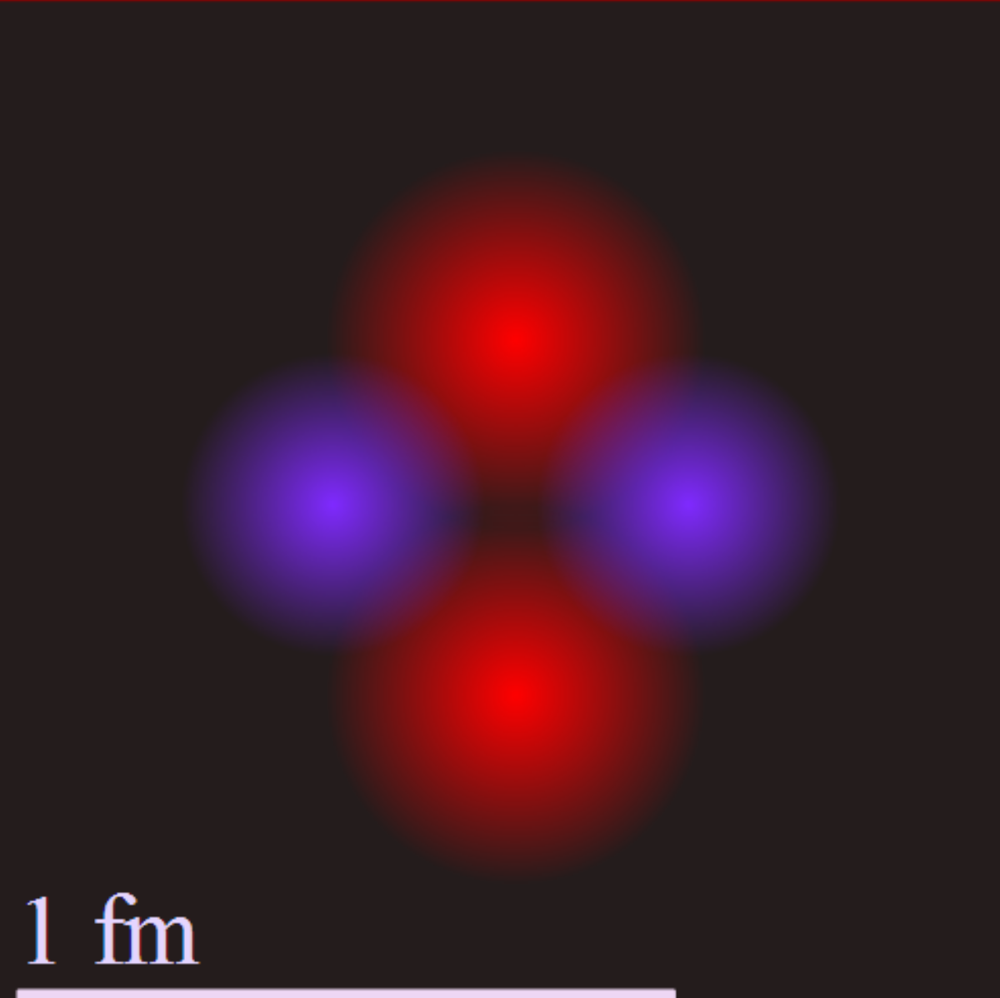

My opinion is that false priors in the late 1800's led to one or more misconceptions that then led to the fixation on the quantum and all the mysterious characteristics of quantum mechanics that are wrestled with to this day. I believe I can explain what has happened in simple sensible terms. Imagine indestructible point charges are the basis of everything and positive and negative pairs form Bohr-like orbitals 2-2-2 at vastly different energy scales for each of these three orbiting binaries. Three orbital planes. How does this assembly survive as the dominant assembly in the universe, the Noether core that powers and balances all particle assemblies? **Shielding.** Simple potential wave superposition and cancellation. Locally some rather intense fields still emit and the next level orbitals include six point charges, and if you look at all the combinations, it pretty much explains all of the fermions from the standard model.

Nature has revealed a seemingly brilliant emergent technique to enable an assembly to survive. Is it intelligent? No, not by our current definition of intelligence. Is it efficient mathematically? I suspect the answer is most definitely. First lets examine the _electrino : positrino_ binary which is neutral, such that from any location the net potential field averages zero. However we would see high frequency oscillation in the attenuated potential fields.

My conjecture is that somehow the Noether core is able to shield itself through superposition so that it cancels its own fields to a large degree and presents the lowest possible field emissions given the geometry. Why must this be the case? I need to check the circularity of the argument, but how else would Noether cores become the basis of almost all structures in the universe? We are talking almost ALL, the exceptions possibly at the very highest energies where point charge binaries decay! The fermions, i.e., quarks, electrons, and neutrinos. The bosons, including W+ and W- and Z as well as the photon and the Higgs. Gluons are the individual binaries in the Noether cores doing some kind of colorful dance.

Higgs is the spacetime aether assemblies that appear to be made out of a cluster of two pro-Noether cores and two anti-Noether cores. So it would be shaped like a Helium nucleus in some sense. The Noether core is at the heart of all of them. And when a natural process or collider knocks out the outer binary, we have a generation II particle and so on. I suspect that the Higgs mass may be the generation III binary in spacetime aether as measured on the surface of the Earth during a proton-proton collision at CERN.

<figure>

<figcaption>

Helium Nucleus

</figcaption>

</figure>

The lede. The lede. Oh yes. Clearly the Lagrangian and Hamiltonian are going to be dealing with kinetic and potential energy of point charges. However, if through superposition a structure is able to shield its energy then what does this imply? It seems to me to imply a muted interaction between passing particles. Superposition is like Romulan cloaking in a way.

The **_really cray-cray_** part of this insight is that it has fooled physicists for a very long time. They are relatively clueless. There are certainly many hints regarding the emergent structure of nature but physicists have papered them over by designing clever ways to handle them unnaturally in their theories. There are many examples : the quantum, curvy geometry of spacetime, renormalization, massless yet energetic photons, etc, I could go on... It is a long list that is continuously swept under the patchwork quilted rug that covers the rough areas in the GR/QM/LCDM landscape.

**_J Mark Morris : Boston : Massachusetts_**
