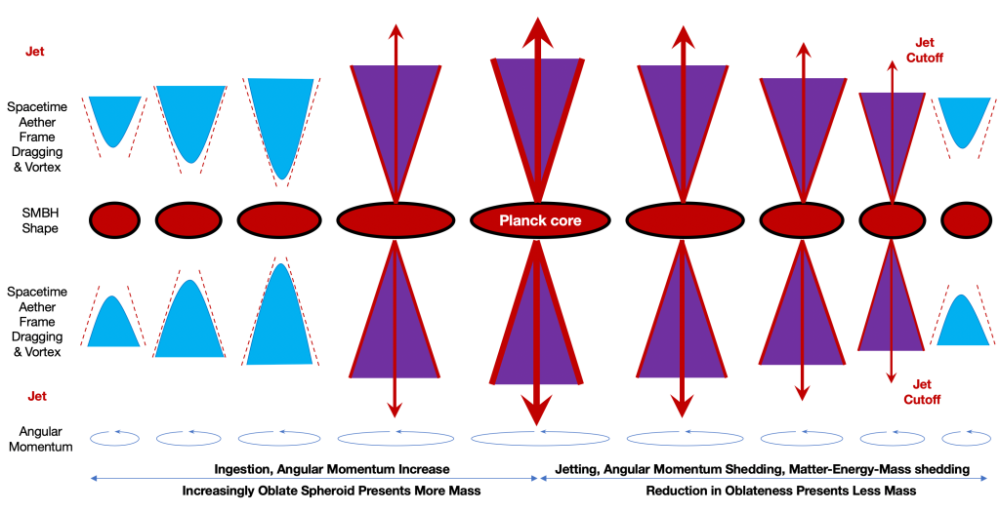
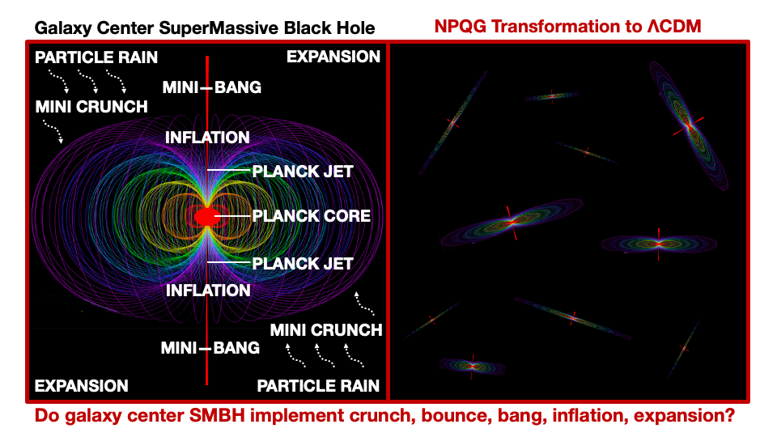

I encountered a fascinating talk about quasars and supermassive black holes by Dr. Anna-Christina Eilers that was published by Aspen Physics on YouTube in June 2020. Dr. Eilers' work is incredibly interesting to me as I seek to understand more of what scientists have observed and deduced about the highest energy states of matter evident in quasars.

https://youtu.be/MOeTPrQ\_ytY

The talk is linked above and I will follow with discussion of the differentials to NPQG and immutable point charges. Unfortunately, and no fault of Dr. Eilers, but particle physics and astrophysics are narratively off-track in the **GR-QM-LCDM** era. As a result, Dr. Eiler's talk has many convoluted interpretations of observations that fit with incorrect priors, but are unnatural. I hope you will find the NPQG narrative far more sensible and not convoluted in the least bit. I am looking forward to the day when our brightest minds, such as Dr. Eilers', are unconstrained by incorrect foundational priors and are creatively free to imagine a universe of energy generating and carrying immutable point potentials.

@2:30 — Dr. Eilers uses terminology such as '**_early universe_**,' which is a code phrase for the **one time inflationary Big Bang**. Dr. Eilers also continues with '**_the universe was still in its infancy_**' referring to the early portion of the supposed 13.8 billion year existence of the universe. It is up to any scientist, Dr. Eilers included, to decide which priors to accept. Sadly, the false narratives are so deeply embedded in the field that it is largely taboo to discuss alternatives in the steady state cosmology realm.

The most perilous times for interpretations are immediately prior to a paradigm shift. Those who react quickly to immutable point charge physics will get a jump on the next era, and there is plenty of opportunity for all. I dream for the day when **scientists** see things at a much deeper and more natural level than their predecessors. All astrophysicists really need are galaxy-local inflationary mini-bang processes and everything is taken care of **naturally** in an unbounded distributed mechanism. How 'bout that?!?

@7:00 — Dr. Eilers talks about the most distant quasars we can observe at around 13B years ago. I wonder what is the density of quasars at more recent observation ages?

@10:00 — We need to get redshift sorted out. Spacetime aether has a tendency to migrate to lowest stable energy state given the surroundings are also spacetime aether. As aether assemblies lose energy the Noether core continues its inexorable expansion from a tight contracted/dilated state. It is expansion, but it is **expansion in place** in a sense. "**Big Bang**" expansionary processes are in opposition of one another in a steady state universe. Furthermore, we have particle rain, i.e., the precipitation of matter via Higgs pair production and the processes by which ultimately redshifted photons and neutrinos also join the spacetime aether. Modern era physicists do not yet understand how to perform point charge accounting, provenance, and conservation in analysis of reactions.

Ok, so space is flat. The background is Euclidean. There is no general **_outward_** expansion of the 'universe'. Forget all that. It's more like every galaxy is outgassing spacetime aether (or other assemblies ultimately destined to join the aether) and some stays local and some leaves the galaxy, but likewise each galaxy is traversed by photons and neutrinos, some that stay for a while, either due to collision or if they finally redshift enough to become massy and slow and get captured.

What exactly causes redshift? Are there both quantized and continuous processes? How do photon assemblies and spacetime aether assemblies interact to cause redshift? The aether assemblies are shaped by the scalar and vector potential emanating from all point charges, especially the dense collections of local massy assemblies. The photon is on a magic carpet ride through aether much of which is expanding in free space. Are there gradual and continuous phase shift transfers of energy from the photon assembly to the aether assemblies? Are there discrete redshift transfers in h-bar? Remember, that the redshift implementation must be non-scattering. If discrete h-bar redshift occurs, how is it implemented without affecting the path of the photon?

For the photons we observe, what has been their provenance, their path? How many galaxies have they passed through? What was the aether energy and expansion rate along the way? What are the differentials for every photon emitting process? It should be evident that the photon’s magic carpet ride through the aether is going up and down the energy gradients of the aether which would basically be similar in each galaxy depending on the clear path to our instrument. It should be up the energy slope and then down the energy slope and on to the next galaxy. Of course there are special cases like gravitational lensing when the permittivity and the permeability of the aether refract each photon.

If there are quantized redshifts, i.e., in some number of h-bar units of angular momentum, then how are they implemented? Do they depend on the energy level of spacetime aether? Do they depend on the energy gradient of spacetime aether at a particular energy level? What else could it depend on? Let's break it down to our best understanding of the model.

- A binary is an orbiting pair of immutable point charges
    - one electrino at -e/6 and one positrino at +e/6
    
    - transacts energy in units of h-bar
    
    - inflates and expands according to Maxwell's equations and classical mechanics, with reconsideration for permittivity and permeability of space as well as some other corner cases.

- A generation III Noether energy conservation engine has one binary and thus one dimension of containment/stability

- A generation I Noether engine has three nested binaries that are coupled at vastly different energy levels. At high apparent energy and low velocity these Noether engines are massy. A generation I Noether energy core provides three dimensions of containment/stability.

- A neutrino has a generation III Noether energy core that is carrying so little energy that the outer binary can no longer fully shield the internal binaries and hence we see mass oscillation.

- Interestingly, a photon is Noether engine coupled to a Noether anti-engine and the three binary in each are planar and are counter-orbiting and slightly offset from each other in the direction of travel. This is how polarization and Malus' Law work. I also think the energy of the two internal binaries may be shielded and the inner binaries may be a product of any reaction that decays the outer binaries.

Now you have to look at the charts of high redshift quasar spectra and realize that each of these beams of photons have responded differently also due to the energy level and gradient in the aether they passed through.

@11:00 — I listen to this segment and for me it is a cognitive struggle to imagine how to shoehorn these observations into a 13.8 billion year old universe. Dr. Eilers is working with enormous quasars at an age of 800 million years after the prior called the big bang. Could the prior be wrong? No discussion. Of course, in NPQG that is not an issue since it is a steady state universe with no known beginning nor end.

@12:00 — I lack a full understanding of the conditions under which energy presents as mass in the immutable point charge universe. Clearly the more planar the formation transverse to the line of travel and the higher the velocity, the lighter the mass as in a neutrino or perhaps near zero mass for the photon. So mass appears to involve the 3D footprint and charge precession (wave equation) of an emergent point charge structure. This makes sense if you think about it for a while. Yet, it appears we also have energy shielding of interior binaries.

@13:00 — In this section Dr. Eilers dives into a '**seed**' model for supermassive black holes that is based upon exponential growth of black holes. This is an unnatural contortion due to the incorrect prior of a universe beginning 13.8 B years ago. Dr. Eilers concludes that the exponential growth model does not match the data due to insufficient quasar growth time, however all of the potential alternative models are also steeped in the incorrect prior of a 13.8 B year old universe.

Instead, if we consider a steady state universe then we have an ample potential timeline for any process. We can imagine a scenario where galaxy clusters birth new galaxies which grow and merge, eventually reaching the conditions for the SMBH to enter the quasar stage and vent Planck point charge plasma from the core. Thus the recycling cycle periodically erupts and a galaxy local inflationary mini-bang occurs. What are the exact scenarios and timelines? Once astrophysics moves on to the NPQG era, the science around distributed 'regenesis' will advance quickly.
