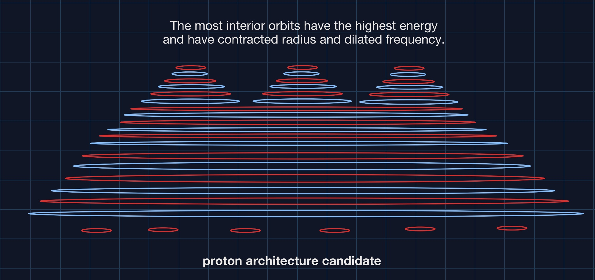

17:00 Is math reality? No and yes. The basis is a 4D Euclidean space and time foundation, which has properties that can be described exactly by math. The ingredients are energetic point charges with a radius of immutability near the Planck length. There are only two free parameters. I — Density of point charges. II — Density of energy carried by those point charges. The 4D Euclidean space and time permeated by energetic point charges all behave according to natural physical laws which can be precisely described by math. So the math and the physical implementation are really very much a partnership.

59:00: Physicists are so precious with their wave function collapse narratives. They are, as they say, **_not even wrong_**. In structures that emerge from point charges, such as any standard matter particle, and in stable conditions for that particle, scientists are correct that the particle structure can absorb **h** joule-secs of energy per QM spin revolutions. Emergent structure is based upon binary building blocks that make 3 generation gyroscopic dynamo cores for fermions (and probably all other particles in their regions of stability).

Physicists are all up in arms for a century now on wave function collapse. Let me fix that for you. When you add or subtract increments of energy to a structure, the wave function control system efficiently and losslessly guides the point charge orbits to different local radii in their portion of the structure. These orbital charges, especially when coupled in binaries or higher order structure are incredible control systems. _Wave function collapse my fanny._ It's the jukebox moving the point charge centers of electromagnetic action to a different (and often related) wave function at different radii, velocity, energy, etc.

Ok, can we get on with it now? No more worrying about wave function collapse. Nor uncertainty really. I mean you get your uncertainty, but QM is just sitting on top of the tipping point poles of these point charge structure control systems. Please join me in the NPQG era. It is a lot more fun and productive, and I am gathering low hanging fruit as fast as I can. There is plenty to go around but the gold rush is starting, so get in now. Here is the point charge encoding of the standard model in case you need some more tangible evidence : [NPQG : December 31, 2020 : EUREKA!](https://johnmarkmorris.com/2020/12/31/npqg-december-31-2020-eureka/)

1:17:00 I suppose it may be counterintuitive, but even a plus and minus point charge orbiting each other at a very small radius must deal with the speed of electromagnetic field transmission, so relativity absolutely applies. The proton diameter is approximately 10\-15 meters but that's an enormous gulf to a point charge. That proton diameter is 1020 times a point charge diameter. Without relativity you won't understand how the basic binary works as an energy storage accumulator. These point charges are immutable at a radius near the Planck length, so there are no singularities to worry about. The more energy you apply they will happily count it off, store it, and shrink their radius until the two point charges are adjacent at a radius of about 10\-35. At that point they are each carrying the Planck energy and they are located in an SMBH or maybe other black holes that meet the necessary conditions to form that type of solid spacetime phase with one microstate and no entropy and no singularity.

Once you understand relativity and the binary, it's easy to leap to the solution to the question of why are there three generations of fermion matter. Three orthogonal binaries orbiting a common center form a gyroscope of sorts. The angles of orientation don't matter as long as the wave equation can evolve to conserve all the conserved properties. If not, that's the beginning of a reaction because violation of conservation is a no go. For thought experiments it's a lot easier to just imagine three planar circular orbits each orthogonal to the others. Generation I fermions have 3 dimensions of containment and if we add that to the generation number that totals to 4. Generation II fermions have much higher energy, only stable in certain high energy environments that provide one dimension of containment so they can survive with 2 binaries of containment. 2+2=4. Generation II fermions are stable and in fact required inside a Generation I fermion. See the pattern? Generation III fermions are stable in a super energy range and environment where only one dimension of confinement is required. One such environment is INSIDE the two outer binaries of a Generation I fermion. Generation III fermions are stable and in fact required inside a Generation II fermion.

N.B. The careful reader will have asked how can it be that the electron contains the muon energy, and the muon contains the tau energy? Clearly the point charge universe must implement energy cloaking and shielding technology. In fact, it has multiple implementations!

Imagine a proton or a neutron, each with three quarks. A proton or a neutron therefore has the three energy cores from the quarks, each with three binaries (a tri-binary?). That is triple protection against decay from a reaction. It is going to take a lot of energy to destabilize a particle with 9 orbiting binaries acting as a gyroscope. Orbiting in the poles of each binary you have the personality of the quarks (4/2 or 1/5 or vice versa for antiquarks) which probably reconfigure into more protection for the three energy cores. That's another good point, the outer layers are not only containing the energy cores, but they are also protecting them. Continuing our build of the proton that whole multiply branched nest of spherical orbits (worldlines) at last expresses its six positrinos on the outer surface. Six positrinos are the charge of the positron. The positron is the antielectron — there is nothing missing in NPQG. The geometry is similar for the neutron except it's outer binary is neutral.

After writing my last comment I had a small eureka moment. I wonder if particles moving close to or at the speed of light have flattened out their binaries, i.e., aligned their angular momentum vectors, because they no longer need three dimensions of containment, and can forego two of them. Everything these particles are conserving is moving in one dimension. The only exception being the energy stored in the orbiting binaries. If this is true, then a photon geometry would take on a planar orbit for its six electrinos and six positrinos and the direction of motion would be perpendicular to that plane. Surely some right-hand rule would apply. If this is the case, there are probably multiple contra-rotating orbits. One is the electron neutrino core (3/3 : +-+-+-) and the other the electron antineutrino core (3/3 : -+-+-+) making the photon 6/6. The orbital patterns are responsible for our perception of frequency, wavelength, phase, and etc. It's probably straightforward to figure out.

**_J Mark Morris : San Diego : California_**
