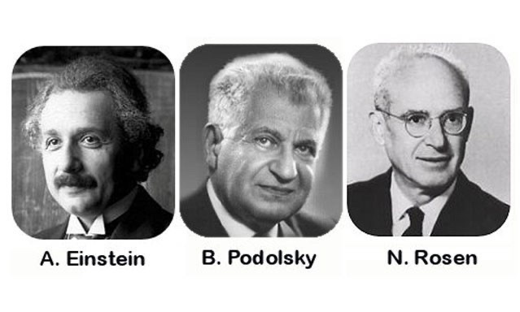

I was thinking about EPR, the Einstein, Podolsky, Rosen paradox. The issue is around quantum uncertainty in quantum mechanics, and quantum entanglement which is also related to 'spooky action at a distance'. I may have found the explanation for the controversy. In NPQG these issues are hardly mysterious, and in fact they are ordinary.

> _The Einstein–Podolsky–Rosen paradox (EPR paradox) is a thought experiment proposed by physicists Albert Einstein, Boris Podolsky and Nathan Rosen (EPR), with which they argued that the description of physical reality provided by quantum mechanics was incomplete. In a 1935 paper titled "Can Quantum-Mechanical Description of Physical Reality be Considered Complete?", they argued for the existence of "elements of reality" that were not part of quantum theory, and speculated that it should be possible to construct a theory containing them._
> 
> _Resolutions of the paradox have important implications for the interpretation of quantum mechanics. The thought experiment involves a pair of particles prepared in an entangled state (note that this terminology was invented only later). Einstein, Podolsky, and Rosen pointed out that, in this state, if the position of the first particle were measured, the result of measuring the position of the second particle could be predicted. If, instead, the momentum of the first particle were measured, then the result of measuring the momentum of the second particle could be predicted. They argued that no action taken on the first particle could instantaneously affect the other, since this would involve information being transmitted faster than light, which is forbidden by the theory of relativity. They invoked a principle, later known as the "EPR criterion of reality", positing that, "If, without in any way disturbing a system, we can predict with certainty (i.e., with probability equal to unity) the value of a physical quantity, then there exists an element of reality corresponding to that quantity". From this, they inferred that **the second particle must have a definite value of position and of momentum prior to either being measured. This contradicted the view associated with Niels Bohr and Werner Heisenberg, according to which a quantum particle does not have a definite value of a property like momentum until the measurement takes place**._
> 
> Wikipedia

The EPR paradox relates to the Heisenberg uncertainty principle of quantum mechanics. At this point, I won't go into the notion that quantum mechanics is unaware of electrinos and positrinos and composite particles, but it is also unaware of the structure of spacetime æther. These aspects of NPQG may inform this EPR paradox even further.

> _Introduced first in 1927 by the German physicist Werner Heisenberg, the **uncertainty principle** states that the more precisely the position of some particle is determined, the less precisely its momentum can be predicted from initial conditions, and vice versa. The formal inequality relates the standard deviation of position σx and the standard deviation of momentum σp to the reduced Planck constant which is the quantum of electromagnetic energy._
> 
> $latex \\mathbf{\\sigma \_{x}\\sigma \_{p} \\geq \\frac {\\hbar}{2}} &s=2$
> 
> Wikipedia

There is no uncertainty at all as regards the electrinos and positrinos. There is always a potential aura arriving from assemblies at various distances. Reactions are influenced by this potential aura and it can change the outcome of a reaction. Not only could the aura impact the tipping point in a quantum energy transfer between Noether cores, but it could impact the products of the reaction and their characteristics. Quantum Mechanics misconstrued quantum uncertainty as fundamental rather than being emergent behaviour from the 'floating ground' in the potential aura and its impact on the aether as well.

So QM still gets to keep the concept of uncertainty at some scales but for a different reason. That means QM needs to examine every case where the root cause of uncertainty makes a difference. And the reason it is $latex \\mathbf{ \\frac {\\hbar}{2}} &s=2$ is because it is whether to kick up one more revolution per unit time or not.

I want to point out that not only is this a logic proof of EPR in NPQG, but it is a falsification of the definition of the uncertainty principle. Physicists still get to keep their uncertainty in some reactions but not for the reason physicists thought. So physicists need to patch up all their logic and math where it is wrong. Uncertainty is from the potential waves transmitted all point charges which most definitely includes those outside of causal contact.

Entanglement should not be a mystery! Coupled systems have an equal and opposite imprint when separated, but only on conserved quantities, as you would expect. Who cares when you look at one product of the reaction? We already know it is equal and opposite to the other product. Seriously, physicists?

**_J Mark Morris : San Diego : California_**
