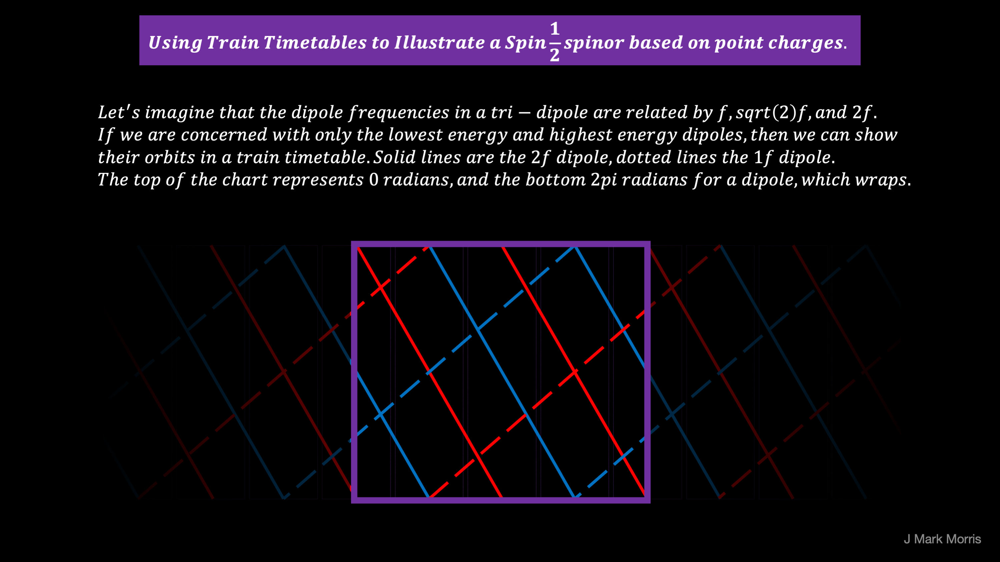

My goal is to make progress on the dynamical geometry and simulation with NPQG and the point charge universe. Part of that effort is to continue to explore the linkages, mappings, and isomorphisms between emergent point charge structures with their low assembly indexes and the mathematical theories of physics, embodied in general relativity, lambda cold dark matter, and the standard model based upon quantum mechanics. Therefore, sometimes I take mental excursions to examine the patchwork quilt of effective theories to seek insight and understanding. The effective theories **_narratives_** are all inside out and "not even wrong" as physicists say, but the mathematics and even the incorrect narratives contain clues.

https://youtu.be/H2MKP1epC7k

A major idea in particle physics is the spinor with it's fascinating behaviour that requires two full rotations to return to it's original state. It appears the spinor corresponds to the strong force. I surmise that the spinor is attempting to describe the behaviour of a tri-binary Noether core at velocities less than field speed. That said, nearly all observations in the field of particle physics are made with photons, which are our witness to reaction events. We can not rule out the possibility that the geometry of photons affects our perceptions given their role.

There are many good outreach videos on quantum spin and spinors. Here are a few.

https://youtu.be/EK\_6OzZAh5k

https://youtu.be/pWlk1gLkF2Y

How can we map between tri-binary structures and spinors?

First consider the electrino : positrino binary, which is most basic structure in the universe. Essentially, it is a master trader and accountant of h-bar angular momentum. _I bet the point charge binary can also transact trades of continuous energy via phase shift._

Second, in a huge intuitive leap and another "Eureka/doh" moment, it follows that the tri-binary Noether core may be a beehive of energy trading among the three binaries. Now, what might nature select for in this self-tuning? I presume some kind of harmonic relationship may form. For example, the three binaries in the Noether core may select for a relationship of binary frequency progression of f, 2f, 4f, or perhaps f, sqrt(2)f, 2f. Why might such a relationship form and be selected? Is it maintained when work accelerates a particle and the angular momentum vectors rotate?

How might we imagine a pair of spinning binaries with a 2x frequency difference? Can railway timetables help us visualize the scenario?

https://youtu.be/NFLb1IPlY\_k

The following timetable attempts to show why it takes two cycles of the high energy binary for the particle to return to its original state if we relate to a slower binary at half the frequency. Note, point charges leave the station every tick for the higher frequency binary (solid lines), while it is every other tick for the lower frequency binary (dashed lines).

There is more thought required to establish and articulate a precise mapping of tri-binaries to spinors. Hopefully a truly parsimonious mapping will emerge in thoughts like it emerges in nature.

It also occurs to me it might make sense to explore the potential frequency patterns of a tri-binary structure.

- All three binaries v > @

- All three binaries v < @

- The binary velocities somehow straddle @.

- Might the middle binary lock onto v = @?

- What is the relationship of the radii?

- Are high and low energy radii switched on either side of Wien's peak?

- What is the selection criteria for the harmonic solutions?

* * *

I asked this question in a math forum on reddit.

> _Is there a subfield of geometry that covers moving point charges modeled as an eight vector (charge, time, x, y, z, dx/dt, dy/dt, dz/dt) under the influence of a superposition of incoming fields from all point charges?_

A helpful redditor said "That sounds a lot like symplectic geometry."

What is symplectic geometry and can it be reformulated for NPQG?

> The field of **symplectic geometry** begins with the movement of particles in space. In flat, Euclidean space, that motion can be described in a straightforward way by Newton’s equations of motion. No further wrangling is required. In curved space like a sphere, a torus or the space-time we actually inhabit, the situation is more mathematically complicated.
> 
> https://www.quantamagazine.org/the-fight-to-fix-symplectic-geometry-20170209/

This is not a good sign for symplectic geometry I. First, the definition of particle is apparently Newtonian particles of mass, not a point charge. Second, it capitulates to curved spacetime from the beginning. Let's continue and see if we can salvage and recast.

One of the issues here is the concept of a manifold which is baked into symplectic geometry and so much of the mathematics of physics.

> In mathematics, a **manifold** is a topological space that locally resembles Euclidean space near each point.
> 
> Wikipedia

Alas, there is a distorting adaptation in step one of the mathematics. In NPQG point charge theory we have no need to adapt to curved spacetime. Instead, point charges move around in Euclidean time and space under the influence of the potential fields that emanate from the path history of all point charges. Curvy spacetime is an emergent behaviour of the point charge assemblies that emerge in various conditions and events. We don't require a manifold to achieve local Euclidean time and space because the background of the universe **_IS_** Euclidean space and time. The question then becomes how much useful mathematics we can extract and reformulate.

> _Spacetime tells matter how to move; matter tells spacetime how to curve._
> 
> John Archibald Wheeler

Not even wrong.

> _Point charges _continuously__ _emit a spherically expanding potential field. The superposition of all impinging potential spheres tells point charges how to move._
> 
> J Mark Morris

A major issue here is the level of abstraction from nature. Science is stymied and in crisis because the major theories are stuck at levels of abstraction that are several emergent assembly steps removed from an incredibly parsimonious formulation of nature : energetic point charges in Euclidean time and space.

My conclusion is that it would be a rabbit hole for me to dive into symplectic geometry. There are several serious level of abstraction issues and it also looks fairly complicated. I will leave it for some future thinker to extract the applicable essence and mappings for the point charge universe.

**_J Mark Morris : Boston : Massachusetts_**
