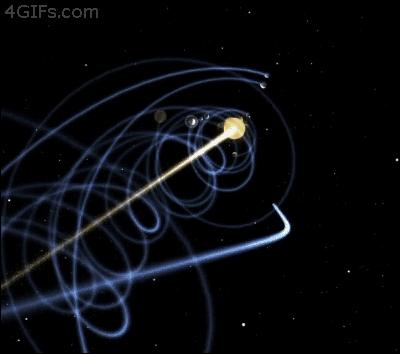
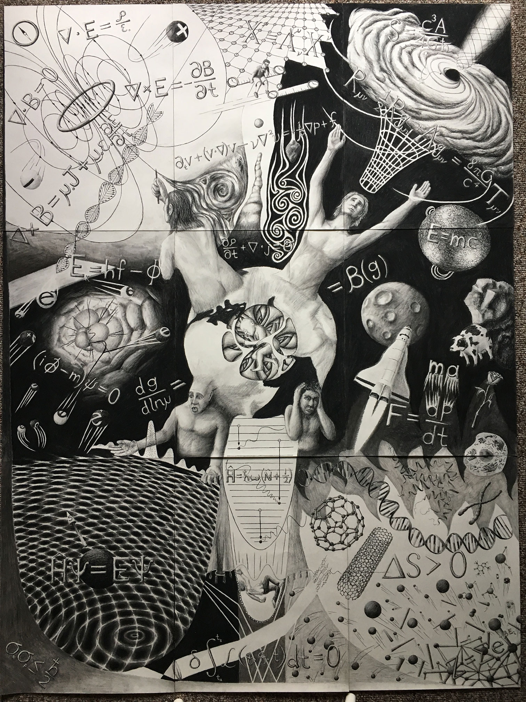
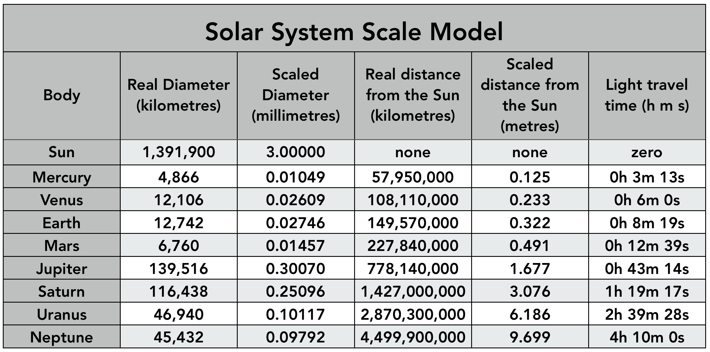
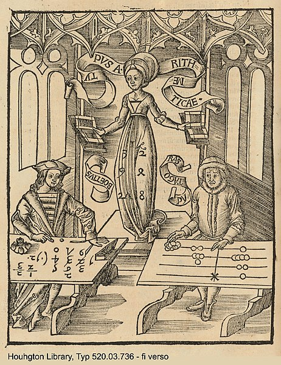
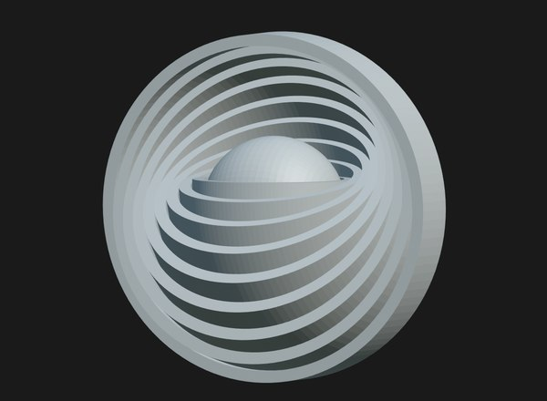
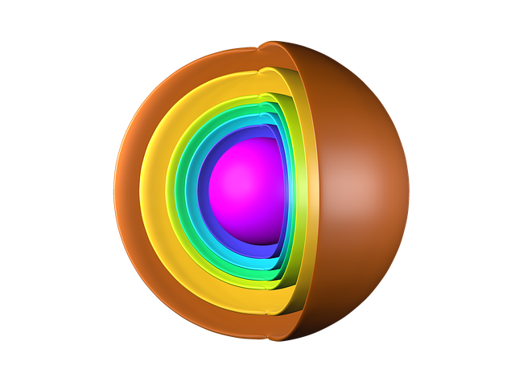
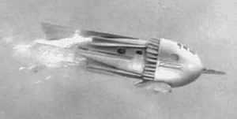
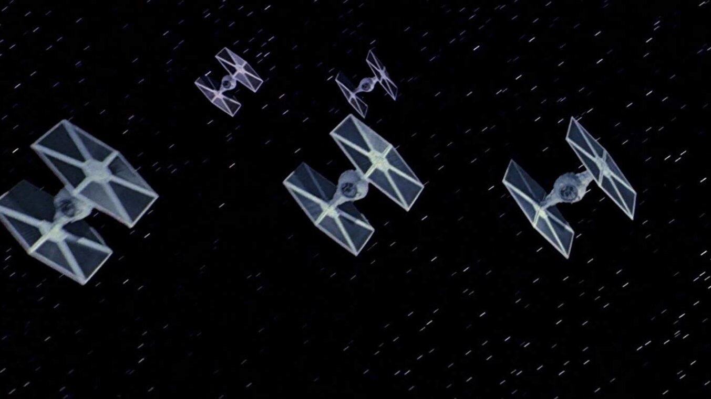

_Solar system path through time and space_

I find it to be fascinating to consider how nature repeats patterns at different scales. Sometimes dualistic patterns are found spanning an enormous scale range. I pine for a large format coffee table book with beautiful art that depicts or visualizes these dualities. Like this art, which I consider 'meta'.

<figure>

<figcaption>

See this artwork and a highly relevant article at  
https://publish.illinois.edu/flowing-from-quantum-to-cosmic/scale-law-and-life/

</figcaption>

</figure>

The chart titled "Solar System Scale Model" provides the radial distance from the Sun to the larger orbs in our solar system. The **_diameter_** of the orbits through Neptune are about 8.3 light hours across, or 9 billion kilometers.

<figure>

<figcaption>

https://www.wesharethesamemoon.org/wp-content/uploads/2019/09/SolarSystemTable.png

</figcaption>

</figure>

Let's examine a computer generated visualization of a moving system of orbiting orbs, specifically our solar system, which has a 9 x 1012 meter diameter and is a medium scale, gravitationally bound system. This video is amazing. I recommend watching it several times. I'll ask you to visualize a similar system at a vastly different scale, on the other side. Also note all the dualities in nature mentioned : Spirals in ferns, succulents, and flowers. Galaxy spirals. The double helix of DNA. Spirals in crustaceans. Spiral vortexes in air or water.

https://youtu.be/0jHsq36\_NTU

Take a moment to reflect upon all of the protons, neutrons, and electrons in our bodies which are traversing the corkscrew patterns in the CGI visualization. Not only that, we are spinning around the Earth every 24 hours!!! And we meander around our neighborhoods or travel. Now, put that all together and that would make for a cool visualization of the path our particles take at various scales, imagined logarithmically!

_Calculating-Table by Gregor Reisch: Margarita Philosophica, 1503. The woodcut shows Arithmetica instructing an algorist and an abacist (inaccurately represented as Boethius and Pythagoras). There was keen competition between the two from the introduction of the Algebra into Europe in the 12th century until its triumph in the 16th. (Wikipedia)_

Science outreach is good at emphasizing the number of significant zeros in the numbers. _1000, 100, 10, 1, 0.1, 0.01, 0.001 and so on._ Yet, outreach material generally illustrates the concept with LOTS of '0's and commas! **Meh**. It is imperative to augment our basic education of students to include lucid techniques for thinking and visualizing in terms of a logarithmic scale of about **60 decades** i.e., multiples of ten. We need a pedagogical revolution! (_ped-uh-GAH-jih-kul_ — _I'm not fond of this word. We need a better term too._) I advocate emphasizing skills for thinking and visualizing at scale beginning at birth, while being relatively abstract for the first few years, emphasizing concepts of scale in length, area, and volume. To some extent this is already taught, as it would be difficult to manage in the world without a sense of scale. We need to take it to the next level.

_**Q :** Hold up! Rewind to the 60 decade statement. If the universe is infinite, how can you say there is a top of scale limit we need to visualize?_

_**R :** You are entirely correct, you can't. It's a special case because there comes a large scale factor where the soup of the universe is modeled to be naturally consistent beyond that point. There is no more remaining to learn through thought experiment on non-intelligent emergence beyond that scale, i.e., it is just more of the same. There are only a few possible exceptions we might research. One is the degree to which intelligent life may alter portions of the universe over extremely long time scales and what is the spatiotemporal expectation for any such influences. Keep in mind that we haven't (yet) even detected intelligent life, beyond Earth based individuals, in a sphere with a 13.8 billion light year radius._ _A second idea to consider is whether it is even possible to have processes such as Wilczek's ice-nine or my plasma-ten. If any such process is possible, how does it work, and what is the spatiotemporal density of **natural** **occurrence**? What should our expectation be on the _spatiotemporal__ _density of such events **caused by intelligent life?**_

We know the cosmic microwave background is consistent to 1 in 100,000 parts. The CMB is observed as emissions over the surface of a virtual sphere of radius 13.8B light years. GR/QM/LCDM era scientists toss anchor with the Big Bang misinterpretation and proceed to mangle their faulty narrative with malarkey resulting from a corrupt understanding of spacetime expansion. Attempt to digest this typical cosmology word salad. Heaven help us.

> _In standard cosmology, comoving distance and proper distance are two closely related distance measures used by cosmologists to define distances between objects. Proper distance roughly corresponds to where a distant object would be at a specific moment of cosmological time, which can change over time due to the expansion of the universe. Comoving distance factors out the expansion of the universe, giving a distance that does not change in time due to the expansion of space (though this may change due to other, local factors, such as the motion of a galaxy within a cluster)._
> 
> _Comoving distance and proper distance are defined to be equal at the present time. At other times, the Universe's expansion results in the proper distance changing, while the comoving distance remains constant._
> 
> Typical Cosmological Word Salad — Wikipedia

The misinterpretation of expansion in the universe is egregious in retrospect. Think about what is really happening in nature. Spacetime is an aether of low _apparent_ energy pro and anti Noether core engines. A high energy reaction dissipates energy through energy transfers to flotillas of pro and anti Noether core engines, which stand ready to receive the energy and fly off as photons. How is a photon structured and how does it operate and deliver behaviour such as the relativistic constancy of c, or the many forms of polarization, or redshift?

Emergence results in a photon structure where the leading Noether core is surfing on the electromagnetic fields of the trailing Noether core and at the same time pulling the trailing Noether core along with a coupling! The toll? The toll is redshift, a continuous phase shift unwinding of the Noether core. What happens as binaries lose energy? They inflate to a certain point, where point charge velocity = c, and then they deflate as they cool further. The universe is not expanding in the sense that physicists imagined. Instead, all Noether cores are redshifting constantly, even when receiving new energy. Simultaneously there are other processes creating more complex structures like fermions as well as incredibly dense super-structures like neutron stars and black holes. I think we can rest assured that the ebb and flow of all reaction processes in the universe lead only to slight variation in large scale density of point charges in the Euclidean void of space and time.

I sent a tweet through the aether directed towards Ned Wright. Ned's cred includes Harvard ABscl, Harvard Phd, MIT Asst Prof, UCLA David Saxon Prof of Physics & Astronomy. I don't know much about Ned other than he has a very cool and useful website and I've seen indications that Ned is well-respected and well-liked by the community. I don't want to cast any shade on Ned, but how do you use words economically to request a change that also requires an enormous mental paradigm shift?

> _Hi Ned. Please consider removing the erroneous concepts that resulted from the faulty understanding of expansion which resulted from the faulty understanding of the aether — which is actually what implements Einstein's spacetime and what actually expands. [https://astro.ucla.edu/~wright/CosmoCalc.html](https://astro.ucla.edu/~wright/CosmoCalc.html)"_
> 
> Sent towards Ned Wright via Twitter.

* * *

Please fasten your seatbelts and let's zoom in on a standard matter particle. The proton, which is made from 36 point charges, has a system diameter of about 1.7 x 10\-15 meters. The scale difference from our solar system is a factor of 5 x 1027.

<figure>

<figcaption>

Steven Steigman 1978

</figcaption>

</figure>

In the diagram below try to imagine a logarithmic scale visualization of concentric spherical orbital domains. Each of the fermion particles has four shells or orbital domains. The number of point charges in each concentric spherical domain, starting from the innermost binary with the highest energy, is 2-2-2-6 for the fermions. A spherical orbital domain with two point charges consisting of an electrino and a positrino is a binary. A 2-2-2 arrangement is a Noether core. The outermost spherical shell is the domain for the 6 personality point charges in each fermion.

It is very important to understand these particles in a logarithmic radius scale. What does that mean? That means **_visualizing these particles at scales that may span 20 orders of magnitude!_** There is a mental trick I use that may be helpful. Imagine concentric spherical shells spaced at incrementing radius 1, 2, 3, 4, ... and **_labeled_** **10\-36**, **10\-35**, **10\-34**, **10\-33**, and so on. With this visualization exercise, you may omit spherical shells at unpopulated scales and condense the visualization. We have the labels that tell us the scale of each orbital shell. Imagine exactly four concentric spheres for the fermions. With this form of visualization, your mind is able to easily reconcile what is happening.

There is no cognitive dissonance once you can give your mind permission to suspend disbelief and reorient to this new way of imagining nature. Remember, **_the point charge universe is isomorphic to the standard models of physics and cosmology_**, in particular the observations, and a lot of the math, _but not so much the 'splain_. Imagining in this space should be psychologically safe for scientists if they can mentally bear it. I get it, it is really hard to free the mind and imagine such a simple formulation of nature based upon immutable point charges. **Once seen, it can not be unseen.**

<figure>

<figcaption>

Geocentric celestial spheres; Peter Apian's _Cosmographia_ (Antwerp, 1539) (Wikipedia)

</figcaption>

</figure>

Let's search for ideas on how to visualize standard matter particles in 3D Euclidean space. We'll add the dimension of absolute time in any simulation visualizations of course. Let's start by reminding ourselves of nature's dualistic tendencies. Examine this photograph of Saturn and its rings. _Aside : It is important to remind oneself that this is an observation of photon frequency and density as focused on a camera's detector array._

_Saturn’s globe blocked the Sun while Cassini captured this panoramic view showing the planet’s ring system in exquisite detail. The imaging team created this mosaic from 165 separate images taken over a three-hour period._ NASA/JPL-Caltech/SSI

Saturn is a system of concentric spherical shells, although with emergent gravity and mechanics at this scale, matter-energy is influenced gradually towards a planar configuration. Only the planetary orb itself looks spherical. Yet we can be certain that if we could change the orientation of the axis of rotation of the planetary orb that all the matter-energy would maintain it's same radius of orbit and yet shift gradually to align orthogonally to the orb's new axis. Why does this happen? Everything is electromagnetic and mechanical when it comes to point charges. This _is_, and other dualistic orbital behaviour _are_, a significant clue missed by science in the last 150 years. Why?

<figure>

<figcaption>

Credit : caeuje @ pixabay

</figcaption>

</figure>

<figure>

<figcaption>

[Valerio Pascucci](https://www.researchgate.net/profile/Valerio-Pascucci)

</figcaption>

</figure>

Thankfully we can explain the standard model particles with 5 or so shells. The fermions require 4 shells as shown above.

<figure>

<figcaption>

Gyroscope : Wikipedia

</figcaption>

</figure>

The gyroscope is a helpful mental model for a Noether engine. Three binary orbitals. Three planes of orbit. Can you imagine how much precessing there must be at the frequencies of the three orbits in a Noether core? I conjecture that this precessing has a lot to do with shielding of energy through cancellation by superposition. I think it also factors into why Noether cores survive the maelstrom, by minimizing interaction.

<figure>

https://videopress.com/v/Ev4pYz0T?resizeToParent=true&cover=true&autoPlay=true&loop=true&posterUrl=https%3A%2F%2Fvideos.files.wordpress.com%2FEv4pYz0T%2Ffermion\_mov\_std.original.jpg&preloadContent=metadata&useAverageColor=true

<figcaption>

Fermion

</figcaption>

</figure>

Examine this animation of a fermion and imagine the three inner binaries doing the gyroscopic dance and the personality charges in the polar orbitals responding to the potential vortex from the Noether core. These orbits are at vastly different scales in energy, radii, and frequency.

* * *

Now let's imagine a standard matter assembly moving through absolute space and time. Visualize the paths through absolute space and time traced by the point charges that make that standard model structure. Some portions of those assemblies are tracing tight intertwined spirals, as might be the case for a binary oriented orthogonal to the direction of travel. Try to make your visualization go slow motion and imagine if the orbital plane of the binary was tilted at an angle to the direction of travel. The traced spirals would look different, wouldn't they?

V_isual artist Rus Khasanov's art illustrates how mind blowing it is to see and understand the point charge universe and reorient your brain to this incredibly parsimonious implementation of nature._

Next, imagine a second binary at a much larger radius orbiting around the first binary. Now there are four point charges, two orbital planes, and our trace looks like a nested complex spiral. Now add a third binary at an even larger radius and we have a Noether engine, with six point charges, three orbital planes, three vastly different radii, and three orbital frequencies. All standard matter particles are based upon the Noether core.

Let's take a frame from the solar system video and imagine that each of the orbs is a point charge. Electrons are made with 12 point charges. It requires 36 point charges to make a proton or neutron. You are made of protons, neutrons, and electrons. Every one of those particles is moving through spacetime at 480,000 miles per hour with our solar system. If you could zoom in on each of your particles they are each doing a dance not un-like the spiral shown, as well as all the other shenanigans the particle is up to in atoms, molecules, and biological constructs.

The difference in scale between a proton and the solar system is enormous, yet nature has repeated this basic pattern of moving systems of orbiting orbs. For both particle structure and solar system structure, classical mechanics plays an enormous role. Electromagnetic action is key to understanding the bound dynamical standard matter particle structure, while for the solar system, gravitational action rules.

I think this is the rocket ship from the 1954 TV series "Flash Gordon". It made all kinds of scary buzzing electrical noise and flashed sparks. In retrospect it was both hilarious and prescient. Imagine an electron up close looking like this rocket ship. _Ha! Cherenkhov radiation, what me worry?_

When I imagine a photon and it's contra-rotating pro and anti Noether cores, I visualize a Star Wars TIE fighter. The dynamics aren't quite right, but imagine the side panels being the leading and trailing Noether cores of the structure and spinning in opposite directions.

> _**Nomenclature alert** — the time has come to realize that the terms '**c**' and '**speed of light'** are overloaded and oft used imprecisely. It may be possible to clarify the incorrect usages and rehabilitate the terms for their own very important purposes. Bottom line : we must consider the velocity of electric potential field emission as a separate and more fundamental aspect than the speed of light, c._
> 
> J Mark Morris

At Wien's peaks of the Planck Equation curves, the point charges in a binary are physically moving at the speed of their potential field emission. At increased energies the point charge velocity can reach up to a factor of pi/2 higher. In this warp mode regime, the point charges are moving so fast that they outpace their own field. Since the point charge is following a curved orbital path, the point charge subsequently encounters its own field, which has traversed a chord of the orbit, and which then acts upon the point charge itself.

Point charges are the most fundamental orbs. Photons are created _from_ point charges, specifically six electrinos and six positrinos in a dynamical structure. Photons apparently have some kind of a structure whereby leading binaries can surf the potential emissions of a contra-rotating and trailing binaries all the while still tugging along the trailing binary. Photons supply their own propulsive electromagnetic _wind_ as it were.

In this formulation, photon structures are point charge assemblies that literally self propel themselves through the spacetime aether with an extremely efficient and low usage of energy, which we call redshift. Redshift is likely implemented as a continuous small energy transfer into the aether, perhaps as a continuous gradual phase shift. The tiny continuous energy transfer from photons (and anything with a Noether core) serves to energize the spacetime aether. How much energy are we talking about here? What proportion of the energy in the aether comes from photon redshift? I don't know. Does it depend on the gradient of energy in the aether. Yes, that would make a lot of sense. It costs more energy for a photon to redshift out of a deep energy well.

_Aside : some day scientists of nature will be able to determine the provenance of all point charges and all energy, shielded or apparent, throughout the point charge aether. I hope I am around to watch outreach videos on that subject!_

* * *

The mathematics and behaviour of classical mechanics and electrodynamics, including point charges, are well covered in the curricula of high school AP and undergraduate STEM fields. Recently as I have begun contemplating modeling the mathematics and behaviour of complex dynamical point charge structures and superstructures, I thought it would be good fun to absorb more academic lectures on the topic of point charges and binaries. I encountered a wonderful lecture series by Dr. Erica Carlson, who is a 150th Anniversary Professor of Physics and Astronomy at Purdue University, and a Fellow of the American Physical Society.

https://youtu.be/GJiUoP5ldgA

Dr. Carlson has an energetic and fun approach to her lectures that I really enjoy. I've always simply trusted the math of point charges and binaries as I built out my vision and understanding of the point charge universe. Now as I absorb Lecture 4, I must take it in small doses because the insights come so fast and I need time to write them down and contemplate.

Up until now I have simply _known_ the behaviour to expect out of point charges due to the observations and math of the GR/QM/LCDM era. When you trust point charges and binaries as a foundation, and you know the task is to link up to the observations of standard model formulation, your thought experiments benefit tremendously. Sure, you are still trying to find your way on a high wire strung across the rocky, jagged, allegorical cave, but there is a safety net and thought experiments are easy to restart when you fall.

Once found, the mapping between point charges and the standard model is easy to understand and the parsimony adds to the case that the point charge universe is isomorphic to GR/QM/LCDM. As the evidence for this isomorphism grows, it becomes increasingly clear that science has an opportunity to rebase on the point charge universe in all appropriate scales, domains, and technologies.

Examine the diagrams and formulas in Professor Carlson's Lecture 4. Point charge binaries are shown, and there is discussion about dynamic orientation. This is so very close to the root of nature. All it takes is to :

- stay in a Euclidean frame,

- fix the magnitude of point charges at |e/6|

- spin those binaries, at rates up to the Planck frequency,

- equate the energy to basic known formulas,

- examine the mathematics of the frequently alternating dynamical fields,

- simulate and watch what forms from a maelstrom of high energy point charges

That's it. Oh, wait, we need to grant point charges immutability such that no two point charges may approach closer than a distance near the Planck length. We'll have plenty of resources and time to circle around and figure out how immutability is implemented, but I assure you that is a far easier problem than what is faced in current era GR, QM, and LCDM.

I am desperately waiting for science historians to get onboard and begin positing cogent analyses of how it came to pass that nature has been hiding in plain sight for 100+ years.

**_J Mark Morris : Boston : Massachusetts_**

_Credits : The "mind blown" images in this post are from visual artist Rus Khasanov. Here is how Rus describes himself on his eponymous [website](https://ruskhasanov.com)._  

p.s. A barber pole is a good first order approximation of the trace of the electrino (blue stripe) and positrino (red stripe) in a point charge binary traversing absolute Euclidean space and time.

* * *

p.p.s. I mentioned this post on the PBS Space Time Discord.

_I've been busy thinking and writing the last several days. Here is a long post on how I think the universe works with super easy geometrical concepts. I hope you will enjoy it. Please remember, that if I am correct, we are on a 150 year jag in physics and cosmology due to an incorrect interpretation that has led to a tree of false prior narratives. (N.B. GR/QM observation and math are fine!) I've been stealthily approaching the new geometry by setting up the problem very carefully and am getting very close to beginning simulations coding. I just keep finding all these jewels to examine with this powerful new paradigm! My recommendation : suspend disbelief, recognize that paradigm changes occur (remember epicycles), and enjoy the ride. As always, thank you PBS Space Time team for enabling this forum._
