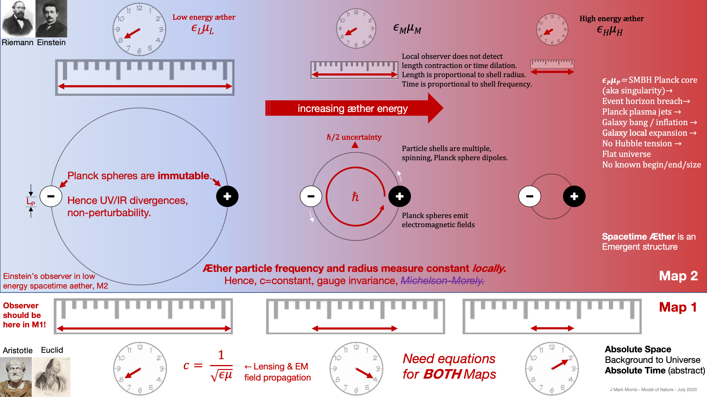

Einstein's geometry of spacetime includes curvature which seems to serve as a geometric proxy for the shape shifting of spacetime æther particles as a function of local energy density. Since the energy of a spacetime æther particle determines its size, this behaviour leads right back to Einstein's "curvy" spacetime.

<figure>

https://youtu.be/XsJhdHVfgx8

<figcaption>

A High Level Introduction to the Fine Structure Number

</figcaption>

</figure>

GR-QM-_Λ_CDM era physics defines the "fine structure constant" as a scalar number that can be calculated from many other so called constants of nature. Unfortunately science doesn't have a full understanding of fine structure and speed of light numbers because it is possible for them to be constants in spacetime æther while at the same time being variables in fundamental Euclidean space M1.

The speed of light in the spacetime æther is not a constant from the perspective of fundamental Euclidean space M1. This is because **c** is calculated by the square root of the reciprocal of permittivity times permeability which both vary in spacetime æther from the perspective of M1.

However, from the perspective of spacetime æther geometry M2 the contraction or expansion of each spacetime particle is related to the frequency of that particle such that photon travel distance/time is always the familiar constant **c**.

This illuminates several challenges we must deal with in NPQG. We must always be clear which perspective geometry were are discussing, M1 Euclidean space and time or M2 Riemannian spacetime. Often we need to discuss both to get a clear understanding of nature. We'll need to introduce a notational convention as well since otherwise it won't be apparent which geometry we are using. For example see the use of c in the prior paragraph. Perhaps we need to introduce a notation like cM1 and cM2?

There have been several media reports of measured variability of the fine structure number in 2020. Let's take a look at those and then continue on with understanding the fine structure in the NPQG era.

https://youtu.be/9IpNEzucNyo

This video is by Anton Petrov who makes excellent astrophysics videos on topics at the forefront of research and explains how those findings may impact the body of GR-QM-_Λ_CDM era understanding.

Let's review this article by David Nield, from April, 2020: [New Tests Suggest a Fundamental Constant of Physics Isn't The Same Across The Universe](https://www.sciencealert.com/new-tests-suggest-the-fundamental-forces-of-nature-aren-t-constant-across-the-universe). Here is a quote.

> _The strength of electromagnetic interaction between elementary particles is calculated with the help of what's known as the fine-structure constant._
> 
> _However, the new readings – taken together with other readings from separate studies – point to tiny variations in this constant, which could have huge implications for how we understand everything around us._
> 
> David Nield

This video is by Matt O'Dowd and the PBS Space Time team.

https://youtu.be/YJzoelANL\_Y

Matt asks rhetorically whether it would be possible for the speed of light c to change. The answer is that it can not change in spacetime æther because the fundamental physics of spacetime particles guarantee that c is a constant in the Riemannian geometry M2 of the spacetime æther no matter the energy of the æther. However, a better question might be, could Earth find itself in higher energy spacetime æther in the future and the answer is yes, that is certainly possible if it comes in closer proximity to a massive celestial object. In that case we would still measure the M2 speed of light to be the same value we see as the constant 3 x 108 m/s. However, if we were looking from the M1 fundamental Euclidean geometry of space and time we would see that cM1 had in fact changed.

| **Metric** | **M1 Euclidean Space and Time Geometry** | **M2 Riemannian Spacetime Geometry** |
| --- | --- | --- |
| c — the speed of a photon in spacetime æther | c is not a constant when viewed from M1. Given by the formula   $latex \\mathbf{c=\\frac{1}{\\sqrt{\\epsilon \\mu}}} &s=2$ | c appears to be a physical constant due to the relationship of spacetime contraction and dilation with local energy density. |
| permittivity of spacetime æther | varies as a function of local electric field. | constant |
| permeability of spacetime æther | varies as a function of local magnetic field. | constant |
| $latex \\mathbf{\\alpha} &s=2$ — the fine structure | Must vary since depends on c, which varies in M1. $latex \\mathbf{\\alpha=\\frac{e^2\\sqrt{\\epsilon \\mu}}{\\hbar}} &s=2$ | My intuition says it must be a constant because we are only talking about electrinos and positrinos - there is no other free parameter.      $latex \\mathbf{\\alpha=\\frac{e^2}{\\hbar c}} &s=2$ |
| charge e/6 | e/6 is a constant. | e/6 is a constant. |

**_J Mark Morris : San Diego : California_**
