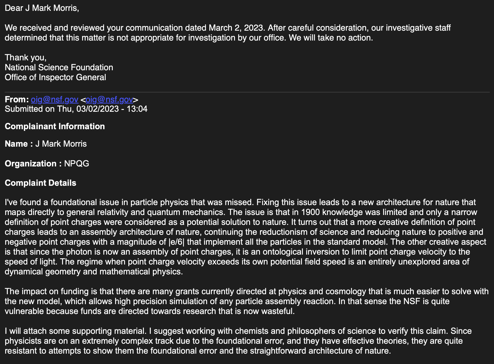

How do you contact an academic to inform them they are living in a dream world, castle in the air, and you can help them back to terra firma, reality, and nature? It is no wonder that the deluded are rather put off or do not respond. This syndrome is a direct repercussion of physicists failing to discover the architecture of nature circa 1900, 125 years ago. Unfortunately, as a result of this impenetrable defense of these scientific fields, we are vastly underutilizing enormous human potential and are wasting funding on much research that is moot and virtually worthless once the architecture of nature is known.

We are where we are. Brass tacks, tough love, let's start gathering information on the major sources of funding for physics and cosmology and begin contemplating identifying those who are funding nonsense research, or those who are receiving funding for nonsense research, which is a total tragedy for all involved. Everyone would be better off to **cancel that funding** and redirect it on something that actually makes sense.

**The National Science Foundation**

_"With an annual budget of about **$11.3 billion** for fiscal year 2024 (up from $8.3 billion in fiscal year 2020), the NSF funds approximately 25% of all federally supported basic research conducted by the United States' colleges and universities."_

You can get a feel for government funding of CERN [here](https://en.wikipedia.org/wiki/CERN). You can find information about the Department of Energy grants [here](https://www.energy.gov/). A higher level view from Wikipedia is [here](https://en.wikipedia.org/wiki/Funding_of_science).

The NSF website makes it easy to find thousands of nonsense research grants. Go to advanced search. Enter in a term for a nonsense area of physics and cosmology. Voila. Here is an example, edited for brevity, with a search for "big bang". This is a $600K grant to a highly respected physicist, who despite searching for cracks in LCDM, is quite unaware they are observing from a leaning tower of interpretational errors. I'll highlight the terms in the abstract that are corrupted by false priors.

```
Award Number: 2108126
Title: The Atacama Cosmology Telescope: searching for cracks in the Lambda Cold Dark Matter model
NSF Org: AST Division Of Astronomical Sciences
Start Date: August 01, 2021
End Date: July 31, 2024
Awarded Amount to Date: $596,466
Organization: Princeton University

Abstract: The Planck satellite was a mission that mapped the Cosmic Microwave Background (CMB), the echo from the Big Bang, in unprecedented detail between 2009 and 2014. Now, with new data from the Atacama Cosmology Telescope in Chile, this project will be able to improve upon the measurements of anisotropies in the CMB. This will allow the team to improve upon cosmological models by determining better estimates for the amount of clustering of galaxies in the universe. 

This project will demonstrate whether the Lambda-Cold-Dark-Matter (LCDM) model sufficiently describes the new CMB data from the Atacama Cosmology Telescope. The new measurements of the polarization power spectrum will reveal whether any significant tensions exist within early-universe data for the LCDM model. By applying techniques from CMB power spectrum analysis the project will demonstrate how well the cosmological model fits a later-universe probe: clusters detected via the Sunyaev Zel'dovich effect, with masses estimated by cross-correlating with gravitational lensing from the Dark Energy Survey. 

This award reflects NSF's statutory mission and has been deemed worthy of support through evaluation using the Foundation's intellectual merit and broader impacts review criteria."
```

Is it fraud to receive government funding for research of nonsense? How does **intent** factor into this equation? I presume that the researchers have no clue of the extent to which they are researching in an ill-conceived dream world. Does that make them less accountable? How will this play out as the point charge universe emerges as the solution to the 150 year tragedy of physics and cosmology? Think about that. What would you do as a researcher the moment you realize the grant(s) you are receiving are formulated on the basis of nonsense false priors? _**Do you call up the NSF and say, "Umm, yeah, could you stop sending me those monthly checks?"**_ The moment the scientists realize they are in this vulnerable position is when fraud becomes a factor. The receiving entities, such as universities and research institutions, will need to sort this out quickly. I can already imagine the lawsuits piling up once the public realizes the amount of waste that has occurred and that we are now in fraud territory.

Arghh, it sometimes gets to me a bit that these scientists are going to have an opportunity to cash in on the point charge technology era. On one hand it doesn't seem fair that those who were lost all of a sudden get a huge windfall. On the other hand, it's really not their fault they are lemmings piled into a leaning tower of false priors. Obviously I have mixed up thoughts on this, probably jaded by my experiences with the intellectual brutality of the guardians of physics. I think everyone will have plenty of opportunity after the anguish. That's a good thing.

In reality, my rational self assumes that most of these scientists are decent people, trying to live their best lives, and who are toiling to figure out nature in a hopelessly **_not even wrong_** paradigm. I continue to advocate that as a professional field, physicists should show leadership around the entire surface of the crisis and think deeply about what the crisis signals and how to behave as a result. If they had such an attitude and bi-directional outreach, we could have been on to the next era by year end 2018.

**_J Mark Morris : Boston : Massachusetts_**

p.s. I find it amusing to imagine the upcoming intellectual skirmish between physicists, cosmologists, astronomers, geometers, and philosophers as shown in this iconic video. I'm hoping the chemists will stay above the fray and lay claim to the entire territory of particle physics.

https://youtu.be/ipsPgNEmAXI

* * *

2023 Update : I made a formal complaint to NSF. **No action.**



2024:  
I will say that on one or more levels, cosmologists and particle physicists are frauds. Seriously, how far can you walk out on that limb, that branch, that twig? This notion of fraud is one that needs to be explored fully, because how is it really possible at this point in modernity these so-called scientists have not discovered such a simple pattern of emergent assemblies from equal and opposite point potentials in a Euclidean void of time and space? It is truly unfathomable!

How is it possible that the fields of particle physics and cosmology have somehow been able to snow over funding agencies for 50 years now with research grants that produce next to nothing in terms of understanding nature. The major open questions in particle physics and cosmology are a complete embarrassment. How has this charade been permitted to continue?

Does it really make sense to fund research to eliminate one small region of the parameter search space? We might get lucky though! That reminds me, I need to ask Ai to find the earliest known article references to "dark matter" and "dark energy". Every day a science article title trumpets the possibility of progress on the dark sector. _**Make it stop, please!**_

To the people in these fields: Wake up! Something must be wrong. Everything you know is based upon "effective theories" (look it up) which match observations and are predictive. However, "effective theories" have no foundation of any kind. No explanation for the quantum. No explanation for why Einstein's spacetime is curvy stretchy. You must go back before the GR and QM eras and search, with your current knowledge serving as a reference model to which you want to map. My best guess is that circumstances caused a simple oversight in imagination circa 1900. It was a time of rapid progress in modeling and measuring nature at the most reductionist levels. I think the solution was simply overlooked in the mad stampede and relegated to the bone pile of unexamined and misfit physics theories.
