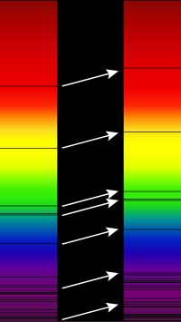

**WHAT IS REDSHIFT?**

Science terminology for the accumulated loss of photon energy is "redshift" which non-intuitive. First of all _redshift_ is **anthropocentric**, relying as it does on the spectrum of radiation that is visible to humans. Likewise, _blueshift_, is the term for a photon gaining energy.

Second, the redshift terminology relies upon the audience to remember which direction in the visible light scale is towards longer wavelengths and lower energy (red) vs. shorter wavelengths and increased energy (blue). Third, the redshift terminology also applies to non-visible portions of the electromagnetic spectrum which is odd and confusing. It is much simpler and more accurate to simply say _reduced energy photon_ instead of redshift, and _increased energy photon_ instead of blueshift.

GR-QM era physics does not yet fully understand redshift. A key example is that science does not yet have any measured data or theory around redshift of a photon traveling through spacetime æther with energy E nor a theory around redshift of a photon experiencing an potential gradient in spacetime æther. GR-QM era science postulates that photons travel through an empty vacuum of space without loss of energy and that expansionary abstract geometrical space of Einstein causes the photon wave to stretch. However, remember that Einstein proposed no natural physical implementation of spacetime.

How is redshift physically implemented on a photon’s journey through spacetime? Does a redshifting photon shed energy in _quanta_ of Planck’s constant **h** Joule-secs? Or does a redshifting photon shed tiny _continuous_ energy per mega-parsec to expanding spacetime aether? The case for quanta is that the photon is structure and QM says standard matter particles transfer energy in quanta. We now have the binary that implements that mechanism. The photon is lightly interacting with the aether, but may stochastically emit energy in quanta h. Alternately photons may leak energy continuously at a very slow rate in low apparent energy spacetime and that may be the mechanism for redshift. Third, it is possible that all forms of redshift could be based on aether energy and energy gradient. These determine the expansion and contraction rate of Noether core based aether. It would be a simplification to existing science if there is a unified redshift mechanism.

As a Noether core redshifts, it is transitioning PE and KE to the local spacetime aether. Photons have a wide energy range over which they retain their planar shape and sail on their own fields through the aether. Within the context of Einstein's curved spacetime geometry, we observe the constancy of the speed of the photon.

All Noether core's redshift as they travel through spacetime aether assemblies. I imagine it as a gradual phase shift type of energy transfer, rather than discrete, but simulation will tell.

It turns out that DeBroglie's mechanism is the general one for the Noether core, and that **_photon redshift is object inheritance_**.

The oldest photons we observe have been fortunate to travel in low apparent energy aether with a low interaction probability with other standard matter particles. Low apparent energy aether imposes a very small energy tax in the form of redshift. Redshift is implemented as a gradual phase shift in the photon's point charge orbital patterns.

We do not know the rate of redshift per absolute distance nor the factors upon which it depends. What might influence the redshift per distance rate?

- The simplest guess is "nothing" influences the redshift rate, i.e., it could be a universal constant. Is this the assumption of LCDM?

- Does the energy of the photon influence the rate of the redshift?

- Does gravitational energy in forms of ambient potential, potential flow, and/or aether flow play a role in this process? We know that lensing studies confirm Einstein's theory of "bending spacetime," which is a physical effect.

- Is the redshift rate a function of both photon energy and the ambient gravitational energy in the aether?

- The only other factor I can imagine seems unlikely : a non-scattering interaction with local photons and/or neutrinos.

* * *

Now we turn our attention to ultimately redshifted photons and neutrinos.

- Can we create and observe such low energy photons?

- What are their characteristics?

- Do photons have a decay mode to neutrinos?

- As the Noether core geometry puffs up and transitions between 2D and 3D, what is the role of history potentials?

- It seems like there would be a braking effect and with the Lorentz factor on velocity then the geometry shifts to 3D.

- How is velocity really related here?

- Which is the cause and which is the effect?

Is braking effect what I really want to say here? Is that a good analogy?

Noether cores link velocity and history potentials so as to maintain momentum

Random thought : a map of dark matter could be showing the redshift imprint of the passing galaxy. The aether being lightly interactive and only gravitationally. So the energy imprint represents net energy transfer from massy or redshifting matter to the aether??

https://en.wikipedia.org/wiki/Equivalence\_principle

So we have a diagram where v = local c which is perceived as a constant from within spacetime. In this region the photon slowly drains energy via redshift. We don't know the factors influencing redshift rate, but they may depend on photon energy and aether energy and gradient. In this region of the "phase diagram" the photon is 2D planar. Then we have a region where photon energy has decayed to the energy level where it can no longer maintain the 2D bosonic shape. What happens in this transition? What are the controlling factors in this reaction? How does the aether react as the photon puffs out a bit? What are the sets or ranges of entry point photons? What is the velocity magnitude profile as the puffy photon transitions towards the aether state. What are the intermediate products? How does energy flow from these assemblies as they drop in speed? What is the apparent energy or mass of puffy photons along their lifecyle? Are neutrino's and photon's produced by the same process, but only differentiated by the amount of energy? Neutrino's not having enough energy to reach the photonic state.

The standard model of particle physics, including quantum theory, has no implementation. Einstein's general relativity describes itself as a geometry, with no implementaton

Aside : Within a galaxy we do not know the rate of expansion/inflation at every point in the galaxy.

Redshift does have the net effect of performing work on the photon, which does cause it to move towards the low energy end of the 2D Bosonic scale. Beyond that point, the photon presumably reverts to pro and anti Noether cores. At that point, additional redshift (which is sort of a misnomer) at this point serves to cause the "particle" to slow down and this slow down occurs via binary size changes which changes the history potential shadow. Wow, this is a really cool mechanism! So, traveling through pure spacetime, these Noether cores (are they oscillating neutrinos now?) would continue to redshift and each h-bar of redshift would correspond to a change in the history potentials, which are powering the sails, which would cause the neutrino to slow down gradually. Eventually they tend to be a constituent of spacetime aether.

**PHOTON LIFECYCLE**

Consider a photon lifecycle. When a reaction produces and sheds energy it can transferred to a nearby spacetime æther particle which reconfigures to produce a photon and **_zing_** - off it goes at local speed of light. That photon may experience many continuous energy transfers, both decreases and possibly increases, as it passes through or by spacetime aether that is expanding. At some point that photon may yield enough energy to transform back into the æther.

A photon that is created deep in the energy well of a dense matter-energy object will experience **GRAVITATIONAL** energy loss (redshift) simply to traverse the steep spacetime energy gradient and escape the object. Then, it will experience **expansionary redshift** as it travels as a function of spacetime æther energy, flow, direction, and distance. The photon may also experience **DOPPLER** energy shift if the emitter or receiver are moving towards or away from the photon. A new consideration in NPQG is **INFLATIONARY** redshift from galaxy local inflation. Let's discuss these forms of redshift.

**GRAVITATIONAL REDSHIFT**

A photon emitted nearby a dense matter-energy object will travel at local speed of light, as determined by the energy of spacetime æther. Spacetime æther energy is determined by gravitational energy waves emitted by the particles in the dense matter object since mass corresponds to the lossless A/C exchange of apparent energy with nearby particles of spacetime æther.

Spacetime energy factors into the photon energy emerging from the reaction, considering that photons are formed from spacetime æther particles. The photon's total energy is the pre-emission photon energy, plus the energy from the reaction that was transmitted to the photon, plus a component from the energy of the spacetime æther particle that decayed into the photon.

As the photon travels away from the dense object and towards free space, it must face a steep gradient in spacetime aether energy, and the photon, which has a very small near zero mass (apparent energy), leaks energy as it travels through expanding spacetime aether particles, and thus experiences redshift. Note : redshift is a continuous small drain on photon energy caused by interaction with the aether. Redshift is not quantized. My conjecture is that it is a continuous phase shift. The aether is a floating ground so this extremely slow energy leakage is non-scattering. It is also worth noting that as the energy of æther falls on this journey out of the objects gravitational field, local speed of light increases due to the changes in spacetime aether permittivity and permeability.

**DOPPLER REDSHIFT**

Let's consider only linear motion in one dimension. The photon emitter has velocity Ve relative to æther, the photon receiver has velocity Vr relative to æther. We are considering redshift, so the distance between emitter and receiver is increasing. No matter what, we can be assured that the photon will travel at the local speed of light based on spacetime æther energy. Let's assume the distance traveled is small. How does redshift occur in this case? Each photon may be Doppler redshifted either at the emitter or at the receiver. Redshift means less energy.

If the emitter is stationary, no energy is required to change the initial momentum of the photon. If the emitter is moving away, partial energy must go towards reversing momentum of the photon which therefore leaves less energy for the photon itself and it is redshifted. Likewise compared to a stationary receiver, a receiver moving away must use some of the energy to equalize momentum which leaves less energy for the photon and it appears to be redshifted. This is a fascinating new way to think about this that is enabled by the realization that photons have mass, even though miniscule.

**SPACETIME ÆTHER INFLATION/EXPANSION REDSHIFT**

Redshift from inflation is not often discussed by science since most consider the one time inflationary Big Bang redshift to be accepted science. However, 𝗡𝗣𝗤𝗚 predicts that there was no Big Bang and instead that inflation is a routine occurrence around Planck scale point charge plasma jets and mini-bangs emitted from the supermassive black holes typically found in the center of galaxies.. Inflationary redshift is related to gravitational redshift. The mathematics should be similar, although the turbulent reactions around Planck scale point charge plasma likely are different than other typical celestial light sources. This is an area for ongoing research.

Expansion is misunderstood in ΛCDM as a universal outflow from a one time inflationary Big Bang. Instead, expansion needs to be reframed as galaxy local expansions of spacetime æther, and that the expansions of adjacent galaxies oppose each other in a sense.

Just like any other particle, spacetime aether particles redshift or lose energy as we travel away from dense matter-energy. We still get the same expansionary redshift of photons, but redshift is not uniform universe wide. Of course given the difficulty of establishing the constancy of the Hubble constant this makes a lot of sense, precisely because it is NOT a constant. Expansion is galaxy local and will vary not only within each galaxy, but from galaxy to galaxy.

Furthermore, there are spacetime æther flows in clusters of galaxies that will undoubtedly have a small but accumulative effect on photons. Spacetime æther may be flowing in various directions relative to a photon trajectory. The end result is that a photon may pass by more or fewer redshifting spacetime æther particles than it would if spacetime æther were not flowing.

**SPACETIME ÆTHER CONTRACTION BLUESHIFT**

Is it possible that the spacetime æther can contract in some regions? What would this mean? It means that there would be a dense matter-energy sink where spacetime æther is consumed. The logical place to look for this is around black holes and in particular around supermassive black holes. Spacetime æther particles have an extremely low apparent energy (mass) and may not experience much gravitational force, even from a black hole. On the other hand, for all we know black holes may gulp down spacetime æther. Let's put this thought on hold for now, but keep it as an idea to contemplate.

**MULTI-CAUSAL REDSHIFT**

A given photon may experience multiple types and degrees of redshift. Redshift is simply a loss of energy. A photon may experience many different forms of energy loss (transfers to aether) in its lifetime.

**SPECTRAL LINES: ABSORBTION AND EMISSION**

We also see shifted absorption lines in redshifted spectrum.

<figure>

<figcaption>

WIKIPEDIA

</figcaption>

</figure>

How do we explain the shifting of reaction absorption spectral lines? Well, first of all, it's nonphysical to talk about shifting nothing (an absence of photons), so instead let's first look at both sides of each gap. We already know that redshift occurs. Therefore it is no surprise that the frequency gap is defined by its redshifted boundaries.

What about the shifting of emission spectral lines? In this case we have an abundance of photons to shift, and we know how redshift works, so it makes sense.

**AXIAL ALIGNMENT AND CORRELATION OF DIVERSE REDSHIFT OBJECTS**

Halton Arp observed a number of cases of young galaxies and galaxy precursors aligned axially with large galaxy AGN SMBH, but with a diversity of redshifts.

> _"An “exotic” idea proposed by Viktor Ambartsumian was that new galaxies are formed through the ejection from older active galaxies. Galaxies beget galaxies, instead of the standard scenario in which galaxies stem from the evolution of the seeds derived from fluctuations in the initial density field. This idea is in some way contained in the speculative proposal that some or all Quasi-Stellar Objects (QSOs) might be objects ejected by nearby galaxies, and that their redshift is not cosmological (Arp, G./M. Burbidge and others)."_
> 
> Mart ́ın Lo ́pez-Corredoira arXiv:0901.4534

I will include references and excerpts about this controversial idea at the end of this post. Needless to say, if these correlations exist, they are perfectly explained by Neoclassical Physics and Quantum Gravity.

**PREDICTIONS AND HYPOTHESES**

- Every photon causes a small lossless energizing purturbation in every local æther particle as it passes. _What are the implications of this hypothesis?_

- A new model for Doppler redshift was introduced.

- In absolute coordinates, spatial distance and photon age depend on the interaction of spacetime æther flow in relation to celestial objects. Flow of spacetime aether is an advanced topic that I will probably leave to the professionals.

- The redshift diversity of AGN minor axis aligned QSO's is consistent with a galaxy seeding narrative driven by Planck plasma jets.

- The redshift diversity of AGN minor axis aligned QSO's is consistent with rapid inflation upon emission of Planck plasma.

- Scientists perform corrections on observations of superluminal jets by attributing apparent superluminality to angle of observation. However, it may be possible for Planck plasma jets to be superluminal once the jet has obliterated the spacetime æther particles in its path.

**NEXT STEPS**

This post has introduced some new thinking about redshift in the context of NPQG. We have learned that the ideas of Ambartsumian and Arp appear to fit this emerging narrative. Yet many questions remain to be answered.

1. Doppler redshift

3. Gravitational redshift

5. Galaxy local spacetime æther inflationary or regional expansion redshift

7. Regional spacetime æther contraction blueshift (if possible).

I suspect the Friedmann equations are relevant to the dynamics of redshift. I don't view the solutions to the Friedmann equations as representing the whole universe, but instead representing the state of Noether core inflation or expansion or the opposite contraction and deflation. Inflation occurs when extremely high energy point charge binary plasma in a black hole is exposed to lower energy Higgs spacetime aether. When the speed of binaries is greater than their own field speed it behaves in a dynamical geometry regime that includes self-action. From the point of view of a Noether core it could be on any of these curves and can switch between them as conditions change.

There are also many questions to investigate

- _What is the causal information about EACH photon energy transaction?_

- _What is the energy of the minimum energy photon?_

- _What is the transition energy where a photon has redshifted into a puffed up state and drops out of light speed and begins its transition towards spacetime aether?_

- _Does an ultimately redshifted photon convert into a neutrino?_

- _With this new insight, how does redshift relate to distance?_
    - _Is redshift linear regardless of photon energy (apparent or total)?_
    
    - _Or does redshift proceed faster or slower at some photon energies?_
    
    - _Is redshift constant with distance regardless the apparent energy of the spacetime aether?_
    
    - Is aether expansion redshift a function of aether potential or gradient?

- _How much does spacetime æther flow impact the movement of celestial objects?_

- _What is the gradient of spacetime æther flow throughout the universe?_

- _Does this change our thinking on distance and age calculations?_

**_J Mark Morris : San Diego : California_**

* * *

REFERENCES AND EXCERPTS

arXiv:0609514 : **First tentative detection of anisotropy in the QSO distribution around nearby edge-on spiral galaxies**, M. Lo ́pez-Corredoira, C. M. Gutie ́rrez, September 19, 2006. "Results. There is a clear excess of QSOs near the minor axis with respect to the major axis of nearby edge-on spiral galaxies, significant at a level 3.5σ up to angular distances of ∼ 3◦ (or ∼ 1.7 Mpc) from the center of each galaxy. The significance is increased to 3.9σ with the _z_ \> 0.5 QSOs, and it reaches 4.8σ if we include galaxies whose circles of radius 3 degrees are covered by the SDSS in more than 98% (instead of 100%) of the area.  
Conclusions. Gravitational lensing in the halo of nearby galaxies or extinction seem insufficient to explain the observed anisotropic distribution of QSOs. The anisotropic distribution agrees qualitatively with the predictions of Arp’s models, which claim that QSOs are ejected by galaxies along the rotation axis, although Arp’s prediction give a distance of the QSOs ∼ 3 times smaller than that found here. In any case, a chance fluctuation, although highly improbable, might be a possibility rather than a true anisotropy, and the present results should be corroborated by other groups and samples, so we prefer to consider it as just a first tentative detection."

arXiv:0801.0423 : **Analysis of possible anomalies in the QSO distribution of the Flesch & Hardcastle catalogue**, M. Lopez-Corredoira, C. M. Gutierrez, V. Mohan, G. I. Gunthardt, M. S. Alonso, Jan 2, 2008. Summary: Did not find QSO background anomalies in 41 objects studied from the FH04 catalogue.

arXiv:0901.4534 : **Apparent discordant redshift QSO-galaxy associations,** Mart ́ın Lo ́pez-Corredoira, November 6, 2018. Excerpts: "There are plenty of statistical analyses (e.g., Chu et al. 1984; Zhu & Chu 1995; Burbidge et al. 1985; Burbidge 1996, 2001; Harutyunian & Nikogossian 2000; Ben ́ıtez et al. 2001; Gaztan ̃aga 2003; Nollenberg & Williams 2005; Bukhmastova 2007) showing an excess of high redshift sources near low redshift galaxies, positive and very significant cross-correlations between surveys of galaxies and QSOs, an excess of pairs of QSOs with very different redshifts, etc. An excess of QSOs near the minor axes of nearby parent galaxies has also been observed (L ́opez-Corredoira & Guti ́errez 2007); however, the discovered excess for position angles lower than 45 degrees is significant only at the 3.5-σ level (3.9-σ for zQSO > 0.5) with the QSOs of the SDSS-3rd release (L ́opez-Corredoira & Guti ́errez 2007) and somewhat lower \[2.2-σ (2.5-σfor zQSO > 0.5)\] with the SDSS-5th release".

"There are plenty of individual cases of galaxies with an excess of QSOs with high redshifts near the center of nearby galaxies, mostly AGN. In some cases, the QSOs are only a few arcseconds away from the center of the galaxies. Examples are NGC 613, NGC 1068, NGC 1097, NGC 3079, NGC 3842, NGC 6212, NGC 7319 (separation galaxy/QSO: 8”), 2237+0305 (separation galaxy/QSO 0.3”), 3C 343.1 (separation galaxy/QSO: 0.25”), NEQ3 (see Fig. 1/left; a QSO-“narrow emission line galaxy” pair separated 2.8” from another emission line galaxy with a second redshift, and all of them lying along the minor axis of an apparently distorted lenticular galaxy at ∼17” with a third redshift), etc. In some cases there are even filaments/bridges/arms apparently connecting objects with different redshift: in NGC 4319+Mrk 205, Mrk273, QSO1327-206, NGC 3067+3C232 (in the radio), NGC 622, NGC 3628 (in X-ray and radio), NEQ3 (Fig. 1/left), etc. The probability of chance projections of background/foreground objects within a short distance of a galaxy or onto the filament is as low as 10−8, or even lower. The alignment of sources with different redshifts also suggests that they may have a common origin, and that the direction of alignment is the direction of ejection. This happens with some configurations of QSOs around 1130+106, 3C212, NGC 4258, NGC 2639, NGC 4235, NGC 5985, GC 0248+430 (Fig. 1/right), etc. Other proofs presented in favor of the QSO/galaxies association with different redshift is that no absorption lines were found in QSOs corresponding to foreground galaxies (e.g. PKS 0454+036, PHL 1226), or distortions in the morphology of isolated galaxies".

"In my opinion, we must consider the question as an open problem to be solved. I maintain a neutral position, neither in favor of nor against non-cosmological redshifts. The debate has lasted a very long time, around 40 years, and it would be time to consider making a last effort to finish with the problem. However, _**the scientific community does not seem very interested in solving the problem because most researchers consider it already solved. Supporters of the standard dogma of all redshifts being cosmological do not want to discuss the problem. **_ This means that it is very difficult to make any progress in this field, as is usual when a researcher is away from the mainstream (L ́opez-Corredoira & Castro-Perelman, eds., 2008). On the other hand, the main supporters of the hypothesis of non-cosmological redshifts continue to produce tens of analyses of cases in favor of their ideas without too much care, pictures without rigorous statistical calculations in many cases, or with wrong identifications, underestimated probabilities, biases, use of incomplete surveys for statistics, etc., in many other cases. There are, however, many papers in which no objections are found in the arguments and they present quite controversial objects, but due to the bad reputation of the topic, the community simply ignores them. In this panorama, it would be difficult for the problem to be solved soon. Mainstream cosmologists are waiting for the death of the main leaders of the heterodox idea (mainly Arp and the couple Burbidge) to declare the idea as definitively dead. However, as in the case of Ambartsumian, some challenging ideas could survive or even be revived after some time if we leave open problems without a clear solution. Therefore, I would recommend that the community either finds good arguments against the Arp-Burbidge hypothesis, or that it allows their ideas to cohabit within the possible speculative hypotheses in cosmological scenarios."

arxiv:0401420v3 : **Redshift of photons penetrating a hot plasma**, Ari Brynjolfsson, January 21, 2004. _N.B. I first encountered Ari's work on June 18, 2019 and although there are major differences, I see that portions are remarkably prescient and consistent with respect to my discoveries of NPQG._ Excerpts: "Plasma redshift contributes also to the heating of the interstellar plasma, the galactic corona, and the intergalactic plasma. Plasma redshift explains the solar redshifts, the redshifts of the galactic corona, the cosmological redshifts, the cosmic microwave background, and the X-ray background. The plasma redshift explains the observed magnitude-redshift relation for supernovae SNe Ia **without the big bang, dark matter, or dark energy. There is no cosmic time dilation. The universe is not expanding.** \[...\] This means that there is no need for Einstein’s Lambda term. **The universe is quasi-static, infinite, everlasting and can renew itself forever. All these findings thus lead to fundamental changes in the theory of general relativity and in our cosmological perspective.**"
