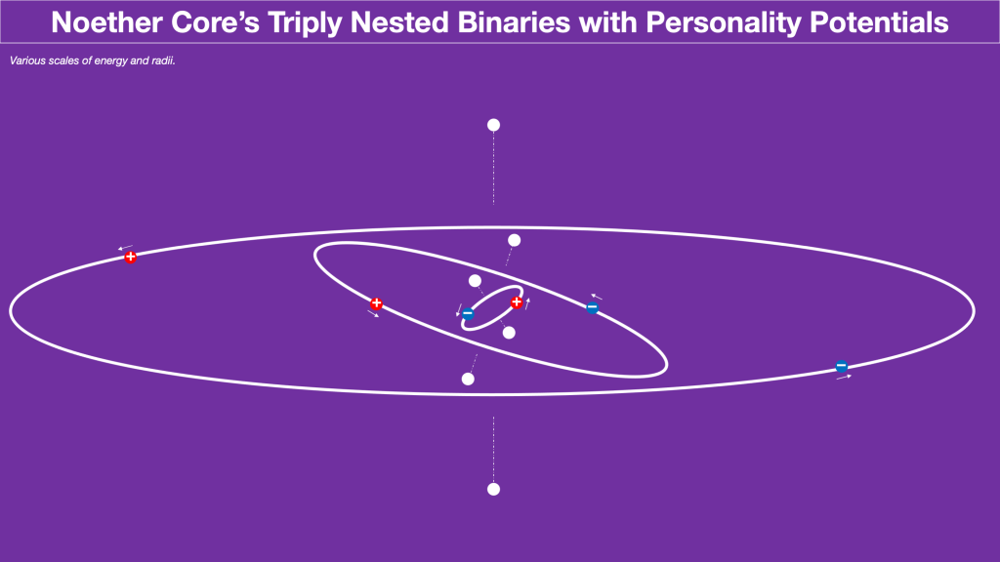

> _All matter possesses energy, and all energy is associated with matter. When people refer carelessly to matter being converted into energy (or vice versa), they mean simply that certain kinds of matter and energy are being converted into other kinds. For example, an electron and a related (but oppositely charged) particle called a positron can come together and turn into two photons, a process a process often described as “annihilation” or even “annihilation of matter to give energy.” However it is merely the transformation of matter into other matter, of certain forms of energy into other forms._
> 
> Murray Gell-Mann in “The Quark and the Jaguar”

This is a great quote from Murray Gell-Mann. It gets right down to the nexus of energy and matter. I imagine that Dr. Gell-Mann would really love the patterns in nature that emerge from point charge assemblies. He would be incredibly excited at the pure simplicity that through emergence gives rise to complexity in our universe.

Can we think of reactions as processes involving disassembly and reassembly? These processes involve the breaking of bonds and the making of bonds. We have the strong bonds in each binary of the Noether core. Is there energy inherent in the nested structure of the Noether core itself and if so is that a form of bond? Next we have the weak bonds of the polar personality charges for each binary. Do these polar personality charges change energy with temperature? Are they the main kinetic transducer transferring h-bar to the core or spinning up photons to release energy?

Let's consider a relatively low energy disassembly and reassembly reaction — fusion.

> _Deuterium–tritium fusion (abbreviated D+T) is a type of nuclear fusion in which one deuterium nucleus fuses with one tritium nucleus, giving one helium nucleus, one free neutron, and 17.6 MeV of energy. It is the most efficient type of fusion for fusion devices._
> 
> Wikipedia

> _By raising temperatures inside the tokamak to unfathomably high levels, the particles from the fuel are forced to fuse into one. The process creates helium and neutrons — which are lighter in mass than the parts they were originally made of._
> 
> _The missing mass converts to an enormous amount of energy. The neutrons, which are able to escape the plasma, then hit a “blanket” lining the walls of the tokamak, and their kinetic energy transfers as heat. That heat can be used to warm water, create steam and turn turbines to generate power._
> 
> https://www.cnn.com/interactive/2022/05/world/iter-nuclear-fusion-climate-intl-cnnphotos/

Okay. That's a lot of background to review. What is physically happening during fusion? These are collisions of nuclei, so there are no electrons involved. Each nucleon is composed of three quark personality tri-binaries. Interestingly neither the number of protons nor the number of neutrons change in the reaction. Also, there is no reference to photon emission. Can we presume that this is a relatively low energy reaction where nucleons retain their form? Or is it possible the reaction redistributes quark components a bit, and it all equals out? My intuition would be to first guess that (most or all?) nucleons retain their integrity throughout this process.

Examine the following template for a fermion with the white circles replaced by some permutation of unit potential polarity. Those combinations make electrons, up quarks, down quarks, and neutrinos. For the purpose of fusion we need only concern ourselves with the up and down quarks comprising each nucleon, i.e., each proton or neutron. The triplet up-down-up makes a proton, and the triplet down-up-down makes a neutron. One can imagine the dance the unit potentials do in each triplet tri-binary with personality charges. Apparently, the binaries become gluons.

I am amazed in a way about how low energy fusion must be. It really looks like protons and neutrons retain their integrity throughout this process. That's actually on the low end of the energy scale compared to breaking the bonds holding those assemblies together.

What does this tell us about mass? The energy released kinetically corresponds to the change in mass according to E=mc2. Mass is determined by apparent energy. The photon sail geometry barely interacts with the aether thus we call it massless, but yet it has apparent energy and shielded energy. Mass is akin to the resistance or drag through the spacetime aether presented by an assembly. The reaction converts potential energy of position and rotational momentum to linear momentum of the reaction products.

D-T fusion is not a difficult simulation when modeled with unit potential point charges. I would expect many insights would be evident to fusion scientists should such a simulation be created.

**_J Mark Morris : Boston : Massachusetts_**

p.s. I continue to make good progress through thought experiment while also narrowing in on ideas about the dynamical geometry of unit potentials in a Euclidean void, unconstrained in velocity by their field speed @. This is the unexplored sector, where v > limit of c which approaches the field speed @. The density of apparent energy also energizes the spacetime aether which contracts just as Einstein specifies and imparts a permittivity and permeability that define the path that the photon sails.
