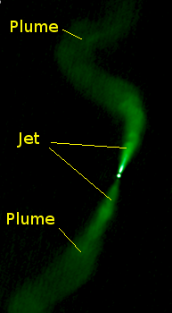
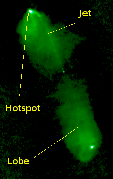

**Euclidean Time and Space**

The background for our universe is Euclidean time and three dimensional space, aka "the void". The void is non-interacting. The void does not have any inherent characteristic energy nor ability to carry energy itself. Euclidean time and space does not curve, stretch, inflate, expand, or do anything for that matter. Einstein's spacetime has an emergent implementation that permeates Euclidean time and space. Potential fields emitted by point charges expand spherically through the void at a constant velocity @. The void is the empty vessel in which standard matter-energy assemblies made of point charges may exist. In NPQG we can _geometrically_ consider absolute distance, absolute direction, and absolute time with respect to the void, although to be clear there are no physical coordinate reference points in the void. It is unknown whether the void is infinite, but it may be treated so. It is unknown whether any sizeable regions of unoccupied void space exist. The void has no testable characteristics other than the deduction that the void must exist because the universe exists.

**Aura**

As a matter of convenience, we define the term '**aura**' as the scalar and vector potentials that result from the superposition of all Dirac spheres at the current location of a point charge, i.e. (t,s), beyond those point charges in an assembly or set of local assemblies. That is to say, "aura" represents the churning background potential from far enough away to not be part of the typical behaviour of the assembly or reaction. The aura certainly has influence on the path of point charges, but that influence is generally very small compared to the nearby point charges. Occasionally superposition can result in a change in the aura that is in the right location and the right time and with the right magnitude to influence a reaction.

**Electrino**

An immutable point charge with a negative 1/6 charge. Symbol: ε⊖ or ε-.

**Positrino**

An immutable point charge with a positive 1/6 charge. A positrino is the equal and opposite of an electrino. Symbol: ε⊕ or ε+.

**Point Charge**

An electrino or a positrino. Symbol: ε. Electrino ε⊖ and positrino ε⊕ are physical due to immutability with a radius near the Planck length and thus a size far below the state of the art (as of 2023) experimental observation scale of GR-QM era physics. Point charges are immutable.

**Point Charge Assembly Notation**

A notation for describing composite particles and fragments. Expressed as a count of electrinos, a ':' character, and then a count of positrinos. A proton has notation 15ε-:21ε+. The ':' character is always present, even if there is a zero count of either electrinos or positrinos. The alternate stylized format is ε⊖ or ε⊕. In informal notation, or formal notation after introduction of terminology, the symbol may be omitted, such as proton 15:21. Older posts used a '/' as a separator, but now the ':' separator is preferred, because the '/' can be confused as a fraction.

**Standard Model Particle Assemblies**

Quantum theory has led to a standard model of particles which can carry energy and are often referred to as standard matter-energy, or matter-energy for short. Standard matter-energy is the basis for all elements in the periodic table and all reactions. The NPQG model goes one level deeper and can express all standard matter-energy particles including spacetime aether particles as assemblies of electrinos and positrinos.

**Planck Scale Emergence**

In quantum mechanics and general relativity, the Planck units are considered to be a result of dimensional analysis, and no claim is made for the physicality of the Planck units. In NPQG, the point charge is physical and we can relate the Planck units to the behaviours of point charge assemblies. Point charge assemblies may form in very high energy objects or events, such as the core of some active galactic nuclei (AGN) supermassive black holes (SMBH). It is conceivable that high energy point charge assemblies may form in other high energy objects or events.

Orbiting binary and nested binary point charge sub-assemblies with electrinos and positrinos at the highest energy possible, the Planck energy, are hypothesized to occur as ejecta or emission of supermassive black holes in a jet or rupture of the Planck core.

**Planck Plasma**

A plasma of particles emitted from a Planck core during a jet or rupture of a black hole. Planck plasma is expected to be composed of particles at or about the Planck energy. Planck plasma is found in extreme energy situations throughout the universe, particularly in AGN SMBH jets or ruptures. It may also occur in other objects such as emissions from mergers of black holes, and as a result of mergers of black holes and neutron stars.

**Planck Point Charge Plasma Jet**

A powerful Planck point charge plasma jet forms from a core breach of a dense matter object which exposes in-core extreme energy point charges to lower energy conditions. Jets frequently occur in pairs, exiting each polar axis. Cooling jets decay and react into lower energy photons, neutrinos, spacetime æther and other standard matter-energy. The jet ejecta causes galaxy local inflation as it rapidly increases in scale and then expansion as apparent energy of the aether falls to levels in intergalactic space. Notes: 1. Modern physics says that accretion disk matter-energy is also carried away in each jet. 2. See the Wikipedia article on [radio galaxies.](http://radio galaxies.)

<figure>

<figure>

<figcaption>

FRI radio galaxy [3C31](https://en.m.wikipedia.org/wiki/NGC_383) - Ⓦ

</figcaption>

</figure>

<figure>

<figcaption>

FRII radio galaxy 3C98 - Ⓦ

</figcaption>

</figure>

</figure>

**Planck Plasma Mini-Bang**

A catastrophic core breach of a dense matter object which exposes in-core Planck plasma to lower energy conditions in a chaotic matter that leads to turbulent explosion. This is **not** "The Big Bang". A Planck plasma mini-bang is localized within a galaxy. Such a mini-bang causes rapid galaxy local inflation and then expansion.

**Binary or Orbiting Binary**

I often use the terminology **"orbiting binary"** to describe two equal and opposite point charges that are orbiting each other — an electrino and positrino coupled in an orbit. In past writings I used the terms "rotating dipole" or "orbiting dipole" to describe the same concept. Here are several terminology considerations:

<figure>

|  | "rotating or orbiting dipole" | "orbiting binary" |
| --- | --- | --- |
| **Pro** | Orbits in assemblies are a key concept in NPQG. However, the use of binary and binaries in astrophysics implies orbits as well.      An esoteric consideration is that "orbiting dipole" may map to the dipole moments of quantum theory. | The word “binary” comes from the Latin word “bini” which means "two together". It is derived from the Late Latin word “binarius” which means "consisting of two".      In the context of mathematics and computing, binary refers to a numerical notation system with base 2. In general, binary can also refer to something that is composed of or involves two things.      In astrophysics, the term “binary” is commonly used to refer to binary systems, which are systems of two astronomical bodies that are close enough that their gravitational attraction causes them to orbit each other around a common center of mass. The action laws for gravity and point charge potential are both dependent on the square of the distance from the point of emission. |
| **Con** | Wordy.   Unnecessarily complicated.   May be confusing.   May be intimidating for learners.   Non-standard. | With nature being fundamentally based on a system with two point charge types, where "binaries," i.e., orbiting point charges, are the foundational assemblies upon which more diverse assemblies emerge, it might give new nuanced meanings to other uses of "binary". To the extent those are good then fine, but I worry about poor interpretations and false justifications. Bai explains those uses cases thus:      In non-technical contexts, the term “binary” is often used to refer to a situation that involves two opposing or contrasting elements or options. For example, people may talk about a binary choice, meaning a choice between two options. Similarly, the term “binary opposition” refers to a pair of related concepts or terms that are opposite in meaning, such as good and evil, light and dark, etc.      In some contexts, the term “binary” is also used to refer to gender identity. A binary gender system is one in which individuals are classified as either male or female based on their sex assigned at birth. However, many people argue that this binary system is overly simplistic and does not accurately reflect the diversity of human gender identities. |

<figcaption>

Terminology Considerations  
Mark and Bai (Bing AI)

</figcaption>

</figure>

**Spacetime Æther Assembly**

Spacetime æther is dominated by low apparent energy pro and anti Noether cores. The internal Higgs energy is shielded by superposition. Noether cores are formed with three nested binaries, each at different energies, orbital radii, and point charge velocity.

**Photon**

A composite particle with a formula of 6ε-/6ε. It is imagined as a pro Noether core coupled with an anti Noether core which contra-rotates. Both Noether cores are planar in a photon and sail on each others potential emissions.

In the point charge universe, it appears that photons are implemented as **_contra-rotating coaxial point charge rotors_**.

> **_Coaxial rotors_** _are a pair of rotors mounted in a parallel and offset plane from each other with the same axis of rotation, but turning in opposite directions (contra-rotating)._
> 
> Wikipedia

Photons aren't just one coaxial rotor, but **three**, and they are nested at higher energies and smaller radii.

**Inflation**

The rapid increase in geometrical scale of Planck plasma as it emits energy, react dissipatively, and cools. In NPQG, inflation begins when in-core Planck particles are exposed to less energetic surroundings via a jet or other core breach. Note: There is no single Big Bang in NPQG. Instead, the perpetual and intermittent emission of Planck plasma throughout the cosmos replaces the concept of the Big Bang. The galaxy local inflation causes expansion of spacetime æther in the vicinity of each active galaxy. The expansion proceeds until it encounters spacetime æther expanding from other galaxies.

**Spacetime Æther implements Einstein's spacetime**

Spacetime æther is an extremely weakly interacting configuration of low apparent energy Noether cores. Spacetime æther is material and contains energy, and is modeled as a black body with a 2.7 K black body spectrum consistent with measurements of the cosmic microwave background (CMB). The æther geometry is experimentally unknown, yet it may be helpful to imagine a gas of point charge structures, or perhaps a dense foam or face-centered cubic (FCC) lattice forming at certain energy levels. The terminologies "vacuum of free space" and "quantum vacuum" are GR-QM era terms that map to spacetime æther. Planck cores and Planck plasma jets are two environments where point charge geometry may preclude spacetime æther configurations.

**Expansion**

Scientists of the GR-QM era believe that the Universe is expanding based upon redshift readings. However, NPQG shows that galaxy local inflationary mini-bangs lead to galaxy local expansion of spacetime æther. The aether expands locally until it encounters aether expanding from another galaxy. The outflow of æther from Planck plasma emissions from every active galaxy is typically somewhat balanced by the inflow of standard matter-energy. It is possible that the net flow rates may fluctuate in magnitude and direction or even mix with other galaxies.

**Spacetime Æther Extent**

The extent of the spacetime æther is unknown and presumed infinite.

**Electron**

A structure made of point charges in a configuration with a tri-binary surrounded by 6 electrinos, i.e. 1:1, 1:1, 1:1, 6:0. The anti-electron, or positron, is similar, with positrinos in the outer orbital layer 1:1, 1:1, 1:1, 0:6.

**Proton**

A composite particle with a formula of 15ε-:21ε+.

**Electron** **Neutrino**

A composite particle with a formula of 3ε-:3ε+, 3ε-:3ε+ or 6:6 overall. The electron anti-neutrino has the same formula.

**Neutron**

A composite particle with a formula of 18ε-:18ε+.

**Quarks**

Quarks are the fermion particles from which protons and neutrons are constructed. Each quark type defined in the standard model has a specific electrino/positrino formula.

**Exotic Composite Particles and other Fragments**

See the Particle Data Group data book for the myriad known exotic particles, lifetimes, characteristics. Each has a specific electrino/positrino formula and configuration. There may be unknown fragments yet to be discovered. The PDG documents many high-energy and short-lived particles.

**Fermion Generations**

Generation I fermions have a 3ε-:3ε+ Noether core.  
Generation II fermions have a 2ε-:2ε+ Noether core.  
Generation III fermions have a 1ε-:1ε+ Noether core.

**Pair Production**

A reaction with the spacetime æther that creates a pair of photons or a fermion assembly and an anti-fermion assembly. Point charges and energy are conserved, as always.

**Mass**

Mass is based upon the apparent energy of a point charge assembly interacting with the spacetime aether.

**Gravity**

The force of gravity is caused by convection of standard-matter energy due to the energy gradient of the spacetime æther. The energy density of æther increases with proximity to massy (high apparent energy) standard matter-energy.

* * *

**TERMS FROM THE GR-QM ERA OF PHYSICS**

**Dark Matter**

NPQG provides several new mechanisms to explain galaxy rotation curves and the other observations that seek dark matter as a solution.

1. Spacetime æther is composed of particles of matter-energy. In low gravity environments spacetime æther particles are extremely low mass, i.e., low apparent energy. However, in the presence of dense matter-energy the spacetime æther energizes, it's Noether cores shrink in radius and this increases the energy gradient in the aether, i.e., gravity. Thus spacetime æther is one contributor to "dark matter."

3. Matter-energy consumed by galaxy center SMBH will be shielded through superposition and present less mass (apparent energy) especially if and when it joins a Planck core, as is present in SMBH under certain conditions.

5. Upon a Planck core breaching the event horizon, and Planck plasma jetting, inflating, decaying, and reacting as photons, neutrinos, and other standard matter-energy and the reappearance of mass above and below the galactic plane.

7. The inflation and decay of Planck plasma jets also generates a tremendous amount of new spacetime æther and this may also impact galaxy rotation curves.

**Dark Energy**

The energy of spacetime spacetime æther and the galaxy local outflow of spacetime æther are the causes for the phenomenon targeted by dark energy theory.

**Big Bang**

NPQG is a model of a recycling universe with no known beginning nor end. The concept of the Big Bang is replaced with perpetual and intermittent Planck plasma emission throughout the cosmos, and especially from AGN SMBH.

**Cosmic Inflation**

The Big Bang theory proposes an initial explosive event that creates the universe. The initial explosion is immediately preceded by cosmic inflation that is faster than the speed of light. In NPQG the physical implementation for crunch, bang, inflation, expansion is the SMBH in each galaxy. These processes are galaxy local, distributed, intermittent, and independent.

**Baryon Asymmetry**

There is no missing anti-matter in NPQG. Anti-matter particles have an anti Noether core. Free anti-matter quickly reacts and the reaction products are photons, and other standard matter-energy. Point charges are indestructible and are conserved in all reactions.

**Early Universe**

This term from the Big Bang era is obsolete in NPQG. Any writings that use this term or other euphemisms that imply a time relative to the Big Bang (e.g., "early time," "beginning of the universe," “primordial,” "late time," etc.) should be re-evaluated and re-framed.

**Singularity**

An ill-defined term related to general relativity mathematics producing infinites in a black hole. Instead, NPQG imagines a phase change to a point charge core at the Planck energy and this is where general relativity does not apply. Under certain conditions, Planck particles may escape from black holes because they are not subject to the gravity of general relativity.

**Multiverse**

The galaxies in the universe.

**Pocket Universe**

A galaxy.

**White Hole**

Unused.

**Many Worlds Interpretation**

Unused.

**Vacuum, Quantum Vacuum**

Unused.

* * *

**ACRONYMS**

- AGN : Active galactic nuclei

- BB : Big Bang

- BBIT : Big Bang inflation theory

- BH : black hole

- CMB : cosmic microwave background

- ε⊖ or ε- : electrino

- ε⊕ or ε+ : positrino

- FCC : face-centered cubic

- GR : general relativity

- N : neutron

- NPQG : Neoclassical Physics and Quantum Gravity

- NS : neutron star

- P : proton

- QM : quantum mechanics

- S : entropy

- SM : standard model

- SMBH : supermassive black hole

**_J Mark Morris : San Diego : California : 2018 - 2023_**
