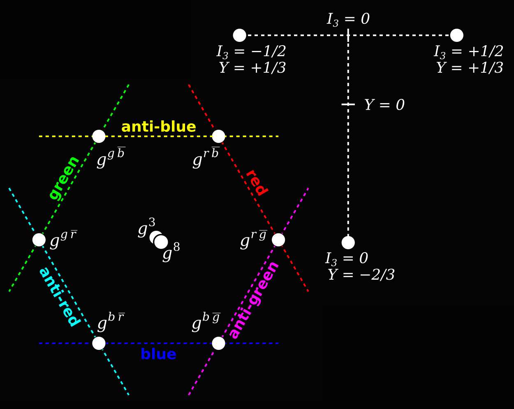

Let's brainstorm the implementation of gluons and color charge.

The chart shows the point potential ingredients that assemble into a proton, which are two up quarks and one down quark. Quarks are fermions with a 2-2-2-6 structure. The 2-2-2 is shown as the nested binaries on the dark grey orbitals. Orbitals are more generally "paths" of point potentials, and also generate wave equations. The inner circular orbits are logarithmically higher energy, faster orbital speed, and smaller orbital radius. The 2-2-2 is also a tri-binary structure, which is termed the Noether core, after Emmy Noether, because the tri-binary is an amazing transaction accumulator, and accountant. The outer six personality charges in each quark are at lower energy that are coupled in the polar regions of each of the three binaries. Those six locations are a point potential assembly dual of Lagrange points in gravitation.

How do assemblies with three quarks take on a grander structural pattern of orbits in the proton? We know that scientists model nucleons with gluons and color charge. Are the gluons the Noether core binaries themselves? Might the gluons go into some kind of a dance where they are exchanged between Noether cores? Scientists observe flux tubes. Perhaps gluons represent the coupling between two separate binaries.

> _Color charge is a property of quarks and gluons that is related to the particles' strong interactions in the theory of quantum chromodynamics (QCD)._ _The term color and the labels red, green, and blue are for distinction only, and imply no implementation._
> 
> _Some structures have corresponding anti-structures. A structure with red, green, or blue charge has a corresponding _anti-structure_ in which the color charge must be the anticolor of red, green, and blue, i.e., __antired, antigreen, and antiblue__, for the color charge to be conserved in _structure_:_anti-structure_ creation and annihilation. All three colors mixed together, or any color and its complement has a net color charge of zero._
> 
> _The strong interaction requires color confinement, free structures must net zero color charge_  
> \- _a baryon is composed of three quarks, which must be one each of red, green, and blue_.  
> \- _an antibaryon is made of three antiquarks, one each of antired, antigreen, and antiblue._  
> _\- A meson is made from one quark of any color and one antiquark with matching anticolor._
> 
> Wikipedia - edited for clarity, including 'particle' changed to 'structure'

_Aside : I think the _'color charge' metaphor_ should be replaced in the point potential era. We need a term that is descriptive of the actual implementation. Paradigm shifts are good opportunities to reset the terminology._

Ok, so what clues do we have about the implementation? The pro and anti might map to the pro and anti of the Noether cores which is basically the precession orientation of the three angular momentum vectors.

<figure>

<figcaption>

Are strong and weak related? https://news.fnal.gov/2015/06/the-strong-weak-force/

</figcaption>

</figure>

One thing I have found is that there are so many mini AdS-CFT like correspondences. That is why the symmetries of nature are driving everyone mad. Because you can find elements of the truth in a zillion transformations that each themselves have some duality to the truth.

  
When I say that modern physics and cosmology are a patchwork quilt of effective theories I am really trying to express this idea that all the partially successful theories have some _scale x dimension_ region that is effective in its domain and also has a transformation to the natural truth.

Are strong force and weak force related? Yes, but it's complicated. I think the personality layer is also the weak point potential layer and I think these six weak point potentials in each fermion execute a path that is somehow related to the six polar regions of the three binaries in the core.  
So that is going to be a complex dynamical relationship and at this point I have no clue how the behaviors would map. What are the patterns that link weak and strong forces?

> _Well, for one, the symmetries of one are a subgroup of the symmetries of the other. Weak symmetries are represented by SU(2). Strong symmetries are represented by SU(3)_
> 
> Interlocutor

The tri-binary Noether core maps to SU(3). The weak personality layer maps to SU(2). I think that the three binaries in a Noether core are incredibly good at trading energy between each other to reach a harmony in frequencies. Perhaps f, f\*sqrt(f), f2 or something sensible that results in an optimal superposition. These harmonic tri-binaries emit complex local electric potential Dirac sphere streams. Point potential velocity can exceed the electric potential field speed @. There are many dynamics in a local charged N-body problem with electric potential speed @.

_Aside : It's easiest to think in terms of units of Planck time, but with everything moving about continuously. Field speed is one Planck length per Planck time. If you visualize in these units, point potentials move in slow motion and it's a lot easier to figure out what is going on. Pedagogically, developing the ability to zoom in and out over some 60 orders of magnitude in distance and time is extremely helpful when it comes to understanding nature._

Consider each binary in a Noether core separately and the two personality potentials associated with each polar region of the orbital axis. That is a set of four point potentials. Color charge may describe the pattern of which generation binary gets which personality duo. This plays a big role in the neutron and proton which have three Noether cores and therefore nine binaries that each generate two potential vortices. How do the "gluons" couple and change color charge between the Noether cores of the quarks? What is the provenance of the specific electrinos and positrinos that are changing position in the architecture? How much energy are they transporting and transferring at every step of this journey?

Each binary implements a potential vortex in its north and south poles. If binaries are gluons, then they would surely like to couple poles together. But we have the lower energy personality potentials flying some path around those poles as well. Since an up quark is modeled with 5 positive personality potentials and one negative personality potential then color could be determined by which of the three binaries gets the plus and minus combo. A similar chart could be made for down quarks.

Potentials is swirling local to a binary axis. The peak magnitude of these potentials is falling off at least at 1/r2, although I've seen examples with binaries that yield 1/rn with I think n = 3 and 5. That was in a Prof. Carlson (https://www.youtube.com/c/ProfCarlson) episode. Perhaps more important is the frequency at which the two polar axial potential vortices are churning. Does any of this map to what we see in QED, QCD, or QFT?

If the polar conjecture is on the right track, then instead of the personality layer as a distributed layer of six low energy potentials at some much larger radius band, perhaps it would be better to think of each binary supporting two lower energy potentials, one per polar potential vortex.

Let's imagine the assembly theory progression.

1. Binary

3. Binary capture of lower energy personality duo in polar vortices.
    1. electrino : electrino (-e/3)
    
    3. electrino : positrino (0)
    
    5. positrino : electrino (0)
    
    7. positrino : positrino (+e/3)

5. Binary Nesting — Noether cores
    1. 1, 2, and 3 level nests correspond to fermion generation III, II, I.
    
    3. The precession orientation of the angular momentum vectors determines pro and anti Noether cores.

7. Noether core assemblies
    1. Photon : a pair of contra-rotating coaxial planar tri-binaries.
    
    3. Neutrino : wobbly low energy photon with oscillating shielding.
    
    5. Electron : a Noether core with six electrino personality potentials.
    
    7. Proton, Neutron : three quark assemblies, nine binaries dancing.
    
    9. Spacetime aether assemblies (Higgs, dark matter, dark energy)
    
    11. Z and W boson assemblies

Note: The dynamical geometries of point potential assemblies follows from the pure dynamical geometry of point potentials. Assemblies are emergent.

**_J Mark Morris : Boston : Massachusetts_**
