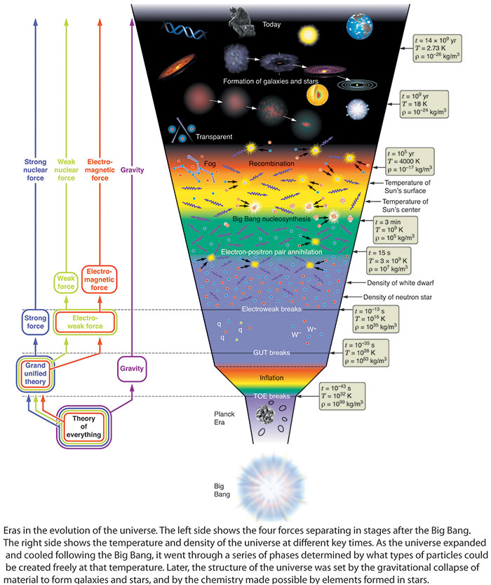

Let’s remap the Big Bang cosmology timeline to the point charge universe!

<figure>

<figcaption>

Chegg.com

</figcaption>

</figure>

In the first post of the chronology of the universe we covered the transformation of the Planck epoch from Big Bang cosmology to point charge cosmology : [Planck Epoch : Peak Density of Energetic Point Charges](https://johnmarkmorris.com/2023/04/22/planck-epoch-peak-density-of-energetic-point-charges/). In terms of forces, gravity had emerged and separated from the electro-nuclear force at the end of the Planck era which was about 10−43 seconds after the event formerly called the Big Bang. Now let's look at the Grand Unification epoch.

| Big Bang Cosmology | NPQG Cosmology |
| --- | --- |
| A Grand Unified Theory (GUT) is a model in which, at high energies, the three gauge interactions of the Standard Model comprising the electromagnetic, weak, and strong forces are merged into a single force. Although this unified force has not been directly observed, many GUT models theorize its existence. | First, the four interactions are not fundamental. They are each behaviours of point charge assemblies. For the three mentioned as unified that implies that during this dense high energy epoch, binaries are intact because if binaries had decayed, they would exhibit electromagnetism. Furthermore, binary decay is required to free up individual point charges to become personality charges weakly bonded to Noether cores. |
| The grand unification epoch was the period in the evolution of the **_early_** **_universe_** following the Planck epoch, starting at about 10−43 seconds after **the Big Bang**. | In NPQG the universe is quasi-steady state and unlimited in time and spatial dimensions. Furthermore, we understand the high energy recycling process in the universe occurs in parallel and distributed in time and is facilitated by supermassive black holes. Terms such as "early universe" are replaced with the redshift of the observations which we can use to estimate when the observed photons were emitted. |
| If the grand unification energy is taken to be 1015 GeV, this corresponds to temperatures higher than 1027 K. | Presumably these estimates of energy and temperature have a good scientific basis. However, if nested binaries have formed then we must account for apparent energy and shielded energy. Also, we will need to determine exactly how to define the temperature calculation in terms of point charges or assemblies. In particular, it is clear that at later stages of the cosmology timeline that the kinetic energy of shielded binaries is not included in temperature. |
| During the grand unification epoch, physical characteristics such as mass, charge, flavour and colour charge were meaningless. | Binaries are neutral, and this explains why charge has not yet emerged. Mass is an interaction between standard model particle assemblies and Higgs aether assemblies. During this epoch, the stealthy Higgs aether is presumably escaping. Thus, the dynamics of spacetime and mass have not yet settled. Flavour and color charge do not emerge until some binaries are able to decay and weak personality charges bond. |
| The grand unification epoch ends at approximately 10−36 seconds. | The timeline here refers to the process which started at the moment energetic point charges escape the Planck core. |
| Parallel inflation epoch. | Meanwhile, in a parallel process all Noether cores are inflating in size as they are exposed to space containing less dense energetic point charges and are able to spread out and dissipate energy to lower energy assemblies. |

Meanwhile, in a process parallel to the grand unification epoch, the spacetime which emerged in the Planck epoch is inflating. We'll cover that in the next post in this series : [Inflationary Epoch : Noether Cores Form](https://johnmarkmorris.com/2023/04/23/inflationary-epoch-noether-cores-form/).

**_J Mark Morris : Boston : Massachusetts_**
