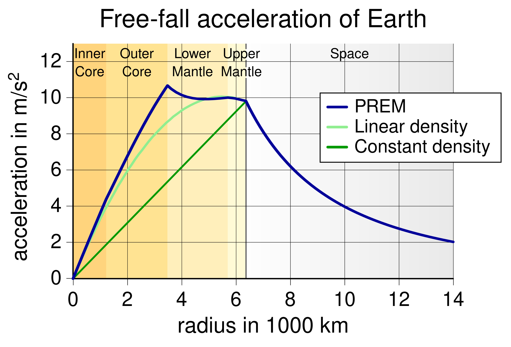

The æther that implements spacetime contains energy. In deep space, the temperature of outer spacetime æther averages 2.7 degrees Kelvin. In the proximity of matter-energy, the energy of spacetime æther increases due to a wave interaction with matter-energy. What we call the 'mass' of a particle (or collection of particles) is related to the energy contained in the particle shell. As the electrinos and neutrinos in the particle shell move on paths determined by their wave equation, they interact with other nearby particle shells (mostly spacetime æther particles); even though no discrete energy is transferred, the ebb and flow of energy in each shell raises its average energy. As particle shells gain energy their electrinos and positrinos move faster and the radius of the shell decreases according the the Lorentz equation. This is how the curviness of spacetime is implemented and is also a factor in gravity.

Starting from the 2.7K temperature of spacetime æther in deep space, as we approach an object such as a planet, the temperature of spacetime æther will increase as we approach the center of the planet. If we were to graph the temperature and measure the degree of incline, the slope would indicate the strength of gravity at any location in or around the planet. Interestingly, close to the center of the planet, the curve would flatten. At the very center, the curve would be flat (zero slope) and there would be no net gravity, even though the temperature of the spacetime æther would be higher here than at the surface of the planet.

The graph shows the strength of gravity, i.e., the **_slope_** of spacetime temperature, as a function of radius from the Earth's center. Several models are shown that depict various mass density profiles for earth. The simplest model is constant density, as if the composite of Earth was the same throughout- which it isn't. The most sophisticated is the PREM model, which takes into account the changing composition of particles in the Earth from the mantle to the molten inner core of IRON-56.

<figure>

<figcaption>

Wikipedia

</figcaption>

</figure>

From the PREM model chart of Earth's gravity, we can estimate the shape of the spacetime æther temperature curve from the center of Earth outwards. We don't know the actual values of the spacetime æther temperature, except in deep space where the black body temperature of spacetime is 2.7 Kelvin.

Planets with more mass would have a higher spacetime æther temperature curve, but would still round off at the center. Objects with even more mass would have even higher core temperatures: small stars, large stars, neutron stars, black holes, and supermassive black holes, for instance.

| Celestial Object | Core Composition | Core Temperature   (Kelvin) |
| --- | --- | --- |
| Moon | Solid iron and nickel | 1,377 |
| Earth | Solid iron and nickel | 6,273 |
| Jupiter |  | 36,000 |
| 0.1 Solar Mass Star |  | 5 Million |
| Our Sun | ion/electron plasma | 15.7 Million |
| Young Neutron Star |  | 0.1 - 1 Trillion |
| SMBH with a Planck Core | Pure Planck Particles | Planck Temperature |

At some point the temperature of the gas is so high that photons cannot escape from inside that radius. We call such an object a black hole. As we consider black holes of larger and larger density, eventually the peak spacetime æther temperature will reach the Planck temperature, which is the limit of nature. An object that is so dense that a Planck core forms is special because the Planck particles within the core cannot transmit or receive gravitational energy, since they are at the maximum temperature possible, as are their neighbors. In common parlance, the interior of a Planck core presents no mass, even though it is the highest possible energy state of matter.

_**J Mark Morris : San Diego : California : January 26, 2020 : v1**_
