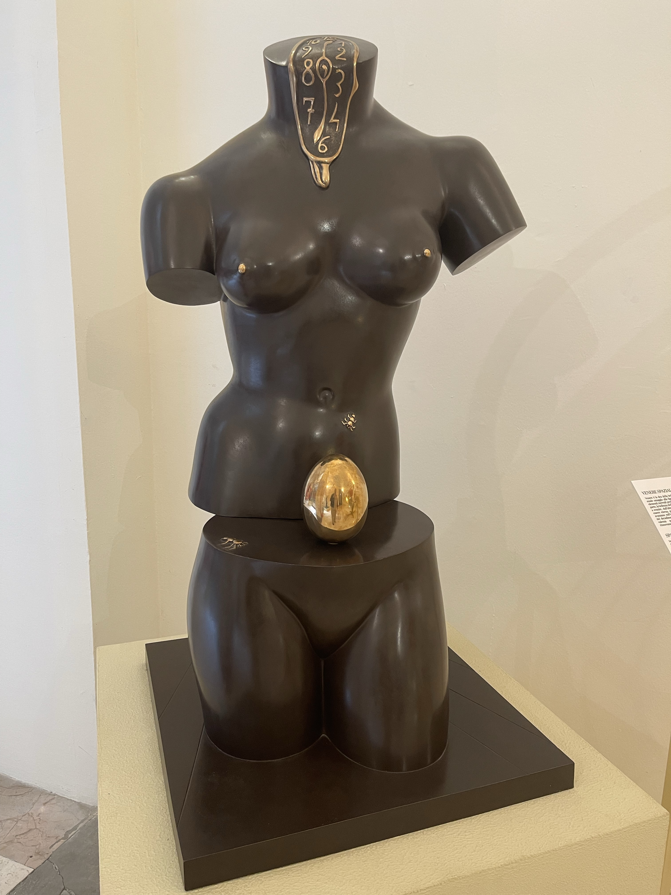
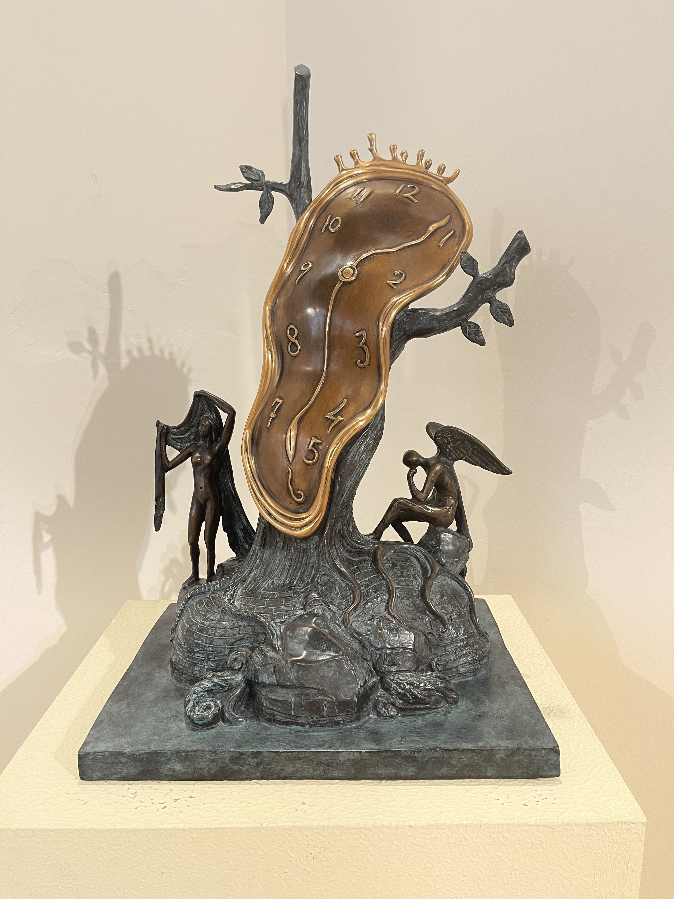
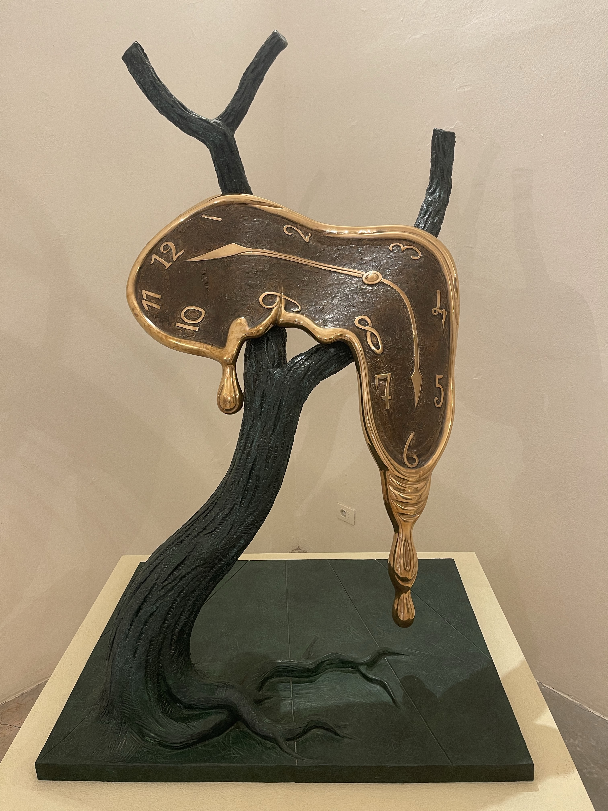

One of the more popular topics in popular science video and article outreach is the mysterious concept of time. It turns out, like everything else in the universe, the explanation is quite straightforward and conceptually simple. Let’s talk about time as it is manifested in nature.

> **Level Zero Time**

At the most fundamental level in Euclidean time and space we have absolute time, which is an abstract concept. It moves forward only and progresses linearly and continuously. Absolute time marches onward at a constant pace throughout the entire universe. In a sense, absolute time is a mathematical or geometrical concept. There are no clocks that directly measure absolute time. There are no natural units of absolute time. However, once we move up to the point charge assembly levels of nature we can build clocks that assign units of duration and measure those durations and the accumulated expiry of absolute time. Absolute time has no known beginning nor no known projected end.

> **Level One Time**

Next we have the unit potentials, the minus and plus Dirac delta potentials, aka elementary point charges, aka the electrino and positrino. These point charges have two relationships with absolute time. First, each point charge is moving along a path through absolute time and space. Thus their instantaneous velocity is related to absolute time, because that velocity combined with action from incoming potential fields determines the direction in space the point charge will move as time progresses. The path is continuously adjusted as the point charge encounters Dirac sphere potentials emitted by other point charges and sometimes by themselves.

This brings us to the Dirac sphere potentials emitted by point charges. These are emitted continuously at each time and space location along the path of each point charge. Once emitted, the radius of these Dirac sphere potentials expands at a certain speed, which we designate with the symbol @. Thus the radius of each Dirac sphere potential is given by r = @t where t in this case is the absolute time since emission. Dirac sphere potentials continue to expand forever with a magnitude given by q/r, which means that at large distances and times they are extremely tiny, but real. The magnitude of each unit potential |q| = |e/6|.

Point charges have these two relationships with absolute time, one by nature of their path, and one by nature of the Dirac spheres emitted along their path.

> **Level Two Time**

As we enter the realm of assemblies of point charges, we start with assembly number 1 which is the point charge binary. This is a negative unit potential bonded with a positive unit potential, i.e., an electrino and a positrino, chasing each other around in an orbit. Unperturbed by other point charges, and with zero absolute assembly velocity, this orbit would be strictly circular. However in the real world which is permeated by point charges in various assemblies as well as the assembly layers built upon the point charge binary, these all influence the path of the point charges. To be sure, the forces are so large for the highest energy binaries that it would take a lot of energy to make a deviation from the relative circular path, but all point charges are interacting with each other and themselves, so we only imagine that the binary is traveling a circular orbit. On top of that, we can consider the velocity of the assembly itself, which means that paths are really spirals through absolute continuous Euclidean time and space.

Each loop of the orbit, or circuit of the wave equation, is one tick of a natural clock. The behaviour of point charge binaries and nested point charge binaries, and their personality charges are thus described with many frequencies and more specifically wave equations. Frequency is another way to measure time. In assemblies there are a variety of clocks which we might consider as indicators of the progress of time.

> What is Time?

Where do we go from here? Which of these measures of time is most closely related to how we perceive time as intelligent beings or as scientists perceive time in experimental observations? Einstein’s general relativity describes time as a measure that is fluid and changes with energy. This would appear to map to the point charge binaries that comprise a Noether core. Which binary? Does it matter? If the binaries self-synchronize, then even if they have different frequencies, in a sense they are each a related measure of time.

Our sense of time is based upon all the standard model particle assemblies in and around our mind and body, including the protons, neutrons, and electrons, the aether that permeates us, and the photons we sense. The net effect is a perception of causality that proceeds forward in time. I’ll have to leave it there for scientists to further refine based upon nature’s implementation of time at the foundation of the void, unit potentials, and their assemblies.

**_J Mark Morris : Tuscany : Italy_**

p.s. While writing this post I was on vacation in Italy and happened upon an exhibit of Salvador Dali’s art hosted in the building where Galileo Galilei was held for heresy in cosmology. The juxtaposition of Dali’s vision of fluid time and the purported heresy of Galileo, for stating that the Earth orbited the Sun, was quite amusing, given my discoveries. Here are some pictures I took.

