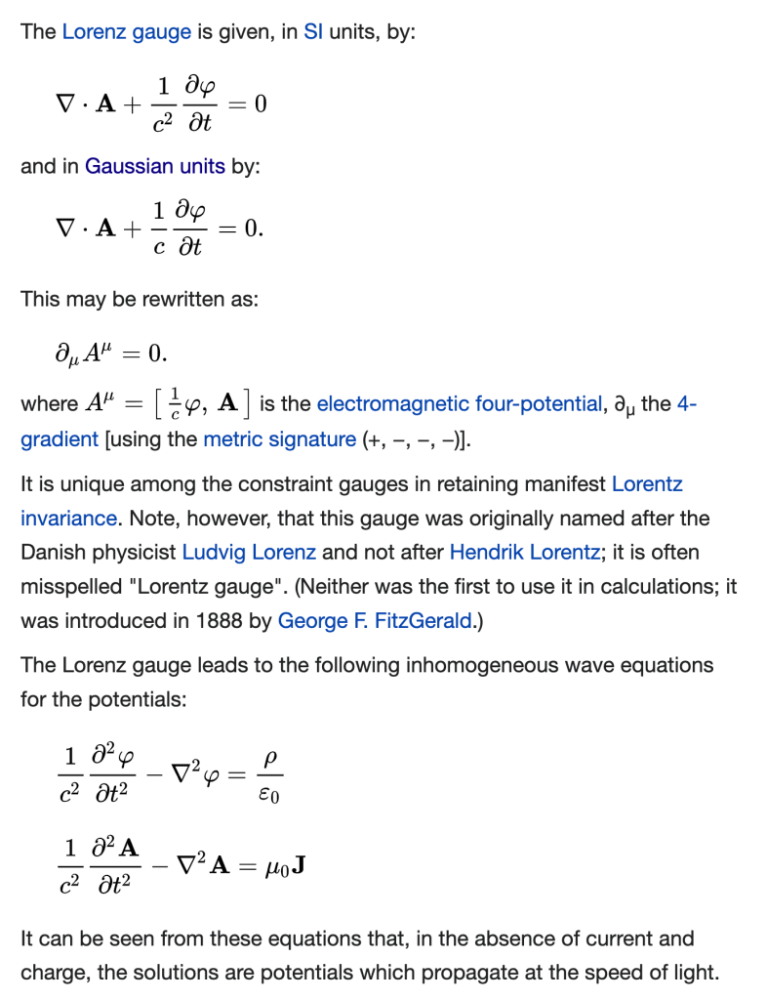

**PURPOSE**

The purpose of the point potential model of nature is to facilitate _thinking and experiments_ based on the assumptions of a parsimonious physical universe consisting of a Euclidean time and space and energetic point potentials. These thought experiments lead to new insights about nature.

PHYSICAL ENTITIES

- Background of the universe: 1D linear forward moving time and 3D Euclidean space.

- Electrino and positrino point potentials. Conserved.

- Energy: Only carried by point potentials. Conserved.

DIMENSIONS (7)

- Absolute 3D Euclidean space

- Absolute 1D linear forward moving time

- Energy : potential and kinetic

- Point potential : magnitude of +|e/6| or -|e/6|

CONSERVATION

- Electrino and positrino point potentials

- Energy

- Linear momentum

PHYSICS

- Point potentials are constant rate potential emitters.

- Potential emissions expand spherically from the point of emission.

- Action occurs when a potential sphere intersects a point potential.

EMERGENT ASSEMBLIES AND BEHAVIOURS

- The point potential binary: an electrino and a positrino orbiting each other.

- General relativity and gravity do not apply to a black hole core of point charges at Planck energy.

- A Planck scale plasma of point charges may emit via jet or rupture from high energy objects and events. (e.g., Active galactic nuclei (AGN) of a supermassive black hole (SMBH))

- The gradient of æther energy density is the strength of the gravitational field.

- From an æther perspective the speed of light is constant. (Map 2, Riemannian)

- From the perspective of Euclidean Map 1 the local speed of light varies based on æther energy and gradient.

- Redshift: gravitational, doppler, cosmological (galaxy local expansion), inflationary

- Gauge invariance via Lorentz factor

- Four forces (gravitational, weak, electromagnetic, strong).

**Hypotheses**

- Recycling of standard matter (including spacetime æther) through high energy objects or events. In particular, active galactic nuclei (AGN) supermassive black holes (SMBH), Planck scale point potential core, and emission of high total energy spacetime assemblies via jet or radial. _\[dark matter, galaxy rotation curves, inflation, expansion\]_

- Instead of a cosmic inflation and a one-time big bang we model intermittent, independent, distributed, parallel and ongoing galaxy local spacetime emission from black holes and galaxy local inflation. _\[universe age, Hubble, expansion, flatness\]_

- Map 1 Euclidean variable speed of light and refraction given by local permittivity and permeability as a function of the local energy density of spacetime æther. _\[gravitational lensing\]_

_**J Mark Morris : San Diego : California**_
