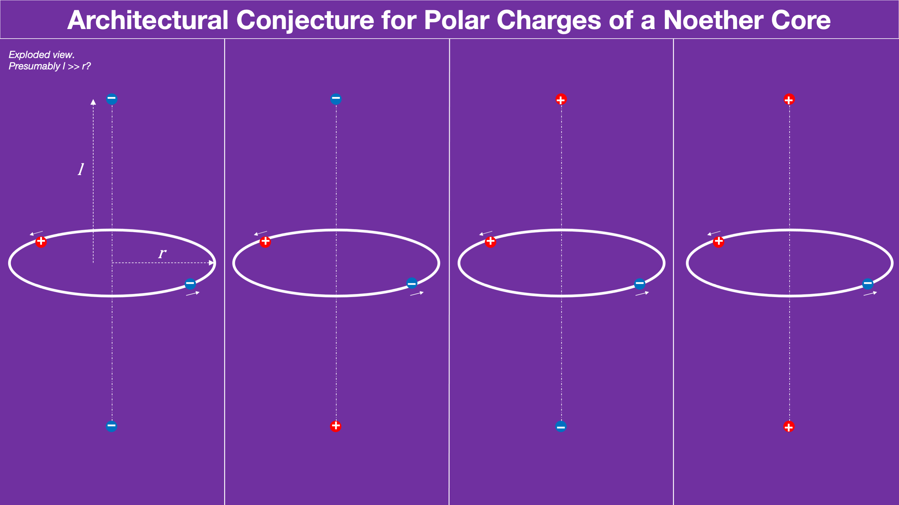

This is a brainstorming session foreshadowed in my recent post [Assembling a Theory](https://johnmarkmorris.com/2022/06/07/assembling-a-theory/) I'll reference outreach material on the weak nuclear force and attempt to apply the latest advancement in the NPQG understanding of nature. I've long associated the personality charges with the weak force, but I had an amorphous complex path equation in mind for each charge. Lately, ideas have crystallized around a conjecture of a personality charge in each pole of each binary in the Noether core. This then leads to a set of conjectures about how certain functions operate, such as energy transfer, temperature, and color charge. _If you click on any of the images in this gallery you should see a large readable version._

This is a pattern and code matching exercise. The goal is to continually improve the mapping between NPQG and the Standard Model. Eventually there should be a map that provides the implementation for all observations supporting the Standard Model and an explanation for any errors in theory or narrative.

We now know the root false error is in **not** considering q = |e/6| and velocity greater than field speed in Jefimenko's equations and the Lienard-Wiechert potentials. This root has grown into a tree of false priors that permeates physics and cosmology. On the bright side, I've found what appears to be a completely unexplored territory of dynamical geometry.

> _In the weak interaction, fermions can exchange three types of force carriers, namely W+, W−, and Z bosons. The masses of these bosons are far greater than the mass of a proton or neutron, which is consistent with the short range of the weak force. In fact, the force is termed weak because its field strength over any set distance is typically several orders of magnitude less than that of the electromagnetic force, which itself is further orders of magnitude less than the strong nuclear force._
> 
> Wikipedia

Ok, so we have a good mapping at this point. Only fermions exchange force carriers via the weak force. Since everything is Noether core based, and only fermions have personality charges, it makes sense that personality charges are related to the weak force.

I wonder if the W and Z boson's are a product of a reaction between the personality charges and the Noether cores comprising the aether? Where else would all those point charges in each boson come from in terms of provenance? Remember that aether has extremely low apparent energy but is also shielding the high energy of the inner binaries via a fluctuating superposition based on binary frequencies. There is plenty of shielded energy in the reactant assemblies. Apparently, some of that shielded energy becomes observably massy during the weak interaction. This all makes eminent sense to me now.

> _The weak force is the only force aware of the spin of the particles involved and whether they are matter or anti-matter._
> 
> Dr. Don Lincoln

The NPQG decoding of matter vs. antimatter relates to the orientation of the three binary angular momentum vectors. Since they have different magnitudes, if we were to position ourselves in the octant where all three are positive and virtually look towards the origin, we would see them either as 1-2-3 or 1-3-2 which are two distinct configurations. One of them is matter and the other is anti-matter. The personality charges are also opposite in anti-matter.

Now we can define spin by the direction of rotation of the Noether core angular momentum vectors in the positive octant, i.e., the 1-2-3 vs. 1-3-2 orientations.

> _The spin axis has to be parallel or anti-parallel to the direction of motion._
> 
> Dr. Don Lincoln

Ok, this gets really interesting. I've written about how velocity is related to the tilt of the tri-binary orbital planes. I wonder if this may be related to the concept of momentum itself. Referring to Dr. Don's point, it would seem that the octant where all three angular momentum vectors are positive must either be leading the way or trailing like a shuttlecock. It wouldn't make sense for the lead octant to be the negative of all three angular momentum vectors (the shuttlecock) or to be in any of the other six positions. This is equivalent to saying there is only one positive octant and it is always oriented the same way relative to motion.

> _The weak interaction is the only fundamental interaction that breaks parity-symmetry, and similarly, but far more rarely, the only interaction to break charge parity symmetry._
> 
> Wikipedia

> _In quantum mechanics, a parity transformation (also called parity inversion) is the flip in the sign of one spatial coordinate. In three dimensions, it can also refer to the simultaneous flip in the sign of all three spatial coordinates (a point reflection_
> 
> Wikipedia - Parity

> _Quarks, which make up composite particles like neutrons and protons, come in six "flavours" – up, down, strange, charm, top and bottom – which give those composite particles their properties. The weak interaction is unique in that it allows quarks to swap their flavour for another. The swapping of those properties is mediated by the force carrier bosons._
> 
> Wikipedia

> _During beta minus decay, a down quark within a neutron is changed into an up quark, thus converting the neutron to a proton and resulting in the emission of an electron and an electron antineutrino. Another important example of a phenomenon involving the weak interaction is the fusion of hydrogen into helium that powers the Sun's thermonuclear process._
> 
> _Most fermions decay by a weak interaction over time. Such decay makes radiocarbon dating possible, as carbon-14 decays through the weak interaction to nitrogen-14._
> 
> Wikipedia

I like to imagine the operation of standard matter particles in terms of their constituent unit potentials. The up and down quarks have an asymmetric charge distribution, which can be distributed in three ways to the Noether core binaries, suggesting color charge. However, since the electron has six electrino personality charges there is no differentiation between the personality charges assigned to each binary, and therefore no color charge. The neutrino will also have no color charge, but it will be interesting to examine the left and right handed symmetries as compared to experimental observation (or lack thereof). Let's first take a detailed look at a brainstorm decoding of the fermions. _Click on the images to enlarge._

Examine the decoding of the electron and positron. Note that the symmetries of this architecture result in only one color regardless of point charge provenance. Since unit potential point charges are immutable each one has a path P through time and space and we could track them individually with a simulation model regardless the energy level.

I need to take more time with the neutrino decoding. I think there is a lot of insight there. You see, I think the neutrino is a clue to the continuum between Fermi-Dirac and Bose-Einstein behaviour. The neutrino reveals how energy is shielded via superposition because its mass fluctuates due to the interlacing of the orbital planes. Standard matter orbital planes are quite distinct at low absolute velocity. However, as work performed increases their velocity, the standard matter orbital planes converge to planes orthogonal to the direction of motion, as in the photon which is a contra-rotating coaxial nested tri-binary.

What exactly is happening in a neutrino? Many reactions emit photons and neutrinos. Are neutrinos both a precursor to photons as well as their redshift destiny? Can symmetry explain the architectural convergence that matches observations? Is it possible that emergence and survival play a role, where say contra-rotating tri binaries are more stable than say six point charges orbiting in the same direction?

If I am correct that as the Noether core becomes planar it destabilizes the right hand neutrinos and left handed anti-neutrinos, then we are left with the following diagram.

This was a brainstorm post. I am feeling pretty good about the mapping of personality charges to the polar regions of each binary. It seems as if the diversity that emerges from the symmetries matches up extremely well with the standard matter particles in terms of pro/anti, left/right spin, quark colors and the lack of color for the electron and neutrino, as well as the fermion generations. I may not have the map exactly correct at this point, but I think I have taken a major step forward.

**_J Mark Morris : Boston : Massachusetts_**
