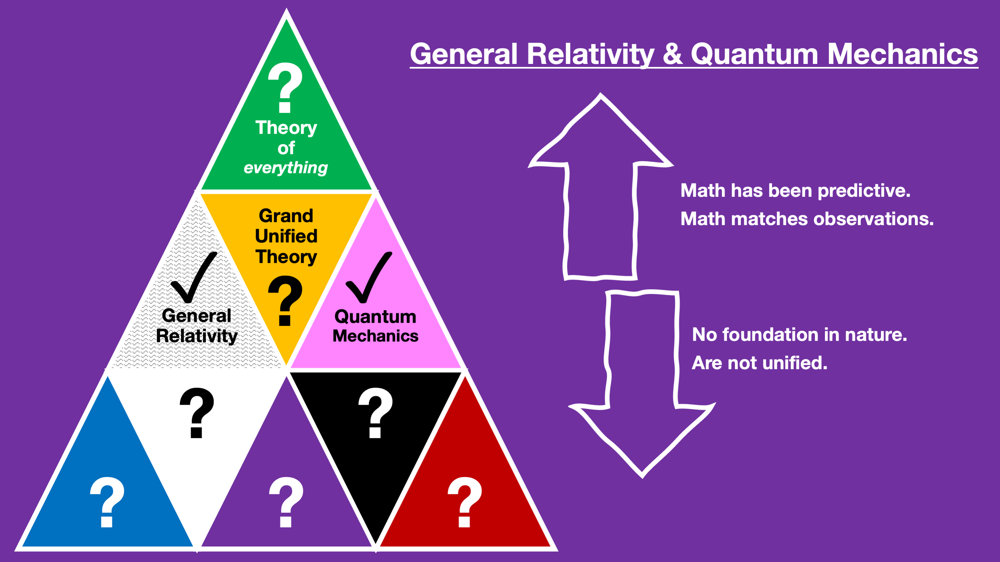
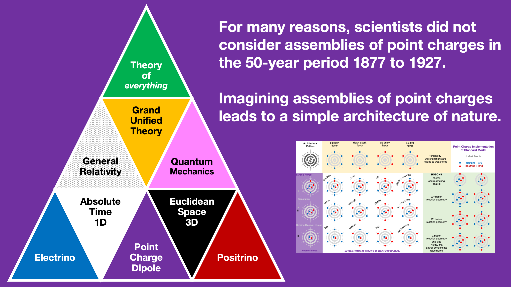

I'm convinced that physicists missed a golden opportunity circa 1895-1927 to imagine the foundation of nature. If you think about it, you will be able to imagine dozens or thousands of unique point charge systems that could be the basis of our universe. You could imagine any point charge magnitude or a combination of magnitudes. You could imagine all sorts of potential emissions and how they disperse and how action occurs. You could dream up various speed limits for the potential emission wave as well as speed limits for the point charges themselves. You could dream up all kinds of geometric space and time formulations in which the point charges reside.

Now consider this: The classical to quantum transition occurred with consideration of one and only one point charge system and here it is: A Euclidean void in time and space (correct), point charge magnitude of |e| (wrong), point charge speed limit of c (wrong), and point charge emission speed of c (almost correct).

It turns out nature can be easily modeled with a point charge system specified as: A Euclidean void in time and space, point charge magnitude of |e/6|, no fundamental point charge speed limit, and point charge emission speed of @, where @ is just slightly greater than the maximum speed of photons.

With these basic building blocks, everything is an assembly, all the particles in the standard model are assemblies of point charges, often using the same sub-assembly architecture. Not only that, but Einstein's spacetime is similar to a gas filling a Euclidean void in time and space. The point charges forming the spacetime assemblies are so nearly perfectly shielded that we only see the effects of Einstein's theory of gravity. Well, actually we see far more, but we don't realize it yet, for example in pair production and annihilation spacetime assemblies are the broker.

I have explored this model for 5.5 years now and keep finding more and detailed mappings to GR and QM. Of course, any new theory must map to GR and QM, since they match observations so well. But GR and QM also have an incredible number of outstanding questions and confusion and are often said to be in crisis. It turns out the root cause of this mess is the failure of imagination 1895-1927 that resulted in physics and cosmology taking a wrong turn into a patchwork of effective theory with a confused ontology and many incorrect narratives.

I've recently begun an experimentation phase with simulation. For Experiment 1 Phase 1 the idea is to simulate point charge scenarios with equations that have some similarities to electromechanical laws, but which are not correct by any means. I wanted to see if assemblies would form under these conditions. The simulation starts with an equal number of positive and negative point charges at random positions within a rectangle in a 2D plane and a random velocity. Then it evolves their positions and velocities each frame.

https://videopress.com/v/dxduniop?resizeToParent=true&cover=true&loop=true&posterUrl=https%3A%2F%2Fvideos.files.wordpress.com%2Fdxduniop%2Femergence14a\_mp4\_std.original.jpg&preloadContent=metadata&useAverageColor=true

I had a hunch that even with rando formulas that assemblies would form. Sure enough orbiting binaries form. You can press space-bar to pause in Quicktime, then advance frame by frame with the arrow keys. Red lines are the + to + relationships. Blue are - to -. Those both repel. Purple is the + to - or - to + which are symmetric and which both attract. There is even a meta-stable super assembly that forms for a while before it destabilizes and forms something else. We also see reactions between orbiting point charge pairs that cause changes in orbital direction, and sometimes exchange of point charges. You can see this if you go frame by frame around an interesting segment. These are not proper physics formulas, but you can already start to see how nature works with point charges.

I've done hundreds of these simulations now. In all cases I've seen the point charges make a supra-assembly or cluster of assemblies that are of a limited size and net low net velocity. The code has guard rails so if any point charges touch the edges it lights up purple. This is because I wanted to capture the entire behaviour of the collection. The simulation is primitive and doesn't account for full path history of each point charge. One of the enhancements is to store the path history per time step dt. This is a dynamical geometry in absolute time and absolute 3D space, which we can model with R4. The metric signature is not (+, −, −, −), but rather + = + + +. In absolute time and space x^2 + y^2 +z^2 = (point charge emission speed)\*t^2.

I would like to augment this with the ability to show tracers of each point charges emissions. Also it would be really interesting to show the point charge tracks through 2D space. One can leverage these 2D simulations to imagine what would happen in 3D time and space. Essentially, in synchronization throughout absolute time, every point charge in the universe would experience action from the incoming potential(s) from all other point charges in the universe, including in some cases, themselves. The net action influences each point charges future path and with it the moving origin of all future potential spheres. This is happening in real continuous time. Every continuous path of each point charge has an associated potential sphere stream that each point charge emitted along its path.

One of the beautiful things about the point charge architecture of nature is its dynamical geometry. You can reason causally because we are dealing with absolute time. Einstein's curvy spacetime happens to be the medium permeating GR/QM/LCDM era science. Those scientists need to think outside of their curvy-stretchy box!

As the simulation code evolves, I expect that the experimental results will eventually show formation of the standard model particles and spacetime as well as all the reactions known to particle physics.

My plan is to make videos where I go through these simulations in real time, slow-motion, and frame-by-frame with my observations regarding what is happening. The emergence is fascinating to me. Provenance of point charges is amazing! Reactions are awesome! Nature is fun!!!

**_J Mark Morris : Lynn : Massachusetts_**
