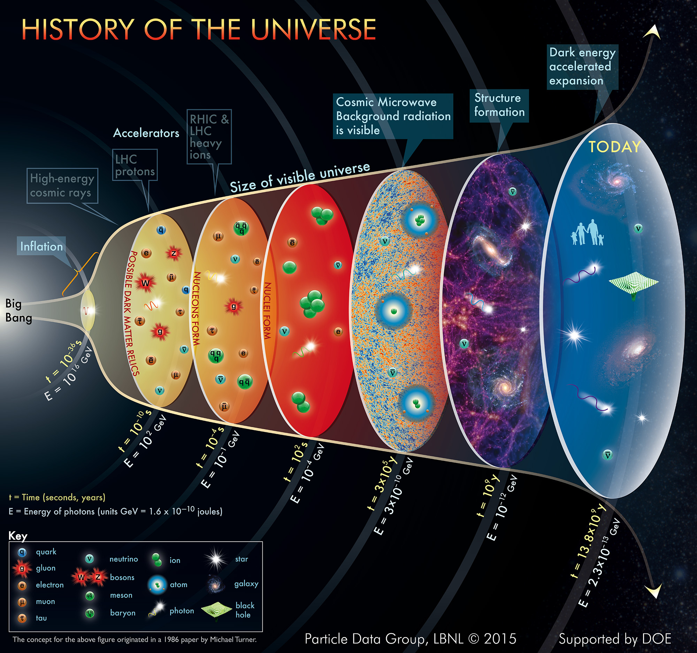

Let’s remap the Big Bang cosmology timeline to the point potential universe! The inflation phase of the timeline is shown in the figure. Inflation follows the Planck epoch and occurs in parallel with the Grand Unification epoch.

- [Planck Epoch : Peak Density of Energetic Point Charges](https://johnmarkmorris.com/2023/04/22/planck-epoch-peak-density-of-energetic-point-charges/)

- [Grand Unification Epoch: Binaries Dominate](https://johnmarkmorris.com/2023/04/23/grand-unification-epoch-binaries-dominate/)

| Big Bang Cosmology | NPQG Cosmology |
| --- | --- |
| Cosmic inflation expands space by a factor of the order of 1026 over a time of the order of 10−36 to 10−32 seconds. | Point potential binaries inflate as energy drops from Planck scale where point charge velocity v = field speed x pi/2. Inflation means that the radius of the binary grows rapidly as energy is dissipated. Inflation is complete when velocity drops to v = field speed (@) which also corresponds to the symmetry breaking point. The inflationary portion of binary behaviour corresponds to a region of behaviour that includes both self action and partner action. At energies lower than the symmetry breaking point there is no self-action and the binary expands slowly as energy is dissipated.      Note: although the literature is a but vague, it seems that the 1026 expansion of space corresponds to around 107 increase in radius of the volume. |
| The universe is supercooled from about 1027 down to 1022 Kelvins. | Temperature is a vague measure of kinetic energy. There are at least two possible ways for the kinetic energy to drop in this epoch.   1\. Binary capture and shielding. Shielded energy is not apparent energy and therefore doesn't factor into the apparent kinetic energy (temperature). The question is what do our scientific observations measure at this stage of recycling? Are they measuring binaries before binary capture occurs, or does the existing science reflect some intermediate state where some binary capture has occurred, but perhaps not completely to the nested tri-binary Noether core state.   2\. High energy (nested) binaries spreading out volumetrically and dissipating energy to other lower energy assemblies. What other assemblies could mix in? Perhaps lesser energy Higgs aether local to the SMBH are the sink for the energy. |
| _One motivation for the theory of inflation is that it allows the entire Universe to be causally connected early on, helping explain why conditions now are the same everywhere in the cosmos. ~\[Adam Frank\]_ | In NPQG cosmology the universe is the same everywhere in both space and time (isotropic) because the black hole driven mini-bang events are driven by the same physics, with the same starting point of incredibly dense energetic point charges. Thus NPQG cosmology does not require causal connection for the universe to be isotropic. |
| _Inflation explains the origin of the large-scale structure of the cosmos. Quantum fluctuations in the microscopic inflationary region, magnified to cosmic size, become the seeds for the growth of structure in the Universe (see galaxy formation and evolution and structure formation). \[Wikipedia\]_ | It seems to me that the idea that quantum fluctuations during inflation is an explanation for large scale galaxy formation is a contrived idea related to the concept of a one time Big Bang event throughout the entire universe. In NPQG the universe is quasi steady state with high energy galactic recycling processes driven by black holes, particularly the SMBH. Therefore we need to look to different ideas to understand structure formation. Clearly the recycling action is regenerative local to the galaxy where it occurs as fresh high energy Higgs spacetime assemblies are formed and high energy processes create particle assemblies of the standard model, which leads to a lot of Hydrogen gas, and new stars. There is also the case where SMBH jets expel new Higgs and standard matter to the terminii of the jets where new satellite galaxies may originate. Furthermore photons and neutrinos carry point potentials and energy to distant locations, contributing energy to deep space, which may spontaneously contribute standard matter particles in certain reactions. Bottom line, there is a lot of new science to be done as a result of changing the Big Bang paradigm. |
| _No physical field has yet been discovered that is responsible for this inflation. However such a field would be scalar and the first relativistic scalar field proven to exist, the Higgs field, was only discovered in 2012–2013 and is still being researched. So it is not seen as problematic that a field responsible for cosmic inflation and the metric expansion of space has not yet been discovered. The proposed field and its quanta (the subatomic particles related to it) have been named the inflaton. If this field did not exist, scientists would have to propose a different explanation for all the observations that strongly suggest a metric expansion of space has occurred, and is still occurring (much more slowly) today._ \[Wikipedia\] | In the point potential universe, fields are understood to be patterns of potential emitted by point charge assemblies that we call particles. It's often a simple mapping, such as saying the "quark assembly generates the quark field." However, there is nuance when we are talking about subassemblies. Thus, what NPQG identifies as an orbiting binary or nested binaries of the Noether core may correspond to the inflaton field. |
| The wikipedia article on cosmological inflation goes into a tremendous number of subjects that are related to inflation. [Inflation (cosmology) - Wikipedia](https://en.wikipedia.org/wiki/Inflation_\(cosmology\)#Theory) | Some of these inflation related topics do not occur in the steady state universe with mini-bangs distributed in time and space (e.g., flatness problem, horizon problem, magnetic monopole problem). Given that point charge theory will allow scientists to model inflation precisely, I'll leave this placeholder here that there are many more inflationary topics that point charge theory illuminates. |

NPQG provides the point potential mechanism that implements inflation and places it in the proper universe context as a behavior of black holes, particularly supermassive ones.

Next : [ElectroWeak Epoch : Personality Charges Bond to Noether Cores](https://johnmarkmorris.com/2023/04/28/electroweak-epoch-personality-charges-bond-to-noether-cores/)

**_J Mark Morris : Boston : Massachusetts_**
