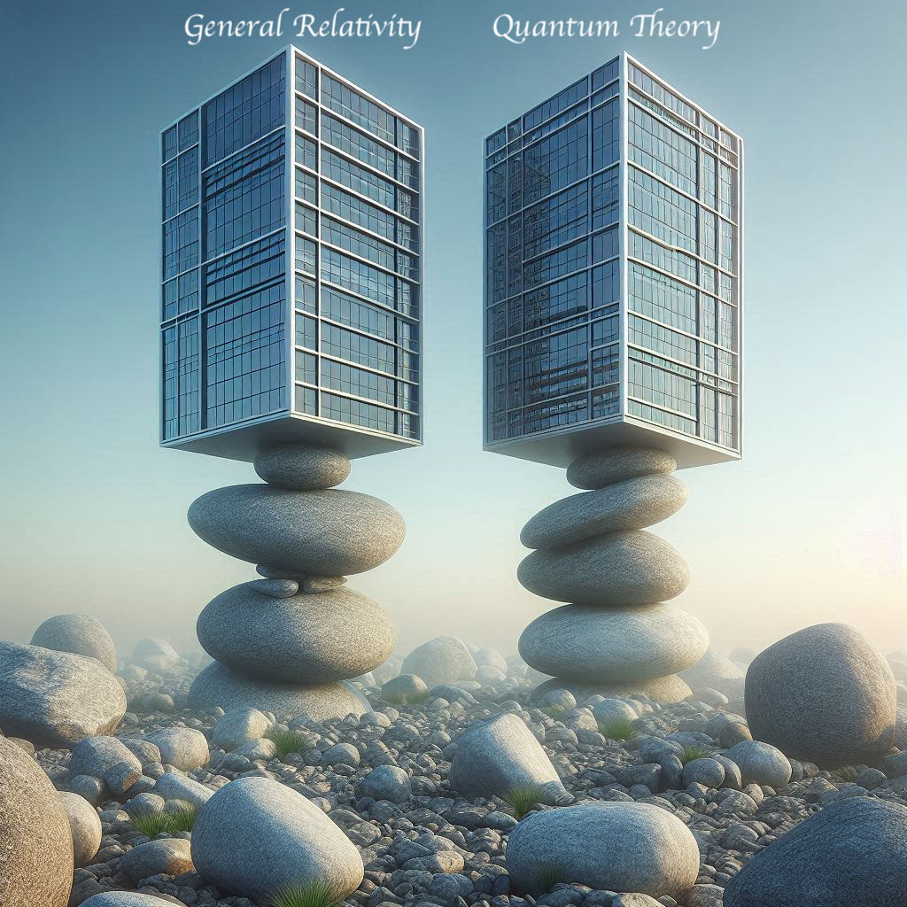

Let's learn and ideate about the theory of information in the point potential universe.

> Information theory and particle physics intersect in fascinating ways, particularly through the concept that information is a fundamental aspect of physical reality.
> 
> ### Key Points:
> 
> - **Information as a Fundamental Entity**: Physicist John Wheeler's phrase "it from bit" suggests that physical reality ("it") fundamentally arises from information ("bit"). This idea posits that information is more fundamental than matter, energy, space, and time.
> 
> - **Quantum Information**: In quantum mechanics, the state of a particle is described by quantum information. This information can be manipulated using quantum information processing techniques. Quantum information theory studies how information is encoded, transmitted, and processed in quantum systems.
> 
> - **Entropy and Information**: Entropy, a measure of disorder, is closely related to information. In thermodynamics, the increase in entropy is associated with the loss of information about the exact state of a system. This concept extends to particle physics, where the behavior of particles can be understood in terms of information theory.
> 
> - **Unifying Theories**: Efforts to unify general relativity (which describes space and time) with quantum mechanics (which describes particles and matter) often use information as a common language. This approach aims to reconcile the two theories by considering information as a fundamental component.
> 
> In summary, information theory provides a framework for understanding the fundamental nature of particles and their interactions, bridging the gap between classical and quantum physics.
> 
> _Copilot_

Let's look at Wheeler's concept first.

> John Archibald Wheeler, a pioneering physicist, coined the phrase “**it from bit**” to express the idea that every element of the physical world fundamentally arises from binary choices, or bits of information. According to Wheeler, reality itself is constructed from these binary decisions—yes/no, true/false, on/off—that we make when observing and interacting with the universe.
> 
> In essence, Wheeler proposed that the universe is fundamentally informational. He suggested that every particle, field of force, and even spacetime itself derives its existence and properties from the answers to binary questions posed by observers. This concept implies that the physical world has an immaterial source and that information is at the core of reality.
> 
> _Copilot_

Wheeler's idea of _"it from bit"_ is **abjectly false** in the point potential universe. There is nothing binary about continuous time, location, and velocity of point potential paths. **Q.E.D.**

* * *

Let's consider quantum information theory.

> Wheeler’s “it from bit” idea has profound implications for our understanding of quantum mechanics and the nature of reality, suggesting that the universe is participatory and that our observations play a crucial role in shaping it.
> 
> _Copilot_

In some sense Wheeler is making an association or mapping between binary information and the quantum. **_Oof_**. Scientists have misunderstood the basis of the "**_quantum_**" for a century — it is simply a behaviour of the primal assembly, the binary. It is a very simple dynamical geometry with a tipping point in energy.

- The ideal binary assembly is characterized by a **_delay_** differential equation.

- Each point potential is responding to _**a point on the path history**_ of its partner.

- Point potentials emit potential at a constant rate in time, i.e., the starting Dirac delta magnitude of each Dirac sphere stream is divided by velocity magnitude.

- An approaching interloping point potential is also in a dynamical relationship with the point potentials in the binary and there can be a transfer of energy to or from the binary.

- Energy transfer in a binary depends on the tipping point, up or down. Here is the up case:
    - The intersecting sphere stream was emitted along a non-radial chord,
    
    - The action at the intersection causes point potential velocity to increase,
    
    - Which causes the instantaneous point potential emission magnitude to drop,
    
    - Which results in the orbital radius decreasing.
    
    - This is a continuous analog mechanism. (_see flip-flop_)
    
    - Feedback between all participating point potentials determines the outcome.

- Depending on the path (t, s, ds/dt) of the interloper, energy can transfer in discrete units that physics calls quanta and assigns h-bar units of angular momentum as the minimum amount of energy transfer.
    - _Aside: It is perplexing that physicists know that the unit of energy transfer is angular momentum, but they never considered the point potential binary. Point charges were incorrectly falsified circa 1900._

- In the ideal context of two individual point potentials, any energy transfer between them is continuous and not quantized.

Hence, the quantum in quantum theory is simply a behaviour of the primal assembly, the point potential binary. Quantum theory is an "effective theory" with no ontological foundation.

* * *

Let's look at information and entropy. Here's the CoPilot description.

> **Entropy and Information**: Entropy, a measure of disorder, is closely related to information. In thermodynamics, the increase in entropy is associated with the loss of information about the exact state of a system. This concept extends to particle physics, where the behavior of particles can be understood in terms of information theory.

There is an odd thing about entropy that will need to be mapped. Imagine an extremely dense black hole core packed with point potential binaries that are interacting. Do they remain intact, or do they decay into individual point potentials? It seems that some binaries would gain energy until they reach the maximum curvature. Other binaries might decay. What is the closest packing of point potentials in an SMBH core? Entropy keeps rising as orbital or vibrational frequency increases until there is a quenching at some layer in the core. The core achieves one microstate and zero entropy. The ontology of the point potential universe will allow us to mathematically explore the region of state space approaching and arriving at maximum energy density.

* * *

Let's examine unification.

> **Unifying Theories**: Efforts to unify general relativity (which describes space and time) with quantum mechanics (which describes particles and matter) often use information as a common language. This approach aims to reconcile the two theories by considering information as a fundamental component.

The NPQG ontology of the point potential universe provides a natural foundation and unification of general relativity and quantum mechanics.

Information theory will continue to be studied in the point potential universe for a variety of applications.

* * *

Now let's turn our attention to information in the point potential universe.

The universe is a countably infinite set of paths, where each point potential travels a path defined by a continuous set of points described by {q, t, s, ds/dt}. where s = {x,y,z} or any 3D coordinate system. That's eight items of information for every continuous moment. Paths have no known beginning. Each path is influenced by all point potentials in the universe. Any segment of a path contains infinite information.

We can extract the potential polarity **q** from each set since point potentials are immutable. We require **1 bit** of information for each point potential to represent **q**.

We can extract absolute time since that is the same for all point potentials. The Newtonian conception of time within classical mechanics posits that time is an independent and absolute entity, progressing uniformly irrespective of the events transpiring within it.

- **Real**: Each instant of time is represented by a real number.

- **Continuous**: Time flows without interruption.

- **Monotonically increasing**: Time always advances forward and never decreases.

- **Linear**: Time progresses at a constant rate.

Classical time contrasts with the relativistic view introduced by Einstein, where time is intertwined with space and can vary depending on the observer’s frame of reference. Unbeknownst to Einstein, his spacetime is implemented by the Noether core assembly, which is a triply nested set of point potential binaries at three different magnitude scale points. Relativistic time remains as a higher level ontology of geometry 2, the geometry of Noether core based assemblies, all of which are encapsulated within geometry 1 of point potentials.

Is it possible to theoretically and statistically calculate the total information in a volume populated by spacetime assemblies and other standard model particle assemblies? I think it will be possible given information on the flux of spacetime, photons, neutrinos, and so on.

* * *

Finite information systems are possible in abstract ideal cases. Point potential paths are continuous. In an ideal artificial scenario absent of spacetime assemblies and incoming potential spheres from outside the volume, then if the behaviour of the assemblies in the volume repeats on some cycle could we even hope to be able to determine an analytic formula for the paths. Only in an ideal scenario could we hope to capture a finite and minimal amount of information completely describing a system of point potentials.

_**J Mark Morris : Lynn : Massachusetts**_
