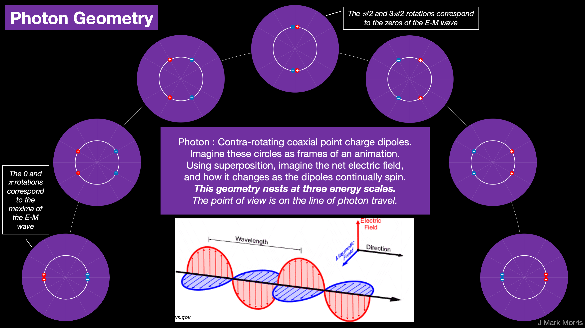

Photons are incredibly awesome emergent structures. The six electrinos and six positrinos in each photon form six binaries orbiting in one or more closely spaced planes perpendicular to the direction of travel. It could all be one plane. It might be two planes with a slight separation. It might even be more evolved than simple binary orbits or concentric binaries. Perhaps orbits form with 3, 4, 6, or all 12 point charges in some coordinated planar dance.

One insight I had today is that the assembly moves a distance determined by the local speed of light every wavelength, i.e., every cycle. But the pattern we see is just a shadow of reality. Lawrence Krauss, in his book "The Greatest Story Ever Told — So Far," tells of Plato's Allegory of the Cave.

> _In the allegory, Socrates describes a group of people who have lived chained to the wall of a cave all their lives, facing a blank wall. The people watch shadows projected on the wall from objects passing in front of a fire behind them and give names to these shadows. The shadows are the prisoners' reality but are not accurate representations of the real world._
> 
> _Socrates explains how the philosopher is like a prisoner who is freed from the cave and comes to understand that the shadows on the wall are not reality at all. A philosopher aims to understand and perceive the higher levels of reality. However, the other inmates of the cave do not even desire to leave their prison, for they know no better life._
> 
> Wikipedia

While we can measure the wavelength of a photon, what is not realized is that the point charges in the photon structure have gone once around their orbit during the cycle.

- What is the circumference of that planar orbit?

- What is the velocity of the point charges in orbit?

I think it would be great fun to brainstorm and imagine how a **photon** might propel itself. It feels odd to write those words and thoughts that way. What if phrasing it that way is **isomorphic** with saying that a particle conserves momentum? Then it doesn't seem so odd. Let's explore these ideas and see if it goes anywhere. This is a brainstorm post that may or may not lead to ideas and insight that could apply to the photon or beyond.

> _In mathematics, an isomorphism is a structure-preserving mapping between two structures of the same type that can be reversed by an inverse mapping. Two mathematical structures are isomorphic if an isomorphism exists between them._
> 
> _The interest in isomorphisms lies in the fact that two isomorphic objects have the same properties (excluding further information such as additional structure or names of objects). Thus isomorphic structures cannot be distinguished from the point of view of structure only, and may be identified. In mathematical jargon, one says that two objects are the same up to an isomorphism._
> 
> _An automorphism is an isomorphism from a structure to itself. An isomorphism between two structures is a canonical isomorphism (a canonical map that is an isomorphism) if there is only one isomorphism between the two structures (as it is the case for solutions of a universal property), or if the isomorphism is much more natural (in some sense) than other isomorphisms. For example, for every prime number p, all fields with p elements are canonically isomorphic, with a unique isomorphism. The isomorphism theorems provide canonical isomorphisms that are not unique._
> 
> Wikipedia

Let's visualize the dynamical structure of a photon. In object oriented software terms let's make (_a primitive attempt at_) a **class structure** that might lead to a taxonomy. Thinking and programming in object oriented languages has always been a challenge for me because while I understand some of the concepts there are others that I simply don't grok due to a mental block.

I presume I must have some sort of a subconscious rebellion against the very formulation of object oriented languages. Perhaps I just don't get it yet, which is the highly likely. I added the "yet" because I do wish I could truly understand. Sometimes the most obvious interpretation can be plainly evident yet we can not grok it. Grok is a great word. Grok implies to me that I'm just an assemblage of well meaning point charges trying to figure out what is going on and how to interpret my inputs and control my outputs according to my principles. Lately I have been doing more object oriented programming and I am starting to have flashes of insight and am making progress. I still hope to find a simpler way to think about the concept of object orientation, if only for my benefit.

Aside : My first introduction to object oriented computing was via the Intel IA-432 processor. Those were early days for the concepts of object orientation. Intel went boldly into hardware before there was significant mainstream language support. Perhaps my attempt to understand object orientation at this turbulent time has something to do with why I am so confused. Or I just don't get it yet.

> _The iAPX 432 was referred to as a "micromainframe", designed to be programmed entirely in high-level languages. The iAPX 432 instruction set architecture and programming model is a stack machine with no visible general-purpose registers. It supports object-oriented programming, garbage collection and multitasking. Direct support for various data structures is also intended to allow modern operating systems to be implemented using far less code than for ordinary processors. Intel iMAX 432 is a discontinued operating system for the 432, written entirely in Ada, \[the\] intended primary language for application programming. In some aspects \[ _iAPX 432__\] _may be seen as a high-level language computer architecture._
> 
> _These properties and features resulted in a hardware and microcode design that was more complex than most processors of the era, especially microprocessors. Using the semiconductor technology of its day, Intel's engineers weren't able to translate the design into a very efficient first implementation. Along with the lack of optimization in a premature Ada compiler, this contributed to rather slow but expensive computer systems, performing typical benchmarks at roughly 1/4 the speed of competitors. This initial performance gap to the rather low-profile and low-priced 8086 line was probably the main reason why Intel's plan to replace the latter (later known as x86) with the iAPX 432 failed. Although engineers saw ways to improve a next generation design, the iAPX 432 capability architecture had now started to be regarded more as an implementation overhead rather than as the simplifying support it was intended to be._
> 
> Widkipedia - edited for brevity

Okay! I've hemmed and hawed long enough, let's give it a first go! Here is one view (relational database sense) of classes that lead to the structure of the photon through inheritance. I'll try to make it JSON-ish , but I don't know JSON so bear that in mind.

- Class: binary
    - First order substructures : 2
        - Distinct Substructure configuration : positrino
            - Substructure class : immutable point charge
        
        - Distinct Substructure configuration : positrino
            - Substructure class : immutable point charge
    
    - Frequency : f
    
    - Radius of orbit : r
    
    - Wave equation type: circular-elliptical
    
    - Wave equation : x2 + y2 = r
    
    - _N.B. a more sophisticated class may include formulas and factors that account for elliptical orbits._

- Class: tri-binary
    - First order substructures : 3
    
    - Distinct Substructure configuration: Gen III binary
        - Substructure class: binary
        
        - Energy role : high
        
        - Frequency : high
        
        - Radius : small
    
    - Distinct Substructure Configuration: Gen II binary
        - Substructure Class: binary
        
        - Energy Role : medium
        
        - Frequency : medium
        
        - Radius : medium
    
    - Distinct Substructure Configuration : Gen I binary
        - Substructure Class: binary
        
        - Energy Role : low
        
        - Frequency : low
        
        - Radius : large

- Class : Photon
    - Point charge count : 12
    
    - First order substructures : 2
        - Distinct substructure configuration : Pro
            - Substructure class: tri-binary
            
            - Substructure orientation : lead | trail
        
        - Distinct substructure configuration : Anti
            - Substructure class : tri-binary
            
            - Substructure orientation : lead | trail
    
    - Substructure configuration : lead-trail type
    
    - Redshift mechanism : _continuous via slow phase shift?_

How parsimoniously does nature define a tri-binary? For example, what is the orbital direction of each binary or does that even matter given symmetry? How are the three frequencies and phases related? How is redshift implemented? If binaries synchronize, how does that work and is it related to Koide's formula? There is a tremendous amount of knowledge to be gleaned and used to refine our class structure.

Let's imagine that opposite point charges can orbit in a tight loop. _I recommend imagining a circular orbit for ease of visualization, but circular, elliptical, wave equation — they all occur in nature — and this assembly can be moving through spacetime all the while, spiral style._ A pair of point charges, an electrino and a positrino, chasing each other through an orbit forms a spinning binary moving through spacetime with some translating axis of rotation.

A binary is an electrino point charge and a positrino point charge orbiting each other. Let's say two closely spaced binaries are contra-rotating at a phase difference of pi/2, and with the plane of orbit orthogonal to the direction of travel. Do they produce planar E and B fields that are equivalent to the E and B fields of a photon?

<figure>

<figcaption>

Wikipedia

</figcaption>

</figure>

Imagine a minimal clock face as a circle with tick marks at the hour. On the near side of the clock, place a red sphere positrino at 3 and a blue sphere electrino at 9. Now give them a speed clockwise and they go 4:10, 5:11, 6:12, 7:1, 8:2, 9:3 always opposed across the diameter. Imagine the expanding spherical electric potential fields each point charge is continuously emitting as it spins around the clock circumference. Stop the mental spinning, and place a second duo of point charges on the far side of the clock face. You can pair red with red and blue with blue for now. When you start the spin, have the far binary spin counter-clockwise with the same speed as the near side binary. Watch your mental creation for a while. Let's say the speed of the point charges is far less than the speed of their potential fields. Imagine the potential field in the vicinity as the binaries contra-rotate. Think about the superposition and cancelling. You have imagined the geometry of a photon. Here is a diagram that illustrated the geometry and shows some linkage points to electromagnetic waves.

In the point charge universe, photons are implemented as **_contra-rotating coaxial point charge rotors_**.

> **_Coaxial rotors_** _are a pair of rotors mounted in a parallel and offset plane from each other with the same axis of rotation, but turning in opposite directions (contra-rotating)._
> 
> Wikipedia

Photons aren't just one coaxial rotor, but **three**, and they are nested at higher energies and smaller radii.

Does the contra-rotating coupling mechanism create a situation where the leading binary is the sail, and **_the trailing binary provides the propulsion via it's field acting as a wind_**, as it were? Is the leading **_tri-binary_** surfing the electric field of its partner **_tri-binary_**? Is the leading **_tri-binary_** also towing its trailing partner **_tri-binary_** along? The challenge is to visualize a set of point charges tracing certain paths through a Euclidean void filled with low apparent energy Noether cores, all the while observing Maxwell's equations.

When I visualize dynamical point charge structures, I imagine using Coulomb's Law but slow it down by so many orders of magnitude that I can visualize the dynamic electric field wavefront being emitted from each of the twelve point charges in the photon and the dynamic action on each point charge from all incoming fields. As a first order approximation, I simplify the visualization by focusing on the four lowest energy point charges, the two outer contra-rotating binaries. Since I have an intuition that the three binaries are coupled, I suspect that this approach may be good enough until a mathematical model and simulation are developed. Even if this particular structure visualization is flawed, this process helps us develop our ability to mentally simulate point charge structures.

We also need to understand how the photon is interacting with the aether of cold appearing Noether cores, i.e., the ocean the photon is sailing through. We know the photon's path is influenced by the energy and energy gradients in the aether. Consider that the fields of the contra-rotating binary comprising the photon must do some lovely a/c corkscrew through the aether as the binaries pass at the speed of light. It occurs to me that saying "pass at the speed of light" is redundant. A photon is light.

One of the challenges to overcome with point charge theory is to ascertain how point charge immutability is implemented. There are a set of interrelated factors that need to be sorted out as a precursor to divining the math. One factor is the speed of electromagnetic fields through absolute Euclidean space and time. I have gone back and forth on this question and wrote quite a bit about the fields themselves possibly being impeded by the local strength of other electromagnetic fields, and related to what we call permittivity and permeability. More recently I am leaning the other way and think that fields don't interact, considering superposition to be a passive aggregation that neither space and time, nor the fields themselves are aware of. It would be extremely parsimonious if we can concentrate the mechanisms of nature into the the action of fields on point charges AND give no active role to fields interacting with other fields, space, or time. That is quite a healthy serving of word salad, but it's important to spell this out. Hopefully some day I can go back through all my blog articles and revise or annotate the ideas that turned out to be incorrect.

The field speed of emitted potential is the universal constant @. Photon assemblies are sailing on their own potential fields at some percentage of field speed @ based upon local permittivity and permeability. Because spacetime aether assemblies change size with energy Einstein perceived space as curvy, but in reality the void is Euclidean. From within the curvy reference frame it does in fact look like the speed of a photon, c, is constant even though in the absolute frame the photon speed changes with energy density of the aether. At low aether energy photon speed c approaches field speed @.

Thus all of the point charges have a velocity component on the line of travel at local c. We must also consider that the point charges are orbiting in the transverse direction with radius r at frequency f. As a result, there is a vector velocity of the point charges that is the hypotenuse.

In low apparent energy spacetime aether there is little resistance to photons and also a very slow redshift process. Low apparent energy spacetime can carry photons of all energies and hence all frequencies, where frequency is presumably that of the outer binaries.

What is the net point charge velocity as a function of radius and frequency? Can we relate this physical model to the currently established equations?

Now this gets interesting in high energy spacetime aether, such as around a black hole. Again it seems that photons of all frequencies travel at the same local speed. So they are sailing upon their own field emissions. We can characterize local c in absolute terms by measuring local permittivity and permeability.

Is it the case that in high energy spacetime aether there is more local turbulence in the net superimposed Dirac sphere streams of all local point charges many of which are in high frequency binaries? Also, the point charges in the photon will be closer in distance on average to the point charges in the aether and the point charges in the aether will also be operating at elevated frequencies. There is a lot for the professionals to sort out!

So why do all frequencies of photons move at the same speed? Is there a relationship with the radius of the photon's outer orbits? Apparently "the photon sails on it's own field emissions at speed x" is not dependent on the frequency of the photon. Why is that? How does that work out in the dynamical geometry? I find it helpful to first assume the current science is correct and this **must** occur and then imagine how it _could_ occur.

_Aside : Imagine every photon is like a set of coaxial propellers at different frequencies alternating in directions. It is literally point charges sailing at the local speed of light, plus rotating in the transverse plane like a propeller. Visible light around 300 Thz composes sunlight, with the point charges in photons orbiting a tiny transverse circle. When photons impact standard matter particles a reaction occurs. The outcomes vary because those point charges in the photons can cause reactions that transfer energy and transform particles, which are also made of point charges. Some mirrors for example can reflect photons. Some photons reactions enhance life (photosynthesis) and others degrade life (sunburn, skin cancer). A photon can be a precise scalpel for science that can be tuned to different frequencies. We have only begun to realize the benefits of the photon for the science of reactions._

How can we determine the total velocity of the point charges in the outer binaries of the photon? If we knew the orbital radius, we would have the transverse velocity and we can calculate local c, so then we could apply the Pythagorean theorem. NPQG has expressed no limit on the natural velocity of an independent point charge in a void, yet it is recognized that emergent speed limits may be encountered via integration with other point charges, often locally and in an assembly. What happens in the photon assembly, neglecting for the moment that we have three nested binaries! It might be complicated to imagine the extremes of frequency.

https://youtu.be/msVuCEs8Ydo

I suggest these followup topics on this video.

1. The perspective from the Euclidean frame where speed of electromagnetic fields, c, varies.

3. A discussion of the role of permittivity and permeability of spacetime (aether) and how they vary with aether energy.

5. A clarification about non-accelerating reference frames for special relativity. While correct, there is still acceleration _within_ the reference frame for fermions and photons because their point charges are rotating and therefore have angular acceleration. That’s a clarification point, but it should be explained since that mechanism has so much to do with energy storage and momentum.

Is the patchwork quilt of physics and cosmology isomorphic to the point charge universe? I believe so and the evidence is growing stronger by the day.

**_J Mark Morris : Boston : Massachusetts_**

p.s. We aren't finished with the photon geometry. It's straightforward to add polarization and Malus Law.
