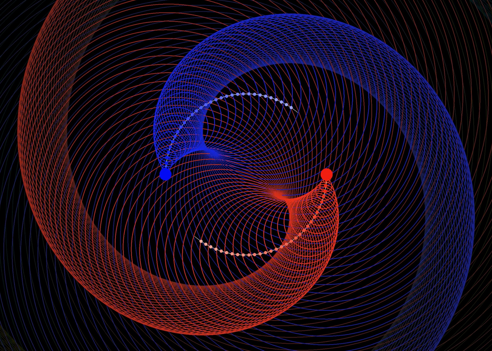
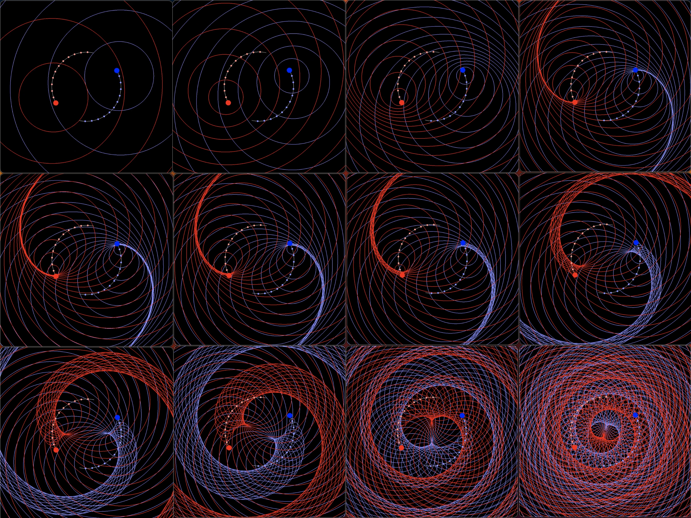
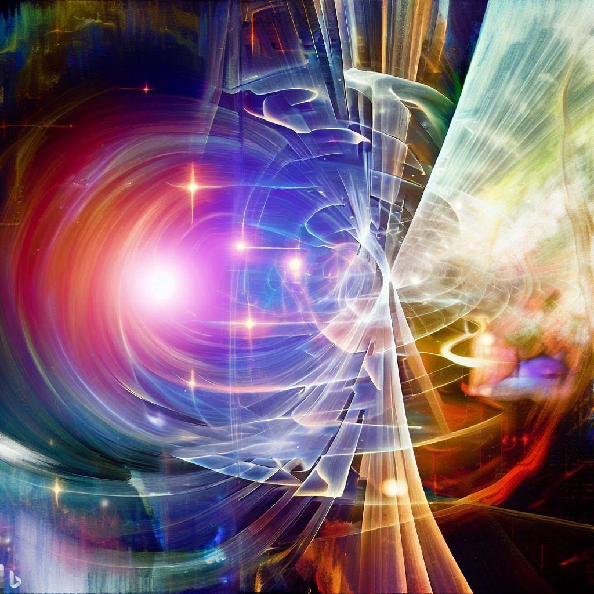
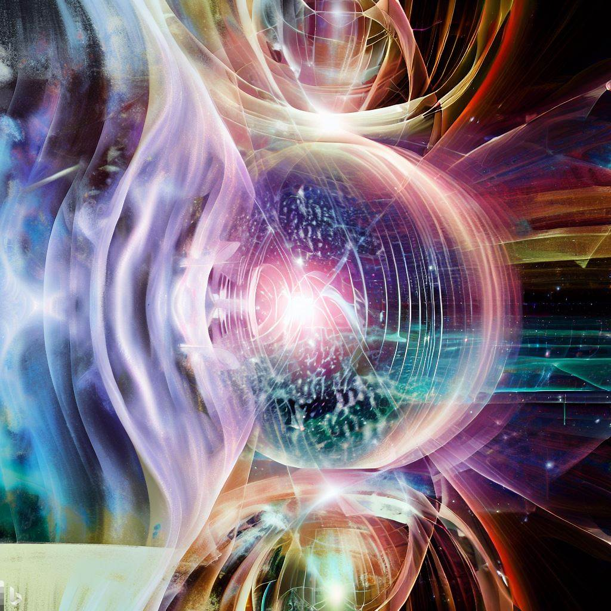
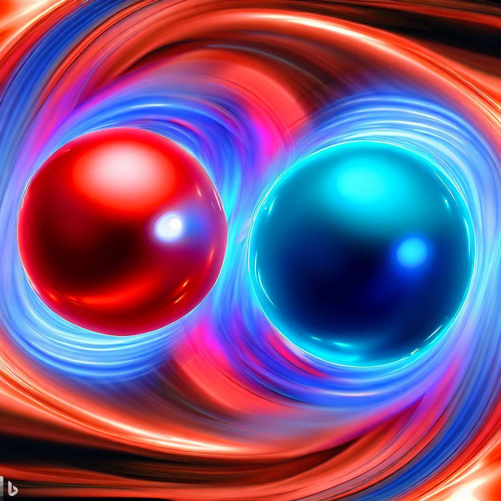

I have realized that it entirely viable to visualize the Noether core geometry in a way that maps directly to both general relativity and quantum theory. This should lead to new insights as well as being educational.

**Doh!** I know this has been in my subconscious for a long time. In fact, I've already made Manim illustrations, generated Copilot imaginations, and collected images from the internet, but it still hadn't dawned on me to model the potential wave patterns of the ideal cases! I often imagine the point charges surfing in a constant position in a binary, as if in an ideal situation the point charges would never detect a change. The virtual observer riding along with a point charge in an ideal binary would perceive its universe to be static. The opposite point charge would appear (in potential waves, not photons) as it did at the point in its path history when the potential was emitted.

One of the images in the gallery shows an abstract view of an atom with a nucleus of protons and neutrons and surrounded by orbitals of electrons. It will not be difficult to simulate the full path of each point charge as well as the resulting potential patterns.

Each of the 1, 2, or 3 concentric circular binaries has vastly different frequency and radii, from which we can determine velocity which is also at vastly different scales.

This appears to be straightforward to simulate and visualize in Manim. Either the pattern stabilizes into a standing wave equation, or it doesn't. Some patterns are truly static. Are those the ideal, most stable patterns? I suggest that for each quantum of momentum h-bar (joule-secs) that the pattern can evolve in a stable manner. The overall relationship in frequencies is maintained. Is this a power of two law, {v, 2v, 4v}? Are such patterns the most stable in the ideal case? What are the particular patterns of potential that lead to stability or instability?

> - 
>     The energy of a **photon** (such as light) is directly proportional to its frequency, and this relationship is expressed as **E = hν**, where **ν** represents the frequency
> 
> - The **reduced Planck constant** (also known as **ħ**) is defined as **ħ = h / (2π)**.
> 
> - Angular momentum is quantized in units of ħ, which means that the allowed values of angular momentum are multiples of ħ.
> 
> Wikipedia

It has long been understood that even a single point charge binary has quantized frequencies. There is always a tipping point in phase where the configuration changes to the adjacent energy level. It's not clear how h-bar maps. Is h-bar the unit of angular momentum for a single binary? Alternately, is h-bar a higher level of quantization?

_Aside: I speculate that the case where the middle binaries' charges are traveling at field speed is somehow special. Perhaps a balance point? Can they each ride over that hump and remain stable? How does this relate to the sombrero?_

Modeling Steps

1. A single planar binary in 2D (which is identical in all radial planes). Model in Python/Manim. Explore ways to label and/or visualize the standing wave pattern as frequency changes from 1 to Planck frequency. Sample some of them, particularly <<@, @, and >@. Be sure to include the potential/velocity factor for constant flow rate point charges. Perhaps a color scale from red to blue! Aha! Purple is full superposition.

3. Two concentric binaries at exploring the full spectrum from 0 to Planck frequency for both the inner and the outer binaries. Model with binaries orbiting in the same direction and opposite directions. Study the results to understand the behaviour. My intuition is that all binaries orbit in the same direction in 2D as this seems to be the most common pattern in the larger scale universe.

5. Three concentric binaries with a similar extensions as #2 to cover all mathematical possibilities.

7. Analyze all of the configuration space of three orthogonal concentric circular binaries.

9. Repeat all of the above with the assembly group velocity = v, varying from v = 0 (previous steps) to v << @, v = @, v>@, v = pi/2 (Planck scale). This serves to orient the angular momentum of all binaries in the direction of travel. Those three angular momentum vectors precess to determine the overall spin. The faster the assembly group velocity is, the closer the angular momentum vectors approach each other. In photons, and perhaps all bosons, it seems that a planar formation maps to quantum theory. Perhaps a 3D assembly is somehow surfing close to field speed? I suppose either might lead towards a Bose-Einstein condensate.

11. Introduce a background aura of various patterns of potential. What is the state space across the entire range of potential patterns (sampled intelligently) that maps to interactions vs. reactions. _(Aside: is there a good existing terminology for this?)_

13. Explore the particular configuration space around photons and determine if it is possible that neutrinos and photons are different energy versions of the same assembly structure. Is it possible that the neutrino is the lower energy precursor and/or ultimately redshifted photon?

15. #7 begs the question of what happens when a photon decays? Do the two interior binaries in the pro and anti Noether cores that presumably continue on for some distance when a photon decays (e.g., in a solar panel, on human skin, eye, etc.). What reactions to the internal binaries cause? Good reason to avoid or mask intense solar ray exposure.

17. What are the wave patterns of the ideal versions of each standard matter particle?

19. This includes the wave patterns in spacetime assembly condensate (Higgs, aether).

21. Now examine the patterns of each ideal assembly moving through the full configuration space of it's own group velocity as well as the spacetime assembly condensate. This is where general relativity will map.

23. How do we map temperature? Is it related to the personality charges of the electron?

25. How is energy transferred to a Noether core? Is it via the personality charges?

This line of thinking leads to a waterfall of insights. It seems to map with the idea that the photon energy in our traditional equations is the apparent energy which corresponds to the outer binary. Thus when the outer binary decays the two internal binaries continue on for some distance in a highly reactive state. It would be interesting to know what those reactions are.

Another thought that has been percolating is that slow moving point charges approaching each other have a lot of time to sense and interact and for action to change their paths. Fast moving point charges that are approaching may have very little notice in terms of potential. Intuitively this seems to suggest they would climb higher on each other's potential curve as their path rapidly adapts.

A fast mover has more time to adjust to a slow mover than a slow mover does, i.e., the fast mover is riding up the gentle part of the 1/r slope. The fast mover distorts that slope such that it wallops the slow mover.

Each point charge is always on a 1/r curve with the emitter, (except for the self when v <= @). It would appear that this is a relatively straightforward generalization of classical mechanics.

I'm very happy with these insights that have bubbled up today!

**_J Mark Morris : Lynn : Massachusetts_**
