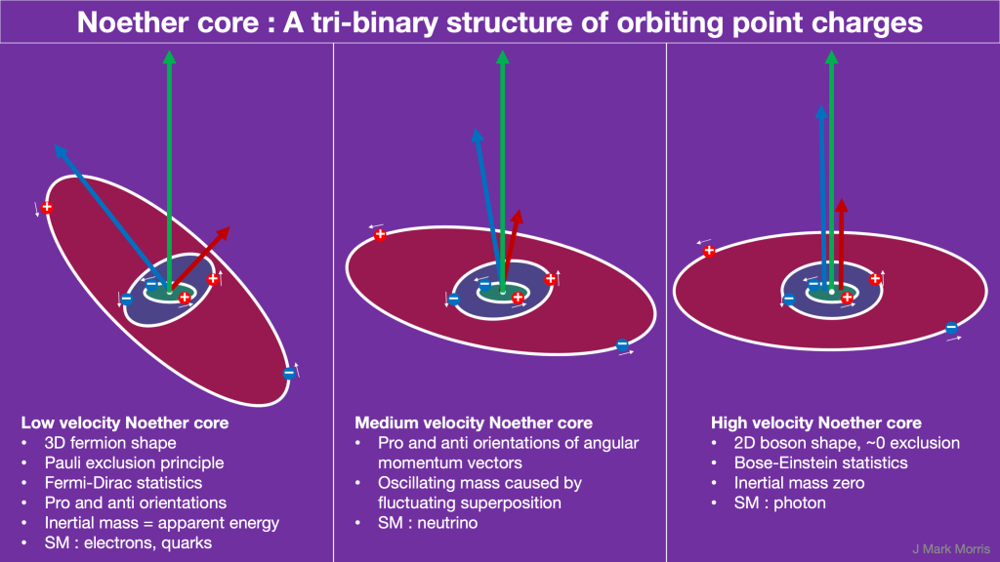
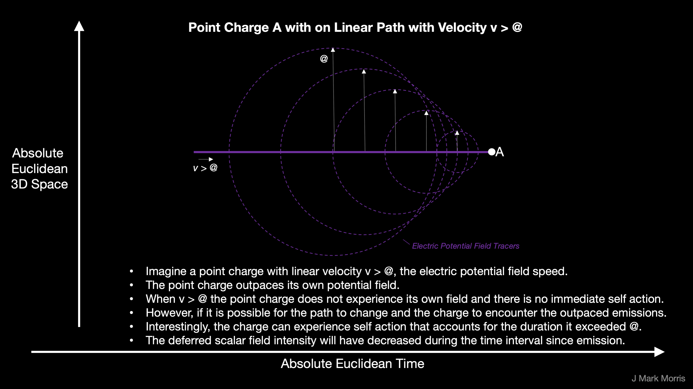
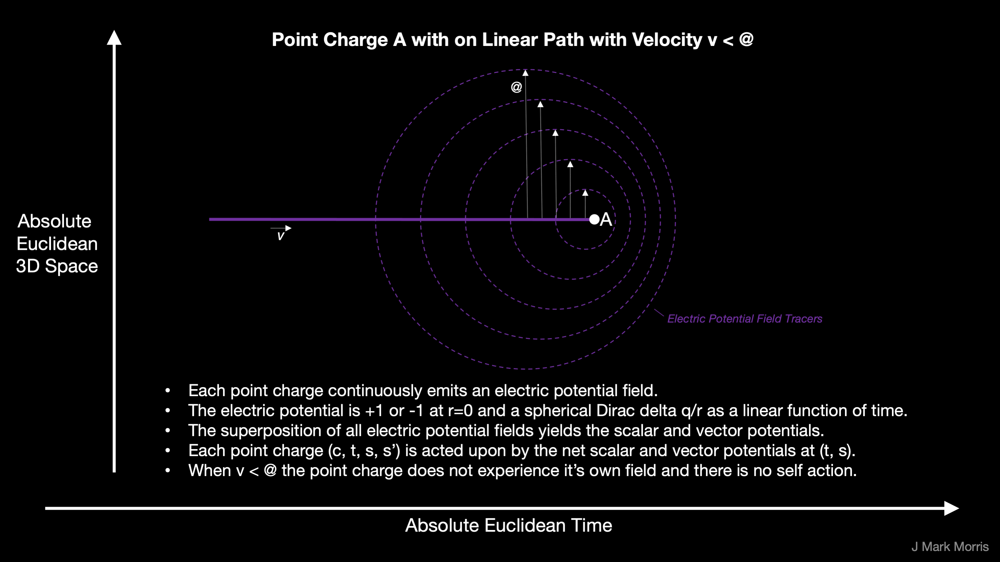
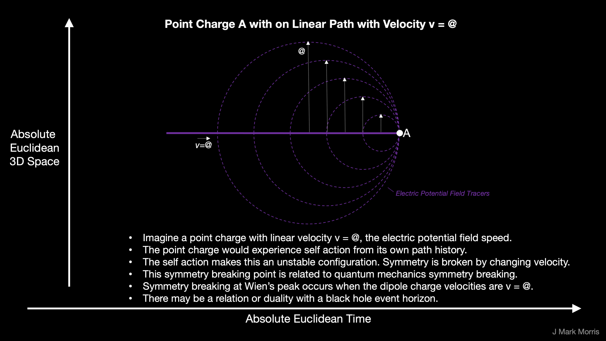

* * *

Consider Jefimenko's equations and Liénard-Wiechert potentials. These geometries are an attempt to define a relativistic theory of electric potential history based upon classic point charges. However, these theories are ontologically mixed up.

One thing is clear — the speed of the photon structure has been smuggled in to the equations erroneously. The photon speed c is asymptotic to the speed @ of the electric potential emitted by the point charges. There are more issues. There is no a priori limitation on the point charge speed v which can exceed @. This opens up a whole new missing sector of physics which will help resolve the crisis in physics and cosmology. There is also a confused idea of extending a charge and methods that conceive charge magically multiplying.

We need a new geometry to describe the behavour of point charges.

Can we refactor Jefimenko, Liénard, and Wiechert? Tasks include :

- Eliminate any use of photons and the speed of light.
    - The speed of light is a characteristics of the photon structure.
    
    - Photons have higher assembly numbers than point charges.
    
    - A proof from first principles and emergence must build higher assemblies before leveraging them.
    
    - Obtain dependencies (special relativity?) directly from point charges, without photons.
    
    - Ensure ontological confusion is excised from the equations.

- Update the terminology
    - Focus on point charges in a Euclidean void of time and space.
    
    - All action occurs on one or more Dirac spheres that have propagated for a duration in time at velocity @.
    
    - In other words a point charge is always acted upon by the scalar potential (and the vector potential gradient) emitted in the history of all point charges including themselves.

Let's take a gander at Jefimenko's equations. Even if we substitue @ which is the electric potential field speed for c, the speed of photon structures we are still missing a treatment for v > @.

<figure>

<figcaption>

Wikipedia

</figcaption>

</figure>

It is beginning to dawn on me that Euclidean time and space, can be considered as an absolute rest frame, albeit non-interacting. The reason is that the electric field from a point charge propagates at a velocity, @, and that velocity is relative to the absolute rest frame. Today, some scientists still think of a vacuum as containing empty Einsteinian spacetime. In NPQG we know that spacetime is really an aether of low apparent energy Noether cores.

I haven't given much thought to whether it would be possible to create a volume of Euclidean time and space with an absence of spacetime aether (_other than the case of an SMBH jet_). If we could create true void Euclidean time and space then I don't know if a point charge structure would or would not be stable. In other words, it may possible that the interaction with the aether is a necessary aspect to the stability of standard matter particles.

However, if we imagine that we could create void Euclidean time and space and that standard matter particles were stable in void Euclidean time and space then we can imagine that a particle with absolute velocity = 0 in Euclidean time and space is very different than one with absolute velocity > 0 because of the propagation of the electric field emitted by the point charges in the structure. This suggests that there could be a reason that structures would dissipate energy to other structures and tend towards zero absolute velocity.

So a point charge with absolute velocity = 0 is in a unique situation. Not only is its kinetic energy zero, but it is creating a scalar potential but no vector potential. To be clear, Euclidean time and space is not interacting with the point charge, it's more that the point charge is interacting with itself and if it has a velocity, that represents a higher energy state than having a lower velocity or no velocity.

In some sense it means that the self-interactions of the Noether core with velocity v are a dominant factor in nature. Interactions with the spacetime aether (other Noether cores) are a lesser factor for a Noether core based structure passing through (of course, doh, because that very small interaction is gravity). No doubt they both are important, but this is a huge step forward in understanding of how nature operates.

It seems we could use this mechanism to understand why momentum is conserved for example. That is, if you perform work on a Noether core to change its velocity, not only might you be increasing the h-bar angular momentum of the binaries, but you are also causing a tilt to the orbital planes which is somehow preserved when the accelerating force ceases.

Let's distinguish our terms for velocity.

**@ — The field speed of the electric potential**. At every continuous moment in time the point charge emits a spherically expanding field front that behaves like a Dirac delta sphere that is decreasing in magnitude with r. @ is the only natural constant in NPQG so far.

**c — The speed of the photon structure.** The photon is a mated pair of three nested contra-rotating coaxial point charge binaries. From the perspective within the spacetime of general relativity (GR) the speed of a photon is a constant. However, in the absolute Euclidean perspective of the point charge universe we see that the speed of a photon varies with the "curvature" of spacetime aether. Curvature therefore is a proxy for the magnitude of the electric vector potential. That said, in the limit of low energy aether, which is found in regions of low scalar and vector potential, then c approaches @.

**v — the absolute velocity of a point charge** in Euclidean time and space, modeled in R4. The lower bound on magnitude is 0, although it is hard to imagine a point charge actually being at rest in Euclidean time and space. I haven't yet found an upper bound, but I can think of several natural controls.

- The energy that accelerated these point charges had to be finite.

- Lone high energy point charges would likely exchange energy with the point charges they fly by, shedding energy, and thus reducing velocity.

- Lone high energy point charges are highly reactive and would likely cause a reaction and end up in a structure.

- Even in a jet of point charge plasma that clears everything out of it's path, including the aether structures, there is a point where the jet piles up in a terminus. Loss of collimation. The energy has spread out and the reaction detritus provides a reaction surface for the diffuse jet. Of couse some radiation will continue beyond the terminus and redshift until those structures drop in velocity and decay towards the low aparent energy end of the spectrum.

These three speeds are distinct concepts and we must be precise in our understanding and usage. It is very important to understand that v can exceed @. This critically important concept was missed by Jefimenko, Liénard, and Wiechert. I suspect the reason this was missed is the the photon structure speed was used in cases where either the speed of the point charge v, or the potential field speed @ should have been considered. The equations will need to be modified to support the full range of point charge velocity.

Ruh roh, do we need to add Heaviside and Feynman to this rumble?

Why is no one showing multiple causal contacts to path history?

Imagine a drone dropping a pebble every second as it flies a path over a still pond. Except let's make a simplifying modification. These special pebbles emit only one slowly expanding ring per pebble and that corresponds to the electric potential wave. Do these expanding circles cross each other? If the drone is flying faster than the ring expansion rate then of course they do. A bobber at that crossing experiences the superposition of circles. Is there a limit to how many such circles may cross at a point?

There are certain emergent point charge structures which can produce the naturalistic dual of Lagrange points in the scalar and vector potential. The point charge structures are assembled from a collection of negative and positive point charges. This makes for some fascinating dynamical superposition. The full complexity and beauty of these dynamics are not considered in the existing scalar and vector potential formulations. The popular view imagines the point charge as a potential tent pole that moves along a path history. The emitted scalar field is always decreasing at 1/radius. Radius of this spherical emission is determined by time since emission multiplied by @, the speed of the electric potential.

The way I am starting to look at it is as a set of discrete Dirac delta like functions. That makes more sense to me. We could define the electric potential field as plus or minus the unit Dirac delta at r = 0. Alternatively we could define the electric potential as 0 at r = 0, if that works out better for the geometry.

There is a train of thought in my subconscious about the definition of the electric potential field at r = 0 and how that relates to asymptotic safety. In a continuous real geometry, it seems it might be a challenge for point charges to be on a collision course. What would it even mean for two point charges to arrive at the same point in (s,t) where s is (x,y,z) or (r, phi, theta)? I suppose it is possible though. One point charge arrived there and what is so different about the other point charge? I am happy that I have a solution for the glancing blow, which is asymptotic safety. I am happy that I have a solution for the direct hit, which is that the field is plus or minus 1 (or zero?) at r = 0. It feels like this has some kind of a relationship with the Dirac delta emission. I need a geometrical language for these concepts.

Is there a geometrical language for an object that would be like a Dirac delta for potential, which is tentatively a Dirac delta emitted on a continuous path at velocity v and expanding spherically at a velocity @ and multiplied by the function (+1 or -1 (or 0) at r=0, 1/r at r>0)? I'm not sure what I am saying makes sense, but it's not really a field, is it? What geometry is the superposition of multiple of such geometries?

Even if you toss Heaviside and Feynman in to this rumble, I have yet to see a picture that shows multiple causal contacts from path history of a charge. I do see some mention of extended charge and I think this is related our discussion on charge multiples. The bigger issue is imagining the dynamical geometry of those causal contacts. Note that all causal action occurs on Dirac spheres and Dirac spheres travel at velocity v = @. However, since point charges can race ahead at v > @ this brings a new twist into the ideas about causality.

**_J Mark Morris : Boston : Massachusetts_**

p.s. Is it just me, or do a lot of people go through this phase where once they really grok "**ontology**" they feel inclined to use the terminology incessantly? I am annoying even myself with this brainworm. I can hit any topic with an ontological hammer.

> _ontology (noun)_ _on·​tol·​o·​gy | \\ än-ˈtä-lə-jē  \\_
> 
> _**1:** a branch of metaphysics concerned with the nature and relations of being. Ontology deals with abstract entities._
> 
> _**2:** a particular theory about the nature of being or the kinds of things that have existence_
> 
> Merriam-Webster

Gosh, Pulp Fiction was an amazing movie with so many tremendous performaces. Gotta love Samuel L. Jackson.

p.p.s.

I know everyone wants geometry, but it is obviously important for the setup of the problem to be sensible and precise before attempting the actual formulae. The alternative is like when I made a confused attempt to use electrostatics to solve an orbiting point charge binary. Oy vey! Plus, as always, this is open-source ideation. I'm slow and I'm learning as I go. I think there are more than 10,000 people on the planet who could make faster progress than I from this point. That said, I do feel like the insights are flowing and I am making good progress.
