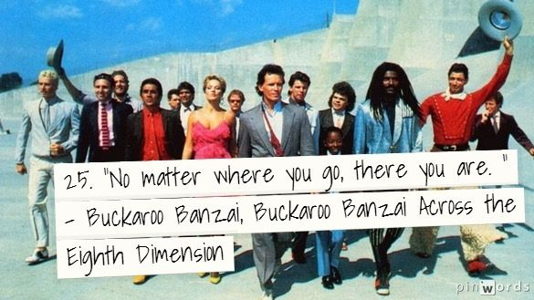
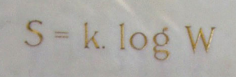

This post is based on [Kirsten Hacker](https://kirstenhacker.wordpress.com/)'s fascinating article "[Blue Skies](https://kirstenhacker.wordpress.com/2019/09/05/blue-skies)" and a brief exchange we had in the comments section following her article. 

* * *

Dear Kirsten,

I model spacetime as an æther of low energy particles, such as low energy photons, neutrinos, and axion like particles. My model is classical, with real particles, of which there are just two fundamentally: the electrino and the positrino, modeled at 1/6th the charge of the electron and positron, respectively. 

Spacetime is an æther with a black body temperature distribution of 2.7 Kelvin. Thus the spacetime æther is responsible for the energy that scientists have called the cosmic microwave background (CMB) and erroneously attributed to remnants of the mythical Big Bang.

To tie in to your post Kirsten, refraction **_is_** the root cause of gravitational lensing. You see, in my model, the temperature of a particle of spacetime æther is the net energy impinging on that particle which has traveled from all other radiating matter-energy sources in the universe. This is a [Machian](https://en.wikipedia.org/wiki/Mach%27s_principle) view, with a twist that not all matter-energy is capable of radiating – in particular the interior of Planck cores of SMBH is not capable of transmitting mass because all neighbor particles are maxed out at the Planck energy.

So how does spacetime æther cause refraction? We know refraction is due to variation in the speed of light. We know that the speed of light can be calculated from the permittivity and permeability of a medium. Therefore, following this logic, the permittivity and permeability of the spacetime æther must vary based upon the local energy of the æther. So, we have a continuously varying speed of light around massive objects, where c is dominated by function of radius from nearby matter-energy and the radiated mass energy from the object.

local speed of light $latex \\mathbf{= \\frac{1}{\\sqrt{\\epsilon\\mu}}} &s=4$.

I wrote more about this subject here: [Brainstorming the Speeds of Light](https://johnmarkmorris.com/2019/07/17/brainstorming-the-speeds-of-light/)

Best,  
Mark

p.s. As a fun exercise, consider a large star being absorbed by a galaxy center SMBH and eventually joining a Planck core, which is not capable of radiating mass. From the perspective of all other objects in the galaxy, a large mass at the galaxy center has effectively disappeared. What are the implications? Do the orbits of all objects in the galaxy increase in radius somewhat due to the mass disappearance? What are the implications for galaxy rotation curves and the search for dark matter?

* * *

> Thank you for your comments. It is nice to be understood. I see what you mean about the story arcs and the importance of introducing each character (idea) in a measured way that can be easily understood by the sort of person who might read a novel. In the books I’m writing, I’m trying to do this by creating narrative tension between Galilean and Lorentzian frameworks. Entropy is a wily character that plays different roles in each framework. My challenge is to avoid getting lost in the details so that the story (big picture) shines through. That is the biggest flaw of physics instruction, myopic detail without a clear (dramatic) narrative connecting it together. If drama is invoked, it is through false mysteries and jargon like dark matter. I think we can do better than that.
> 
> Kirsten Hacker October 14, 2019

* * *

There are sixty orders of magnitude from Planck length to the size of the observable universe. To tell the story of nature requires the imagination and freedom of mind to quickly, nimbly, and comfortably scale up and down 60 orders of magnitude with ease. This requires relaxing the mind so that it does not recoil at the thought of incredibly small particles and field amplitudes or enormous structures in the universe.

Furthermore, we must avoid our natural anthropocentric thinking from the perspective of human scale. I imagine that physicists and cosmologists develop the ability to think logarithmically, i.e., no matter where you are on the scale, it is a multiply to go up the scale and a divide to go down the scale. These ideas of **_scale invariance_** and the resulting symmetries are somewhat difficult to comprehend and at extreme scales can cause a mental meltdown for the uninitiated.

I believe entropy is conserved in the universe once we take into account the spacetime æther. The second law of thermodynamics can be tightened up to say that total entropy is a constant considering all particles in a reaction. I also think that the Planck particle phase of matter-energy, which can develop in the core of a supermassive black hole, has zero entropy. A Planck core has one microstate. I wrote an article on entropy here: [Fresh Thinking on Entropy](https://johnmarkmorris.com/2019/06/15/fresh-thinking-on-entropy/).

<figure>

<figcaption>

Wikipedia

</figcaption>

</figure>

It is very exciting that your books will explore Galilean and Lorentzian frameworks. I imagine the particle assembles of the standard model as a triply nested set of electrino:positrino binaries supporting personality charges in the polar regions of the binaries. I have an intuition that the velocity of the point potentials in each binary is somehow related via a Lorentzian function to the local speed of light. The core becomes an energy storage mechanism, somewhat like a flywheel, and the faster the cores' binaries spin the more energy the core stores.

The radii of the core binaries experience a Lorentzian related scale expansion as a particle dissipates energy. The inverse is also true, as a core absorbs energy harmonics, the core deflates. The hockey stick part of these curves occurs at extreme temperatures where matter-energy is at extreme density and pressure.

Euclid, Galileo, and Newton were on to nature with their flat geometric thinking about space. I believe Einstein did a great disservice to science by choosing the abstract curvy spacetime approach. It is so much easier to understand nature from the perspective of a 3D Euclidean background space and as you say Galilean framework. Thinking about general relativity as implemented by a universe permeating æther (except in Planck core phase) is far less stressful on the mind.

_**J Mark Morris : San Diego : California**_
