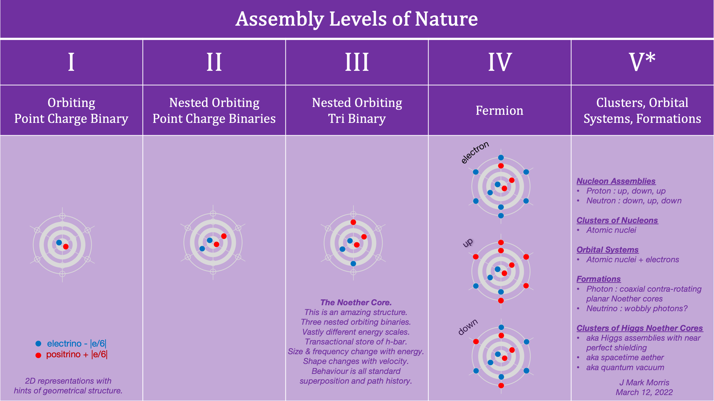

Recently I listened to several podcasts featuring [Lee Cronin](https://en.wikipedia.org/wiki/Leroy_Cronin) who is the Regius Chair of Chemistry at the University of Glasgow, UK. _I am very impressed by Lee's creative thinking and in particular his willingness to break out of the prison formed by ignorance and the revered intellectual strictures of academia._

https://youtu.be/ZecQ64l-gKM

Lee and team have established a new line of thought called [assembly theory](https://en.wikipedia.org/wiki/Assembly_theory) to bootstrap our search for the origins of biological life.

> _Assembly theory compares how complex a given object is as function of the number of independent parts and their abundances. To calculate how complex an item is, it is recursively divided into its component parts. The 'assembly index' is defined as the shortest path to put the object back together._
> 
> _For example, the word 'abracadabra' consists of 5 different letters and is 11 symbols long. It can be assembled from its constituents as a + b --> ab + r --> abr + a --> abra + c --> abrac + a --> abraca + d --> abracad + abra --> abracadabra, because 'abra' was already constructed at an earlier stage. Because this requires 7 steps, the assembly index is 7. The string ‘abcdefghijk’ has no repeats so has an assembly index of 10._
> 
> Wikipedia

https://youtu.be/FMKPz1tuv10

Let's consider the assembly of standard matter in the universe. Compared to the work of Walker and Cronin, this may at first seem like an unusual approach since we do not consider standard matter to be biological life. The way to reconcile this is to **_consider how few assembly steps nature takes to make standard matter_**. Thus, the assembly of standard matter establishes a lower bound derived directly from nature.

I'm sure academics will follow in these footsteps to improve this classification, but even at this nascent stage of inquiry, it appears **_the number of assembly steps is less than half a dozen for every known standard matter assembly, including atoms in the periodic table._** One could argue that the first three steps could be collapsed into one super general rule, or perhaps one rule for binary formation and a second rule for binary capture and shielding. Once we have reached assembly level IV then all other assemblies are combinations of the ones already produced. Note, I didn't show the W and Z bosons, but they appear to be a combination of the parts already evident in the diagram. At most six assembly levels to make all of the component structures in the standard model. Once you have that assembly line, it leads to everything in the periodic table, all molecular structures, complex biological structures, and complex structures created by biological life. Note that assembly creation is history dependent - there may be many reaction processes to arrive at the same assembly.

One of the key concepts in assembly theory is the examination of **bonds**.

> _A chemical bond is a lasting attraction between atoms, ions or molecules that enables the formation of chemical compounds. The bond may result from the electrostatic force of attraction between oppositely charged ions as in ionic bonds or through the sharing of electrons as in covalent bonds. The strength of chemical bonds varies considerably; there are "strong bonds" or "primary bonds" such as covalent, ionic and metallic bonds, and "weak bonds" or "secondary bonds" such as binary–binary interactions, the London dispersion force and hydrogen bonding._
> 
> _Since opposite charges attract via a simple electromagnetic force, the negatively charged electrons that are orbiting the nucleus and the positively charged protons in the nucleus attract each other. An electron positioned between two nuclei will be attracted to both of them, and the nuclei will be attracted toward electrons in this position. This attraction constitutes the chemical bond. Due to the matter wave nature of electrons and their smaller mass, they must occupy a much larger amount of volume compared with the nuclei, and this volume occupied by the electrons keeps the atomic nuclei in a bond relatively far apart, as compared with the size of the nuclei themselves._
> 
> Wikipedia

What is the dual of chemical bonds in the regime of point charge structures? Bonds in point charge structures are "lasting attractions" the strongest of which is the simple Coulomb force of attraction in a point charge binary. Now, throw in Maxwell's equations and dynamical geometry and we find many other such "bonds" in point charge structures. I'll hypothesize that the personality layer charges are attracted to foci at the opposite poles of the orbital axis of each binary. Three binaries, three orbital axes, six poles, six personality charges.

> _"Survival of the fittest" is a phrase that originated from Darwinian evolutionary theory as a way of describing the mechanism of natural selection. The biological concept of fitness is defined as reproductive success. In Darwinian terms, the phrase is best understood as "Survival of the form that will leave the most copies of itself in successive generations."_
> 
> Wikipedia

Lee talks about "selection" in his interview and this is a fascinating topic when it comes to natural emergence. Selection and survival are two sides of the same coin. The word "survival" is often used in biological context, and is perhaps too often misconstrued as requiring agency of the subject to control its own reproductive destiny. Yet, we can abstract these concepts. That which is selected by nature, is that which is created and survives. Reproduction is not a requirement in this context. In our case of standard matter, the set of all abiotic reaction processes, i.e., the maelstrom of maelstroms at all energies, is the grand progenitor of biological nature. It appears to be the case that a maelstrom of extremely dense and energetic point charges is the petri dish in which Noether cores are formed in three (or fewer) assembly steps. Note that Noether cores at this primitive stage already have general relativity and quantum mechanics inherent in their being. _Aside : I am playfully using language often reserved to describing life to help us think about the duality of processes between abiotic and biotic structures._

An essential aspect of structure survival and selection is the shielding of energy. High energy point charges are highly reactive. Our experimental observations show that if the low energy binary in a Noether core is removed, in a particle collider collision for example, the resulting particle structure is no longer fully shielded and quickly reacts and decays. It does not survive, and it is not selected.

I've written more regarding the relation of assembly theory to NPQG.

- [Assembly Redux](https://johnmarkmorris.com/2022/04/09/assembly-redux/)

- [Gluon Color Charge Assembly](https://johnmarkmorris.com/2022/04/10/gluon-color-charge-assembly/)

- [How are Fermions Assembled?](https://johnmarkmorris.com/2022/04/03/how-are-fermions-assembled/)

- [Fusion Disassembly and Reassembly](https://johnmarkmorris.com/2022/05/30/__trashed-2/)

- [Sara Walker : Life : Lex Fridman](https://johnmarkmorris.com/2022/03/22/sara-walker-life-lex-fridman/)

- [The Assembly Duality : Standard Model vs. Galaxy](https://johnmarkmorris.com/2022/05/25/the-assembly-duality-standard-model-vs-galaxy/)

- [Assembling a Theory](https://johnmarkmorris.com/2022/06/07/assembling-a-theory/)

**_J Mark Morris : Boston : Massachusetts_**

p.s. Here is another excellent long form interview with Lee Cronin.

https://youtu.be/UO1AvCbMfyE
