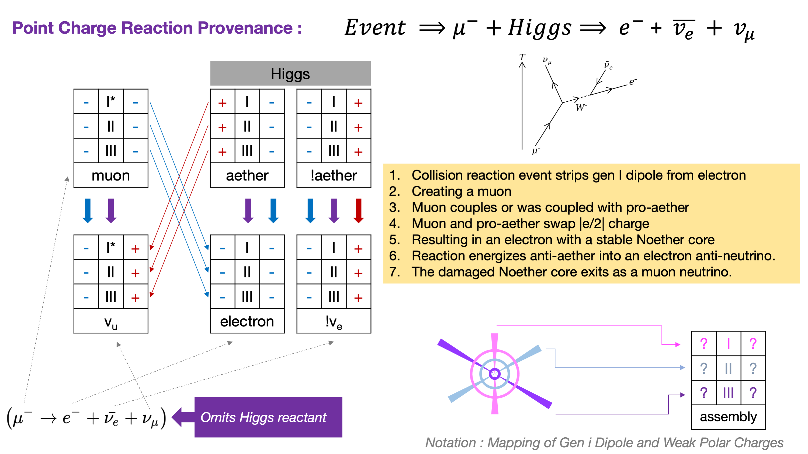

I've diagrammed out a provenance conjecture for a test case of lepton flavor universality. There is a notation mapping in the lower right. This 2D notation seems slightly improved, although I hope for better.

The pattern that I am starting to see emerging involves a coupling to one core of the Higgs. Was the coupling present before the muon was created by decaying an electron's Gen I binary? Alternately does the decay of the electron's Gen I binary reveal the inner binary energies which quickly couple. Surely simulation will reveal how the dynamical geometry of this reaction works.

> _The coupling of leptons to all types of gauge boson are flavour-independent: The interaction between leptons and a gauge boson measures the same for each lepton. This property is called lepton universality and has been tested in measurements of the muon and tau lifetimes and of Z boson partial decay widths, particularly at the Stanford Linear Collider (SLC) and Large Electron–Positron Collider (LEP) experiments._
> 
> Wikipedia

The architecture of nature appears to support the theory lepton flavor universality quite well.

