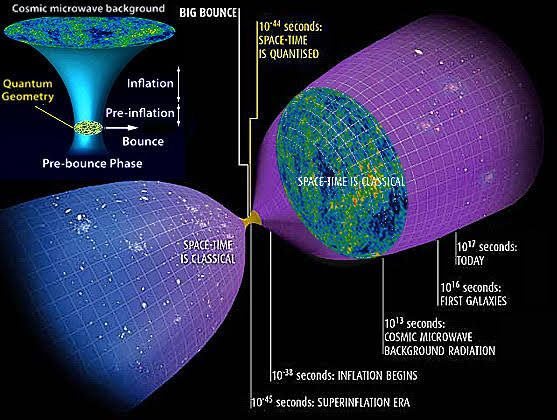

Let's discuss loop quantum gravity (LQG) and compare and contrast it with NPQG. Let's start with basics from Dr. Carlo Rovelli. Episodes 1 and 2 of this lecture series will build your foundation of understanding from the historical progression of the understanding of space and time through black holes.

https://www.youtube.com/playlist?list=PLwLvxaPjGHxR6zr421tXXlaDGbq8S36Un

In **Lecture 2** Dr. Rovelli talks about space, time, and spacetime. In general relativity the concept of Newtonian 3D space which is Euclidean was **_replaced_** by Einstein's spacetime which is Riemannian. Here we encounter a key difference with NPQG. In NPQG, Newtonian space, or absolute space and time, is the fundamental vessel for the universe, and we describe it with absolute Euclidean coordinates and absolute linear time and call that Map 1. NPQG also requires Einstein's spacetime to be understood at the same time, and we describe spacetime with Riemannian coordinates and refer to that as Map 2. One key to nature and the universe is that we must deeply understand that **_in NPQG BOTH Euclidean space and time as well as Einstein's spacetime are simultaneously applicable to physics_**, i.e., Map 1 and Map 2. We must describe each concept with equations in both of these coordinate systems to fully understand how nature works. While this may at first seem abstract or confusing, our understanding is aided by the realization that Einstein's spacetime (Map 2) is implemented with an emergent structure, an _æther_ that permeates Newtonian space (Map 1). So, all that is needed besides absolute space and absolute time (Map 1) is a certain density of immutable, equal and opposite, point charges with a certain energy density (so that makes two free parameters total) and voila, everything will emerge, including the spacetime aether.

Dr. Rovelli describes LQG as being based on the quantization of a gravitational field that is inherent in Einstein's spacetime. We'll have to see how this develops, but it seems to me to be a cognitive error, as if gravitation is inherent in Einstein's spacetime. In NPQG spacetime æther can accumulate energy from nearby standard matter-energy and then propagate that energy. Gravity is the force that matter-energy experiences when the surrounding spacetime æther has an energy gradient.

* * *

In this video a number of the physicists working on loop quantum gravity share their thoughts. I was fascinated by the insights they have developed top down that are getting very close to the fundamental understanding of nature expressed in NPQG. It is even more amazing that they are so close to the answer yet can't break through the incorrect narratives of physics that are blindfolding them from seeing the truth. I'll extract some quotes from the transcript and comment upon them.

https://youtu.be/MgwJmWXoWWI

> __\[LQG\]_ attempts to modify Einstein's equations of general relativity by introducing quantum principles. \[LQG\] is tackling the **mysteries of black holes** and dark matter. \[We'll review\] the experimental search for signs of a **big bounce replacing the big bang singularity** and see how \[LQG\] might solve what's touted as the biggest mystery in physics, dark energy._

My sense watching this video is that the LQG folks are very close to discovering galaxy local cosmology as I have with NPQG. Sometimes scientists are coy with their progress reports when they haven't yet published and don't want to be scooped by colleagues. I wonder if that is the case here.

> _Spacetime has this **bounce effect** which which means that there is no big bang but **some contracting universe before and then it achieved some minimal volume and then it started expanding.** The same effect of this bouncing makes a black hole turn into white hole and the contracting universe turn into into cosmology which we can see now. We have a nice mathematical construction for the theory, but going from there to the real universe is a huge challenge_

The bounce effect that LQG is pondering is the contraction into the Planck core of an SMBH and the escape of Planck plasma via a breach of the event horizon at the poles of the SMBH and emission as a jet. For the life of me I cannot figure out why this is not obvious to these scientists.

> _The cosmic microwave background is the oldest light we can see in the universe and hidden within it are tiny differences in its temperature called anisotropies. The power spectrum leads cosmologists to believe the universe went through an incredibly rapid period of expansion called inflation driven by **a novel type of matter called the inflaton field**._

Fields are the physicists opiates. Seriously physicists are field happy. They invent fields for anything. I think these fields probably correspond to new terms in their equations and they turn these fields on and off as convenient. To me this is really poor science of curve fitting and manipulation.

<figure>

<figcaption>

Sacred cows of physics, out standing in their field.

</figcaption>

</figure>

> _If you had a bounce in the past, problems like the horizon problems are not there anymore because there was time in the previous eon of the universe to have different regions being in causal contact._

This conclusion is incorrect. Since cosmology is driven by galaxy local processes, not a universe level process, we are guaranteed isotropy, and the solution to the horizon problem, because all galaxies are following the same laws of physics. In fact, any active galaxy has developed a Planck core which is essentially the same microstate that is repeated in every SMBH with the sufficient conditions to develop a Planck core. I say 'essentially' because I presume Planck cores aren't exactly perfect — that there are faults in the geometry of the Planck core structure.

Here is another video by "**_skydivephil_**" on LQG.

https://youtu.be/HFJtDLR4bTo

> _"We quantized completely the black hole and we unexpectedly discovered a discrete structure typical of LQG but in this very simple case was not expected and we also observed that the central singularity is completely resolved. There is no singularity at all. You have a point of maximum curvature with large fluctuations but in principle one can go further on the other side of the black hole. whatever that means._"
> 
> _Rodolfo Gambini_

> _"So what happened to a black hole? It forms and then what? Is this black hole exploding back in our universe? Or, is it possible that something has happened, namely is it possible that this black hole divides itself from our universe and creates a new region namely a new universe?"_
> 
> _Francesca Vidotto_

Yes, it is exploding back into our universe, via the polar jets and it is creating newly minted spacetime _æther_ and standard matter particles because the jet is very much an inflationary mini-bang.

> _"When we first came up with the idea that black holes might transform into white holes there was a question of whether this might happen early in their lives or quite late. Our most recent thinking is that it actually happens deep into the lifetime of the black hole. So the black hole mostly evaporates via these Hawking quanta and and then it reaches a very, very, small size what we call the Planck mass and it's only once it's reached this size that it transforms. So this leads to this incredible timescale that I've never seen anything like elsewhere in physics — much much longer than the age of the universe, let's see 55 orders of magnitude larger than the age of the universe. It's quite quite an extraordinary timescale."_
> 
> Hal Haggard

These scientists can not be playing coy with these confused interpretations. They really have not figured it out. First of all, the white hole idea is incorrect — it's simply the pair of jets emanating from an active SMBH. Second, on the incredibly long time scale, this is because from the perspective of Riemannian spacetime (Map 2) time has slowed to a crawl near the Planck core and to a stop in the Planck core. Reminder that time from the perspective of a particle is related to the frequency that the binaries in the Noether core complete their orbits. If viewed from Map 1 Euclidean space, absolute time is moving forward at its normal pace.

> _If there is a a pre Big Bang phase in a bouncing cosmology in which the universe would have undergone a contraction before the current expansion well in this contracting phase a lot of black holes could have formed and they could have been in the remnant phase. It's possible for those pretty big black holes to pass through the bounce and be present today. What I found very interesting is that these black hole in the contracting phase provides exactly the right kind of matter for the universe to give the right power spectrum at a later time. So this happens without the need for inflation. So there is a current scenario in which primordial black holes are there and not only they provide that matter but they also provide the right source for getting rid of inflation_.
> 
> _Francesca Vidotto_

The confusion of scientists is evident as they search for scenarios to explain the universe. Considering that they are perplexed while colossal SMBH jets are known to extend for up to 10 million light years, this is astounding.

I'll conclude with more quantum gravity videos.

https://youtu.be/QMpkFde3euA

Dr. Don explains how LQG divides space and time into the smallest possible elements. Herein is the problem - LQG is creating a new geometry without understanding that it is point charges, the electrino and positrino that are the basis of an emergent geometry of the structure of spacetime. Once LQG realizes this and begins modeling particles of spacetime æther that are formed by electrinos and positrinos — expandable Noether cores, with time being determined by the frequency of the orbits — then LQG will be off to the races! I just love this quote from Dr. Don "_Gamma ray bursts are the brightest explosions in the history of the universe, second only to the Big Bang itself._" Ha ha — that is amusing because those gamma ray bursts from AGN SMBH are the physical implementation of the inflationary big bang and the source of galaxy local expansion.

https://youtu.be/5foUTeRdqII

Sabine provides a cogent review of five quantum gravity theories. She mentions "perturbatively quantized gravity" which she says fails at high energies. Of course it does and NPQG tells us why. At high energies we are reaching maximum contraction and dilation and approaching the Planck scale. Perturbative theories work by relying on mathematics that can model with differences far smaller than Planck scale. Perturbative mathematics is, of course, destined to fail when you are dealing with point charges. NPQG does not break down at high energies. In the vernacular, NPQG is "UV complete" which is a reference to the ultraviolet catastrophe and ultraviolet divergence. NPQG is also "asymptotically safe" meaning that it is not subject to infinities in mathematics.

Ironically, solving nature is not about intelligent life creating scientists who **_quantize_** _**something**_ in order to gain understanding. Solving nature requires that we understand that nature itself is based on physical quanta, the fundamental point charges, the electrino and positrino.

https://youtu.be/YNEBhwimJWs

https://youtu.be/L2suMPiuog4

It sounds like spinors, Ashtekar variables, and the loops of LQG may be implemented by point charges binaries or Noether cores they form. This is similar to my conclusion that string theory should rebase on point charge paths as the foundation for strings. Also, NPQG will allow LQG to incorporate time, since the rate of time is a function of the frequency of the wave equation for particles of spacetime æther. If both LQG and string theory were to rebase on NPQG it would set off the greatest scientific competition ever. Hopefully they would also find many ways to simplify their theories.

Let's review a video from [Dr. Paul M. Sutter.](https://www.patreon.com/pmsutter) Paul's video about loop quantum gravity is very well done. He does a great job describing the **_mental reorientation_** required to understand LQG's attempt to explain spacetime with quantum objects with size on the order of Planck length at 10\-35 meters. **Reframing is required!**

https://youtu.be/4N44eVF\_N5U

0:00 — Paul imagines a Broadway musical titled "Hamiltonian" where the cast is comprised of photons, neutrinos, quarks, W bosons, and all the other characters (structures) in the Standard Model .

The title of the musical is a pun contrasting the popular Broadway musical "Hamilton" to the "Hamiltonian" in physics, which represents total energy as the sum of kinetic and potential energies. _I readily admit, that a nerdy wonk marble in my gumball machine of consciousness, finds this to be a hilarious vision. I imagine a CGI version with my point charge animations of the characters._ Here are the cast of **_Hamiltonian, point charge edition_**.

0:40 — Paul describes the stage as a background that "supports the action of the actors." He relates the stage to spacetime in our universe. This is a mistaken conception in GR/QM/LCDM era science. The stage in our universe is a passive Euclidean void in space and time. In our universe, spacetime is an aether of tiny particles with low apparent energy, and these _spacetime particles are actors as well_. The table sums up the situation.

| Theories vs. Space/Time | Euclidean space and time | Einsteinian spacetime |
| --- | --- | --- |
| **Newtonian Mechanics** | **Passive background of the universe.** | **No concept of spacetime.** |
| General Relativity | **No concept of a Euclidean background.**      **Low energy spacetime behaves like Euclidean space and time.** | The background of the universe is described as a GEOMETRY   that interacts gravitationally with quantum mechanical matter.      General Relativity and Quantum Mechanics   are not integrated in this model.      _"**Matter tells spacetime how to curve**,_   _and curved spacetime tells matter how to move."_   _J. A. Wheeler_       |
| String Theory | **Passive background of the universe.** | The graviton particle mediates the force of gravity.   Incomplete understanding and   integration of general relativity. |
| Loop Quantum Gravity |  | Space and time are quantized, i.e., discrete.   Matter moves in tiny quantum leaps through spacetime.   Incomplete understanding and   integration of general relativity. |
| Nature | Passive background of the universe. | Spacetime is implemented by an aether of point charge   structures exhibiting low apparent energy.      Isomorphic with Einstein's geometry. |

7:40 — Paul notes that LQG uses mathematics of spin networks or spin foams. The term "spin network" is very interesting. I can imagine reusing that term describe a particle structure as a spin network of immutable point charges. LQG doesn't contemplate point charges, but I wonder if the mathematics of LQG spin networks are leverageable in the point charge model of nature. Unfortunately, the mapping between [LQG spin networks](https://en.wikipedia.org/wiki/Spin_network) and systems of orbiting charged orbs is not immediately apparent (to me) at the moment.

8:50 — "The hallmark of \[quantum mechanics\] is a whole bunch of math that makes great predictions but \[scientists\] have a really hard time putting into words and conceptualizing what is actually happening." _Huh. You don't say. That pretty much fits with particle physicists punting into the intellectual swampland of effective theories._

10:55 — Paul talks about the LQG concept that there is an indivisible smallest unit of discrete spacetime and the implication that there are no singularities. Paul mentions that this resolves the issue around general relativity that the center of a black hole would have to be infinitely dense. Paul mentions the Big Bang as another case where a singularity arises.

Wait, this brings the Big Crunch and Big Bounce back into play. Shades of Sir Roger's CCC. Alas, it is too much cognitive dissonance for LQG theorists to see beyond the fallacies and reorient to the mundane behaviour of nature emergent from point charges.

From the point charge universe perspective, it is fascinating to look back in history at the ideas comparing and contrasting two incredibly wrong theories. One central conclusion must be that the electrinos and positrino structures in the human brain have a remarkable talent for self-delusion.

> The **human brain**'s electrino and positrino structures are skilled at self-delusion.

16:20 — "Loop quantum gravity should contain within itself general relativity." It is easy to see why LQG fails in this respect if we examine from the  perspectiveof NPQG. The problem is that LQG's vision for the quantum of spacetime does not implement variation in volume or frequency with energy. That is what is needed for general relativity to be mapped properly.

p.p.s. I find it ironic that we know that...

1. the laws of Newtonian gravitation are remarkably similar to the laws of point charges (Coulomb's law)

3. structures of orbiting orbs form at different scales, planet-moon systems, solar systems, binary mergers, galaxies, ...

5. zooming in or out in scale is an idempotent operation. Our minds can easily zoom over 60 orders of magnitude.

7. though it has dawned on physicists before to model nature with orbiting orbs (such as the Bohr atom), the idea has been out of favor for 100 - 150 years.

9. really? all because no scientist thought about imagining a rule in nature where no two point charges could approach closer than somewhere around the Planck length?

11. with the veritable mountain of woo-ish cognitive dissonance in physics and cosmology, why was there never an Apollo 13 moment where the leaders of these fields got together and said, "Ok, let's drop all the nonsense woo. What exactly are we looking at if all these paradoxes resolve in favor of common sense?"

Frankly, it boggles my mind that scientists have not been able to intuit nature from observed behaviour and dualities. There are dozens of ways to illustrate this, such as "Gee the universe looks really flat, except around really high energy orbs. Maybe we should try a model where **_the universe really is fundamentally flat_** (ala Euclidean space and time) and then imagine an overlay layer that inflates, expands, and dilates its shape with energy? "_Wait, wut!? Hold up, could that relate to what we've been calling dark matter and dark energy?"_ Sigh.

Is it possible that due to the complexity created by a growing tree of false narratives from the false prior seeds, that physicists got so lost and wrapped around the axle on math, that they are incapable of imagining a physical implementation? Even that should be ok though, because it's still math. Weird, huh?

**_J Mark Morris : San Diego : California_**
