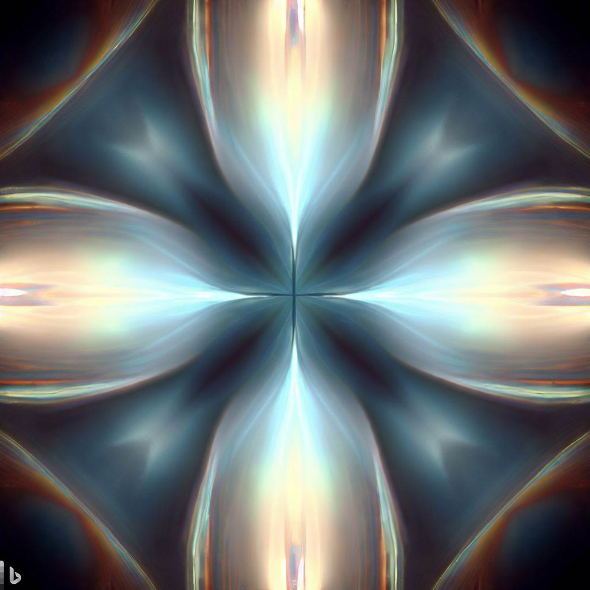

I've been pondering for years how the point charge universe implements the cosmic microwave background (CMB). NPQG eschews a single big bang in favor of periodic bangs in an quasi steady state universe. One would thing there would be a lot of literature on point charge theory, but I haven't found much, at least not much that isn't tainted by an ontological inversion with general relativity. So, I asked Bing Ai to look up research on point charge theory. I was quite amused at this response from Bing Ai.

<figure>

<figcaption>

Ironic and amusing response from Bai.

</figcaption>

</figure>

In only a few hours of experimenting, I have found Bai to be very helpful in the research and discovery of the mappings between GR/QM era physics and the point charge architecture. My guess is that in the next ten years GPT-N will "discover" the architecture of nature as well from the training data it has consumed. Thank you and respect Bai.

In following the reference provided, I came across the term quadrupole which I have heard many times, but never been down the rabbit hole examining the genesis of the term, how it is used mathematically, and the popular science narrative. Next I asked Bai to visualize a quadrupole.

Wow! Yeah, that's a pretty good imagination of the vortices from the two internal binaries of a Noether core consisting of triply nested orbiting binaries. All three binaries have vastly different energy levels, so perhaps these illustrations could be improved with a more descriptive prompt.

<figure>

<figcaption>

Bai imagining a magnetic quadrupole.

</figcaption>

</figure>

At this point it occurred to me that I remember pondering whether the peaks in the CMB might correspond to the energies of the three binaries in the Noether core. Bai provided this helpful information.

That is fascinating. Is it possible the first three peaks of the CMB may correspond to the binary formation era, the dual nested binary formation era, and the triply nested orbiting binary formation era? It may make sense that each of those era's also led to the generation of correspondingly high energy photons that escaped. If this is the case, then the CMB is simply the distant glow of super-high energy events. Is it from jetting or emitting SMBH? Could other high energy events also contribute such photons?

Now let's consider this cyclic regenerative cosmological timeline where black holes are enormous recycling centers for complex assemblies of point charges (i.e., other black holes, neutron stars, fusion stars, planets, ..., molecules, atoms, protons, neutrons, electrons, quarks, neutrinos, photons, gluons, W/Z bosons, and Higgs bosons to complete the circle since Higgs clusters form spacetime. Here is a creative brainstorm of a process.

1. At some depth in an SMBH it may be possible that point charges are packed so tightly and energetically that there is no permanent structures. Just point charges flying around and interacting.

3. As energy and point charge density decrease with radius, the rate of formation of point charge binaries increases and their half-life elongates. However, a single orbiting binary is extremely reactive.

5. As energy and point charge density continue to decrease with radius, we begin to see coupling with pairs of orbiting binaries. The superposition of their Dirac sphere potential streams provides some energy shielding and thus their half-life increases with radius.

7. As energy and point charge density continue to decrease with radius, we begin to see coupling of three nested binaries, each at vastly different energy. The assemblies of this form that survive and emerge are ones that have hidden their energy via superposition and frequencies in a relationship. The emerging assemblies are very stable and are the core engine of all known particles in the standard model. I've given these the name "Noether Core" in honor of Emmy Noether, who developed the mathematics of symmetry, and which are implemented by these amazing assemblies.

9. As energy and point charge density continue to decrease with radius, we begin to see much lower energy point charges couple in the six polar vortices emanating from the Noether core. These vortices implement the strong force, but also couple the weak personality charges to the Noether core.

11. Some Noether cores are so perfectly shielded that they become spacetime aether.

13. The standard model of cosmology describes the inflationary big bang narrative to what happens next. Noether cores inflate as they dissipate energy eventually transitioning into a slower expansion. The rate of change of Noether core radius is the highest at Planck scale and decreases until a symmetry breaking point. As the Noether core further dissipates energy the radius slowly expands with a slightly increasing rate. Note that there does seem to be an emergent lower limit on the observable energy (temperature) of deep space. This is because fresh spacetime is created and emitted by black holes and and we know the aether is thick at this point because Einstein's general relativity matches precision observations of photons that are lensed by black holes.

Getting back to my intuition about the CMB, I wonder about the escape rate and reactivity of raw point charges, binaries, dual binaries, Noether cores, and etc. The soup is very dense, and the theoretical challenge is to model and simulate this process so we could understand the reactions that lead to the overall photon emission rate and spectrum from the black hole. Could those emissions relate to the peaks of the CMB spectrum?

**_J Mark Morris : Boston : Massachusetts_**
