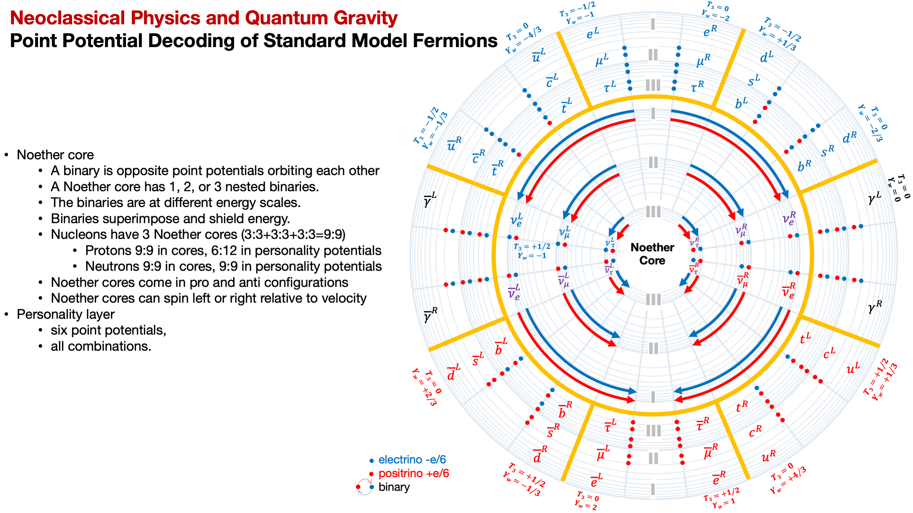

Let's quickly look at quantum numbers and map them to the point potential universe.

There is a set of quantum numbers at the Bohr atom model scale, but we want to study the quantum numbers for standard model particle assemblies.

| **Quantum Number h/t Wikipedia** | Standard Model | Point Potential Model |
| --- | --- | --- |
| Electric charge (Q) in units of \|e\|, the magnitude of the charge on the electron. | **{-1, -2/3, -1/3, 0, 1/3, 2/3, 1}** | **{-1/6, +1/6}**   constant rate emitters |
| Weak isospin (T3) — relating to the electrically charged part of the weak interaction: Particles with half-integer weak isospin can interact with the W± bosons; particles with zero weak isospin do not |  | See mapping in chart. |
| Baryon number (B) — strictly conserved additive quantum number of a system. Baryons (three quarks) have a baryon number of +1, mesons (one quark, one antiquark) have a baryon number of 0, and antibaryons (three antiquarks) have a baryon number of −1. | **B = (quarks - antiquarks)/3** | For quarks: **(\* - !\*)/3**      \* = Noether core   ! = anti |
| Lepton number (L) — strictly conserved additive quantum number of a system.   In a reaction, the lepton number of reactants equals lepton number of products. | **L = leptons - antileptons** | For leptons: **(\* - !\*)** |

| **Standard Model** | **Point Potential Model** |
| --- | --- |
| Strong interactions conserve all flavours | Strong interactions are those that involve coupling the polar vortices of binaries in two Noether cores. |
| Lepton flavor is not conserved in neutrino oscillation. | The neutrino is a quasi-stable assembly. The change in the neutrino geometry reveals the shielded energy of the gen II and gen III binaries. |
| Baryon number and lepton number conservation. | These quantum numbers map directly to Noether cores. |
| All flavour quantum numbers are violated (changed, non-conserved) by electroweak interactions | Electroweak interactions involve the personality potentials. These types of interactions are able open up an assembly and transform it in a reaction. |

The overall observation is that not only does the point potential geometry explain the quantum numbers, but it also provides insight into the related behaviour.

**J Mark Morris : Lynn : Massachusetts**
