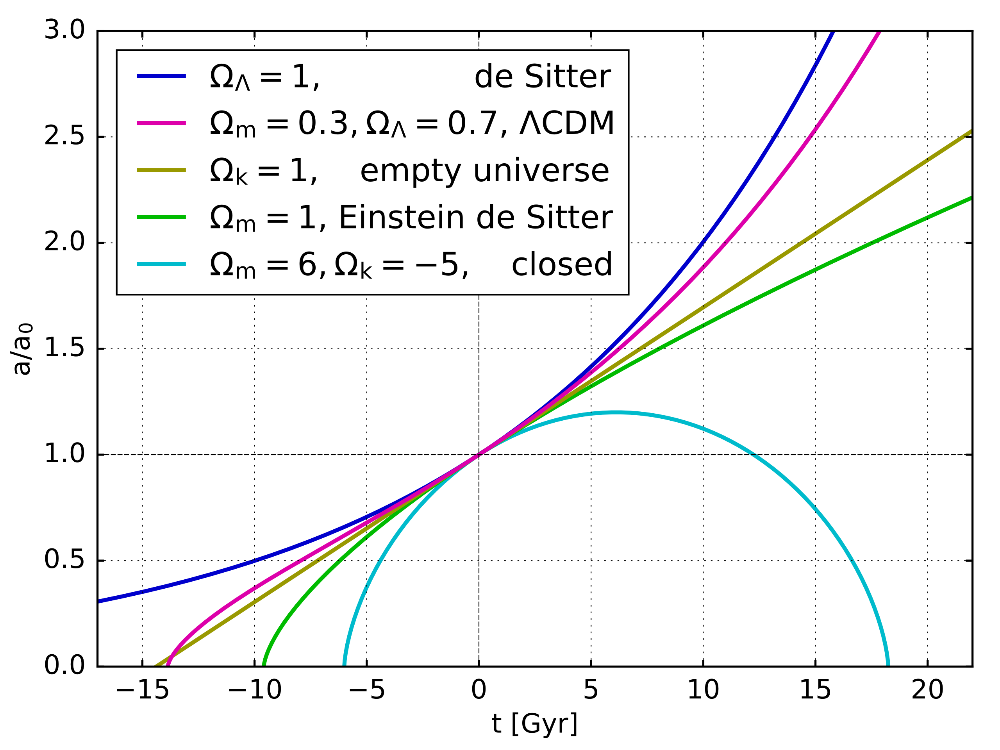

> _The Friedmann equations are a set of equations in physical cosmology that govern the expansion of space in homogeneous and isotropic models of the universe within the context of general relativity. They were first derived by Alexander Friedmann in 1922 from Einstein's field equations of gravitation for the Friedmann–Lemaître–Robertson–Walker metric and a perfect fluid with a given mass density ρ and pressure p. The equations for negative spatial curvature were given by Friedmann in 1924._
> 
> Wikipedia

| LCDM Cosmology | NPQG Cosmology |
| --- | --- |
| "_Perhaps inspired by the ever-changing weather that had occupied him for so long, Friedmann brought change to the Universe as a whole. Cannot a homogeneous and isotropic Universe — one that is the same in all points and directions — have a time-dependent geometry? Friedmann realized that if matter moves, so does the Universe. If the average distribution of matter changes in an uniform way, the Universe does as well._   _In 1922, Friedmann presented his remarkable results in a paper titled “On the Curvature of Space.” He showed that with or without a cosmological constant, there are solutions to Einstein’s equations that show a time-evolving universe. More than that, Friedmann’s universes exhibit several possible types of behavior. These depend on the amount of matter filling space as well as whether or not the cosmological constant is present, and if so, how dominant it is._"      [How imaginary universes advanced the field of cosmology](https://bigthink.com/13-8/imaginary-universe-cosmology/) — Marcelo Gleiser \[MG\] | I find myself wondering "What if Friedmann had studied systems of energetic point charges?" The problem is similar though clearly there is a huge scale difference from point charges to massive gravitational orbs in a sea of Higgs aether assemblies. As often noted, Coulomb's law for point charge force has the same mathematical form as the law of gravitation, except that point charges have both attraction and repulsion, while gravity only has attraction. |
| _"Friedmann distinguished two main types of cosmological solutions: expanding and oscillating. Expanding solutions result in universes where the distances between two points are always increasing, as in de Sitter’s solution where the Universe expands forever. However, the presence of matter slows down the expansion, and the dynamics become more complex." \[MG\]_ | It is interesting how everything was abstracted to such a large scale geometry of nature with absolutely no implementation. It is a pure figment of the imagination to assign the ability to expand or contract to the spacetime construct. There is no fine grained explanation for the root causes of spacetime behaviour. |
| _"Depending on how much matter there is and on how its contribution compares to that of the cosmological constant, it is possible for the expansion to be reversed and for the Universe to begin contracting, with galaxies moving closer and closer. In the far future, such a Universe would collapse onto itself into what we call a Big Crunch. Friedmann conjectured that indeed the Universe could alternate cycles of expansion and contraction. Sadly, Friedmann died four years before Hubble discovered cosmic expansion in 1929. He must have guessed that the Universe we live in was hiding among his conjectured universes. But neither he nor de Sitter — nor Einstein for that matter — could have known how tricky this story would become." \[MG\]_ | Here Friedmann is acknowledging that spacetime could contract due to the presence of matter. Yet this is also considered as a universe scale pattern even though we know that matter is composed of tiny particles which must each effect local spacetime.      In NPQG every assembly is based on a Noether core which inflates, expands, contracts, and deflates depending on energy. As photons traverse the sea of spacetime aether assemblies in the cosmos they surely pass through or by assemblies at different energy levels or even regions with aether energy gradients to climb or descend. Photon gravitational lensing is one such example at the extreme. |

The Friedmann equations are an attempt to describe the expansion of the universe as a whole when there is no such process. While all point charges in the universe are interacting with each other and sometimes themselves, their emitted potential falls off rapidly with distance. This means that spacetime distortion is local to concentrated apparent energy (e.g., mass). Local could be at defined at increasingly large scales from the vicinity of a photon emitting reaction, to asteroids, planets, stars, neutron stars, black holes, entire galaxies, galaxy clusters, and clusters of clusters. Around each of these we see the distortion of spacetime as described by Einstein. Furthermore, each of these localities is part of a grand recycling process for point charge assemblies. Supermassive black holes consume higher order assemblies and release Higgs aether assemblies and point charge plasma which quickly forms the orbiting binary, an essential step in the emergence of standard model particle assemblies. Highly energetic newly generated Higgs aether expands as it spreads out and dissipates energy. This is a local process, not a universe scale process.

**_J Mark Morris : Boston : Massachusetts_**
