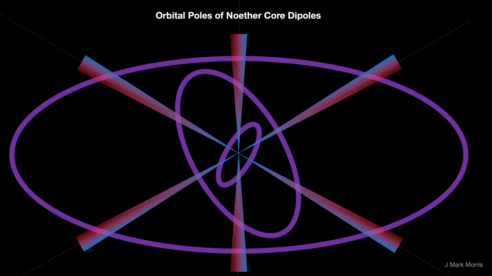
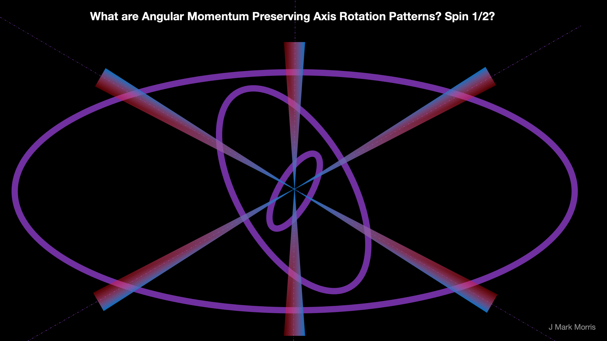

I have a vague intuition that supersymmetry may map to point charge theory very well. Their math works right? But they just haven't found the particles. The cool thing about point charge theory is that the supersymmetric partners are plain as day right in front of us, on the inside of standard matter particles, but the energy of the inner binaries is shielded by the superposition of the presumably precessing (in an angular momentum preserving pattern) binaries. This is probably one of the largest surprise predictions of point charge theory, that every particle we measure has enormous shielded energy in the inner binaries of the Noether core. I calculated **25000 X** the standard model mass for a Proton + Neutron + Electron.

I also wonder if the v > @ regime of potential self-action is related to supersymmetry. Where @ is the field speed of the potential field emitted by unit potential point charges. This is an entire new world of dynamical geometry. All action occurs on some Dirac potential sphere.

> _In a supersymmetric theory the equations for force and the equations for matter are identical. Supersymmetry is a spacetime symmetry between two basic classes of particles: bosons, which have an integer-valued spin and follow Bose–Einstein statistics, and fermions, which have a half-integer-valued spin and follow Fermi–Dirac statistics. In supersymmetry, each particle from one class would have an associated particle in the other, known as its superpartner, the spin of which differs by a half-integer. In the simplest supersymmetry theories, with perfectly "unbroken" supersymmetry, each pair of superpartners would share the same mass and internal quantum numbers besides spin. More complex supersymmetry theories have a spontaneously broken symmetry, allowing superpartners to differ in mass._
> 
> _Supersymmetry has various applications to different areas of physics, such as quantum mechanics, statistical mechanics, quantum field theory, condensed matter physics, nuclear physics, optics, stochastic dynamics, astrophysics, quantum gravity, and cosmology. Supersymmetry has also been applied to high energy physics, where a supersymmetric extension of the Standard Model is a possible candidate for physics beyond the Standard Model. However, no supersymmetric extensions of the Standard Model have been experimentally verified._
> 
> Wikipedia

Interestingly, it sounds like unit potential point charge theory may map very well to a new formulation of supersymmetry. In point charge theory the velocity dependent macro alignment of orbital planes of the three binaries in the Noether core are what shifts a particle between Fermi-Dirac and Bose-Einstein statistics. Of course, it remains to discover the math at this level, but conceptually it seems logical, given how velocity and charge paths, and Dirac sphere potential streams work (i.e., "delayed" potential).

It is interesting to consider that the orbital planes of the Noether core tri-binaries may have both a micro and a macro motion. The micro motion being a weaving or dance that results in the precession necessary for shielding of energy. The macro motion being dependent on the group velocity of the assembly and resulting in an alignment of the three orbital planes as the particle shifts from a 3D shape towards a flatter 2D shape as the velocity approaches field speed. I suppose the micro motion may map to the concept of spin 1/2.

However as velocity increases the micro motion may have less of an effect and is completely eliminated when an assembly assumes a 2D planar configuration orthogonal to the travel path. This would then correspond to spin 1. What are the conditions where assemblies can survive in a 2D planar bosonic configuration? Well, let's look at the standard model. It's the W and Z bosons which are short lived, and the photon which has a very long lifetime. The neutrino appears to be nearly 2D but it still precesses but the shielding varies, and thus we observe neutrino oscillation. I suspect many other particles would decay as velocities approach field speed.

Here is a mathematical problem in topology or visualization of 3D geometries. If we imagine doing the eigenmath preserving axis rotations that preserve angular momentum do they in some way correspond to spin 1/2? I don't  know the proper terminology in this area of geometry or group theory.  It seems to me it does sort of require a figure 8 like precession which is exactly symmetric between both loops of the figure 8. Spin 1/2 corresponds to 720 degrees or two rotations, as we know.

If I were to say grab on to +z axis and rotate it in some direction, the x and y axis would also rotate to compensate. So if I'm grabbing +z and rotate through the x-y plane it is the same as switching +z and -z. If we now rotate the axis back through the x-y plane we return to the original position. Flipping +z and -z means that the next flip returns to the starting point. This system has spin 1/2.

Note that these binaries are running at three different frequency, radii, and energy gauges. This means that the angular momentum vectors may be vastly different in scale. This mechanism seems like it bridges gauges and is scale invariant. It also seems that the angular momentum of each binary may map to its magnetic moment.

It's great fun to visualize these mappings, but it remains to discover the mathematics of this new dynamical geometry.

**_J Mark Morris : Boston : Massachusetts_**
