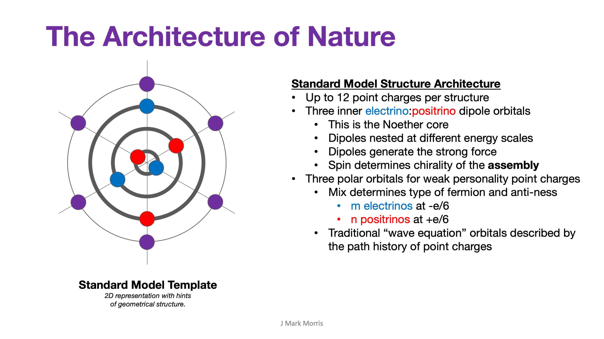

What is mass? Did you know that physicists do not have a good answer? Did you know that physicists do not know if mass is fundamental or emergent? That they cannot calculate the mass of a particle from first principles? The field of physics has been stuck on these and other concepts for quite a long time. Unfortunately, physicists have also made a mess of the mass terminology and mathematics.

It turns out that **mass is an emergent phenomenon** largely related to the orientation of the orbital planes in the Noether core in a gravitational field of spacetime aether or while traveling through spacetime aether at velocity v. The configuration of the Noether core binary energies and orbital planes is the same in these two cases and that is why the Equivalence Principle holds even though the situations are quite different. Einstein sort of pulled a rabbit out of the hat with the Energy-Momentum equation which is essentially the Equivalence Principle in action.

Let's back up and refresh ourselves that some form of the Noether engine appears to be re-used in all standard model structures as well as the particles of spacetime aether which generally have very low relative energy to the matter-energy structures that are flying about. This makes it evident why the Noether engine is so influential.

The Noether engine is essentially responsible for the strong force in all its forms. Who knows what kind of a dance the binaries of the three Noether engines in a proton or neutron are doing? QCD does! The theory of Quantum Chromo Dynamics. We call the bond between binaries gluons in this case. Still the conceptual groupings of the patchwork of theories help us understand the geometry. Understanding these geometries will be valuable input for closed form mathematical solutions as well as simulations.

If we zoom into the structure of the Noether core we see that each instantiation of a Noether core is described by the characteristics of its binaries which are at vastly different energy scales in low apparent energy environments, like a solar system. Each and every Gen I Noether core has three binary frequencies, three orbital radii, and three different energy levels. Add to that spin, chirality, and other quantum numbers which also nee to be mapped to the architecture. That potentially means that Noether cores could have incredible diversity.

Yet we know that standard model particles can transmute from one to another so I presume that there are certain Noether core patterns that are stable otherwise how could all the interchange happen for the transmutation? For example, it seems logical to speculate that in a steady state Noether core, the three energy levels maintain some sort of energy relationship. A big clue is the Koide Formula. One interesting Ph.D thesis topic would be a theory of how the binaries self-synchronize and shift energy. What is the exact mechanism? Keep in mind that Noether cores redshift. As the outer binary redshifts and loses energy, it seems logical to hypothesize the inner binaries will adjust energy and redshift as well so as to maintain synchronization.

When the standard matter particle structure is at rest, it's mass is determined by the apparent energy. Apparent energy is related to the energy of each binary as well as the angles of the orbital planes to each other. As work is performed on the standard matter particle, not only does the structure accelerate, but the Noether core is receiving energy, which is changing the orbital frequencies of the binaries. Furthermore, **the higher the velocity through the spacetime aether**, the more the planes of the binary orbitals converge towards a planar structure. Ultimately, the formula for mass will emerge from this electromechanical phenomena of Noether cores.

Perhaps this gets down to what has been so challenging for physicists to realize. Einstein is not best undertstood by starting at the grand scales of the cosmos and black holes and singularities and lensing and even the precession of Mercury around the Sun. Einstein is best understood based upon the discrete implementation of positive and negative |e/6| point charges orbiting one another. That basic binary chasing its tail is the most basic assembly emerging from the highest energy, zero entropy, state.

The beauty of nature is that binaries of lower energy and higher radius will capture binaries of higher energy with smaller radius. Once point charges and energy spread out, and apparently because the universe has 3D space as a foundation, nature seems to like to dedicate quite a lot of spatial volume to particles of standard matter and spacetime aether that are made of generation III Noether energy cores. Note that I worded that carefully, because if we are instead accounting for point charges accumulation by concentration in structures, I suspect that we might be quite surprised by the concentrations of point charges at extremely small scales.

On top of all that, these binaries click off energy in terms of angular momentum in h-bar j-s. So there you go. GR and QM are unified.

Are you clear on what just happened? NPQG is predicting that the total energy of generation I fermions includes the energies of generation II and III, which are largely shielded by the outer Noether core binaries. That means that your average generation III fermion has far more total energy than apparent energy. Apparent energy in relation to the spacetime aether is what causes mass. Check out the energy levels in the generation II and III fermions. Yes, that is a LOT MORE energy than physicists realize. See the top quark at 173,100 MeV/c2 vs. it's charm captor at 1,280 MeV/c2 vs. the ultimate captor, the up quark at 2 MeV/c2. Are you comprehending this prediction?

Curious about shielding via superposition, I asked this question on the PBS Space Time discord and received a fascinating response. _Does the standard model have any concept of electromagnetic field shielding at the particle level, especially fermions?_

It's unsurprising that the concept of potential shielding by superposition is not front and center of modern physics. However, this concept is an essential key concept and has a lot to do with the emergence of "mass".

Mass is ‘apparent energy’ and it’s not fundamental. Of course there are other components in ‘apparent energy’, not just how much energy is in the encapsulated generations of the Noether energy core and what percentage is shielded (similar concept as neutrino oscillation, I think). There is the obvious energy in kinetic and electromagnetic form of the fermion personality as well as the outer binary of the core. How all of this interacts moment to moment with the spacetime aether is the ‘mass’ of the particle. When you realize EACH binary in the core has up to Planck frequency (Fp) settings on the energy dial, I am curious how nature is going to implement rest mass so precisely. The Planck formulas are all clues.

We see the revealing of shielded energy in many aspects of physics and one is in the mass of a nucleon. The sum of the generation I quark masses is the order of 1% of the nucleon mass. Somehow the dance of the quarks in the nucleon is revealing more of the shielded energy as apparent energy.

<figure>

<figcaption>

Jianwei Qiu

</figcaption>

</figure>

We already discussed how velocity through the spacetime aether causes the planes of the Noether core to become aligned and more so as the particle approaches the local speed of light.

A fourth place we see the revealing of shielded energy is in particle colliders. Given that these collisions can reveal structures like the top quark with their high energy this conclusions should be evident. However, I have found physicists who insist the energy all comes from the rest and relativistic mass of the proton. My guess is that they are incorrect.

<figure>

<figcaption>

CERN

</figcaption>

</figure>

* * *

Once the point charge era physics is sorted out to the simplest possible explanations of nature, researchers and entrepreneurs will develop precise simulation models which track point charge by point charge via (perhaps) monte-carlo simulation on key reaction points. Essentially we need to build up some immense library that we can use to train artificial intelligence that can help us understand the individual electrinos and positrinos as they fly through each reaction. What is their exact path? Once you understand why the different reactions happen by tracking every electrino and positrino then we will begin to see how to influence and control the reaction. _By the way, it is not lost on me that our current era Ai could help us solve what is essentially a differential equation._

These simulation models do not on the surface appear to be difficult at the highest energies or for that matter, any energy. There may be a simplifying model for spacetime aether for instance. Even at the scale of the reactions that make the largest atom (the largest atom has fewer than 10,000 point charges) the number of objects to track is quite reasonable. However, there will also be situations where the challenge involves tracking each individual particle in the spacetime aether as well as the dynamical and fluctuating _virtual_ permittivity and permeability of space. I say virtual, because it seems to me that void space itself does not impose any limits on electromagnetic fields but rather that the point charges can be modeled as if there is a permittivity and permeability in the aether.

My current inclination is that the closest approach of point charges is determined by the point charges themselves and their actions on each other.

I am not closed minded to the idea that space itself could impose limits on permittivity and permeability but I have not visualized any implementation mechanism, so I am dis-inclined to favor that idea.

I admit that I think the model is more natural if space is conceived of as a three dimensional void and there is an absolute time that is forward moving only. It seems that absolute 3D space and absolute time, each with no known beginning or end are the fundamental background of our universe. As far as we can observe, the space and time background is populated by a large scale parameter of point charge density as well as a second large scale parameter of the average energy per point charge, including both kinetic and electromagnetic forms.

**_J Mark Morris : Boston : Massachusetts_**

p.s., Here is Alexander Unzicker at his best, pointing out the travesties of physics, this time in regards to mass.

https://youtu.be/5e\_aqdPP\_Rc
