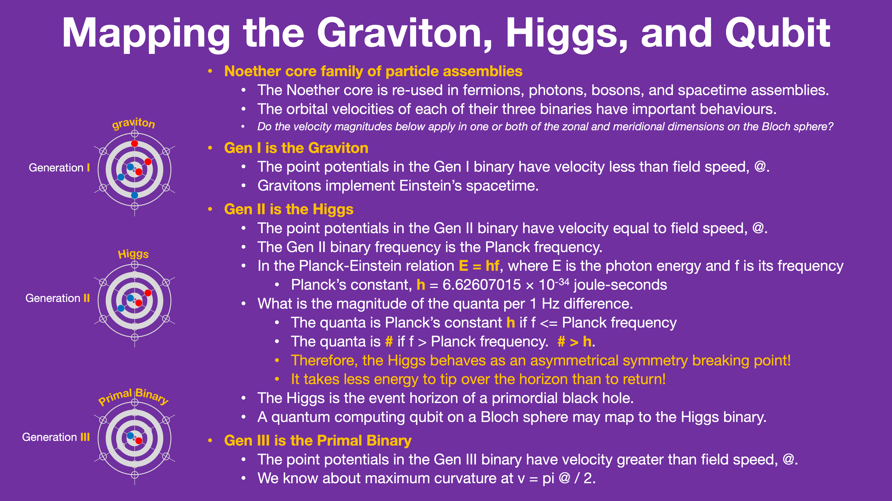
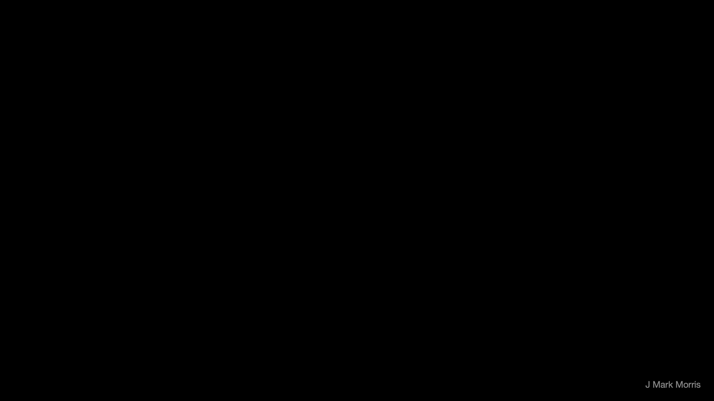
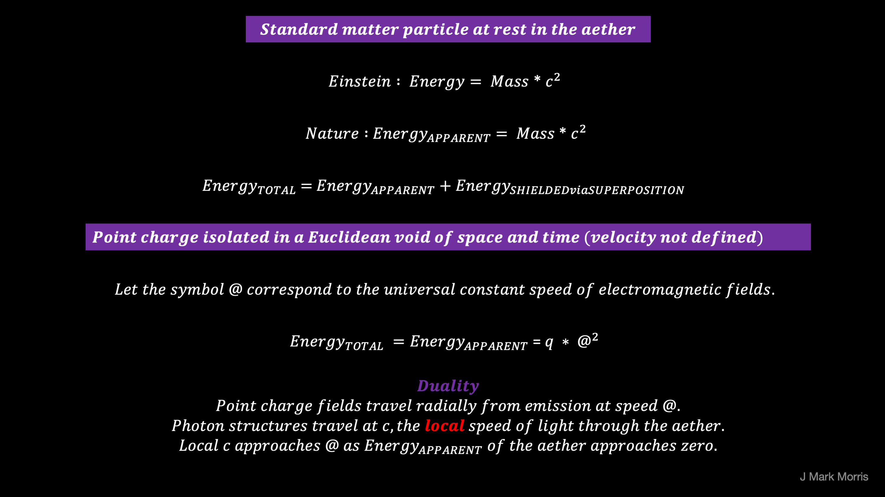
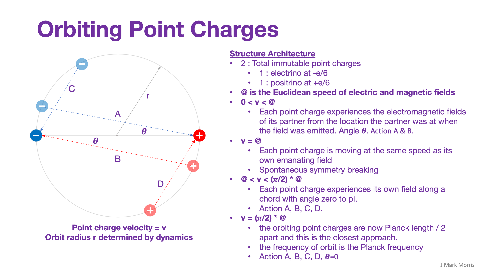
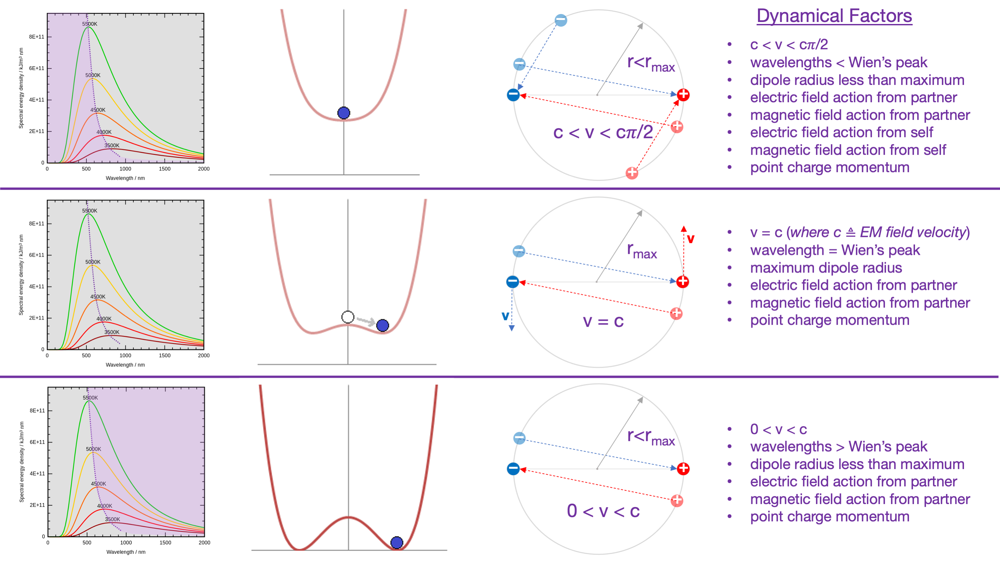

_Background : To gain a present era undergraduate understanding of electromagnetism including point charges I recommend Prof. Carlson's series as excellent pedagogy. Note the math about how the fields of point charges superimpose and the hint at the exotic nature in the rate at which those fields decrease with distance, which in some cases are faster than distance squared. [https://youtu.be/v57B\_1ZBAho](https://youtu.be/v57B_1ZBAho)_

This is the beginning of a collection of slide images showing the math of nature from first principles. The basics are simple, but emergence begets complexity, specifically in the behaviours of point charge assemblies. Perhaps readers can see how simple and obvious is this solution to nature. As I have mentioned ad nauseum, physicists planted a bad prior seed circa 1900 and an enormous tree of false priors has grown, casting shade on the fields of physics, cosmology, and astronomy. It's time for a paradigm change to knock down the tree of false priors and start over, with the previous era as an _**effective reference model**_.

I was thinking about the math for this model of nature as a collection of energetic unit potential point charges and I realized that the most basic foundational math is the only true math for this model. The point being that the passing Dirac sphere potentials emitted by point charges combined with the path and velocity of the point charge being acted upon are what determines the change to the path of that point charge. Likewise the change of path of a point charge determines it's future Dirac sphere potential emissions that will at some point act on all other point charges and perhaps itself. This is a kind of math that lends itself to extremely precise simulation.

Beyond that, all other math of assemblies of point charges are approximations. Even if I have my orbiting pair of positive and negative point charges, they are never truly in isolation. Their proximity means the dominant forces they experience are from their orbital partners or themselves in the self-action regime. However, any real world scenario suggests that they will be influenced by the Dirac spheres from all other point charges in the universe and those would never superimpose to a true zero potential and gradient. So no matter how small the impinging potential from distant point charges they would still be influenced in some way by the net superposition of all incoming Dirac spheres other than their partners and their own. Now, it could be that the external influence is so tiny as to be negligible, but my point is that it is interesting that there is no analytical closed form solution that accounts for the external influence. It is only when we ignore all external influences and consider the local point charge assembly in isolation, or perhaps with some generic background potential pattern from the aether that it may be possible to find a closed form analytic solution. This isn't really a problem, but I think it is an interesting observation.

Another extremely cool thing about unit potential point charge theory as the basis of nature is that there is only a single field. A single field! That field is given mathematically by the sum of all incoming Dirac sphere potentials at each (t,x,y,z) in time and space. The Dirac sphere potentials are a stream representing the emissions of each point charge along its path. So that Dirac sphere stream has a shape that depends on the path of the emitter point charge including it's velocity. Of course, that said, each assembly has a complex shape of it's local field and tapers elsewhere. Those complex shapes of the local potential field from each assembly type corresponds to the QFT model for each standard model particle. Which means that every particle in the standard model, no matter the energy, no matter the process, does generate a local field as modeled currently, but there is a lingua franca in terms of potential. We must differentiate the yarn from the finished product of the loom. In other words, it's simply these unit potential point charges flying around and they apparently get bound into stable patterns sometimes and those stable patterns are the standard model assemblies including the spacetime aether assemblies and detritus.

I'm sure you can imagine, as can I, how straightforward this will be to simulate, especially with radius of the Dirac sphere potential stream depending on the emitter path through absolute space and time. We can also model each unit potential to unit potential interaction in each assembly. Fortunately, given the vast energy level differences, or gauges, we can model each regime separately. But now we can unify those models and zoom into any gauge of interest.

For stable or semi-stable assemblies we can make very local models of the interactions of the unit potential point charges in each assembly. An electron has 12. Protons and Neutrons have 36. Photons and neutrinos also have 12. Now you simply have to start imagining kids transformer toys and how these point charges might assemble given various processes and events in the universe, such as black hole jets, supernovae, stars, and anything else high energy.

* * *

* * *

* * *

* * *

* * *

* * *

* * *

* * *

* * *

* * *

* * *

* * *

* * *

* * *

* * *

**_J Mark Morris : Boston : Massachusetts_**
