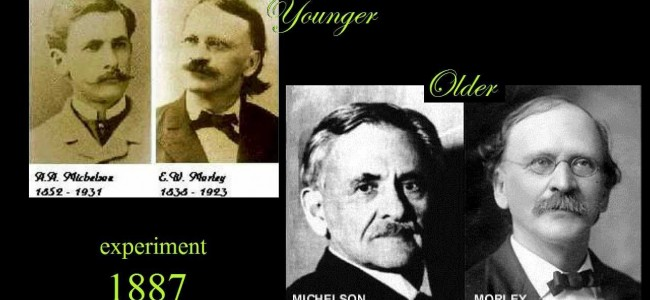
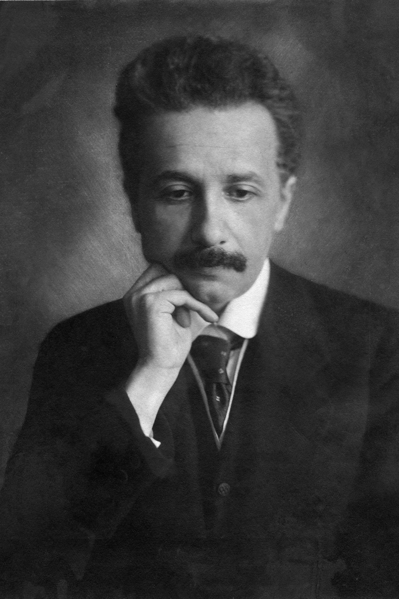
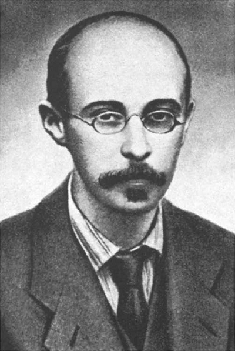
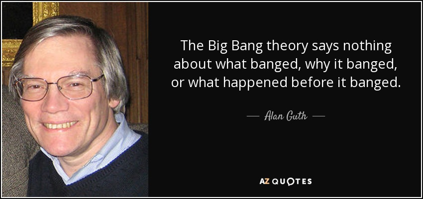
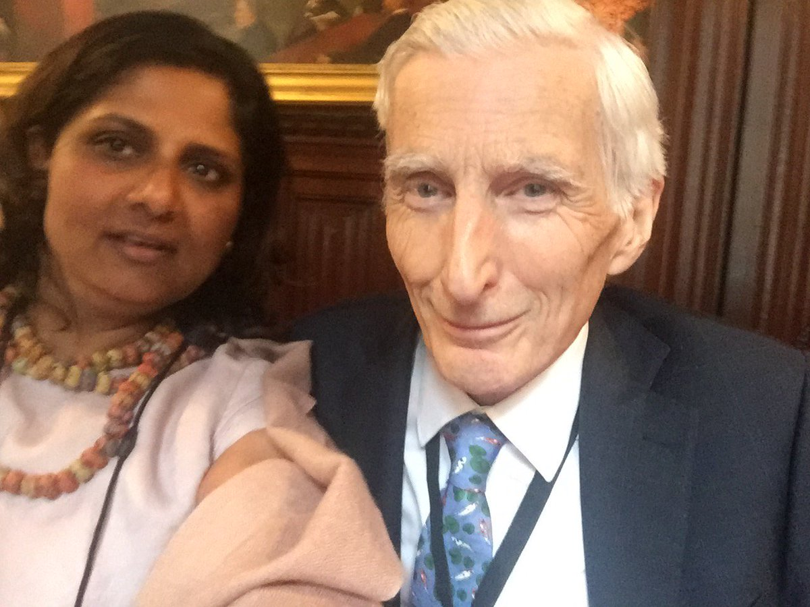

A calamitous series of misinterpretations has derailed physics and cosmology onto extremely difficult lines of attack, where complexity and confusion reign, and progress is slowed. I'll list these in approximate historical sequence since some are contemporary or overlap.

1. **MICHELSON AND MORLEY**

3. **LIENARD and WIECHERT**

5. **EINSTEIN**

7. **FRIEDMANN**

9. **LEMAITRE**

11. **HUBBLE**

13. **FIFTH SOLVAY CONFERENCE ON ELECTRONS AND PHOTONS 1927**

15. **IGNORING HOYLE**

17. **CHEW : BOOTSTRAP MODEL & NUCLEAR DEMOCRACY**

19. **McKELLAR, PENZIAS, WILSON**

21. **GUTH**

23. **NATARAJAN AND REES**

Note: This post is intended as a dispassionate assessment of history. It is not in any way meant as an attack on any of the scientists. These scientists did the best that they could do. Often, they were working within the mental models that were handed down from their predecessors. Scientists are open about how difficult it is to step back and reconsider ideas that require a paradigm change, especially the farther the science progresses. It seems that it will take a number of discordant observations to create the tension required that will result in reconsideration of radical new ideas. I think we will start building that tension to high levels with the next generation of space based instruments to be deployed in the 2020's. _Update 2022/2023/2024 : JWST is producing tremendous tension!_

* * *

**MICHELSON AND MORLEY 1887**

<figure>

<figcaption>

naturalphilosophy.org

</figcaption>

</figure>

In 1887 Michelson and Morley failed to detect the spacetime æther. No one could imagine a spacetime aether that was itself adaptable to local conditions. They could not measure how lightly spacetime æther interacts at the low energy density on earth. Spacetime æther is a vase sea of emergent assemblies made from point potentials, the electrino and positrino.‬ It turns out that the æther assembly maintains a relationship between its frequency and radius such that the speed of light always looks constant from within the æther. Furthermore, the æther is very difficult to observe as it is an extremely low apparent energy assembly. **_Observations are always vulnerable to that which they cannot observe!_** See [A Vulnerability in the Mathematics of Physics](https://johnmarkmorris.com/2020/05/30/a-vulnerability-in-the-mathematics-of-physics/).

It can be difficult to mentally adjust to thinking of the æther as a pseudo-Riemannian construct in a Euclidean frame. First you have to un-think Einstein's spacetime as a pure geometry of spacetime, precisely expressed in mathematics. Next, you must think about what is happening in an absolute Euclidean frame. Then you have to show that an observer in spacetime æther would see what Einstein asserted.

_Aside_: _Hopefully you will understand that it has been difficult to communicate this idea to physicists because they are conditioned to aggressively defend against bad ideas that waste time. The problem is of course that the truly revolutionary idea is indistinguishable and will be rejected as well._

Try to imagine and think from a perspective _**in absolute Euclidean time and space**_ as if Einstein's spacetime is a composite assembly based æther where each assembly that grows and shrinks with energy, and where that ambient energy is a function of local matter-energy density.

Examining the strength of the forces we see that the strength of gravity is tens of orders of magnitude below the other forces.

Consider that assemblies emerge from Planck energy electrino and positrino point charges. All stable assemblies have a nested tri-binary core which is constantly pulsing a spherical spiral of alternating potential at high frequencies from each of the binaries. The alternating potential excites nearby point potential assemblies. The orbits lead to continuous energy exchanges between kinetic and potential form. Since protons, neutrons, and electrons have very high apparent energy compared to spacetime aether, their alternating potential causes local aether to gain energy and change size and frequency. This is how Einstein's stretchy curvy spacetime is implemented, by Noether cores that behave as stretchy rulers and variable clocks.

* * *

**LIENARD and WIECHERT**

The primary failure of imagination occurred during the classical to quantum transition. Due to the confluence of many factors, including what was observed at the time, and previous conclusions, theories, and scientific narratives, the opportunity to discover the point charge assembly architecture of nature was missed. Lienard and Wiechert studied point charges and point charge path history, yet failed to conceive of an assembly architecture. Instead physicists and all sciences which depend on physics transitioned the the effective theories of general relativity and quantum mechanics, neither of which has a physical foundation in nature. I wrote a post about this tragedy of missed opportunities here : [Ontological Errors Occluded Nature’s Solution](https://johnmarkmorris.com/2022/11/30/ontological-errors-may-have-occluded-a-neoclassical-solution-to-nature/).

* * *

**ALBERT EINSTEIN**

Einstein's general relativity (1917) should have been based on a Euclidean 3D space permeated by assemblies of point charges, one of which implements a physical spacetime æther — where energetic point charge assemblies excite the Higgs aether assemblies and they contract as a result.‬ The consideration of the physical limits of the point charge architecture, rather than mathematical continuum, would have translated into an maximally dense matter-energy core rather than a singularity and all the nonsense that followed.

* * *

**ALEXANDER** **FRIEDMANN**

> _Friedmann in 1922 introduced the idea of an expanding universe that contained moving matter. Correspondence with Einstein suggests that Einstein was unwilling to accept the idea of an evolving Universe and worked instead to modify his equations to ensure a static eternal Universe as believed from Newton's time. Some years later, in 1926 Hubble published the redshift vs distance relationship, namely, all the galaxies in the neighborhood seemed to be receding at a rate proportional to their distance._
> 
> Wikipedia

In 1922 Friedmann was the first to derive the idea of an expanding universe from Einstein's equations of general relativity. The error was conceptual in that spacetime does not expand outward. Spacetime aether does expand local to each galaxy, but in opposition to the other galaxies, and with balancing processes that consume aether, thus the universe is steady state. Friedmann was working with gravity in which massive bodies attract, but never repel. Had Friedmann applied his ideas to point charges which both attract and repel, he might have discovered nature.

* * *

**GEORGES** **LEMAITRE**

<figure>

<figcaption>

Georges Henri Joseph Édouard Lemaître - Wikipedia

</figcaption>

</figure>

> _Georges Henri Joseph Édouard Lemaître (July 1894 – 20 June 1966) was a Belgian Catholic priest, mathematician, astronomer, and professor of physics at the Catholic University of Louvain. He was the first to identify that the recession of nearby galaxies can be explained by a theory of an expanding universe, which was observationally confirmed soon afterwards by Edwin Hubble. He was the first to derive what is now known as Hubble's law, or the Hubble–Lemaître law, and made the first estimation of what is now called the Hubble constant, which he published in 1927, two years before Hubble's article. Lemaître also proposed what later became known as the "Big Bang theory" of the origin of the universe, initially calling it the "hypothesis of the primeval atom"._
> 
> Wikipedia

Lemaître made the error of planting the seed that the universe could be traced back to a single originating point. Had he been more creative he would have imagined tracing to parallel and independent originating points distributed in time and space.

* * *

**EDWIN HUBBLE**

> _Hubble's law, also known as the Hubble–Lemaître law, is the observation in physical cosmology that galaxies are moving away from the Earth at velocities proportional to their distance. In other words, the further they are the faster they are moving away from Earth. The velocity of the galaxies has been determined by their redshift, a shift of the light they emit to the red end of the spectrum._
> 
> _Hubble's law is considered the first observational basis for the expansion of the universe and today serves as one of the pieces of evidence most often cited in support of the Big Bang model._
> 
> Wikipedia

Unfortunately, Hubble, like LeMaitre, made a grand cognitive error by choosing the universe as a whole expansion model on the left in the figure below, instead of the galaxy local expansion model shown on the right. It is each galaxy local SMBH that implements the process for crunch, bounce, bang, inflation, & expansion.

* * *

**FIFTH SOLVAY CONFERENCE ON ELECTRONS AND PHOTONS 1927**

In 1927, at Solvay, quantum mechanics took wing. In the following decades the quantum theories of QM, QFT, QED, and QCD, went hook, line, and sinker as believers in the geometry of spacetime. Had they known spacetime was an æther they would have evolved differently and quickly and may have solved nature by 1950 if not earlier.

A major ontological failing in quantum mechanics is the attribution of the root cause of uncertainty to the particle. Instead uncertainty should have been attributed to the arriving electromagnetic waves of gravity transmitted via the spacetime æther. A reaction that is teetering between energy levels can be influenced one way or the other by the turbulent sea of passing potential emissions passing through the spacetime æther. This error in quantum mechanics has led to massive confusion with regards to entanglement, 'spooky action at a distance', the Bell tests, and more. Einstein, Podolsky, and Rosen objected but were not able to correct the mistake. See [EPR 1, Spooky Action 0](https://johnmarkmorris.com/2020/07/20/epr-1-spooky-action-0/).

* * *

**FRED** **HOYLE**

> _Fred Hoyle coined the term “big bang” for a lecture on BBC radio in March 1949. It was meant as a pejorative; Hoyle favored the steady-state picture._
> 
> Cosmology’s Century - Peebles

* * *

**CHEW : BOOTSTRAP MODEL & NUCLEAR DEMOCRACY**

> The term "_**bootstrap model**_" is used for a class of theories that use very general consistency criteria to determine the form of a quantum theory from some assumptions on the spectrum of particles. In the 1960s and '70s, the ever-growing list of strongly interacting particles — mesons and baryons — made it clear to physicists that none of these particles is elementary. **_Geoffrey Chew and others went so far as to question the distinction between composite and elementary particles, advocating a "nuclear democracy" in which the idea that some particles were more elementary than others was discarded._** Instead, they sought to derive as much information as possible about the strong interaction from plausible assumptions about the S-matrix, which describes what happens when particles of any sort collide, an approach advocated by Werner Heisenberg two decades earlier.
> 
> Wikipedia

Wow!?! I just found learned of this in July 2021 while listening to an interview of David Gross by Lawrence Krauss. How do you characterize this other than willfull ignorance?

<figure>

<figcaption>

complianceandethics.org

</figcaption>

</figure>

* * *

**McKELLAR, PENZIAS, WILSON**

<figure>

<figcaption>

Bell Labs

</figcaption>

</figure>

The CMB was re-discovered in 1964 by Wilson and Penzias of Bell Labs.

* * *

Since 1975 or so, it is said the major theoretical work on the standard model was essentially complete. On the theory side, progress has been nil since then. By 1980 it became the era of enormous experimentation with fabulously expensive equipment and huge teams of collaborators. An organizational approach to physics. Dilbert. Office Space. Post-grad drones. Any follower of NPQG knows that chipping away from 10\-20 is a long ways away from electrino and positrino Planck scale binary orbits at ~10\-35.

* * *

**ALAN** **GUTH**

The idea for an inflationary big bang and expansion was formulated circa 1981 by Guth (et al.). As an origin story it should not have been tied to a single event in time. The ‘pocket universe’ is a galaxy. The multiverse is the universe of galaxies.

* * *

**NATARAJAN AND REES**

<figure>

<figcaption>

Twitter

</figcaption>

</figure>

Circa 1995 Natarajan and Rees missed an opportunity to realize that AGN SMBH were the primary implementation of what has been hypothesized as universe wide crunch, bounce, bang, inflation, and expansion. Natarajan and Rees largely mapped the existing black hole model onto supermassive black holes. However, they did not recognize that under extreme conditions that a supermassive black hole can emit extremely well shielded assemblies of spacetime.

* * *

**_J Mark Morris : San Diego : California_**
